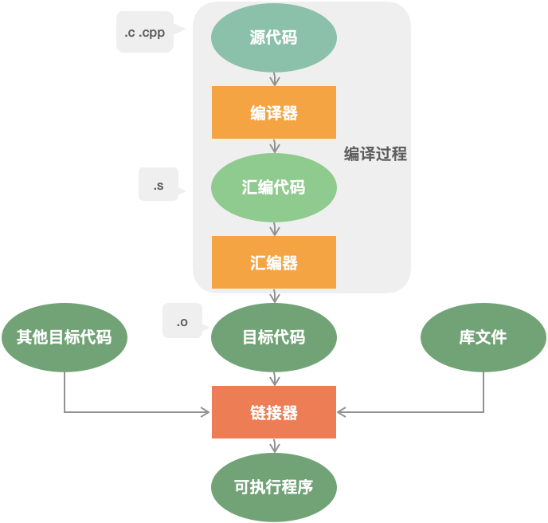

# leetcode [编译内存相关](https://leetcode-cn.com/leetbook/read/cpp-interview-highlights/e42yee/)

本章是 C++ 面经的开章之作，其中涉及 C++ 程序的编译过程、内存以及头文件的一些知识点，重点在内存方面进行展开，包括内存的分区、内存对齐、内存泄漏、内存泄漏的防止方法、现有的检测内存泄漏的工具等等。由于问题之间的关联性，可能有些问题并非是本章相关的知识点，例如一些问题涉及到了类中的虚函数、创建类的对象的底层原理等等，但为了保持问题上下的连贯性，也放在了本章，便于问题的理解。


## A C++ 程序编译过程

> NOTE: 
>
> compiler principle、龙书、from-source-to-exec
>
> 一、主要考察C++的implementation，参见 `C++\C++implementation` 章节
>
> 二、programming language的design and implementation
>
> design: grammar
>
> implementation: from source code to excutable
>
> 三、Separate compilation model、translation unit，参见 `C++\C++implementation\Phases-of-translation\Separate-compilation-model` 章节
>
> 涉及到的问题:
>
> 1、Linkage 是建立在 translation unit 之间的一个概念
>
> 2、Initialization order of no-local object with static storage duration
>
> 四、分步骤进行描述
>
> 1、Preprocess，参见 `C++\C++implementation\Preprocess` 章节
>
> macro、include guard
>
> cppreference [Preprocessor](https://en.cppreference.com/w/cpp/preprocessor)
>
> 2、Compile，参见 `C++\C++implementation\Compile` 章节
>
> 3、Link，参见 `C++\C++implementation\Link` 章节


编译过程分为四个过程：编译（编译预处理、编译、优化），汇编，链接。

编译预处理：处理以 # 开头的指令；

编译、优化：将源码 .cpp 文件翻译成 .s 汇编代码；

汇编：将汇编代码 .s 翻译成机器指令 .o 文件；

链接：汇编程序生成的目标文件，即 .o 文件，并不会立即执行，因为可能会出现：.cpp 文件中的函数引用了另一个 .cpp 文件中定义的符号或者调用了某个库文件中的函数。那链接的目的就是将这些文件对应的目标文件连接成一个整体，从而生成可执行的程序 .exe 文件。



### 链接分为两种：

静态链接：代码从其所在的静态链接库中拷贝到最终的可执行程序中，在该程序被执行时，这些代码会被装入到该进程的虚拟地址空间中。

动态链接：代码被放到动态链接库或共享对象的某个目标文件中，链接程序只是在最终的可执行程序中记录了共享对象的名字等一些信息。在程序执行时，动态链接库的全部内容会被映射到运行时相应进行的虚拟地址的空间。

### 二者的优缺点：

静态链接：浪费空间，每个可执行程序都会有目标文件的一个副本，这样如果目标文件进行了更新操作，就需要重新进行编译链接生成可执行程序（更新困难）；优点就是执行的时候运行速度快，因为可执行程序具备了程序运行的所有内容。

动态链接：节省内存、更新方便，但是动态链接是在程序运行时，每次执行都需要链接，相比静态链接会有一定的性能损失。


## C++ 内存管理

> NOTE: 
>
> ELF
>
> C++ data model、object、object lifetime and storage duration
>
> C++ 给予了 programmer对memory的控制，这是Java所无法提供的，参见 `C++\CppReference\Basic-concept\Object\cppreference-object` 章节

C++ 内存分区：栈、堆、全局/静态存储区、常量存储区、代码区。

1、栈：存放函数的局部变量、函数参数、返回地址等，由编译器自动分配和释放。

2、堆：动态申请的内存空间，就是由 malloc 分配的内存块，由程序员控制它的分配和释放，如果程序执行结束还没有释放，操作系统会自动回收。

3、全局区/静态存储区（.bss 段和 .data 段）：存放全局变量和静态变量，程序运行结束操作系统自动释放，在 C 语言中，未初始化的放在 .bss 段中，初始化的放在 .data 段中，C++ 中不再区分了。

4、常量存储区（.data 段）：存放的是常量，不允许修改，程序运行结束自动释放。

5、代码区（.text 段）：存放代码，不允许修改，但可以执行。编译后的二进制文件存放在这里。

说明：

从操作系统的本身来讲，以上存储区在内存中的分布是如下形式(从低地址到高地址)：.text 段 --> .data 段 --> .bss 段 --> 堆 --> unused --> 栈 --> env

```c++
#include <iostream>
using namespace std;

/*
说明：C++ 中不再区分初始化和未初始化的全局变量、静态变量的存储区，如果非要区分下述程序标注在了括号中
*/

int g_var = 0; // g_var 在全局区（.data 段）
char *gp_var;  // gp_var 在全局区（.bss 段）

int main()
{
    int var;                    // var 在栈区
    char *p_var;                // p_var 在栈区
    char arr[] = "abc";         // arr 为数组变量，存储在栈区；"abc"为字符串常量，存储在常量区
    char *p_var1 = "123456";    // p_var1 在栈区；"123456"为字符串常量，存储在常量区
    static int s_var = 0;       // s_var 为静态变量，存在静态存储区（.data 段）
    p_var = (char *)malloc(10); // 分配得来的 10 个字节的区域在堆区
    free(p_var);
    return 0;
}

```


## 栈和堆的区别

> NOTE: 
>
> 一、
>
> 参见工程Linux-OS 的`Multitasking\Process-memory\Process-address-space\Segment\Stack-VS-heap\Operation-on-stack-VS-on-heap` 章节
>
> 结合process run model来进行解答，参见 `Multitasking\Process-model\Process-run-model` 章节
>
> 二、private、shared
>
> stack对应的是call stack，每个thread都一个一个call stack
>
> heap是所有的thread shared的
>
> 三、storage duration、存放的内容
>
> automatic storage duration、automatic object、function argument
>
> dynamic storage duration、dynamic object
>
> 四、size
>
> call stack的size是可以控制的，参见: `man-3-pthread_create`
>
> heap的size是hardware决定的
>
> 五、C++ prefer automatic storage duration over dynamic storage duration
>
> 六、效率
>
> stack 远高于 heap
>
> 如何进行optimization:
>
> 1、memory pool
>
> 2、small buffer optimization

申请方式：栈是系统自动分配，堆是程序员主动申请。

申请后系统响应：分配栈空间，如果剩余空间大于申请空间则分配成功，否则分配失败栈溢出；申请堆空间，堆在内存中呈现的方式类似于链表（记录空闲地址空间的链表），在链表上寻找第一个大于申请空间的节点分配给程序，将该节点从链表中删除，大多数系统中该块空间的首地址存放的是本次分配空间的大小，便于释放，将该块空间上的剩余空间再次连接在空闲链表上。

栈在内存中是连续的一块空间（向低地址扩展）最大容量是系统预定好的，堆在内存中的空间（向高地址扩展）是不连续的。

申请效率：栈是有系统自动分配，申请效率高，但程序员无法控制；堆是由程序员主动申请，效率低，使用起来方便但是容易产生碎片。

存放的内容：栈中存放的是局部变量，函数的参数；堆中存放的内容由程序员控制。


## 变量的区别

> NOTE: 
>
> 一、C++ data model，参见
>
> `C++\CppReference\Basic-concept\Object`
>
> 二、从C++的四种storage duration为基准来展开，在 `C++\CppReference\Basic-concept\Object\Lifetime&&storage-duration\Storage-duration` 中的table就是这个问题的答案
>
> 三、下面的回答没有我总结得好
>
> 

**全局变量、局部变量、静态全局变量、静态局部变量的区别**

C++ 变量根据定义的位置的不同的生命周期，具有不同的作用域，作用域可分为 6 种：全局作用域，局部作用域，语句作用域，类作用域，命名空间作用域和文件作用域。

从作用域看：

全局变量：具有全局作用域。全局变量只需在一个源文件中定义，就可以作用于所有的源文件。当然，其他不包含全局变量定义的源文件需要用 extern 关键字再次声明这个全局变量。

静态全局变量：具有文件作用域。它与全局变量的区别在于如果程序包含多个文件的话，它作用于定义它的文件里，不能作用到其它文件里，即被 static 关键字修饰过的变量具有文件作用域。这样即使两个不同的源文件都定义了相同名字的静态全局变量，它们也是不同的变量。

局部变量：具有局部作用域。它是自动对象（auto），在程序运行期间不是一直存在，而是只在函数执行期间存在，函数的一次调用执行结束后，变量被撤销，其所占用的内存也被收回。

静态局部变量：具有局部作用域。它只被初始化一次，自从第一次被初始化直到程序运行结束都一直存在，它和全局变量的区别在于全局变量对所有的函数都是可见的，而静态局部变量只对定义自己的函数体始终可见。

从分配内存空间看：

静态存储区：全局变量，静态局部变量，静态全局变量。

栈：局部变量。

说明：

静态变量和栈变量（存储在栈中的变量）、堆变量（存储在堆中的变量）的区别：静态变量会被放在程序的静态数据存储区（.data 段）中（静态变量会自动初始化），这样可以在下一次调用的时候还可以保持原来的赋值。而栈变量或堆变量不能保证在下一次调用的时候依然保持原来的值。
静态变量和全局变量的区别：静态变量用 static 告知编译器，自己仅仅在变量的作用范围内可见。


## 全局变量定义在头文件中有什么问题？

如果在头文件中定义全局变量，当该头文件被多个文件 `include` 时，该头文件中的全局变量就会被定义多次，导致重复定义，因此不能再头文件中定义全局变量。

> NOTE: 
>
> `static const`
>
> 

## 对象创建限制在堆或栈

> NOTE: 
>
> 一、参见: `Requiring-or-Prohibiting-Heap-based-Objects-idiom` 章节
>
> 二、需要进行举一反三，参见 `C++\CppReference\Classes\Special-member-function\Common-issue\Require-prohibit` 章节
>
> 

如何限制类的对象只能在堆上创建？如何限制对象只能在栈上创建？

说明：C++ 中的类的对象的建立分为两种：静态建立、动态建立。

静态建立：由编译器为对象在栈空间上分配内存，直接调用类的构造函数创建对象。例如：A a;

动态建立：使用 new 关键字在堆空间上创建对象，底层首先调用 operator new() 函数，在堆空间上寻找合适的内存并分配；然后，调用类的构造函数创建对象。例如：A *p = new A();

### 限制对象只能建立在堆上：

最直观的思想：避免直接调用类的构造函数，因为对象静态建立时，会调用类的构造函数创建对象。但是直接将类的构造函数设为私有并不可行，因为当构造函数设置为私有后，不能在类的外部调用构造函数来构造对象，只能用 new 来建立对象。但是由于 new 创建对象时，底层也会调用类的构造函数，将构造函数设置为私有后，那就无法在类的外部使用 new 创建对象了。因此，这种方法不可行。

#### 解决方法 1：

将析构函数设置为私有。原因：静态对象建立在栈上，是由编译器分配和释放内存空间，编译器为对象分配内存空间时，会对类的非静态函数进行检查，即编译器会检查析构函数的访问性。当析构函数设为私有时，编译器创建的对象就无法通过访问析构函数来释放对象的内存空间，因此，编译器不会在栈上为对象分配内存。

```c++
class A
{
public:
    A() {}
    void destory()
    {
        delete this;
    }

private:
    ~A()
    {
    }
};
```

该方法存在的问题：

用 `new` 创建的对象，通常会使用 `delete` 释放该对象的内存空间，但此时类的外部无法调用析构函数，因此类内必须定义一个 `destory()` 函数，用来释放 `new` 创建的对象。

无法解决继承问题，因为如果这个类作为基类，析构函数要设置成 `virtual`，然后在派生类中重写该函数，来实现多态。但此时，析构函数是私有的，派生类中无法访问。

#### 解决方法 2：

构造函数设置为 `protected`，并提供一个 `public` 的静态函数来完成构造，而不是在类的外部使用 new 构造；将析构函数设置为 `protected`。原因：类似于单例模式，也保证了在派生类中能够访问析构函数。通过调用 create() 函数在堆上创建对象。

```c++
class A
{
protected:
    A() {}
    ~A() {}

public:
    static A *create()
    {
        return new A();
    }
    void destory()
    {
        delete this;
    }
};
```

### 限制对象只能建立在栈上：

解决方法：将 `operator new()` 设置为私有。原因：当对象建立在堆上时，是采用 `new` 的方式进行建立，其底层会调用 `operator new()` 函数，因此只要对该函数加以限制，就能够防止对象建立在堆上。

```C++
class A
{
private:
    void *operator new(size_t t) {}    // 注意函数的第一个参数和返回值都是固定的
    void operator delete(void *ptr) {} // 重载了 new 就需要重载 delete
public:
    A() {}
    ~A() {}
};
```


## 内存对齐

> NOTE: 
>
> 一、按照如下思路来进行回答:
>
> 1、CPU memory access:
>
> chunky-word，参见 `CPU-memory-access\Memory-alignment`
>
> 因此，需要把object放到aligned address
>
> 2、C++中，关于alignment的内容
>
> `C++\CppReference\Basic-concept\Object\cppreference-object\Object-alignment-requirement`
>
> 
>
> C++对alignment的支持: `C++\Resource-management\Memory\Alignment`
>
> `C++\CppReference\Struct\struct-pack`


**什么是内存对齐？内存对齐的原则？为什么要进行内存对齐，有什么优点？**

内存对齐：编译器将程序中的每个“数据单元”安排在字的整数倍的地址指向的内存之中

内存对齐的原则：

结构体变量的首地址能够被其最宽基本类型成员大小与对齐基数中的较小者所整除；

结构体每个成员相对于结构体首地址的偏移量 （offset） 都是该成员大小与对齐基数中的较小者的整数倍，如有需要编译器会在成员之间加上填充字节 （internal padding）；

结构体的总大小为结构体最宽基本类型成员大小与对齐基数中的较小者的整数倍，如有需要编译器会在最末一个成员之后加上填充字节 （trailing padding）。

### 实例：

```C++
/*
说明：程序是在 64 位编译器下测试的
*/
#include <iostream>

using namespace std;

struct A
{
    short var; // 2 字节
    int var1;  // 8 字节 （内存对齐原则：填充 2 个字节） 2 (short) + 2 (填充) + 4 (int)= 8
    long var2; // 12 字节 8 + 4 (long) = 12
    char var3; // 16 字节 （内存对齐原则：填充 3 个字节）12 + 1 (char) + 3 (填充) = 16
    string s;  // 48 字节 16 + 32 (string) = 48
};

int main()
{
    short var;
    int var1;
    long var2;
    char var3;
    string s;
    A ex1;
    cout << sizeof(var) << endl;  // 2 short
    cout << sizeof(var1) << endl; // 4 int
    cout << sizeof(var2) << endl; // 4 long
    cout << sizeof(var3) << endl; // 1 char
    cout << sizeof(s) << endl;    // 32 string
    cout << sizeof(ex1) << endl;  // 48 struct
    return 0;
}
```

### 进行内存对齐的原因：（主要是硬件设备方面的问题）

某些硬件设备只能存取对齐数据，存取非对齐的数据可能会引发异常；

某些硬件设备不能保证在存取非对齐数据的时候的操作是原子操作；

相比于存取对齐的数据，存取非对齐的数据需要花费更多的时间；

某些处理器虽然支持非对齐数据的访问，但会引发对齐陷阱（alignment trap）；

某些硬件设备只支持简单数据指令非对齐存取，不支持复杂数据指令的非对齐存取。

### 内存对齐的优点：

便于在不同的平台之间进行移植，因为有些硬件平台不能够支持任意地址的数据访问，只能在某些地址处取某些特定的数据，否则会抛出异常；
提高内存的访问效率，因为 CPU 在读取内存时，是一块一块的读取。


### 补充一个点：

```C++
struct D{
char a;
int b;
static double c; //静态成员
};
```

win32系统
静态成员变量存放在全局数据区内，在编译的时候已经分配好内存空间，所以对结构体的总内存大小不做任何贡献；因此，sizeof(D)=4+4=8个字节

## 类的大小

**类大小的计算**
说明：类的大小是指类的实例化对象的大小，用 `sizeof` 对类型名操作时，结果是该类型的对象的大小。
计算原则：

1、遵循结构体的对齐原则。

2、与普通成员变量有关，与成员函数和静态成员无关。即普通成员函数，静态成员函数，静态数据成员，静态常量数据成员均对类的大小无影响。因为静态数据成员被类的对象共享，并不属于哪个具体的对象。

3、虚函数对类的大小有影响，是因为**虚函数表指针**的影响。

4、虚继承对类的大小有影响，是因为**虚基表指针带**来的影响。

5、空类的大小是一个特殊情况，空类的大小为 1，当用 `new` 来创建一个空类的对象时，为了保证不同对象的地址不同，空类也占用存储空间。

### **实例**：

```c++
/*
说明：程序是在 64 位编译器下测试的
*/
#include <iostream>

using namespace std;

class A
{
private:
    static int s_var; // 不影响类的大小
    const int c_var;  // 4 字节
    int var;          // 8 字节 4 + 4 (int) = 8
    char var1;        // 12 字节 8 + 1 (char) + 3 (填充) = 12
public:
    A(int temp) : c_var(temp) {} // 不影响类的大小
    ~A() {}                    // 不影响类的大小
};

class B
{
};
int main()
{
    A ex1(4);
    B ex2;
    cout << sizeof(ex1) << endl; // 12 字节
    cout << sizeof(ex2) << endl; // 1 字节
    return 0;
}

```

带有虚函数的情况：（注意：虚函数的个数并不影响所占内存的大小，因为类对象的内存中只保存了指向虚函数表的指针。）

```C++
/*
说明：程序是在 64 位编译器下测试的
*/
#include <iostream>

using namespace std;

class A
{
private:
    static int s_var; // 不影响类的大小
    const int c_var;  // 4 字节
    int var;          // 8 字节 4 + 4 (int) = 8
    char var1;        // 12 字节 8 + 1 (char) + 3 (填充) = 12
public:
    A(int temp) : c_var(temp) {} // 不影响类的大小
    ~A() {}                      // 不影响类的大小
    virtual void f() { cout << "A::f" << endl; }

    virtual void g() { cout << "A::g" << endl; }

    virtual void h() { cout << "A::h" << endl; } // 24 字节 12 + 4 (填充) + 8 (指向虚函数的指针) = 24
};

int main()
{
    A ex1(4);
    A *p;
    cout << sizeof(p) << endl;   // 8 字节 注意：指针所占的空间和指针指向的数据类型无关
    cout << sizeof(ex1) << endl; // 24 字节
    return 0;
}


```

## 什么是内存泄露

内存泄漏：由于疏忽或错误导致的程序未能释放已经不再使用的内存。

进一步解释：

1、并非指内存从物理上消失，而是指程序在运行过程中，由于疏忽或错误而失去了对该内存的控制，从而造成了内存的浪费。

2、常指堆内存泄漏，因为堆是动态分配的，而且是用户来控制的，如果使用不当，会产生内存泄漏。

3、使用 `malloc`、`calloc`、`realloc`、`new` 等分配内存时，使用完后要调用相应的 `free` 或 `delete` 释放内存，否则这块内存就会造成内存泄漏。

指针重新赋值

```c
char *p = (char *)malloc(10);
char *p1 = (char *)malloc(10);
p = np;
```

开始时，指针 `p` 和 `p1` 分别指向一块内存空间，但指针 `p` 被重新赋值，导致 `p` 初始时指向的那块内存空间无法找到，从而发生了内存泄漏。

## 怎么防止内存泄漏？内存泄漏检测工具的原理？

> NOTE: 
>
> 一、C++ strong resource safety
>
> `C++\Resource-management\Guide`
>
> `C++\Idiom\Object-based-resource-management`
>
> 1、RAII
>
> 2、Scope-guard
>
> 二、smart pointer
>
> 三、内存检查工具
>
> 参见: `C++\Resource-management\Memory\Memory-error\Memory-debugger`
>
> 

### 防止内存泄漏的方法：

#### 内部封装

RAII

#### 智能指针

智能指针是 C++ 中已经对内存泄漏封装好了一个工具，可以直接拿来使用，将在下一个问题中对智能指针进行详细的解释。

### 内存泄漏检测工具的实现原理：

> NOTE: 
>
> 参见 `C++\Tools\Valgrind` 章节
>
> 


#### 简介

valgrind 是一套 Linux 下，开放源代码（GPL V2）的仿真调试工具的集合，包括以下工具：


1、`Memcheck`：内存检查器（valgrind 应用最广泛的工具），能够发现开发中绝大多数内存错误的使用情况，比如：使用未初始化的内存，使用已经释放了的内存，内存访问越界等。

2、`Callgrind`：检查程序中函数调用过程中出现的问题。

3、`Cachegrind`：检查程序中缓存使用出现的问题。

4、`Helgrind`：检查多线程程序中出现的竞争问题。

5、`Massif`：检查程序中堆栈使用中出现的问题。

6、`Extension`：可以利用 core 提供的功能，自己编写特定的内存调试工具。

Memcheck 能够检测出内存问题，关键在于其建立了两个全局表：

一、Valid-Value 表：对于进程的整个地址空间中的每一个字节（byte），都有与之对应的 8 个 bits ；对于 CPU 的每个寄存器，也有一个与之对应的 bit 向量。这些 bits 负责记录该字节或者寄存器值是否具有有效的、已初始化的值。

二、Valid-Address 表：对于进程整个地址空间中的每一个字节（byte），还有与之对应的 1 个 bit，负责记录该地址是否能够被读写。

> NOTE: 
>
> 是否属于这个process

#### 检测原理

当要读写内存中某个字节时，首先检查这个字节对应的 Valid-Address 表中对应的 bit。如果该 bit 显示该位置是**无效位置**，Memcheck 则报告读写错误。

内核（core）类似于一个虚拟的 CPU 环境，这样当内存中的某个字节被加载到真实的 CPU 中时，该字节在 Valid-Value 表对应的 bits 也被加载到虚拟的 CPU 环境中。一旦寄存器中的值，被用来产生内存地址，或者该值能够影响程序输出，则 Memcheck 会检查 Valid-Value 表对应的 bits，如果该值尚未初始化，则会报告使用未初始化内存错误。


## 智能指针有哪几种？智能指针的实现原理？

> NOTE: 
>
> 参见 `C++\STL\Dynamic-memory-management\Smart-pointer-library` 章节
>
> 

智能指针是为了解决动态内存分配时带来的内存泄漏以及多次释放同一块内存空间而提出的。C++11 中封装在了 `<memory>` 头文件中。

C++11 中智能指针包括以下三种：

1、共享指针（`shared_ptr`）：资源可以被多个指针共享，使用计数机制表明资源被几个指针共享。通过 use_count() 查看资源的所有者的个数，可以通过 `unique_ptr`、`weak_ptr` 来构造，调用 `release()` 释放资源的所有权，计数减一，当计数减为 0 时，会自动释放内存空间，从而避免了内存泄漏。

2、独占指针（`unique_ptr`）：独享所有权的智能指针，资源只能被一个指针占有，该指针不能拷贝构造和赋值。但可以进行移动构造和移动赋值构造（调用 move() 函数），即一个 `unique_ptr` 对象赋值给另一个 unique_ptr 对象，可以通过该方法进行赋值。

3、弱指针（`weak_ptr`）：指向 `share_ptr` 指向的对象，能够解决由`shared_ptr`带来的循环引用问题。


```C++
#include <iostream>
#include <memory>

template <typename T>
class SmartPtr
{
private : 
	T *_ptr;
	size_t *_count;

public:
	SmartPtr(T *ptr = nullptr) : _ptr(ptr)
	{
		if (_ptr)
		{
			_count = new size_t(1);
		}
		else
		{
			_count = new size_t(0);
		}
	}

	~SmartPtr()
	{
		(*this->_count)--;
		if (*this->_count == 0)
		{
			delete this->_ptr;
			delete this->_count;
		}
	}

	SmartPtr(const SmartPtr &ptr) // 拷贝构造：计数 +1
	{
		if (this != &ptr)
		{
			this->_ptr = ptr._ptr;
			this->_count = ptr._count;
			(*this->_count)++;
		}
	}

	SmartPtr &operator=(const SmartPtr &ptr) // 赋值运算符重载 
	{
		if (this->_ptr == ptr._ptr)
		{
			return *this;
		}
		if (this->_ptr) // 将当前的 ptr 指向的原来的空间的计数 -1
		{
			(*this->_count)--;
			if (this->_count == 0)
			{
				delete this->_ptr;
				delete this->_count;
			}
		}
		this->_ptr = ptr._ptr;
		this->_count = ptr._count;
		(*this->_count)++; // 此时 ptr 指向了新赋值的空间，该空间的计数 +1
		return *this;
	}

	T &operator*()
	{
		assert(this->_ptr == nullptr);
		return *(this->_ptr);
	}

	T *operator->()
	{
		assert(this->_ptr == nullptr);
		return this->_ptr;
	}

	size_t use_count()
	{
		return *this->count;
	}
};

```


## 一个 unique_ptr 怎么赋值给另一个 unique_ptr 对象？

借助 `std::move()` 可以实现将一个 `unique_ptr` 对象赋值给另一个 `unique_ptr` 对象，其目的是实现所有权的转移。

```C++
// A 作为一个类 
std::unique_ptr<A> ptr1(new A());
std::unique_ptr<A> ptr2 = std::move(ptr1);
```


## 使用智能指针会出现什么问题？怎么解决？

> NOTE: 
>
> 参见 `C++\STL\Dynamic-memory-management\Smart-pointer-library\std-shared_ptr\Guide\nextptr-Using-weak_ptr-for-circular-references` 章节

智能指针可能出现的问题：循环引用
在如下例子中定义了两个类 Parent、Child，在两个类中分别定义另一个类的对象的共享指针，由于在程序结束后，两个指针相互指向对方的内存空间，导致内存无法释放。

```C++
#include <iostream>
#include <memory>

using namespace std;

class Child;
class Parent;

class Parent {
private:
    shared_ptr<Child> ChildPtr;
public:
    void setChild(shared_ptr<Child> child) {
        this->ChildPtr = child;
    }

    void doSomething() {
        if (this->ChildPtr.use_count()) {

        }
    }

    ~Parent() {
    }
};

class Child {
private:
    shared_ptr<Parent> ParentPtr;
public:
    void setPartent(shared_ptr<Parent> parent) {
        this->ParentPtr = parent;
    }
    void doSomething() {
        if (this->ParentPtr.use_count()) {

        }
    }
    ~Child() {
    }
};

int main() {
    weak_ptr<Parent> wpp;
    weak_ptr<Child> wpc;
    {
        shared_ptr<Parent> p(new Parent);
        shared_ptr<Child> c(new Child);
        p->setChild(c);
        c->setPartent(p);
        wpp = p;
        wpc = c;
        cout << p.use_count() << endl; // 2
        cout << c.use_count() << endl; // 2
    }
    cout << wpp.use_count() << endl;  // 1
    cout << wpc.use_count() << endl;  // 1
    return 0;
}

```

### 循环引用的解决方法： `weak_ptr`

循环引用：该被调用的析构函数没有被调用，从而出现了内存泄漏。

1、`weak_ptr` 对被 `shared_ptr` 管理的对象存在 非拥有性（弱）引用，在访问所引用的对象前必须先转化为 `shared_ptr`；

2、`weak_ptr` 用来打断 `shared_ptr` 所管理对象的循环引用问题，若这种环被孤立（没有指向环中的外部共享指针），`shared_ptr` 引用计数无法抵达 0，内存被泄露；令环中的指针之一为弱指针可以避免该情况；

3、`weak_ptr` 用来表达临时所有权的概念，当某个对象只有存在时才需要被访问，而且随时可能被他人删除，可以用 `weak_ptr` 跟踪该对象；需要获得所有权时将其转化为 `shared_ptr`，此时如果原来的 `shared_ptr` 被销毁，则该对象的生命期被延长至这个临时的 `shared_ptr` 同样被销毁。

```C++
#include <iostream>
#include <memory>

using namespace std;

class Child;
class Parent;

class Parent {
private:
    //shared_ptr<Child> ChildPtr;
    weak_ptr<Child> ChildPtr;
public:
    void setChild(shared_ptr<Child> child) {
        this->ChildPtr = child;
    }

    void doSomething() {
        //new shared_ptr
        if (this->ChildPtr.lock()) {

        }
    }

    ~Parent() {
    }
};

class Child {
private:
    shared_ptr<Parent> ParentPtr;
public:
    void setPartent(shared_ptr<Parent> parent) {
        this->ParentPtr = parent;
    }
    void doSomething() {
        if (this->ParentPtr.use_count()) {

        }
    }
    ~Child() {
    }
};

int main() {
    weak_ptr<Parent> wpp;
    weak_ptr<Child> wpc;
    {
        shared_ptr<Parent> p(new Parent);
        shared_ptr<Child> c(new Child);
        p->setChild(c);
        c->setPartent(p);
        wpp = p;
        wpc = c;
        cout << p.use_count() << endl; // 2
        cout << c.use_count() << endl; // 1
    }
    cout << wpp.use_count() << endl;  // 0
    cout << wpc.use_count() << endl;  // 0
    return 0;
}

```

