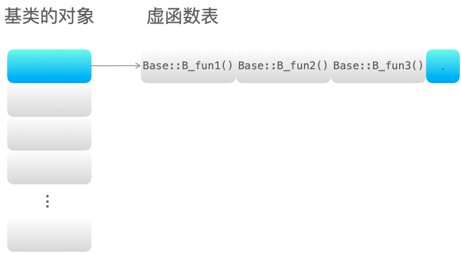
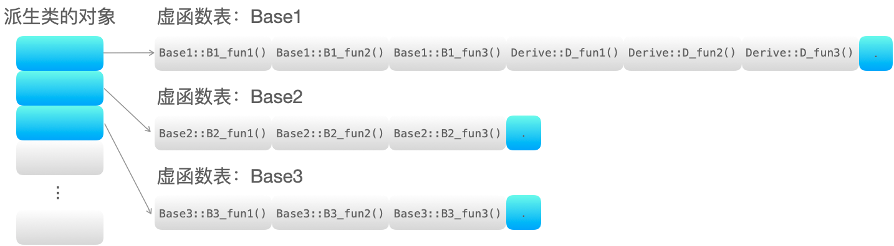

# 类相关

## 什么是虚函数？什么是纯虚函数？

> NOTE: 
>
> 一、Java和C+++的区别: 参见 `Theory\Programming-paradigm\OOP\Subtyping-polymorphism\Subtyping-VS-inheritance` 章节


### 虚函数：

被 `virtual` 关键字修饰的成员函数，就是虚函数。

```C++
#include <iostream>
using namespace std;

class A
{
public:
    virtual void v_fun() // 虚函数
    {
        cout << "A::v_fun()" << endl;
    }
};
class B : public A
{
public:
    void v_fun()
    {
        cout << "B::v_fun()" << endl;
    }
};
int main()
{
    A *p = new B();
    p->v_fun(); // B::v_fun()
    return 0;
}


```

### 纯虚函数：

纯虚函数在类中声明时，加上 `=0`；

含有纯虚函数的类称为抽象类（只要含有纯虚函数这个类就是抽象类），类中只有接口，没有具体的实现方法；

继承纯虚函数的派生类，如果没有完全实现基类纯虚函数，依然是抽象类，不能实例化对象。

## 虚函数和纯虚函数的区别？

1、虚函数和纯虚函数可以出现在同一个类中，该类称为抽象基类。（含有纯虚函数的类称为抽象基类）

2、使用方式不同：虚函数可以直接使用，纯虚函数必须在派生类中实现后才能使用；

3、定义形式不同：虚函数在定义时在普通函数的基础上加上 virtual 关键字，纯虚函数定义时除了加上virtual 关键字还需要加上 =0;

4、虚函数必须实现，否则编译器会报错；

5、对于实现纯虚函数的派生类，该纯虚函数在派生类中被称为虚函数，虚函数和纯虚函数都可以在派生类中重写；
析构函数最好定义为虚函数，特别是对于含有继承关系的类；析构函数可以定义为纯虚函数，此时，其所在的类为抽象基类，不能创建实例化对象。

6、析构函数最好定义为虚函数，特别是对于含有继承关系的类；析构函数可以定义为纯虚函数，此时，其所在的类为抽象基类，不能创建实例化对象。


---

> NOTE: 
>
> 一、下面的内容主要涉及dynamic polymorphism的实现
>
> 二、从通用的polymorphism的实现角度来进行切入

---

## 虚函数的实现机制

实现机制：

虚函数通过虚函数表来实现。虚函数的地址保存在虚函数表中，在类的对象所在的内存空间中，保存了指向虚函数表的指针（称为“虚表指针”），通过虚表指针可以找到类对应的虚函数表。虚函数表解决了基类和派生类的继承问题和类中成员函数的覆盖问题，当用基类的指针来操作一个派生类的时候，这张虚函数表就指明了实际应该调用的函数。

虚函数表相关知识点：

1、虚函数表存放的内容：类的虚函数的地址。

2、虚函数表建立的时间：编译阶段，即程序的编译过程中会将虚函数的地址放在虚函数表中。

3、虚表指针保存的位置：虚表指针存放在对象的内存空间中最前面的位置，这是为了保证正确取到虚函数的偏移量。

注：虚函数表和类绑定，虚表指针和对象绑定。即类的不同的对象的虚函数表是一样的，但是每个对象都有自己的虚表指针，来指向类的虚函数表。

### 实例：

无虚函数覆盖的情况：

```C++
#include <iostream>
using namespace std;

class Base
{
public:
    virtual void B_fun1() { cout << "Base::B_fun1()" << endl; }
    virtual void B_fun2() { cout << "Base::B_fun2()" << endl; }
    virtual void B_fun3() { cout << "Base::B_fun3()" << endl; }
};

class Derive : public Base
{
public:
    virtual void D_fun1() { cout << "Derive::D_fun1()" << endl; }
    virtual void D_fun2() { cout << "Derive::D_fun2()" << endl; }
    virtual void D_fun3() { cout << "Derive::D_fun3()" << endl; }
};
int main()
{
    Base *p = new Derive();
    p->B_fun1(); // Base::B_fun1()
    return 0;
}

```

基类和派生类的继承关系：


基类的虚函数表：



派生类的虚函数表：


主函数中基类的指针 `p` 指向了派生类的对象，当调用函数 `B_fun1()` 时，通过派生类的虚函数表找到该函数的地址，从而完成调用。


## 单继承和多继承的虚函数表结构

编译器处理虚函数表：

1、编译器将虚函数表的指针放在类的实例对象的内存空间中，该对象调用该类的虚函数时，通过指针找到虚函数表，根据虚函数表中存放的虚函数的地址找到对应的虚函数。

2、如果派生类没有重新定义基类的虚函数 A，则派生类的虚函数表中保存的是基类的虚函数 A 的地址，也就是说基类和派生类的虚函数 A 的地址是一样的。
如果派生类重写了基类的某个虚函数 B，则派生的虚函数表中保存的是重写后的虚函数 B 的地址，也就是说虚函数 B 有两个版本，分别存放在基类和派生类的虚函数表中。

3、如果派生类重新定义了新的虚函数 C，派生类的虚函数表保存新的虚函数 C 的地址。

### 单继承无虚函数覆盖的情况

> NOTE: 
>
> 在前面已经讨论了
>
> 


### 单继承有虚函数覆盖的情况

> NOTE: 
>
> 在前面已经讨论了
>
> 


### 多继承无虚函数覆盖的情况

```C++
#include <iostream>
using namespace std;

class Base1
{
public:
    virtual void B1_fun1() { cout << "Base1::B1_fun1()" << endl; }
    virtual void B1_fun2() { cout << "Base1::B1_fun2()" << endl; }
    virtual void B1_fun3() { cout << "Base1::B1_fun3()" << endl; }
};
class Base2
{
public:
    virtual void B2_fun1() { cout << "Base2::B2_fun1()" << endl; }
    virtual void B2_fun2() { cout << "Base2::B2_fun2()" << endl; }
    virtual void B2_fun3() { cout << "Base2::B2_fun3()" << endl; }
};
class Base3
{
public:
    virtual void B3_fun1() { cout << "Base3::B3_fun1()" << endl; }
    virtual void B3_fun2() { cout << "Base3::B3_fun2()" << endl; }
    virtual void B3_fun3() { cout << "Base3::B3_fun3()" << endl; }
};

class Derive : public Base1, public Base2, public Base3
{
public:
    virtual void D_fun1() { cout << "Derive::D_fun1()" << endl; }
    virtual void D_fun2() { cout << "Derive::D_fun2()" << endl; }
    virtual void D_fun3() { cout << "Derive::D_fun3()" << endl; }
};

int main(){
    Base1 *p = new Derive();
    p->B1_fun1(); // Base1::B1_fun1()
    return 0;
}

```


派生类的虚函数表：（基类的顺序和声明的顺序一致）




### 多继承有虚函数覆盖的情况

```C++
#include <iostream>
using namespace std;

class Base1
{
public:
    virtual void fun1() { cout << "Base1::fun1()" << endl; }
    virtual void B1_fun2() { cout << "Base1::B1_fun2()" << endl; }
    virtual void B1_fun3() { cout << "Base1::B1_fun3()" << endl; }
};
class Base2
{
public:
    virtual void fun1() { cout << "Base2::fun1()" << endl; }
    virtual void B2_fun2() { cout << "Base2::B2_fun2()" << endl; }
    virtual void B2_fun3() { cout << "Base2::B2_fun3()" << endl; }
};
class Base3
{
public:
    virtual void fun1() { cout << "Base3::fun1()" << endl; }
    virtual void B3_fun2() { cout << "Base3::B3_fun2()" << endl; }
    virtual void B3_fun3() { cout << "Base3::B3_fun3()" << endl; }
};

class Derive : public Base1, public Base2, public Base3
{
public:
    virtual void fun1() { cout << "Derive::fun1()" << endl; }
    virtual void D_fun2() { cout << "Derive::D_fun2()" << endl; }
    virtual void D_fun3() { cout << "Derive::D_fun3()" << endl; }
};

int main(){
    Base1 *p1 = new Derive();
    Base2 *p2 = new Derive();
    Base3 *p3 = new Derive();
    p1->fun1(); // Derive::fun1()
    p2->fun1(); // Derive::fun1()
    p3->fun1(); // Derive::fun1()
    return 0;
}

```

基类和派生类的关系：


派生类的虚函数表：


---


## 空类占多少字节？C++ 编译器会给一个空类自动生成哪些函数？

**空类声明时编译器不会生成任何成员函数：**

对于空类，声明编译器不会生成任何的成员函数，只会生成 1 个字节的占位符。

```C++
#include <iostream>
using namespace std;

class A
{
};

int main()
{
    cout << "sizeof(A):" << sizeof(A) << endl; // sizeof(A):1
    return 0;
}

```

**空类定义时编译器会生成 6 个成员函数：**

当空类 `A` 定义对象时，`sizeof(A)` 仍是为 1，但编译器会生成 6 个成员函数：缺省的构造函数、拷贝构造函数、析构函数、赋值运算符、两个取址运算符。

```C++
#include <iostream>
using namespace std;
/*
class A
{}; 该空类的等价写法如下：
*/
class A
{
public:
    A(){};                                       // 缺省构造函数
    A(const A &tmp){};                           // 拷贝构造函数
    ~A(){};                                      // 析构函数
    A &operator=(const A &tmp){};                // 赋值运算符
    A *operator&() { return this; };             // 取址运算符
    const A *operator&() const { return this; }; // 取址运算符（const 版本）
};

int main()
{
    A *p = new A(); 
    cout << "sizeof(A):" << sizeof(A) << endl; // sizeof(A):1
    delete p;       
    return 0;
}

```


## 为什么拷贝构造函数必须为引用？

原因：避免拷贝构造函数无限制的递归，最终导致栈溢出。

## C++ 类对象的初始化顺序

> NOTE: 
>
> 参见 `Initialization&&deinitialization-order` 章节
>
> 

构造函数调用顺序：

按照派生类继承基类的顺序，即派生列表中声明的顺序，依次调用基类的构造函数；

按照派生类中成员变量的声名顺序，依次调用派生类中成员变量所属类的构造函数；

执行派生类自身的构造函数。

综上可以得出，类对象的初始化顺序：基类构造函数–>派生类成员变量的构造函数–>自身构造函数
注：

基类构造函数的调用顺序与派生类的派生列表中的顺序有关；

成员变量的初始化顺序与声明顺序有关；

析构顺序和构造顺序相反。

## 为什么用成员初始化列表会快一些？

说明：数据类型可分为内置类型和用户自定义类型（类类型），对于用户自定义类型，利用成员初始化列表效率高。

原因：用户自定义类型如果使用类初始化列表，直接调用该成员变量对应的构造函数即完成初始化；如果在构造函数中初始化，因为 C++ 规定，对象的成员变量的初始化动作发生在进入构造函数本体之前，那么在执行构造函数的函数体之前首先调用默认的构造函数为成员变量设初值，在进入函数体之后，调用该成员变量对应的构造函数。因此，使用列表初始化会减少调用默认的构造函数的过程，效率高。

```C++
#include <iostream>
using namespace std;
class A
{
private:
    int val;
public:
    A()
    {
        cout << "A()" << endl;
    }
    A(int tmp)
    {
        val = tmp;
        cout << "A(int " << val << ")" << endl;
    }
};

class Test1
{
private:
    A ex;

public:
    Test1() : ex(1) // 成员列表初始化方式
    {
    }
};

class Test2
{
private:
    A ex;

public:
    Test2() // 函数体中赋值的方式
    {
        ex = A(2);
    }
};
int main()
{
    Test1 ex1;
    cout << endl;
    Test2 ex2;
    return 0;
}
/*
运行结果：
A(int 1)

A()
A(int 2)
*/

```


## 实例化一个对象需要哪几个阶段


### 1、分配空间

创建类对象首先要为该对象分配内存空间。不同的对象，为其分配空间的时机未必相同。全局对象、静态对象、分配在栈区域内的对象，在编译阶段进行内存分配；存储在堆空间的对象，是在运行阶段进行内存分配。


### 2、初始化

首先明确一点：初始化不同于赋值。初始化发生在赋值之前，初始化随对象的创建而进行，而赋值是在对象创建好后，为其赋上相应的值。这一点可以联想下上一个问题中提到：初始化列表先于构造函数体内的代码执行，初始化列表执行的是数据成员的初始化过程，这个可以从成员对象的构造函数被调用看的出来。


### 3、赋值

对象初始化完成后，可以对其进行赋值。对于一个类的对象，其成员变量的赋值过程发生在类的构造函数的函数体中。当执行完该函数体，也就意味着类对象的实例化过程完成了。（总结：构造函数实现了对象的**初始化**和**赋值**两个过程，对象的初始化是通过初始化列表来完成，而对象的赋值则才是通过构造函数的函数体来实现。）

注：对于拥有虚函数的类的对象，还需要给虚表指针赋值。

没有继承关系的类，分配完内存后，首先给虚表指针赋值，然后再列表初始化以及执行构造函数的函数体，即上述中的初始化和赋值操作。
有继承关系的类，分配内存之后，首先进行基类的构造过程，然后给该派生类的虚表指针赋值，最后再列表初始化以及执行构造函数的函数体，即上述中的初始化和赋值操作。


## 友元函数的作用及使用场景

作用：友元提供了不同类的成员函数之间、类的成员函数与一般函数之间进行数据共享的机制。通过友元，一个不同函数或另一个类中的成员函数可以访问类中的私有成员和保护成员。

使用场景：

1、普通函数定义为友元函数，使普通函数能够访问类的私有成员。

```C++
#include <iostream>

using namespace std;

class A
{
    friend ostream &operator<<(ostream &_cout, const A &tmp); // 声明为类的友元函数

public:
    A(int tmp) : var(tmp)
    {
    }

private:
    int var;
};

ostream &operator<<(ostream &_cout, const A &tmp)
{
    _cout << tmp.var;
    return _cout;
}

int main()
{
    A ex(4);
    cout << ex << endl; // 4
    return 0;
}


```

2、友元类：类之间共享数据。

```C++
#include <iostream>

using namespace std;

class A
{
    friend class B;

public:
    A() : var(10){}
    A(int tmp) : var(tmp) {}
    void fun()
    {
        cout << "fun():" << var << endl;
    }

private:
    int var;
};

class B
{
public:
    B() {}
    void fun()
    {
        cout << "fun():" << ex.var << endl; // 访问类 A 中的私有成员
    }

private:
    A ex;
};

int main()
{
    B ex;
    ex.fun(); // fun():10
    return 0;
}

```


----

> NOTE: 
>
> 对于下面的这些问题，全部从"static 和 dynamic"的角度来进行分析

---

## 静态绑定和动态绑定是怎么实现的？


静态类型和动态类型：

1、静态类型：变量在声明时的类型，是在编译阶段确定的。静态类型不能更改。

2、动态类型：目前所指对象的类型，是在运行阶段确定的。动态类型可以更改。

静态绑定和动态绑定：

1、静态绑定是指程序在 编译阶段 确定对象的类型（静态类型）。

2、动态绑定是指程序在 运行阶段 确定对象的类型（动态类型）。

静态绑定和动态绑定的区别：

发生的时期不同：如上。

对象的静态类型不能更改，动态类型可以更改。

注：对于类的成员函数，只有虚函数是动态绑定，其他都是静态绑定。


```C++
#include <iostream>

using namespace std;

class Base
{
public:
	virtual void fun() { cout << "Base::fun()" << endl;
     }
};
class Derive : public Base
{
public:
	void fun() { cout << "Derive::fun()"; 
    }
};


int main()
{
	Base *p = new Derive(); // p 的静态类型是 Base*，动态类型是 Derive*
    p->fun(); // fun 是虚函数，运行阶段进行动态绑定
	return 0;
}

```

```
/*
运行结果：
Derive::fun()
*/

```


## 编译时多态和运行时多态的区别

> NOTE: 
>
> 参见 `C++\Programming-paradigm\Polymorphism` 章节

编译时多态：在程序编译过程中出现，发生在模板和函数重载中（泛型编程）。

运行时多态：在程序运行过程中出现，发生在继承体系中，是指通过基类的指针或引用访问派生类中的虚函数。

编译时多态和运行时多态的区别：

时期不同：编译时多态发生在程序编译过程中，运行时多态发生在程序的运行过程中；

实现方式不同：编译时多态运用泛型编程来实现，运行时多态借助虚函数来实现。


---


## 深拷贝和浅拷贝的区别

如果一个类拥有资源，该类的对象进行复制时，如果资源重新分配，就是深拷贝，否则就是浅拷贝。

1、深拷贝：该对象和原对象占用不同的内存空间，既拷贝存储在栈空间中的内容，又拷贝存储在堆空间中的内容。

2、浅拷贝：该对象和原对象占用同一块内存空间，仅拷贝类中位于栈空间中的内容。

当类的成员变量中有指针变量时，最好使用深拷贝。因为当两个对象指向同一块内存空间，如果使用浅拷贝，当其中一个对象的删除后，该块内存空间就会被释放，另外一个对象指向的就是垃圾内存。

### 浅拷贝实例

```C++
#include <iostream>

using namespace std;

class Test
{
private:
	int *p;

public:
	Test(int tmp)
	{
		this->p = new int(tmp);
		cout << "Test(int tmp)" << endl;
	}
	~Test()
	{
		if (p != NULL)
		{
			delete p;
		}
		cout << "~Test()" << endl;
	}
};

int main()
{
	Test ex1(10);	
	Test ex2 = ex1; 
	return 0;
}
/*
运行结果：
Test(int tmp)
~Test()
*/

```

说明：上述代码中，类对象 ex1、ex2 实际上是指向同一块内存空间，对象析构时，ex2 先将内存释放了一次，之后 析构对象 ex1 时又将这块已经被释放过的内存再释放一次。对同一块内存空间释放了两次，会导致程序崩溃。

### 深拷贝实例

```C++
#include <iostream>

using namespace std;

class Test
{
private:
	int *p;

public:
	Test(int tmp)
	{
		p = new int(tmp);
		cout << "Test(int tmp)" << endl;
	}
	~Test()
	{
		if (p != NULL)
		{
			delete p;
		}
		cout << "~Test()" << endl;
	}
	Test(const Test &tmp) // 定义拷贝构造函数
	{
		p = new int(*tmp.p);
		cout << "Test(const Test &tmp)" << endl;
	}

};

int main()
{
	Test ex1(10);	
	Test ex2 = ex1; 
	return 0;
}
/*
Test(int tmp)
Test(const Test &tmp)
~Test()
~Test()
*/

```


## 如何让类不能被继承？

解决方法一：借助 `final` 关键字，用该关键字修饰的类不能被继承。

```C++
#include <iostream>

using namespace std;

class Base final
{
};

class Derive: public Base{ // error: cannot derive from 'final' base 'Base' in derived type 'Derive'

};

int main()
{
    Derive ex;
    return 0;
}

```

解决方法二：借助友元、虚继承和私有构造函数来实现

```C++
#include <iostream>
using namespace std;

template <typename T>
class Base{
    friend T;
private:
    Base(){
        cout << "base" << endl;
    }
    ~Base(){}
};

class B:virtual public Base<B>{   //一定注意 必须是虚继承
public:
    B(){
        cout << "B" << endl;
    }
};

class C:public B{
public:
    C(){}     // error: 'Base<T>::Base() [with T = B]' is private within this context
};


int main(){
    B b;  
    return 0;
}


```

说明：在上述代码中 B 类是不能被继承的类。

具体原因：

1、虽然 Base 类构造函数和析构函数被声明为私有 private，在 B 类中，由于 B 是 Base 的友元，因此可以访问 Base 类构造函数，从而正常创建 B 类的对象；

2、B 类继承 Base 类采用虚继承的方式，创建 C 类的对象时，C 类的构造函数要负责 Base 类的构造，但是 Base 类的构造函数私有化了，C 类没有权限访问。因此，无法创建 C 类的对象， B 类是不能被继承的类。

注意：在继承体系中，友元关系不能被继承，虽然 C 类继承了 B 类，B 类是 Base 类的友元，但是 C 类和 Base 类没有友元关系。

## 实现一个类成员函数，要求不允许修改类的成员变量？

如果想达到一个类的成员函数不能修改类的成员变量，只需用 const 关键字来修饰该函数即可。
该问题本质是考察 const 关键字修饰成员函数的作用，只不过以实例的方式来考察，面试者应熟练掌握 const 关键字的作用。

```C++
#include <iostream>

using namespace std;

class A
{
public:
    int var1, var2;
    A()
    {
        var1 = 10;
        var2 = 20;
    }
    void fun() const // 不能在 const 修饰的成员函数中修改成员变量的值，除非该成员变量用 mutable 修饰
    {
        var1 = 100; // error: assignment of member 'A::var1' in read-only object
    }
};

int main()
{
    A ex1;
    return 0;
}

```

