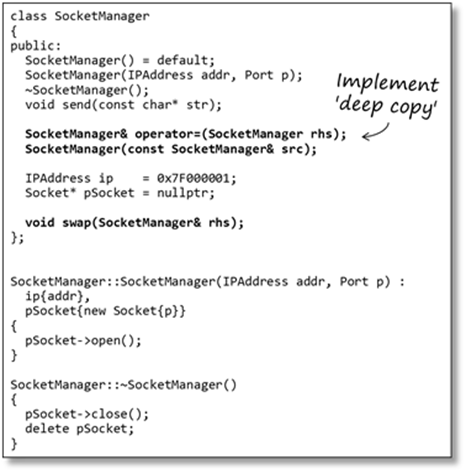
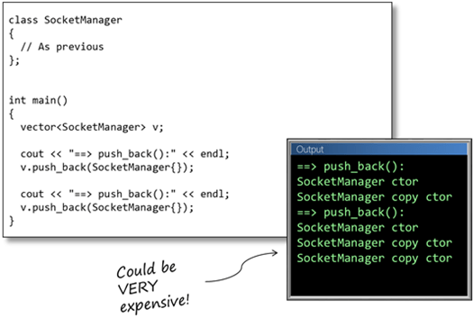
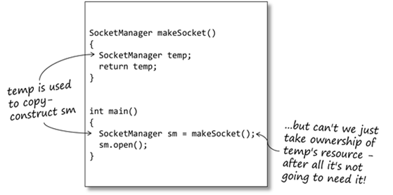
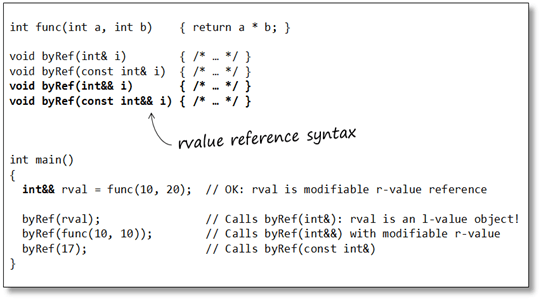
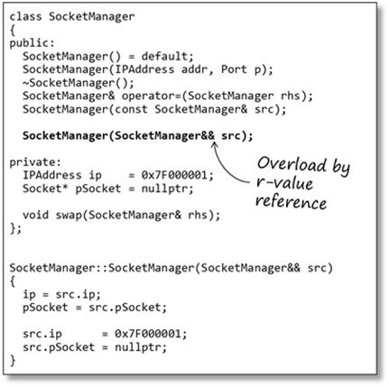
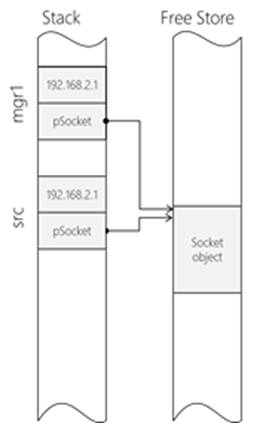
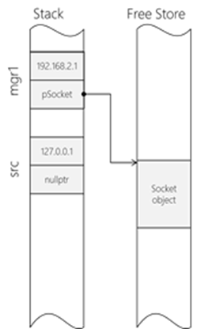
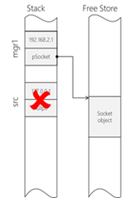
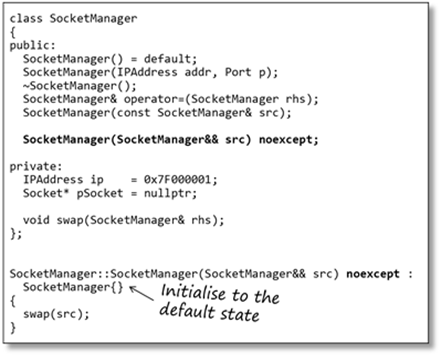
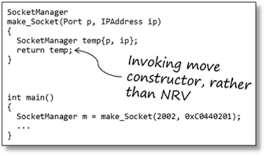

# feabhas [The Rule of The Big Four (and a half) – Move Semantics and Resource Management](https://blog.feabhas.com/2015/01/the-rule-of-the-big-four-and-a-half-move-semantics-and-resource-management/)

In the [previous article](https://blog.feabhas.com/2014/12/the-rule-of-the-big-three-and-a-half-resource-management-in-c/) we looked at the issues of resource management in C++ and introduced “The Rule of The Big Three (and a half)”. In this article we’ll extend this concept by looking at the idea of *move semantics*, a feature introduced in C++11. Move semantics mean we’ll have to extend our rule to “The Rule of The Big Five” or, perhaps more correctly, “The Rule of The Big Four (and a half)”.

## The cost of copying

Earlier, we had defined a `SocketManager` class that manages the lifetime of a `Socket` object. Here’s the type definition for the `SocketManager`:

The `Socket` is allocated in the `SocketManager` constructor; and de-allocated in the destructor.

The `SocketManager` class implements both the copy constructor and assignment operator, providing a ‘deep copy’ policy. You should read the previous article if you’re not already familiar with the *Copy-Swap Idiom* I’ve used here.

Copying objects may not be the best solution in many situations. It can be very expensive in terms of creating, copying and then destroying temporary objects. For example:

1、Returning objects from functions

2、Some algorithms (for example, `swap()`)

3、Dynamically-allocating containers.

Let’s take a vector of `SocketManagers` as an example:

As expected we get the **constructor** for the (temporary) `SocketManager` object, then the **copy constructor** as it is inserted into the vector. The second copy constructor is caused by the vector memory allocator creating space for two new objects then copying the objects across. This is an expensive operation since every copy requires de-allocation / re-allocation of memory and copying of contents.

Here we’re using the default constructor for the `SocketManager` class. We will discuss the consequences of this later.

For this example I’m deliberately ignoring emplacement of the objects; although the copying will still occur as memory is allocated.

## Resource pilfering(盗窃) and r-value references

C++98 favours copying. When temporary objects are created, as in the above example, they are copied (using the copy constructor). In a lot of cases copying is an unnecessary overhead since the temporary is going out of scope and can’t use its resources anymore.

It would be nicer if we could just ‘take ownership’ of the temporary’s resources, freeing it of the burden of de-allocating the resource, and freeing us of the burden of re-allocating. This is concept is known as ‘resource pilfering’.

> NOTE: 
>
> 一、C++11 mover semantic transfer resource ownership

### C++11 *r-value reference*

C++11 introduced the concept of the *r-value reference* for such circumstances.

C++ programmers are (hopefully!) familiar with references. A reference allows you to create an alias to an existing object. These have now been renamed *l-value references*, since they refer to named objects. Using l-value references allows C++ to support input and input-output parameters efficiently.

An r-value reference can be explicitly bound to an r-value. An r-value is an *unnamed object;* a temporary object, in other words. (click [here](https://blog.feabhas.com/2013/02/l-values-r-values-expressions-and-types/) for a much more detailed discussion of l-value and r-value expressions)

Rather confusingly an r-value reference, since it is a named object, is actually an l-value expression! Hence why the call to `byRef(rval)` actually calls `byRef(int&)`

> NOTE: 
>
> 一、"a named rvalue reference is an lvalue-just like any other variable"，下面的这个例子是一个非常经典的例子

The r-value reference, while not in and of itself particularly useful (much like the l-value reference, actually), can be used to overload functions to respond differently depending on whether a parameter is an l-value or an r-value type, giving different behaviour in each case.

#### There is no const r-value reference 

There are (as always) some complications. The compiler only favours r-value reference overloads for modifiable r-values; for constant r-values it always prefers constant l-value references (for **backward compatibility**). This means overloading functions for `const T&&` has no real application.

As we can now distinguish between l-value and r-value objects we can overload the constructor (and, later, assignment operator) to support resource pilfering.

### 4 – Move constructor

The move constructor is an overload of a class’ constructor that takes an r-value reference as a parameter. That is, the compiler can determine that the object used as the source is going out of scope in the near future and so we can pilfer its resources to construct the new object. The basic process is to take ownership of all the source object’s attributes then leave it in an ‘empty’ state.

> NOTE: 
>
> CppCoreGuidelines [C.64: A move operation should move and leave its source in a valid state](https://github.com/isocpp/CppCoreGuidelines/blob/master/CppCoreGuidelines.md#c64-a-move-operation-should-move-and-leave-its-source-in-a-valid-state)

What constitutes(构成) ‘empty’ will obviously vary from class to class; but basically it means leaving the object in such a state that its destructor will not fail or throw an exception.

Let’s look at the naïve solution first to understand the principle.

Note the parameter for the **move constructor** is not `const` – we need to modify the parameter. Our **move constructor** needs to pilfer(偷窃) the resources of the source object, and leave it in a **default state**.

The move constructor ‘claims’(请求) the resource of the supplied r-value. By setting the r-value `pSocket` to `nullptr`, when the r-value object goes out of scope its destructor will do nothing.

As in previous articles, a look at the memory map can clarify what’s going on. First we take ownership of the right-hand-side’s resources.

Then we put the right-hand side into an ‘empty’ state.

When the right-hand-side (temporary) object goes out of scope its destructor is called but does nothing (deleting `nullptr` has no effect). We have successfully pilfered(窃取) the resources from the temporary object.

A brief review of the code reveals that all the **move constructor** is doing is simply swapping the elements of the source object with an object in the default state. We have code that can already perform those two functions – the **default constructor** and the `swap()` function.

Re-writing the move constructor as below is clearly a more elegant solution.

Here we are making use of a C++11 feature – cascading constructors. The first thing we do in the move constructor is call the default constructor for the class, before swapping this ‘empty’ object’s state with the temporary’s.

> NOTE: 
>
> 一、关于"C++11 feature – cascading constructors"，参见 cppreference [Constructors and member initializer lists # Delegating constructor](https://en.cppreference.com/w/cpp/language/constructor#Delegating_constructor)。

Notice, in order to perform a move construction it must be possible to define an ‘empty’ state for the object. A good rule of thumb is: *if you cannot define a default constructor for the class it cannot support move semantics*.

> NOTE: 
>
> 1、上述总结非常好

A side-note: The move constructor is qualified as `noexcept`. This is a C++11 keyword denoting the exception specification of the function. In this case it guarantees that the move constructor will not throw an exception. This is a requirement for container classes (like the vector in our earlier example). If the move constructor may throw an exception the container will normally copy the object rather than move it.

> NOTE: 
>
> 一、CppCoreGuidelines [C.66: Make move operations `noexcept`](https://github.com/isocpp/CppCoreGuidelines/blob/master/CppCoreGuidelines.md#c66-make-move-operations-noexcept)
>
> 二、tag-std-vector implementation--move if std-move_if_noexcept else copy

Now we can return to our original example, the vector of `SocketManagers`. With the move constructor in place the `SocketManager` objects are moved rather than copied. (Note: we haven’t changed the vector code. It was attempting to move our SocketManager class all along, but without a move constructor to bind to, the compiler preferred the next best thing – binding the r-value object to a const SocketManager&; that is, the copy constructor)

This code could be significantly more efficient, if there is a lot of insertion in the vector.

There are some things to be aware of if you want to include move semantics with derived classes. If you want to use the base class move semantics from the derived class you must explicitly invoke it; otherwise the copy constructor will be called.

std::move here doesn’t actually do any moving; it just converts an l-value into an r-value. This forces the compiler to use the object’s move constructor (if defined) rather than the copy constructor.

### 5 – Move assignment

Occasionally we want to explicitly transfer ownership of resources from one object to another. This can be done using std::move.

std::move in this case forces the compiler to choose an r-value overload for the assignment operator.

After the move assignment the right-hand-side object will be left in an ‘empty’ state, so be careful: use std::move only if the l-value object is going to be discarded immediately – either it won’t be used again, or it is going out of scope (what the standard refers to as an ‘x-value’).

The assignment operator can now be overloaded for r-value references. First, let’s look at a naïve solution.

The assignment operator must always check for self-assignment. Although this is extremely rare in hand-written code certain algorithms (for example std::sort) may make such assignments.

Once again, a quick review of the above code reveals that, like the move constructor, the move assignment simply swaps the right-hand-side’s values for those of an ‘empty’ object.

## Eliminating the move assignment operator

In reality is the move assignment operator is unnecessary!

The previously-defined version of the assignment operator made a copy of the right-hand-side object before the call. This would normally invoke the usual copy constructor. However, std::move will cause the compiler to invoke the move constructor on the right-hand-side object instead.

By move-constructing the parameter its source (mgr2) will be left in an empty state (as required).

Once inside the assignment operator the left-hand-side and right-hand-side objects are simply swapped.

When the assignment operator function exits the temporary object (the parameter) will be deleted, conveniently cleaning up the resource that was owned by the left-hand-side.

Once again, a view of the memory map can help explain how this code appears to ‘magically’ work. Here’s our initial state:

First, the move constructor is called which pilfers the resources of the right-hand-side object (mgr1) and leaves it in an empty state.

The behaviour of the assignment operator is to swap the left- and right-hand side objects – in this case mgr2 and rhs.

When the temporary object (rhs) goes out of scope it deletes its resource (the resource originally owned by mgr2).

## Your resource management policy

What should have been “The Rule of The Big Five” is now reduced to “The Rule of The Big Four (and a half):

- The copy constructor
- The assignment operator
- The move constructor
- The swap function

With some careful programming we’ve managed to limit the amount of resource allocation / de-allocation to the bare minimum

“The Rule of The Big Four (and a half)” says if you’ve written one of the above functions then you must have a policy about the others. It doesn’t say you *have to write them.* In fact, you have to have a resource management policy for every class you create. Your policy can be one of the following:

- Use the compiler-provided versions of these functions. In other words, you’re not doing any resource management in the class.
- Write your own copy functions to perform deep copy, but don’t provide move semantics.
- Write your own move functions, but don’t support copying.
- Disable copying and move semantics for the class, because it doesn’t make sense to allow it.

Suppressing move and copy is straightforward; and there are two ways to do it:

- Make the appropriate function declarations private. (C++98-style)
- Use the =delete notation

## The conclusion (so far)

Resource management – making use of C++’s RAII/RDID mechanism – is a key practice for building efficient, maintainable, bug-free code. Defining your copy and move policy for each type in your system is a key part of the software design. The Rule of The Big Five exists as an aide memoir for your copy/move policy. Feel free to ignore it; but do so at your peril.

Finally, examining move and copy policies also leads to two supplemental good practices:

- A class should only manage at most one resource.
- Simplify your types by making use of extant types that perform resource management for you, such as ‘smart pointers’.

This last point is critical; and leads on to the last article in this series – “The Rule of Zero”. We’ll look at that next time.