# feabhas [The Rule of The Big Three (and a half) – Resource Management in C++](https://blog.feabhas.com/2014/12/the-rule-of-the-big-three-and-a-half-resource-management-in-c/)

The dynamic creation and destruction of objects was always one of the bugbears(棘手的难题；恐惧或烦恼的原因) of C. It required the programmer to (manually) control the allocation of memory for the object, handle the object’s initialisation then ensure that the object was safely cleaned-up after use and its memory returned to the heap. Because many C programmers weren’t educated in the potential problems (or were just plain lazy or delinquent in their programming) C got a reputation in some quarters for being an unsafe, memory-leaking language.

> NOTE: 
>
> 上面所描述的其实就是 "manual memory management手工内存管理"

C++ improved matters significantly by introducing an idiom known (snappily) as RAII/RRID – Resource Acquisition Is Initialisation / Resource Release Is Destruction`*`. The idiom makes use of the fact that every time an object is created a constructor is called; and when that object goes out of scope a destructor is called. The constructor/destructor pair can be used to create an object that automatically allocates and initialises another object (known as the *managed* object) and cleans up the managed object when it (the manager) goes out of scope. This mechanism is generically referred to as *resource management*.

> NOTE: 
>
> RAII 是 object-based resource management

In this article we’ll explore resource management in C++ and introduce *“The Rule of The Big Three (and a half)”*.

Resource management frees the client from having to worry about the lifetime of the managed object, eliminating memory leaks and other problems in C++ code. A resource could be any object that required dynamic creation/deletion – memory, files, sockets, mutexes, etc.

However, RAII/RRID doesn’t come without cost. Introducing a ‘manager’ object can lead to potential problems – particularly if the ‘manager’ class is passed around the system (it is just another object, after all). Copying a ‘manager’ object becomes an issue. The phrase “The Rule of The Big Three” was coined to highlight the issues of attempting to copy a resource-managing object.

Experience with resource management objects lead to the introduction of a new idiom in C++ – the *Copy-Swap Idiom*. This in turn has changed “The Rule of The Big three” into The Rule of The Big Three *(and a half)*”.

> NOTE: 
>
> *Copy-Swap Idiom* + The Rule of The Big three =  The Rule of The Big Three *(and a half)*

## 1 – The destructor

> NOTE: 
>
> 一、原文这一章节主要讲述的是RAII

For our example we will use a `SocketManager` class that owns (manages) the lifetime of a Socket class.

> NOTE: 
>
> 1、resource ownership

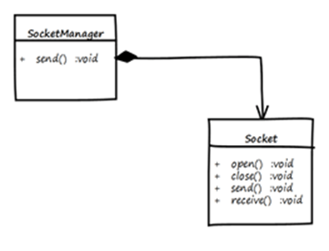

The `SocketManager` is responsible for the lifetime of its `Socket` object. The `Socket` is allocated in the `SocketManager` constructor; and de-allocated in the destructor.

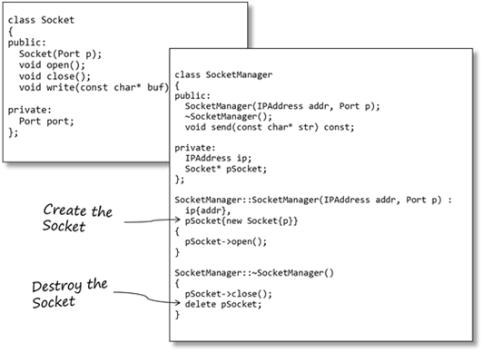

A small warning here: make sure the new and delete operators ‘match’: that is, if the resource is allocated with `new`, then use `delete`; if the resource is allocated as an array (`new[]`) make sure array delete is used (`delete[]`) Failure to do so will lead to ‘Bad Things’ happening.

> NOTE: 
>
> CppCoreGuidelines [ES.61: Delete arrays using `delete[]` and non-arrays using `delete`](https://github.com/isocpp/CppCoreGuidelines/blob/master/CppCoreGuidelines.md#es61-delete-arrays-using-delete-and-non-arrays-using-delete)

Also, if your resource manager class is going to be used polymorphically (that is, in an inheritance hierarchy) it is good practice to make the destructor virtual. This will ensure that any derived class destructors, if defined, will be called even if the client has a pointer to a base class.

> NOTE: 

Here’s the memory layout for a `SocketManager` object:

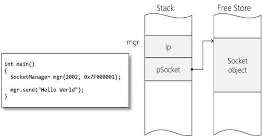

When `mgr` goes out of scope (in this case at the end of main; but in general at the end of the enclosing block) its destructor will be automatically called. The destructor calls `delete` on the `pSocket` pointer, which automatically calls the Socket’s destructor *before* releasing the memory for the Socket.

## 2 – The copy constructor

The copy constructor on a class is a special overload that initialises the object using another object of the same type as a source. At the end of the copy constructor the new object has the same state as the source object.

So when in your code will the copy constructor be called? Often, it is called ‘invisibly(看不见的)’ by the compiler. Here are the four scenarios the copy constructor is invoked:

### 1 – Explicit copy construction

The most explicit way to invoke the copy constructor on an object is to create said object, passing in another object (of the same type) as a parameter.

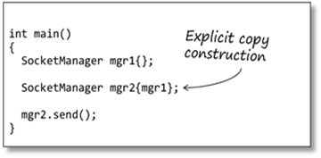

This is not a particularly common way to construct objects; compared with below.


### 2 – Object initialisation

> NOTE: 
>
> 这是典型的copy initialization

C++ makes the distinction between *initialisation* and *assignment* (even though it uses the same symbol for both; unhelpfully). If an object is being initialised the compiler will call a constructor, rather than the assignment operator. In the code below the copy constructor for `mgr2` is called:

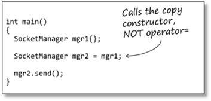


### 3 – Pass-by-value parameters

When objects are passed to functions by value a copy of the caller’s object is made. This new object has a constructor called, in this case the copy constructor.

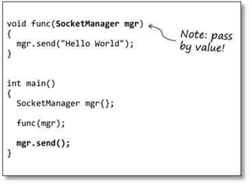


This extra overhead (memory + constructor call time) is why it’s always better to pass objects to functions by reference.

### 4 – Function return value

If a function returns an object from a function (by value) then a copy of the object is made. The copy constructor is invoked on return.

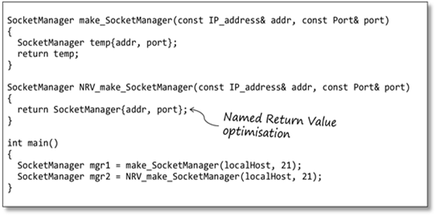


There are two exceptions to this:

1、If the return object is constructed directly as part of the return statement (as in `NRV_make_SocketManager()`, above) the compiler can optimise this and construct the return object *directly* into the caller’s object. In this case a ‘normal’ constructor is called rather than a copy constructor. This mechanism is referred to as the *Named Return Value* (NRV) optimisation.

2、If the object has a move constructor defined then that will be called in preference. We’ll explore move constructors in another article.

In the example below the programmer is passing the `SocketManager` object (either deliberately, or accidently) to the function preamble by value.

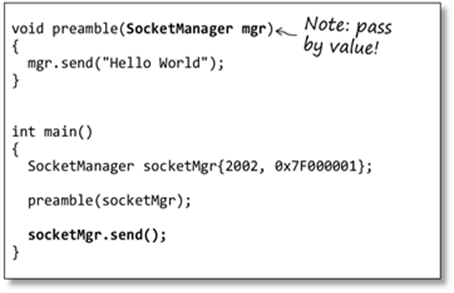


Let’s explore the consequences of this.

Copying an object requires that the new object has the same attributes values as its source. To do this the compiler supplies a default implementation of the copy constructor.

#### Implicit defined copy constructor shallow copy、double free、dangling、wrong ownership

> NOTE: 
>
> 原文后面所谈论的是非常常见的: implicit-defined-copy-constructor-shallow-copy-double-free-dangling-wrong ownership

The compiler-supplied copy constructor performs a *member-wise* initialisation; each data member in the new object is initialised with its equivalent in the source.

Here we see the memory map, just before the call to `preamble()`.


On call, the parameter object, mgr, is created and copy-constructed. Because the default behaviour of the compiler-supplied copy constructor is to perform a member-wise initialisation mgr has the same `pSocket` value as `socketMgr`.

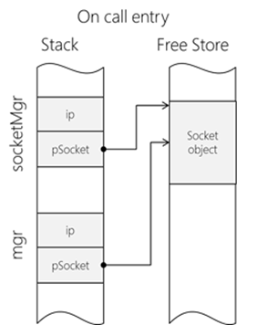

At the moment this should cause no problems with the behaviour of the code. But what happens when `preamble()` returns?

When the function finishes its automatic objects (including its parameters) are destroyed. In this case, mgr goes out of scope and its destructor is called. The `SocketManager` destructor does exactly what it should do – deallocate its resource.

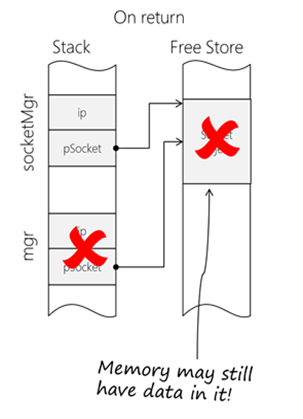

However, at the end of `main()` `socketMgr` goes out of scope; and once again the `SocketManager` destructor is called. This is where our problem occurs – the resource has already been deallocated so we cannot free it again. This will (typically) cause an exception to be thrown.

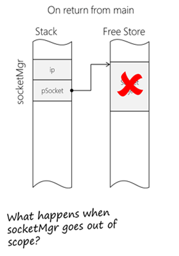

A more subtle problem is that, even though the resource has been deallocated, the data may still exist on the free store (depending on the implementation of your memory manager). This means `socketMgr` may still be able to access / use its Socket object, even though technically the memory is invalid.

You can (and of course, should) provide your own copy constructor, which overrides the compiler-supplied one.

#### Custom copy constructor deep copy

The copy constructor must be written to perform a ‘deep copy’ – that is, don’t simply copy pointers, copy what the pointers *reference*.

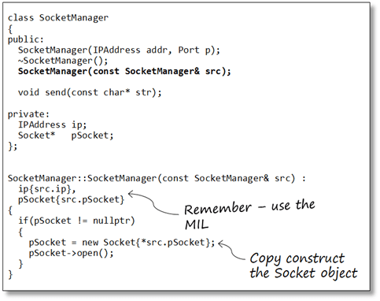

Note the signature of the copy constructor – it takes a reference to a `const` `SocketManager` object. (make sure you always pass by reference, or you’ll blow your stack. I’ll leave it to you to figure out why!)

Notice also that we check if the source object actually *has* a resource allocated, otherwise we’ll get a run-time fault when we try and copy from a null pointer.

The copy construction proceeds as follows:

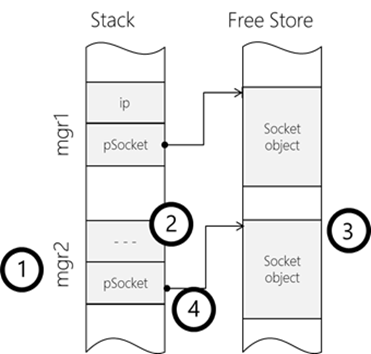

1、Memory is allocated for the new `SocketManager` object

2、The non-pointer elements are initialised with the MIL

3、A new resource (Socket) is allocated.

4、The source Socket is assigned to the target’s Socket.

This new implementation will save us from problems if we happen to copy our resource manager objects about.

## 3 – The assignment operator

One of the design goals of C++ is that user-defined types (classes) should behave in the same way as the built-in types. It should be possible to assign two objects of like type.  Since all behaviours on classes are defined as functions there must be an assignment operator function. If you haven’t provided one the compiler creates a default assignment operator which performs a member-wise assignment; each data member is assigned in turn.

At first glance the code below appears sound:

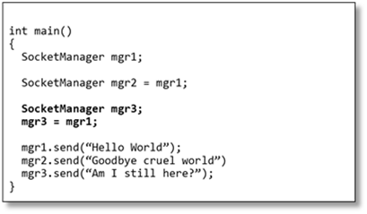

`SocketManager mgr2` is being initialised with `mgr1`. The compiler will copy-construct `mgr2` from `mgr1`. That is, the code above is equivalent to:

```C++
SocketManager mgr2(mgr1);
```

The problem is with `mgr3`.

Although the construction of `mgr3` appears to be semantically the same the compiler is producing different code. In this case `mgr3` is being default-constructed then (in the next statement) having `mgr1` *assigned* to it.

With a resource-managing class this causes the problem we had previously: the default implementation performs *shallow copy;* and we require a *deep copy*.

### Custom assignment operator 

The solution to our problem is to provide an assignment operator function that implements the correct class copy semantics.

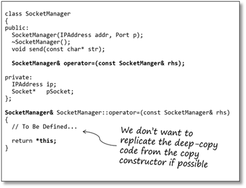

Notice the assignment operator returns a reference to itself. This is so expressions like this work:

```c++
mgr1 = mgr2 = mgr3;
```


The behaviour of the assignment operator is very similar to the behaviour of the copy constructor. In general, it is bad practice to replicate code so ideally we’d like to have a common function for performing both copying and assignment.

### *Copy-Swap Idiom*

Enter the *Copy-Swap Idiom*, which provides an efficient, safe way to implement the assignment operator by (re)using the copy constructor code.

We provide a `swap()` function that uses the standard library function `std::swap` to exchange the attributes of the class. `std::swap` has been specialised for objects and arrays (as well as most of the Standard Library types) so it usually far more efficient than attempting to manipulate memory yourself.

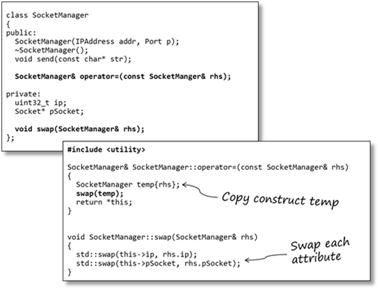

It’s not immediately obvious how this works so it’s worth examining the memory map for the assignment:

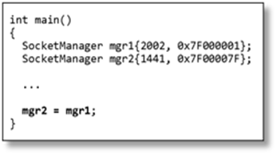

Here’s the memory situation just before the call to the assignment.

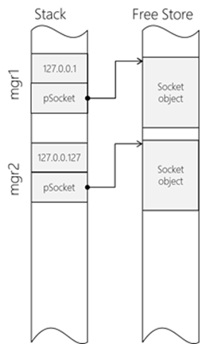


A copy of the right-hand-side object is made: temp.

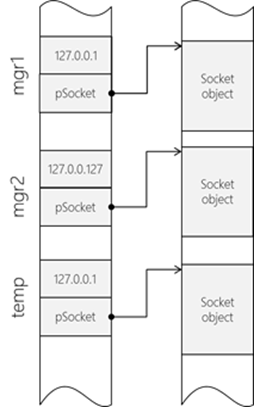


Next, the left-hand-side of the assignment (this) and the temporary object are exchanged using `swap()`.

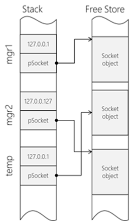


When the temporary object goes out of scope at the end of the function it will deallocate its resource – which was the resource owned by the left-hand-side (`mgr2`). Thus there are no memory leaks.

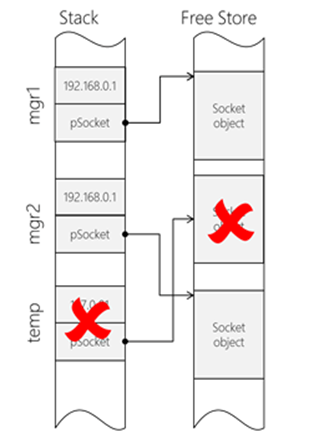


### Assignment operator-pass by value-copy and swap idiom-strong exception safety

There is a (small) chance that if the copy constructor (for `temp`) fails it could throw an exception, possibly leaving the receiving object in an invalid state.

To stop this, we re-write the assignment operator and move the copy construction outside the call. Notice the assignment operator has been re-written to take a `SocketManager` object *by value*.

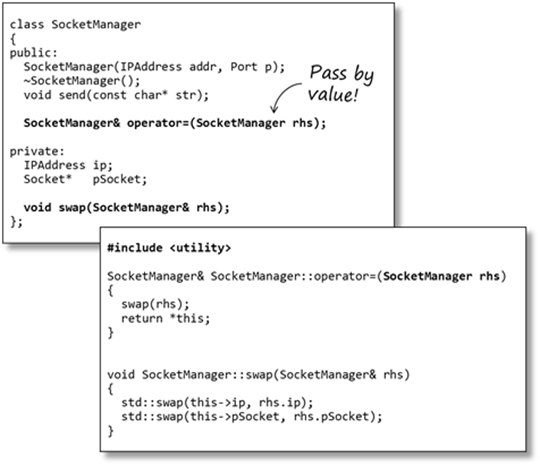


When the assignment operator is called, the first thing that happens is a copy of the right-hand-side is made. Should the copy constructor throw an exception this will happen before the call to `operator=` (which will never get called); thus leaving the left-hand-side object unaffected.

## The Rule of the Big Three (and a half)

If your class manages a resource then it is likely:

- The object needs clearing up when it goes out of scope
- The object may be passed by value (copied) – even if in error
- The object may be assigned to another – even if in error

For robustness your code must cope – correctly – with all these conditions.

The *Rule of the Big Three* states that if you have implemented either

- A destructor
- An assignment operator
- A copy constructor

You should also implement the other two.

To implement the Copy-Swap idiom your resource management class must also implement a `swap()` function to perform a member-by-member swap (there’s your “…(and a half)”)

## Suppressing copying

In some cases you may want to explicitly restrict / suppress copying. For example, copying an OS mutex is semantically incorrect.

To suppress copying mark the copy constructor and assignment operator as a del*eted function* (using `=delete`). The compiler will prevent you from calling these functions. You only have to declare the copy constructor and assignment operator; not define them (since no-once can call them).

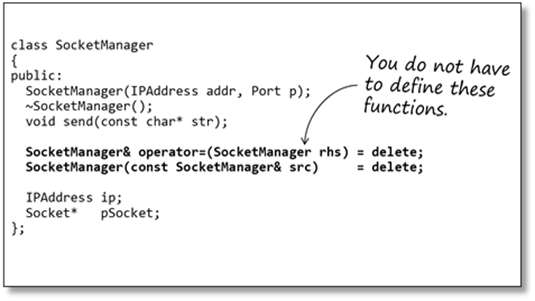


The choice you make for the class is known as its *copy policy.* Depending on the needs of the class the policy may be:

1、Do nothing – accept the default (compiler-supplied) operations.

> NOTE: 
>
> shallow copy

2、Implement deep-copy semantics

3、Suppress copying


**Bjarne Stroustrup joked once that he should never, ever work in marketing, after coming up with an unpronounceable acronym like RAII/RRID!*