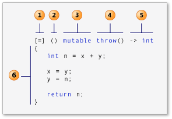

# Lambda expressions


## 发展概述

### C++11

引入 Lambda functions and expressions ，参见:

1) Wikipedia [C++11#Lambda functions and expressions](https://infogalactic.com/info/C%2B%2B11#Lambda_functions_and_expressions)

2) cppreference [C++11](https://en.cppreference.com/w/cpp/11) # [variadic templates](https://en.cppreference.com/w/cpp/language/parameter_pack)


### C++14

新增 generic lambda 特性，参见: 

1) cppreference [C++14](https://en.cppreference.com/w/cpp/14) # [generic lambdas](https://en.cppreference.com/w/cpp/language/lambda)

2) Wikipedia [C++14 # Generic lambdas](https://infogalactic.com/info/C%2B%2B14#Generic_lambdas)

新增 lambda init-capture/Lambda capture expressions，参见:

1) cppreference [C++14](https://en.cppreference.com/w/cpp/14) # [lambda init-capture](https://en.cppreference.com/w/cpp/language/lambda)

2) Wikipedia [C++14 # Lambda capture expressions](https://infogalactic.com/info/C%2B%2B14#Lambda_capture_expressions)


### C++17

新增 lambda capture of `*this` 特性，参见: 

1) cppreference [C++17](https://en.cppreference.com/w/cpp/17) # [lambda capture of `*this`](https://en.cppreference.com/w/cpp/language/lambda#Lambda_capture)

新增 constexpr lambda 特性，参见:

1) cppreference [C++17](https://en.cppreference.com/w/cpp/17) # [constexpr lambda](https://en.cppreference.com/w/cpp/language/lambda)


## microsoft [Lambda Expressions in C++](https://docs.microsoft.com/en-us/cpp/cpp/lambda-expressions-in-cpp?view=vs-2019)

> NOTE: 这篇讲解地非常好

### Parts of a Lambda Expression

```c++
#include <algorithm>
#include <cmath>
#include <cstddef>
#include <iostream>

void abssort(float* x, unsigned n)
{
	std::sort(x, x + n,
			// Lambda expression begins
			[](float a, float b)
			{
				return (std::abs(a) < std::abs(b));
			} // end of lambda expression
			);
}

int main()
{
	float Array[] = { 6, -5, 4, -3, 2, 1 };

	std::cout << "Before sort:" << std::endl;
	for (auto Element : Array)
	{
		std::cout << Element << std::endl;
	}
	std::size_t Len = sizeof(Array) / sizeof(float);
	std::cout << "After sort:" << std::endl;
	abssort(Array, Len);
	for (auto Element : Array)
	{
		std::cout << Element << std::endl;
	}
}

```


This illustration shows the parts of a lambda:



1. *capture clause* (Also known as the *lambda-introducer* in the C++ specification.)
2. *parameter list* Optional. (Also known as the *lambda declarator*)
3. *mutable specification* Optional.
4. *exception-specification* Optional.
5. *trailing-return-type* Optional.
6. *lambda body*.

#### Capture Clause


## cppreference [Lambda expressions](https://en.cppreference.com/w/cpp/language/lambda)


### Passing Lambda Expressions with `std::function`

在drdobbs [Lambdas in C++11](https://www.drdobbs.com/cpp/lambdas-in-c11/240168241)中有如下描述：

Each time you are creating a **lambda expression**, its implementation creates a new class under the hood. Thus, each lambda creates a separate class and has a different type. As you might guess, even when many lambda expressions receive the same arguments and return the same type, each of them will be a different class; that is, a different type. Luckily, C++11 incorporates a **wrapper** for any of the following functions with `std::function` and makes it easy to pass around lambda expressions:

> NOTE: `std::function`是一个abstraction

- Lambda expression
- Function pointer
- Functor


关于此的例子，参见`C++\Language-reference\Functions\std-utility-lib-Function-objects\cppreference-std-function.md`。


## Capture by reference


```C++
#include <iostream>

int main(void)
{
	int i = 0;
	std::cout << &i << std::endl;
	auto F = [&i]()
	{

		std::cout<<&i<<std::endl;
	};
	F();
}
// g++ test.cpp -pedantic -Wall -Wextra --std=c++11

```

从输出来看，两者的地址相等，也就是是同一个object，因此是capture by reference。

## Capture by value

stackoverflow [C++0x lambda capture by value always const?](https://stackoverflow.com/questions/2835626/c0x-lambda-capture-by-value-always-const)

测试程序参见: `./Capture-by-value-const-test-code`