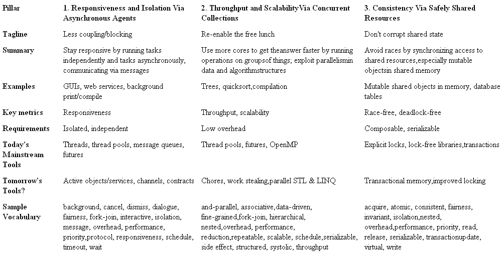

# drdobbs [The Pillars of Concurrency](https://www.drdobbs.com/parallel/the-pillars-of-concurrency/200001985)

> NOTE: 
>
> 

**In his inaugural column, Herb makes the case that we must build a consistent mental model before talking about concurrency.**

> NOTE: 
>
> 1、"Pillar"的含义是"支柱"
>
> 2、这篇文章作者给出了理解concurrency的一个理论框架

You can see the confusion in our vocabulary (and this is not an exhaustive list):

*acquire, and-parallel, associative, atomic, background, cancel, consistent, data-driven, dialogue, dismiss, fairness, fine-grained, fork-join, hierarchical, interactive, invariant, isolation, message, nested, overhead, performance, priority, protocol, read, reduction, release, structured, repeatable, responsiveness, scalable, schedule, serializable update, side effect, systolic, timeout, transaction, throughput, virtual, wait, write,...*

## Callahan's Pillars

My colleague David Callahan leads a team within Visual Studio that is working on programming models for concurrency. He has pointed out that fundamental concurrency requirements and techniques fall into three basic categories, or pillars. They are summarized in Table 1 [1]. Understanding these pillars gives us a framework for reasoning clearly about all aspects of concurrency — from the concurrency requirements and **tradeoffs** that matter to our current project, to why specific design patterns and implementation techniques are applicable to getting specific results and how they are liable to interact, and even to evaluating how future tools and technologies will fit with our needs.

Let's consider an overview of each pillar in turn, note why techniques in different pillars compose well, and see how this framework helps to clarify our vocabulary.

### Table 1: The Pillars of Concurrency.

## Pillar 1: Responsiveness and Isolation Via Asynchronous Agents

Pillar 1 is all about running separate tasks, or agents, independently and letting them communicate via asynchronous messages. We particularly want to avoid blocking, especially on user-facing and other time-sensitive threads, by running expensive work asynchronously. Also, isolating separable tasks makes them easier to test separately and then deploy into various parallel contexts with confidence. Here we use key terms like "interactive" and "responsive" and "background"; "message" and "dialogue"; and "timeout" and "cancel."

## Pillar 2: Throughput and Scalability Via Concurrent Collections

> NOTE: 
>
> 1、我的实践是:  行情插件 将采集到的行情放到 发送队列，然后由发送线程进行发送，即"异步发送"

Pillar 2, on the other hand, is about keeping hundreds of cores busy to compute results faster, thereby re-enabling the "free lunch"[2]. We particularly want to target operations performed on collections (any group of things, not just containers) and exploit parallelism in data and algorithm structures. Here, we use key terms like "scalability" and "throughput"; "data-driven" and "fine-grained" and "schedule"; and "side effect" and "reduction."

New hardware no longer delivers the "free lunch" of automatically running single-threaded code faster to the degree it did historically. Instead, it provides increasing capacity to run more tasks concurrently on more CPU cores and hardware threads. How can we write applications that will regain the free lunch, that we can ship today and know they will naturally execute faster on future machines having ever greater parallelism.

Rather, the key to scalability is to express lots of latent concurrency in the program that scales to match its inputs (number of messages, size of data). We do this in two main ways.

### The first way 

The first way is to use libraries and abstractions that let you say what you want to do rather than specifically how to do it. Today, we may use tools like OpenMP to ask to execute a loop's iterations in parallel and let the runtime system decide how finely to subdivide the work to fit the number of cores available. Tomorrow, tools like parallel STL and parallel LINQ [5] will let us express queries like "select the names of all undergraduate students sorted by grade" that can be executed in parallel against an in-memory container as easily as they are routinely executed in parallel by a SQL database server.

### The second way

The second way, is to explicitly express work that can be done in parallel. Today, we can do this by explicitly running work items on a thread pool (for instance, using Java `ThreadPoolExecutor` or .NET `BackgroundWorker`). Just remember that there is overhead to moving the work over to a pool, so the onus is on us to make sure the work is big enough to make that worthwhile. For example, we might implement a recursive algorithm like quicksort to at each step sort the left and right subranges in parallel if the subranges are large enough, or serially if they are small. 

## Pillar 3: Consistency Via Safely Shared Resources

Pillar 3 is all about dealing with shared resources, especially shared memory state, without either corruption or deadlock. Here we use key terms like acquire and release; read and write; and atomic and consistent and transaction. In these columns, I'll mostly focus on dealing with mutable objects in shared memory.

Today's status quo for synchronizing access to mutable shared objects is locks. Locks are known to be inadequate (see [3] and [4]), but they are nevertheless the best general-purpose tools we have. Some frameworks provide selected lock-free data structures (hash tables) that are internally synchronized using atomic variables so that they can be used safely without taking locks either internally inside the data structure implementation or externally in your calling code; these are useful, but they are not a way to avoid locking in general because they are few and many common data structures have no known lock-free implementations at all.

In the future, we can look forward to improved support for locks (for example, being able to express lock levels/hierarchies in a portable way, and what data is protected by what lock) and probably transactional memory (where the idea is to automatically version memory, so that the programmer can just write "begin transaction; do work; end transaction" like we do with databases and let the system handle synchronization and contention automatically). Until we have those, though, learn to love locks.

## Composability: More Than The Sum of the Parts

Because the pillars address independent issues, they also compose well, so that a given technique or pattern can apply elements from more than one category.

For example, an application can move an expensive tree traversal from the main GUI thread to run in the background to keep the GUI free to pump new messages (responsiveness, Pillar 1), while the tree traversal task itself can internally exploit the parallelism in the tree to traverse it in parallel and compute the result faster (throughput, Pillar 2). The two techniques are independent of each other and target different goals using different patterns and techniques, but can be used effectively together: The user has an application that is responsive no matter how long the computation takes on a less-powerful machine; he also has a scalable application that runs faster on more powerful hardware.

Conversely, you can use this framework as a tool to decompose concurrency tools, requirements, and techniques into their fundamental parts. By better understanding the parts and how they relate, we can get a more accurate understanding of exactly what the whole is trying to achieve and evaluate whether it makes sense, whether it's a good approach, or how it can be improved by changing one of the fundamental pieces while leaving the others intact.

### 

## Summary

Have a consistent mental model for reasoning about concurrency — including requirements, tradeoffs, patterns, techniques, and technologies both current and future. Distinguish among the goals of responsiveness (by doing work asynchronously), throughput (by minimizing time to solution), and consistency (by avoiding corruption due to races and deadlocks).

In future columns, I'll dig into various specific aspects of these three pillars. Next month, we'll answer the question, "how much concurrency does your application have or need?" and distinguish between `O(1)`, `O(K)`, and `O(N)` concurrency. Stay tuned.

## Notes

[1] The elephant analogy and the pillar segmentation were created by David Callahan (www.microsoft.com/presspass/exec/de/Callahan/ default.mspx) in an unpublished work.

[2] H. Sutter. "The Free Lunch Is Over: A Fundamental Turn Toward Concurrency in Software" (www.ddj.com/dept/architect/184405990).

[3] H. Sutter. "The Trouble With Locks" (www.ddj.com/dept/cpp/184401930)

[4] H. Sutter and J. Larus. "Software and the Concurrency Revolution" (*ACM Queue*, September 2005). (gotw.ca/publications/concurrency-acm.htm).

[5] J. Duffy, http://www.bluebytesoftware.com/ blog/PermaLink,guid,81ca9c00-b43e-4860-b96b-4fd2bd735c9f.aspx.