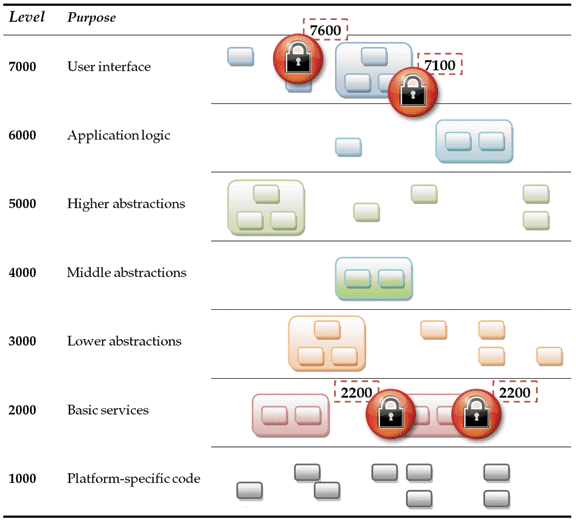

# drdobbs [Use Lock Hierarchies to Avoid Deadlock](https://www.drdobbs.com/parallel/use-lock-hierarchies-to-avoid-deadlock/204801163)

> NOTE: 
>
> 一、本文讨论的其实是lock multiple，其实这在APUE中已经讨论了，作者提出了lock hierarchy的概念、方法，它是一种更加通用的方法，能够保证consistent global order。
>
> 二、deadlock是可以使用dependency model来进行描述的

**Need to avoid deadlock in the code you control? Try using lock hierarchies.**

In the first two Effective Concurrency columns—"[The Pillars of Concurrency](http://www.drdobbs.com/parallel/the-pillars-of-concurrency/200001985)" (*DDJ*, August 2007) and "[How Much Scalability Do You Have or Need?](http://www.drdobbs.com/parallel/how-much-scalability-do-you-have-or-need/201202924)" (*DDJ*, September 2007)—we saw the three pillars of concurrency and what kinds of concurrency they express:

1、Pillar 1: Isolation via asynchronous agents. This is all about doing work asynchronously to gain isolation and responsiveness, using techniques like messaging. Some Pillar 1 techniques, such as pipelining, also enable limited scalability, but this category principally targets isolation and responsiveness.

2、Pillar 2: Scalability via concurrent collections. This is all about reenabling the free lunch of being able to ship applications that get faster on machines with more cores, using more cores to get the answer faster by exploiting parallelism in algorithms and data.

3、Pillar 3: Consistency via safely shared resources. While doing all of the above, we need to avoid races and deadlocks when using shared objects in memory or any other shared resources.


My last few columns have focused on Pillar 3, and I've referred to **lock levels** or **lock hierarchies** as a way to **control deadlock**. A number of readers have asked me to explain what those are and how they work, so I'll write one more column about Pillar 3 (for now).

## The Problem: Anatomy(解剖) of a Deadlock

Your program contains a potential deadlock if:

1、One part of your program tries to acquire exclusive use of two shared resources (such as mutexes) `a` and `b` at the same time by acquiring first `a` and then `b.`

2、Some other part of your program tries to do the same by acquiring `b` and then `a` in the reverse order.

3、The two pieces of code could ever execute concurrently.

> NOTE: 
>
> 1、

For convenience, from now on I'm going to talk about just locks, but the issues and techniques apply to any shared resource that needs to be used exclusively by one piece of code at a time. The following code shows the simplest example of a potential deadlock:

```C
// Thread 1: a then b   // Thread 2: b then a
a.lock();                 b.lock();
b.lock();                 a.lock();
 ...                       ...
// unlock a and b     // unlock a and b 
//   in either order  //   in either order
```

The only way to eliminate such a **potential deadlock** is to make sure that all mutexes ever held at the same time are acquired in a consistent order. But how can we ensure this in a way that will be both usable and correct? For example, we could try to figure out which groups of mutexes might ever be held at the same time, and then try to define pairwise ordering rules that cover each possible combination. But that approach by itself is prone to accidentally missing unexpected combinations of locks; and even if we did it perfectly, the result would still be at best "DAG spaghetti"—a directed acyclic graph (DAG) that nobody could comprehend(理解) as a whole. And every time we want to add a new mutex to the system, we would have to find a way fit it into the DAG without creating any cycles.

> NOTE:
>
> 1、上面给出了一种形式化的分析方法 DAG
>
> 

We can do better by directly exploiting the knowledge we already have about the structure of the program to regularize the mess and make it understandable.

## A Solution: Lock Hierarchies and Layering

> NOTE: 
>
> 1、这是作者给出的解决方法

The idea of a lock hierarchy is to assign a numeric level to every mutex in the system, and then consistently follow two simple rules:

1、Rule 1: While holding a lock on a mutex at level `N`, you may only acquire new locks on mutexes at lower levels `<N`.

2、Rule 2: Multiple locks at the same level must be acquired at the same time, which means we need a "lock-multiple" operation such as` lock( mut1, mut2, mut3, ... ).` This operation internally has the smarts to make sure it always takes the requested locks in some **consistent global order**. [1] Note that any consistent order will do; for example, one typical strategy is to acquire mutexes at the same level in increasing address order.

If the entire program follows these rules, then there can be no deadlock among the mutex acquire operations, because no two pieces of code can ever try to acquire two mutexes `a` and `b` in opposite orders: Either `a` and `b` are at different levels and so the one at the higher level must be taken first; or else they are at the same level and they must be requested at the same time, and the system will automatically acquire them in the same order. The two simple rules have provided a convenient and understandable way to conveniently express a total order on all locking performed in the system.

### Where do we find the levels? 

But where do we find the levels? The answer is: You probably already have them. Mutexes protect data, and the data is already in layers.

Lock levels should directly leverage and mirror the layering already in place in the modular structure of your application. Figure 1 illustrates a typical example of layering (or "hierarchical decomposition" and "into a directed acyclic graph," if you prefer five-dollar words), a time-tested technique to control the dependencies in your software. The idea is to group your code into modules and the modules into layers, where code at a given layer can only call code at the same or lower layers, and should avoid calling upward into higher layers.



##### Figure 1: Sample module/layer decomposition.


If that sounds a lot like the Two Rules of lock hierarchies, that's no coincidence. After all, both the layering and the mutexes are driven by the same goal: to protect and control access to the encapsulated data that is owned by each piece of code, and to keep it free from corruption by maintaining its invariants correctly. As in Figure 1, the levels you assign to mutexes will normally closely follow the levels in your program's **layered structure**. A direct consequence of Rule 1 is that locks held on mutexes at lower levels have a shorter duration than locks held at higher levels; this is just what we expect of calls into code at lower layers of a layered software system.

Software can't always be perfectly layered, but exceptions should be rare. After all, if you can't define such layers, it means that there is a cycle among the modules somewhere that includes code in what should be a lower level subsystem calling into higher level code somewhere, such as via a callback, and you have the potential for reentrancy even in single-threaded code. And remember, **reentrancy is a form of concurrency**, so the program can observe corrupt state even in single-threaded code. If higher level code is in the middle of taking the system from one valid state to another, thus temporarily breaking some invariant, and calls into lower level code, the trouble is that if that call could ultimately call back into the higher level code it might see the broken invariant. Layering helps to solve this single-threaded concurrency problem for the same reasons it helps to solve the more general multithreaded version.


## Frameworks and Lock Hierarchies

> NOTE: 
>
> 一、这一节作者给出了实现Lock Hierarchies的wrapper class

It is a curious thing that major frameworks that supply mutexes and locks do nothing to offer any direct support for lock hierarchies. Everyone is taught that lock hierarchies are a best practice, but then are generally told to go roll their own.

The frameworks vendors will undoubtedly fix this little embarrassment in the future, but for now, here's a useful recipe to follow as you do roll your own level-aware mutex wrapper. You can adapt this simple sketch to your project's specific needs (for example, to suit details such as whether your `lock` operation is a method or a separate class):

1、Write a wrapper around each of your favorite language- or platform-specific mutex types, and let the wrapper's constructor(s) take a level number parameter that it saves in a `myLevel` member. Use these wrappers everywhere. (Where practical, save time by making the wrapper generic—as a C++ template, or a Java or .NET generic—so that it can be instantiated to wrap arbitrary mutex types that have similar lock/unlock features. You might only have to write it once.)

2、Give the wrapper class a thread-local static variable called `currentLevel`, initialized to a value higher than any valid lock level.

3、In the wrapper's `lock` method (or similar), assert that `currentLevel` is greater than `myLevel`, the level of the mutex that you're about to try to acquire. Remember, if the previous value of `currentLevel` is using another member variable, then set `currentLevel = myLevel`; and acquire the lock.

4、In the wrapper's `unlock` method (or similar), restore the previous value of `currentLevel`.

5、As needed, also wrap other necessary methods you need to be able to use, such as `try_lock`. Any of these methods that might try to acquire the lock should do the same things as `lock` does.

6、Finally, write a "lock-multiple" method `lock( m1, m2, ... )` that takes a variable number of lockable objects, asserts that they are all at the same level, and locks them in their **address order** (or their **GUID order**, or some other globally consistent order).

### Using assertions in the `lock` methods 

> NOTE: 
>
> 1、使用assertions ，是典型的"design by contract"

The reason for using assertions in the `lock` methods is so that, in a debug build, we force any errors to be exposed the first time we execute the code path that violates the lock hierarchy rules. That way, we can expect to find violations at test time and have high confidence that the program is deadlock-free based on code path coverage. Enabling such **deterministic test-time failures** is a great improvement over the way concurrency errors usually manifest, namely as **nondeterministic runtime failures** that can't be thoroughly(彻底的) tested using **code path coverage** alone. But often our **test-time code path coverage** isn't complete, either because it's impossible to cover all possible code path combinations or because we might forget a few cases; so prefer to also perform the tests in release builds, recording violations in a log or diagnostic dump that you can review later if a problem does occur.

## A Word About Composability

Although lock hierarchies address many of the flaws of locks, including the possibility of deadlock, they still share the same **Achilles Heel**(致命要害): Like locks themselves, lock hierarchies are not in general composable without some extra discipline and effort. After all, just because you use a lock hierarchy discipline correctly within the code you control, a separately authored module or plug-in that you link with won't necessarily know anything about your lock hierarchy unless you somehow inform them about your layers and how they should fit into the hierarchy.


For example, look at the sample application architecture in Figure 1 again, and consider: What if the application wants to allow plugins that are called from the 5000s layer? First, of course, the program and all the plug-ins should make every effort to avoid calling unknown code (in this case, each other) while holding a lock. But, as we saw last month ("Avoid Calling Unknown Code While Inside a Critical Section", `DDJ`, December 2007), we can encounter trouble even if a plug-in takes no locks of its own but may call back into the main program and create a code path that unexpectedly calls up into higher level code that takes a higher level lock. So the plug-ins must be aware of the layering of the application and be told that they are to operate at (say) level 4999, and may only call APIs below level 4999.


## Summary

Keep it on the level: Use lock hierarchies to avoid deadlock in the code you control. Assign each shared resource a level that corresponds to its architectural layer in your application, and follow the two rules: While holding a resource at a higher level, acquire only resources at lower levels; and acquire multiple resources at the same level all at once.

If your program will call external code, especially plug-ins, then document your public API sufficiently for plug-in authors to see what level their plug-in is expected to operate at, and therefore the API calls they can and can't make (those below their level and those at or above their level, respectively).

Next month, we'll start to look into issues and techniques for writing scalable manycore applications. Stay tuned.


### Notes

[1] Or otherwise gets the same effect. For example, it is possible to just start trying to acquire the locks in some randomly selected order using try_lock operations, and if we can't acquire them all just back-off (unlock the ones already acquired) and try a different order until we find one that works. Surprisingly, this can be more efficient than taking the locks in a hard-coded global order, although any backoff-and-retry strategy has to take care that it doesn't end up prone to livelock problems in-stead. But we can leave all this to the implementer; the key is that the programmer simply writes` lock( /* whatever */ ) `and is insulated from the details of determining the best way to keep the order consistent.