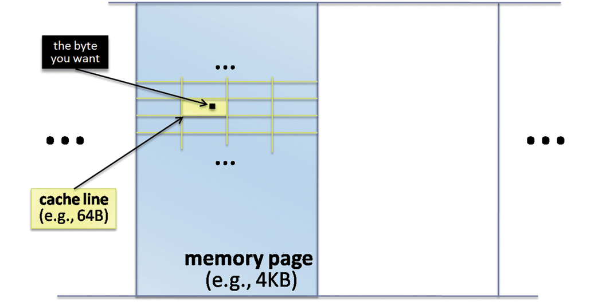

# drdobbs [Maximize Locality, Minimize Contention](https://www.drdobbs.com/parallel/maximize-locality-minimize-contention/208200273) 

> NOTE: 
>
> 1、更大的locality，意味着更少的contention

**Want to kill your parallel application's scalability? Easy: Just add a dash of contention.**

In the concurrent world, locality is a first-order issue that trumps(王牌、首要考虑因素) most other performance considerations. Now locality is no longer just about fitting well into cache and RAM, but to avoid scalability busters(遏制) by keeping tightly coupled data physically close together and separately used data far, far apart.

> NOTE: 
>
> 翻译如下:
>
> "在并发世界中，局部性是一个一阶问题，比大多数其他性能考虑因素都重要。
> 现在，局部性不再仅仅是为了很好地适应缓存和RAM，而是为了避免可伸缩性问题，将紧密耦合的数据保持物理上在一起，而将单独使用的数据保持在很远很远的地方。"
>
> 最后一句话的含义是: 
>
> locality 不再仅仅是"fitting well into cache and RAM"，还包括了: 为了避免"scalability busters(遏制)"，需要:
>
> 1、keeping tightly coupled data physically close together 
>
> 2、separately used data far, far apart
>
> 这是为了避免false sharing


## Of Course, You'd Never Convoy(护航) On a Global Lock

### Example

Nobody would ever willingly write code like this in a tight loop.

```C++
// Threads 1-N
while( ... ) {
  globalMutex.lock();
  DoWork();
  globalMutex.unlock();
}
```

This is clearly foolish, because all the work is being done while holding a global lock and so only one thread can make progress at a time. We end up with a classic lock convoy: At any given time, all of the threads save one are piled up behind the lock as each waits idly for its turn to come.

Convoys are a classic way to kill parallel scalability. In this example, we'll get no parallel speedup at all because this is just a fancy way to write sequential code. In fact, we'll probably get a minor performance hit because of taking and releasing the lock many times and incurring context switches, and so we would be better off just putting the lock around the whole loop and making the convoy more obvious.

#### 降低锁的粒度

True, we sometimes still gain some parallel benefit when only part of each thread's work is done while holding the lock:


```c++
// Threads 1-N
while( ... ) {
  DoParallelWork();     // p = time spent here,
                        // parallel portion
  globalMutex.lock();
  DoSequentialWork();   // s = time spent here,
                        // sequential portion
  globalMutex.unlock();
}
```


Now at least some of the threads' work can be done in parallel. 

> NOTE: 
>
> 一、Global Lock锁的粒度太大了，通过降低锁的粒度，能够提升一些并发性，但是从下面的"Amdahl's Law"可知，这种提升是有上限的。

### Amdahl's Law 

Of course, we still hit Amdahl's Law [1]: Even on infinitely parallel hardware with an infinite number of workers, the maximum speedup is merely` (s+p)/s,` minus whatever overhead we incur to perform the locking and context switches. But if we fail to measure (ahem) and the time spent in `p` is much less than in `s`, we're really gaining little and we've again written a convoy.

### The ugly truth: 无处不在的exclusive lock

> NOTE: 
>
> 1、无处不在的lock，最终都会导致 "hit Amdahl's Law"

We'd never willingly do this. But the ugly truth is that we do it all the time: Sometimes it happens unintentionally; for example, when some function we call might be taking a lock on a popular mutex unbeknownst(不为所知的) to us. But often it happens invisibly(看不见的), when hardware will helpfully take exactly such an exclusive lock automatically, and silently, on our behalf. Let's see how, why, and what we can do about it.


## Recap: Chunky Memory

> NOTE: 
>
> 1、"Recap"的意思是 "回顾"
>
> 2、"chunky" 对应是后面会介绍的"chunk"，对应的OS的page、cache的cache line

For high-performance code, we've always had to be aware of paging and caching effects. Now, hardware concurrency adds a whole new layer to consider.

When you ask for a byte of memory, the system never retrieves just one byte. We probably all know that nearly all computer systems keep track—not of bytes, but of chunks of memory. There are two major levels at which chunking occurs: 

1、the operating system chunks virtual memory into pages, each of which is managed as a unit, and 

2、the cache hardware further chunks memory into cache lines, which again are each handled as a unit. 

Figure 1 shows a simplified view. (In a previous article, we considered some issues that arise from nonshared caches, where only subsets of processors share caches in common [2].)


**Figure 1: Chunking in the memory hierarchy.**


First, consider memory pages: How big is a page? That's up to the OS and varies by platform, but on mainstream systems the page size is typically 4K or more (see Figure 2). So when you ask for just one byte on a page that's not currently in memory, you incur two main costs:

1、Speed: A page fault where the OS has to load the entire page from disk.

2、Space: Memory overhead for storing the entire page in memory, even if you only ever touch one byte from the page.

Second, consider cache lines: How big is a line? That's up to the cache hardware and again varies, but on mainstream systems the line size is typically 64 bytes (see Figure 2). So when you ask for just one byte on a line that's not currently in cache, you incur two main costs:

1、Speed: A cache miss where the cache hardware has to load the entire line from memory.

2、Space: Cache overhead for storing the entire line in cache, even if you only ever touch one byte from the line.

And now comes the fun part. On multicore hardware, if one core writes to a byte of memory, then typically, as part of the hardware's cache coherency protocol, that core will automatically (read: invisibly) take an exclusive write lock on that cache line. The good news is that this prevents other cores from causing trouble by trying to perform conflicting writes. The sad news is that it also means, well, taking a lock.

**Figure 2: Load a byte = load a line + load a page.**




## Sharing and False Sharing (Ping-Pong)

Consider the following code where two threads update two distinct global integers `x` and `y`, and assume we've disabled optimizations to prevent the optimizer from eliminating the loops entirely in this toy example:

```C
// Thread 1
for( i = 0; i < MAX; ++i ) {
  ++x;
}

// Thread 2
for( i = 0; i < MAX; ++i ) {
  ++y;
}
```

`Question: `What relative performance would you expect if running Thread 1 in isolation versus running both threads:

1、On a machine with one core?

2、On a machine with two or more cores?

On a machine with one core, the program would probably take twice as long to run, as we'd probably get the same throughput (additions/sec), maybe with a little overhead for context switches as the operating system schedules the two threads interleaved on the single core.


On a machine with two or more cores, we'd probably expect to get a 2x throughput improvement as the two threads each run at full speed on their own cores. And that is what in fact will happen...but only if `x` and `y` are on different cache lines.

### `x` and `y` are on the same cache line

If `x` and `y` are on the same cache line, however, only one core can be updating the cache line at a time, because only one core can have exclusive access at a time—it's as if the cache line is a token being passed between the threads/cores to say who is currently allowed to run. So the situation is exactly as if we had explicitly written:

```C++
// Thread 1
for( i = 0; i < MAX; ++i ) {
  lightweightMutexForXandY.lock();
  ++x;
  lightweightMutexForXandY.unlock();
}

// Thread 2
for( i = 0; i < MAX; ++i ) {
  lightweightMutexForXandY.lock();
  ++y;
  lightweightMutexForXandY.unlock();
}
```


Which of course is exactly what we said we would never willingly do: Only one thread can make progress at a time. This effect is called "false sharing" because, even though the cores are trying to update different parts of the **cache line**, that doesn't matter; the unit of sharing is the whole line, and so the performance effect is the same as if the two threads were trying to share the same variable. It's also called ping-ponging because that's an apt description of how the cache line ownership keeps hopping back and forth madly between the two cores.

### How to ensure `x` and `y` are on different cache lines? 

Even in this simple example, what could we do to ensure `x` and `y` are on different cache lines? First, we can rearrange the data: For example, if `x` and `y` are data values inside the same object, perhaps we can rearrange the object's members so that `x` and `y` are sufficiently further apart. Second, we can add padding: If we have no other data that's easy to put adjacent to `x,` we can ensure `x` is alone on its cache line by allocating extra space, such as by allocating a larger object with `x` as a member (preceded/followed by appropriate padding to fill the cache line) instead of allocating `x` by itself as a naked integer. This is a great example of how to deliberately waste space to improve performance.

### False sharing example

False sharing arises in lots of hard-to-see places. For example:

1、Two independent variables or objects are too close together, as in the above examples.

2、Two node-based containers (lists or trees, for example) interleave in memory, so that the same cache line contains nodes from two containers.

## Cache-Conscious Design

> NOTE: 
>
> 1、我们要意识到CPU cache的重要性，因此在进行设计的时候，需要合理的安排数据

Locality is a first-order issue that trumps much of our existing understanding of performance optimization. Most traditional optimization techniques come after "locality" on parallel hardware (although a few are still equally or more important than locality, such as big-Oh algorithmic complexity for example).


Arrange your data carefully by following these three guidelines, starting with the most important:

### First

First: Keep data that are not used together apart in memory. If variables `A` and `B` are not protected by the same mutex and are liable(应该) to be used by two different threads, keep them on separate cache lines. (Add padding, if necessary; it's a great way to "waste" memory to make your code run faster.) This avoids the invisible convoying of false sharing (ping-pong) where in the worst case only one contending thread can make progress at all, and so typically trumps other important cache considerations.

### Second

Second: Keep data that is frequently used together close together in memory. If a thread that uses variable `A` frequently also needs variable `B,` try to put `A` and `B` in the same cache line if possible. For example, `A` and `B` might be two fields in the same object that are frequently used together. This is a traditional technique to improve memory performance in both sequential and concurrent code, which now comes second to keeping separate data apart.

### Third

Third: Keep "hot" (frequently accessed) and "cold" (infrequently accessed) data apart. This is true even if the data is conceptually in the same logical object. This helps both to fit "hot" data into the fewest possible cache lines and memory pages and to avoid needlessly loading the "colder" parts. Together these effects reduce (a) the cache footprint and cache misses, and (b) the memory footprint and virtual memory paging.

## Next Steps

Achieving parallel scalability involves two things:


1、Express it: Find the work that can be parallelized effectively.

2、Then don't lose it: Avoid visible and invisible scalability busters like the ones noted in this article.


We've seen some ways to avoid losing scalability unwittingly by invisibly adding contention. Next time, we'll consider one other important way we need to avoid invisibly adding contention and losing scalability: Choosing concurrency-friendly data structures, and avoiding concurrency-hostile ones. Stay tuned.