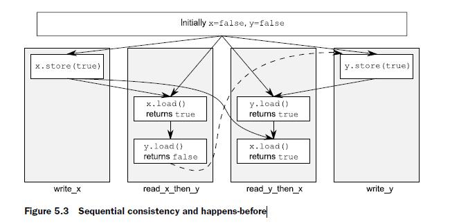
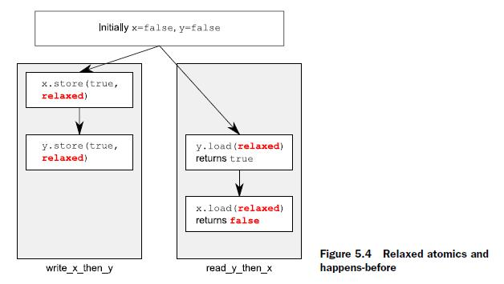

# 5.3.3 Memory ordering for atomic operations


## SEQUENTIALLY CONSISTENT ORDERING

The default ordering is named **sequentially consistent** because it implies that the behavior of the program is consistent with a simple sequential view of the world. If all operations on instances of atomic types are **sequentially consistent**, the behavior of a multithreaded program is as if all these operations were performed in some particular sequence by **a single thread**. This is by far the easiest **memory ordering** to understand, which is why it’s the default: ***all threads must see the same order of operations***. This makes it easy to reason about the behavior of code written with **atomic variables**. You can write down all the possible sequences of operations by different threads, eliminate those that are **inconsistent**, and verify that your code behaves as expected in the others. It also means that operations can’t be reordered; if your code has one operation before another in one thread, that ordering must be seen by all other threads.

> NOTE:
>
> 一、上面这段话的内容需要和 "NON-SEQUENTIALLY CONSISTENT MEMORY ORDERINGS"  章节的内容对比着来进行阅读
>
> 二、"it implies that the behavior of the program is consistent with a simple sequential view of the world"
>
> 读完这段话我的第一想法是  **sequentially consistent** 是最最符合我们的直觉: "a simple sequential view of the world"
>
> 三、"If all operations on instances of atomic types are **sequentially consistent**, the behavior of a multithreaded program is as if all these operations were performed in some particular sequence by a single thread."
>
> 这个观点是站在整体的角度来进行分析，理解本节给出的例子也需要这个这个思考角度。
>
> 四、"It also means that operations can’t be reordered; if your code has one operation before another in one thread, that ordering must be seen by all other threads."
>
> 由于要求" ***all threads must see the same order of operations*** "，因此一旦发生了reorder，那么就可能导致违背这个前提条件


From the point of view of **synchronization**, a sequentially consistent store **synchronizes-with** a sequentially consistent load of the same variable that reads the value stored. This provides one ordering constraint on the operation of two (or more) threads, but **sequential consistency** is more powerful than that. Any sequentially consistent atomic operations done after that load must also appear after the store to other threads in the system using **sequentially consistent** atomic operations. The example in listing 5.4 demonstrates this ordering constraint in action. This constraint doesn’t carry forward to threads that use atomic operations with **relaxed memory orderings**; they can still see the operations in a different order, so you must use **sequentially consistent** operations on all your threads in order to get the benefit.

> NOTE:
>
> 一、"From the point of view of **synchronization**, a sequentially consistent store **synchronizes-with** a sequentially consistent load of the same variable that reads the value stored."
>
> 这段话的前提是: 先store然后load，中文翻译如下:
>
> "从synchronization的观点来看，a sequentially consistent store 与一个读取它的值的 sequentially consistent load 之间存在 **synchronizes-with** 关系"
>
> 二、"Any sequentially consistent atomic operations done after that load must also appear after the store to other threads in the system using **sequentially consistent** atomic operations. "
>
> 这段话的意思其实就是 "***all threads must see the same order of operations***"

This ease of understanding can come at a price, though. On a **weakly ordered machine** with many processors, it can impose a noticeable performance penalty, because the overall sequence of operations must be kept consistent between the processors, possibly requiring extensive (and expensive!) synchronization operations between the processors. That said, some processor architectures (such as the common x86 and x86-64 architectures) offer **sequential consistency** relatively cheaply, so if you’re concerned about the performance implications of using **sequentially consistent ordering**, check the documentation for your target processor architectures.	

> NOTE:
>
> 一、"the overall sequence of operations must be kept consistent between the processors, possibly requiring extensive (and expensive!) synchronization operations between the processors."
>
> 在multiprocessor中，为了维持 **sequentially consistent ordering** 是需要付出代价的，在本节的最后也对这个topic进行了讨论。

The following listing shows **sequential consistency** in action. The loads and stores to `x` and `y` are explicitly tagged with `memory_order_seq_cst`, although this tag could be omitted in this case because it’s the default.

### Listing 5.4 Sequential consistency implies a total ordering

```c++
#include <atomic>
#include <thread>
#include <assert.h>

std::atomic<bool> x, y;
std::atomic<int> z;

void write_x()
{
    x.store(true, std::memory_order_seq_cst);
}

void write_y()
{
    y.store(true, std::memory_order_seq_cst);
}

void read_x_then_y()
{
    while (!x.load(std::memory_order_seq_cst)) // x 为 true，退出循环
        ;
    if (y.load(std::memory_order_seq_cst)) 
        ++z; // y为true则执行
}

void read_y_then_x()
{
    while (!y.load(std::memory_order_seq_cst)) // y 为 true，退出循环
        ;
    if (x.load(std::memory_order_seq_cst))
        ++z; // x为true则执行
}

int main()
{
    x = false;
    y = false;
    z = 0;
    std::thread a(write_x);
    std::thread b(write_y);
    std::thread c(read_x_then_y);
    std::thread d(read_y_then_x);
    a.join();
    b.join();
    c.join();
    d.join();
    assert(z.load() != 0);
}

```

The `assert` can never fire, because either the store to `x` or the store to `y` must happen first, even though it’s not specified which. If the load of `y` in `read_x_then_y` returns `false`, the store to `x` must occur before the store to `y`, in which case the load of `x` in `read_y_then_x` must return `true`, because the while loop ensures that the `y` is `true` at this point. Because the semantics of `memory_order_seq_cst` require a **single total ordering** over all operations tagged `memory_order_seq_cst`, there’s an implied ordering relationship between a load of `y` that returns `false` and the store to `y` . For there to be a **single total order**, if one thread sees `x==true` and then subsequently sees `y==false`, this implies that the store to `x` occurs before the store to `y` in this **total order**.

Of course, because everything is symmetrical, it could also happen the other way around, with the load of `x` returning false, forcing the load of `y` to return true. In both cases, `z` is equal to 1. Both loads can return true, leading to `z` being 2, but under no circumstances can `z` be zero.

> NOTE:
>
> 一、可以肯定: 上述四个thread执行顺序是未指定的
>
> 二、"The `assert` can never fire, because either the store to `x` or the store to `y` must happen first, even though it’s not specified which" 的理解如下:
>
> 因为在 `read_x_then_y()`、`read_y_then_x()` 都会首先执行一个while loop，显然如果要退出while loop就需要 "either the store to `x` or the store to `y` must happen first"，这样它们的值才能够为true。需要注意的是:  无法确定 `write_x()`、`write_y()` 执行的先后顺序是没有指定的，系统地来说，有如下两种可能性:
>
> 1、`write_x()`、`write_y()` 
>
> 这种情况下，`read_x_then_y()` 会先退出while循环
>
> 2、`write_y()`、`write_x()` 
>
> 这种情况下，`read_y_then_x()` 会先退出while循环
>
> 
>
> `read_x_then_y()` 和 `read_y_then_x()` 是相反的，其实这就是第二段中的"symmetrical"的含义。


The operations and **happens-before** relationships for the case that `read_x_then_y` sees `x` as true and `y` as `false` are shown in figure 5.3. The dashed line from the load of `y` in `read_x_then_y` to the store to `y` in `write_y` shows the implied ordering relationship required in order to maintain sequential consistency: the load must occur before the store in the global order of `memory_order_seq_cst` operations in order to achieve the outcomes given here.




### 承上启下

**Sequential consistency** is the most straightforward and intuitive ordering, but it’s also the most expensive memory ordering because it requires **global synchronization** between all threads. On a multiprocessor system this may require quite extensive and time-consuming communication between processors.

In order to avoid this synchronization cost, you need to step outside the world of **sequential consistency** and consider using other memory orderings.


## NON-SEQUENTIALLY CONSISTENT MEMORY ORDERINGS

Once you step outside the nice **sequentially consistent** world, things start to get complicated. Probably the single biggest issue to come to grips with is the fact that ***there’s no longer a single global order of events***. This means that different threads can see different views of the same operations, and any mental model you have of operations from different threads neatly interleaved one after the other must be thrown away. Not only do you have to account for(考虑) things happening truly concurrently, but threads don’t have to agree on the order of events. In order to write (or even just to understand) any code that uses a **memory ordering** other than the default `memory_order_seq_cst`, it’s absolutely vital to get your head around this. It’s not just that the compiler can reorder the instructions. Even if the threads are running the same bit of code, they can disagree on the order of events because of operations in other threads in the absence of **explicit ordering constraints**, because the different **CPU caches** and **internal buffers** can hold different values for the same memory. It’s so important I’ll say it again: ***threads don’t have to agree on the order of events***.

Not only do you have to throw out mental models based on interleaving operations, you also have to throw out mental models based on the idea of the compiler or processor reordering the instructions. ***In the absence of other ordering constraints, the only requirement is that all threads agree on the modification order of each individual variable***. Operations on distinct variables can appear in different orders on different threads, provided the values seen are consistent with any additional ordering constraints imposed.

> NOTE:
>
> 一、上面总结的非常好

This is best demonstrated by stepping completely outside the **sequentially consistent** world and using `memory_order_relaxed` for all operations. Once you’ve come to grips with that, you can move back to **acquire-release ordering**, which allows you to selectively introduce ordering relationships between operations and claw back some of your sanity.


## RELAXED ORDERING

Operations on atomic types performed with **relaxed ordering** don’t participate in **synchronizes-with** relationships. Operations on the same variable within a single thread still obey **happens-before** relationships, but there’s almost no requirement on ordering relative to other threads. 

The only requirement is that accesses to a single atomic variable from the same thread can’t be reordered; once a given thread has seen a particular value of an atomic variable, a subsequent read by that thread can’t retrieve an earlier value of the variable. 

> NOTE:
>
> 一、上面总结了一个requirement

Without any additional synchronization, the **modification order** of each variable is the only thing shared between threads that are using `memory_order_relaxed`.

To demonstrate just how relaxed your relaxed operations can be, you need only two threads, as shown in the following listing.

### Listing 5.5 Relaxed operations have very few ordering requirements

```c++
#include <atomic>
#include <thread>
#include <assert.h>
std::atomic<bool> x, y;
std::atomic<int> z;
void write_x_then_y()
{
    x.store(true, std::memory_order_relaxed);
    y.store(true, std::memory_order_relaxed);
}
void read_y_then_x()
{
    while (!y.load(std::memory_order_relaxed))
        ;
    if (x.load(std::memory_order_relaxed))
        ++z;
}
int main()
{
    x = false;
    y = false;
    z = 0;
    std::thread a(write_x_then_y);
    std::thread b(read_y_then_x);
    a.join();
    b.join();
    assert(z.load() != 0);
}
```

This time the `assert` can fire, because the load of `x` can read `false`, even though the load of `y` reads `true` and the store of `x` **happens-before** the store of `y`. `x` and `y` are different variables, so there are no ordering guarantees relating to the visibility of values arising from operations on each.

Relaxed operations on different variables can be freely reordered provided they obey any **happens-before** relationships they’re bound by (for example, within the same thread). They don’t introduce **synchronizes-with** relationships. The happens-before relationships from listing 5.5 are shown in figure 5.4, along with a possible outcome. Even though there’s a **happens-before** relationship between the stores and between the loads, there isn’t one between either store and either load, and so the loads can see the stores out of order.




### Listing 5.6 Relaxed operations on multiple threads

Let’s look at the slightly more complex example with three variables and five threads in the next listing.


```c++
#include <thread>
#include <atomic>
#include <iostream>

std::atomic<int> x(0), y(0), z(0);
std::atomic<bool> go(false);
unsigned const loop_count = 10;

struct read_values
{
    int x, y, z;
};

read_values values1[loop_count];
read_values values2[loop_count];
read_values values3[loop_count];
read_values values4[loop_count];
read_values values5[loop_count];

void increment(std::atomic<int> *var_to_inc, read_values *values)
{
    while (!go)
        std::this_thread::yield();
    for (unsigned i = 0; i < loop_count; ++i)
    {
        values[i].x = x.load(std::memory_order_relaxed);
        values[i].y = y.load(std::memory_order_relaxed);
        values[i].z = z.load(std::memory_order_relaxed);
        var_to_inc->store(i + 1, std::memory_order_relaxed);
        std::this_thread::yield();
    }
}
void read_vals(read_values *values)
{
    while (!go)
        std::this_thread::yield();
    for (unsigned i = 0; i < loop_count; ++i)
    {
        values[i].x = x.load(std::memory_order_relaxed);
        values[i].y = y.load(std::memory_order_relaxed);
        values[i].z = z.load(std::memory_order_relaxed);
        std::this_thread::yield();
    }
}
void print(read_values *v)
{
    for (unsigned i = 0; i < loop_count; ++i)
    {
        if (i)
            std::cout << ",";
        std::cout << "(" << v[i].x << "," << v[i].y << "," << v[i].z << ")";
    }
    std::cout << std::endl;
}
int main()
{
    std::thread t1(increment, &x, values1);
    std::thread t2(increment, &y, values2);
    std::thread t3(increment, &z, values3);
    std::thread t4(read_vals, values4);
    std::thread t5(read_vals, values5);
    go = true;
    t5.join();
    t4.join();
    t3.join();
    t2.join();
    t1.join();
    print(values1);
    print(values2);
    print(values3);
    print(values4);
    print(values5);
}
```

This is a really simple program in essence. You have three **shared global atomic variables** and five threads. Each thread loops 10 times, reading the values of the three atomic variables using `memory_order_relaxed` and storing them in an array. Three of the threads each update one of the **atomic variables** each time through the loop, while the other two threads just read. Once all the threads have been joined, you print the values from the arrays stored by each thread.

The atomic variable `go` is used to ensure that the threads all start the loop as near to the same time as possible. Launching a thread is an expensive operation, and without the explicit delay, the first thread may be finished before the last one has started. Each thread waits for `go` to become true before entering the main loop, and `go` is set to true only once all the threads have started.

One possible output from this program is as follows:

```c++
(0,0,0),(1,0,0),(2,0,0),(3,0,0),(4,0,0),(5,7,0),(6,7,8),(7,9,8),(8,9,8),(9,9,10)
(0,0,0),(0,1,0),(0,2,0),(1,3,5),(8,4,5),(8,5,5),(8,6,6),(8,7,9),(10,8,9),(10,9,10)
(0,0,0),(0,0,1),(0,0,2),(0,0,3),(0,0,4),(0,0,5),(0,0,6),(0,0,7),(0,0,8),(0,0,9)
(1,3,0),(2,3,0),(2,4,1),(3,6,4),(3,9,5),(5,10,6),(5,10,8),(5,10,10),(9,10,10),(10,10,10)
(0,0,0),(0,0,0),(0,0,0),(6,3,7),(6,5,7),(7,7,7),(7,8,7),(8,8,7),(8,8,9),(8,8,9)
```

The first three lines are the threads doing the updating, and the last two are the threads doing just reading. Each triplet is a set of the variables `x`, `y` and `z` in that order from one pass through the loop. There are a few things to notice from this output:

1、The first set of values shows `x` increasing by one with each triplet, the second set has `y` increasing by one, and the third has `z` increasing by one.

2、The `x` elements of each triplet only increase within a given set, as do the `y` and `z` elements, but the increments are uneven, and the relative orderings vary between all threads.

3、Thread 3 doesn’t see any of the updates to `x` or `y`; it sees only the updates it makes to `z`. This doesn’t stop the other threads from seeing the updates to `z` mixed in with the updates to `x` and `y` though.

This is a valid outcome for relaxed operations, but it’s not the only valid outcome. Any set of values that’s consistent with the three variables each holding the values 0 to 10 in turn and that has the thread incrementing a given variable printing the values 0 to 9 for that variable is valid.

### UNDERSTANDING RELAXED ORDERING

To understand how this works, imagine that each variable is a man in a cubicle with a notepad. On his notepad is a list of values. You can phone him and ask him to give you a value, or you can tell him to write down a new value. If you tell him to write down a new value, he writes it at the bottom of the list. If you ask him for a value, he reads you a number from the list.

The first time you talk to this man, if you ask him for a value, he may give you any value from the list he has on his pad at the time. If you then ask him for another value, he may give you the same one again or a value from farther down the list. He’ll never give you a value from farther up the list. If you tell him to write down a number and then subsequently ask him for a value, he’ll give you either the number you told him to write down or a number below that on the list.

Imagine for a moment that his list starts with the values 5, 10, 23, 3, 1, 2. If you ask for a value, you could get any of those. If he gives you 10, then the next time you ask he could give you 10 again, or any of the later ones, but not 5. If you call him five times, he could say “10, 10, 1, 2, 2,” for example. If you tell him to write down 42, he’ll add it to the end of the list. If you ask him for a number again, he’ll keep telling you “42” until he has another number on his list and he feels like telling it to you.

Now, imagine your friend Carl also has this man’s number. Carl can also phone him and either ask him to write down a number or ask for one, and he applies the same rules to Carl as he does to you. He has only one phone, so he can only deal with one of you at a time, so the list on his pad is a nice straightforward list. However, just because you got him to write down a new number doesn’t mean he has to tell it to Carl, and vice versa. If Carl asked him for a number and was told “23,” then just because you asked the man to write down 42 doesn’t mean he’ll tell that to Carl next time. He may tell Carl any of the numbers 23, 3, 1, 2, 42, or even the 67 that Fred told him to write down after you called. He could very well tell Carl “23, 3, 3, 1, 67” without
being inconsistent with what he told you. It’s like he keeps track of which number he told to whom with a little movable sticky note for each person, like in figure 5.5.


## ACQUIRE-RELEASE ORDERING

**Acquire-release ordering** is a step up from **relaxed ordering**; there’s still no **total order** of operations, but it does introduce some **synchronization**. Under this ordering model, **atomic loads** are **acquire operations** (`memory_order_acquire`), **atomic stores** are **release operations** (`memory_order_release`), and atomic read-modify-write operations (such as `fetch_add()` or `exchange()`) are either `acquire`, `release`, or both (`memory_order_acq_rel`). Synchronization is **pairwise**, between the thread that does the **release** and the thread that does the **acquire**. ***A release operation synchronizes-with an acquire operation that reads the value written***. This means that different threads can still see different orderings, but these orderings are restricted. The following listing is a rework of listing 5.4 using **acquire-release semantics** rather than **sequentially consistent** ones.

### Listing 5.7 Acquire-release doesn’t imply a total ordering

```c++
#include <atomic>
#include <thread>
#include <assert.h>

std::atomic<bool> x, y;
std::atomic<int> z;

void write_x()
{
    x.store(true, std::memory_order_release);
}

void write_y()
{
    y.store(true, std::memory_order_release);
}

void read_x_then_y()
{
    while (!x.load(std::memory_order_acquire))
        ;
    if (y.load(std::memory_order_acquire))
        ++z;
}

void read_y_then_x()
{
    while (!y.load(std::memory_order_acquire))
        ;
    if (x.load(std::memory_order_acquire))
        ++z;
}

int main()
{
    x = false;
    y = false;
    z = 0;
    std::thread a(write_x);
    std::thread b(write_y);
    std::thread c(read_x_then_y);
    std::thread d(read_y_then_x);
    a.join();
    b.join();
    c.join();
    d.join();
    assert(z.load() != 0);
}
```

In this case the `assert` can fire (just like in the **relaxed-ordering** case), because it’s possible for both the load of `x` and the load of `y` to read `false`. `x` and `y` are written by different threads, so the ordering from the **release** to the **acquire** in each case has no effect on the operations in the other threads.

Figure 5.6 shows the **happens-before** relationships from listing 5.7, along with a possible outcome where the two reading threads each have a different view of the world. This is possible because there’s no **happens-before** relationship to force an ordering, as described previously.


### Listing 5.8 Acquire-release operations can impose ordering on relaxed operations

In order to see the benefit of acquire-release ordering, you need to consider two stores from the same thread, like in listing 5.5. If you change the store to y to use `memory_order_release` and the load from y to use memory_order_acquire like in the following listing, then you actually impose an ordering on the operations on `x`.


```c++
#include <atomic>
#include <thread>
#include <assert.h>
std::atomic<bool> x, y;
std::atomic<int> z;
void write_x_then_y()
{
    x.store(true, std::memory_order_relaxed);
    y.store(true, std::memory_order_release);
}
void read_y_then_x()
{
    while (!y.load(std::memory_order_acquire))
        ;
    if (x.load(std::memory_order_relaxed))
        ++z;
}
int main()
{
    x = false;
    y = false;
    z = 0;
    std::thread a(write_x_then_y);
    std::thread b(read_y_then_x);
    a.join();
    b.join();
    assert(z.load() != 0);
}
```


Eventually, the load from y d will see true as written by the store c. Because the store uses memory_order_release and the load uses `memory_order_acquire`, the store synchronizes-with the load. The store to x B happens-before the store to y c, because they’re in the same thread. Because the store to y synchronizes-with the load from y, the store to x also happens-before the load from y and by extension happens-before
the load from x e. Thus the load from x must read true, and the assert f can’t fire. If the load from y wasn’t in a while loop, this wouldn’t necessarily be the case; the load from y might read false, in which case there’d be no requirement on the value read from x. In order to provide any synchronization, acquire and release operations must be paired up. The value stored by a release operation must be seen by an acquire operation for either to have any effect. If either the store at c or the load at d was a relaxed operation, there’d be no ordering on the accesses to x, so there’d be no guarantee that the load at e would read true, and the assert could fire.


### Listing 5.9 Transitive synchronization using acquire and release ordering


```c++
#include <atomic>
#include <thread>
#include <assert.h>

std::atomic<int> data[5];
std::atomic<bool> sync1(false), sync2(false);

void thread_1()
{
    data[0].store(42, std::memory_order_relaxed);
    data[1].store(97, std::memory_order_relaxed);
    data[2].store(17, std::memory_order_relaxed);
    data[3].store(-141, std::memory_order_relaxed);
    data[4].store(2003, std::memory_order_relaxed);
    sync1.store(true, std::memory_order_release);
}

void thread_2()
{
    while (!sync1.load(std::memory_order_acquire))
        ;
    sync2.store(true, std::memory_order_release);
}

void thread_3()
{
    while (!sync2.load(std::memory_order_acquire))
        ;
    assert(data[0].load(std::memory_order_relaxed) == 42);
    assert(data[1].load(std::memory_order_relaxed) == 97);
    assert(data[2].load(std::memory_order_relaxed) == 17);
    assert(data[3].load(std::memory_order_relaxed) == -141);
    assert(data[4].load(std::memory_order_relaxed) == 2003);
}

```

