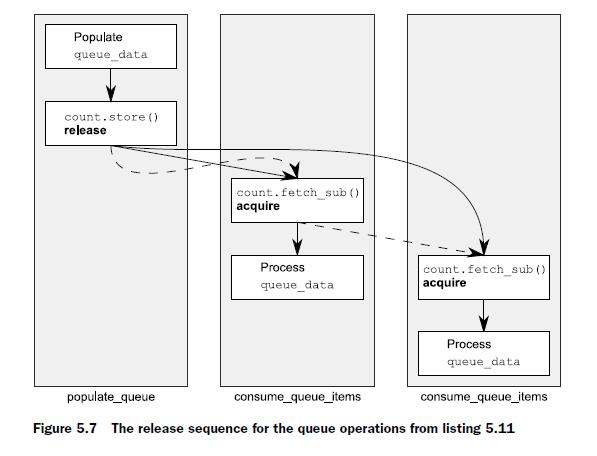

# 5.3.4 Release sequences and synchronizes-with

Back in section 5.3.1, I mentioned that you could get a synchronizes-with relationship between a store to an atomic variable and a load of that atomic variable from another thread, even when there’s a sequence of read-modify-write operations between the store and the load, provided all the operations are suitably tagged. Now that I’ve covered the possible memory-ordering “tags,” I can elaborate on this. If the store is tagged with `memory_order_release`, `memory_order_acq_rel`, or `memory_order_seq_cst`, and the load is tagged with `memory_order_consume`, `memory_order_acquire`, or `memory_order_seq_cst`, and each operation in the chain loads the value written by the previous operation, then the chain of operations constitutes a ***release sequence*** and the initial store synchronizes-with (for `memory_order_acquire` or `memory_order_seq_cst`) or is dependency-ordered-before (for `memory_order_consume`) the final load. Any atomic **read-modify-write** operations in the chain can have any memory
ordering (even `memory_order_relaxed`).

To see what this means and why it’s important, consider an `atomic<int>` being used as a count of the number of items in a shared queue, as in the following listing.

## Listing 5.11 Reading values from a queue with atomic operations


```c++
#include <atomic>
#include <thread>
#include <vector>
#include <iostream>
#include <chrono>

std::vector<int> queue_data;
std::atomic<int> count;
void populate_queue()
{
    unsigned const number_of_items = 20;
    queue_data.clear();
    for (unsigned i = 0; i < number_of_items; ++i)
    {
        queue_data.push_back(i);
    }
    count.store(number_of_items, std::memory_order_release);
}

void process(int val)
{
    std::cout << val << std::endl;
}

void wait_for_more_items()
{
    std::this_thread::sleep_for(std::chrono::seconds(1));
}
void consume_queue_items()
{
    while (true)
    {
        int item_index;
        if ((item_index = count.fetch_sub(1, std::memory_order_acquire)) <= 0)
        {
            wait_for_more_items();
            continue;
        }
        process(queue_data[item_index - 1]);
    }
}

int main()
{
    std::thread a(populate_queue);
    std::thread b(consume_queue_items);
    std::thread c(consume_queue_items);
    a.join();
    b.join();
    c.join();
}
```


