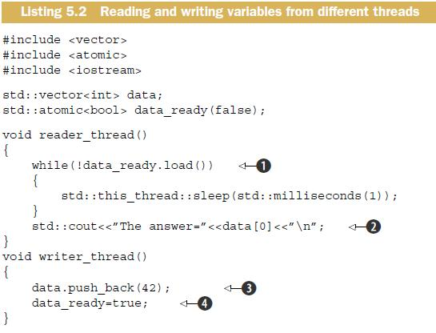
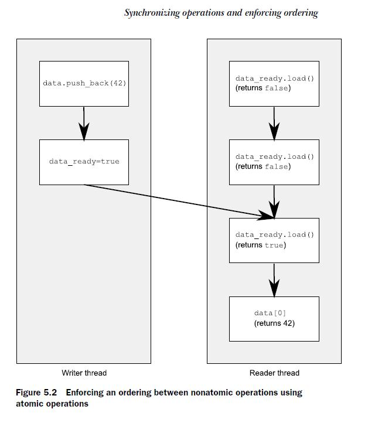

# 5.3 Synchronizing operations and enforcing ordering

Suppose you have two threads, one of which is populating a data structure to be read by the second. In order to avoid a problematic race condition, the first thread sets a flag to indicate that the data is ready, and the second thread doesn’t read the data until the flag is set. The following listing shows such a scenario.




```c++
#include <atomic>
#include <memory>
#include <vector>
#include <chrono>
#include <thread>
#include <iostream>

std::vector<int> data;
std::atomic<bool> data_ready(false);

void reader_thread()
{
    while (!data_ready.load())
    {
        std::this_thread::sleep_for(std::chrono::milliseconds(1));
    }
    std::cout << "The answer=" << data[0] << "\n";
}
void writer_thread()
{
    data.push_back(42);
    data_ready = true;
}

int main()
{
    std::thread t1(writer_thread);
    std::thread t2(reader_thread);
    t1.join();
    t2.join();
}
```


The required enforced ordering comes from the operations on the `std::atomic<bool>` variable `data_ready`; they provide the necessary ordering by virtue of the memory model relations:

1、happens-before 

2、synchronizes-with. 

The write of the `data` **happens-before** the write to the `data_ready` flag, and the read of the flag **happens-before** the read of the `data`. When the value read from `data_ready` is true, the write **synchronizes-with** that read, creating a **happens-before** relationship. Because **happens-before** is **transitive**, the write to the `data` **happens-before** the write to the flag, which **happens-before** the read of the true value from the flag, which **happens-before** the read of the `data`, and you have an **enforced ordering**: the write of the `data` **happens-before** the read of the `data` and everything is OK. Figure 5.2 shows the important **happens-before** relationships in the two threads. I’ve added a couple of iterations of the while loop from the reader thread.





All this might seem fairly intuitive: of course the operation that writes a value **happens before** an operation that reads that value! With the default atomic operations, that’s indeed true (which is why this is the default), but it does need spelling out: the atomic operations also have other options for the ordering requirements, which I’ll come to shortly.

Now that you’ve seen **happens-before** and **synchronizes-with** in action, it’s time to look at what they really mean. I’ll start with **synchronizes-with**.

## 5.3.1 The synchronizes-with relationship

The **synchronizes-with** relationship is something that you can get only between operations on **atomic types**. Operations on a data structure (such as locking a mutex) might provide this relationship if the data structure contains atomic types and the operations on that data structure perform the appropriate atomic operations internally, but fundamentally it comes only from operations on **atomic types**.

The basic idea is this: a **suitably tagged atomic write operation** `W` on a variable `x` **synchronizes-with** a **suitably tagged atomic read operation** on `x` that reads the value stored by either that write (`W`), or a subsequent(随后的) **atomic write operation** on `x` by the same thread that performed the initial write `W`, or a sequence of atomic read-modify-write operations on `x` (such as `fetch_add()` or `compare_exchange_weak()`) by any thread, where the value read by the first thread in the sequence is the value written by `W` (see section 5.3.4).

> NOTE:
>
> 一、上面这段话要如何理解？
>
> 1、对于同一个shared variable `x`
>
> 2、write operation W **synchronizes-with** read operation，简而言之: read the write value
>
> 3、对`x`所有的operation，现成一个sequence
>
> 在 "5.3.4 Release sequences and synchronizes-with" 节对上面这段话的解释如下: 
>
> > Back in section 5.3.1, I mentioned that you could get a synchronizes-with relationship between a store to an atomic variable and a load of that atomic variable from another thread, even when there’s a sequence of read-modify-write operations between the store and the load, provided all the operations are suitably tagged.


Leave the “suitably tagged” part aside for now, because all operations on atomic types are suitably tagged by default. This essentially means what you might expect: if thread A stores a value and thread B reads that value, there’s a synchronizes-with relationship between the store in thread A and the load in thread B, just as in listing 5.2.

> NOTE:
>
> 一、example code: listing 5.2

As I’m sure you’ve guessed, the nuances(细微差别) are all in the “suitably tagged” part. The C++ memory model allows various ordering constraints to be applied to the operations on atomic types, and this is the tagging to which I refer. The various options for memory ordering and how they relate to the **synchronizes-with relationship** are covered in section 5.3.3. First, let’s step back and look at the **happens-before relationship**.

## 5.3.2 The happens-before relationship

The happens-before relationship is the basic building block of operation ordering in a program; it specifies which operations see the effects of which other operations.

For a single thread, it’s largely straightforward: if one operation is sequenced before another, then it also happens-before it. This means that if one operation (A) occurs in a statement prior to another (B) in the source code, then A happens-before B.

You saw that in listing 5.2: the write to `data` **happens-before** the write to `data_ready`.

If the operations occur in the same statement, in general there’s no happens-before relationship between them, because they’re unordered. This is just another way of saying that the ordering is unspecified. You know that the program in the following listing will output “1,2” or “2,1”, but it’s unspecified which, because the order of the two calls to `get_num()` is unspecified.

```c++
#include <iostream>
void foo(int a, int b)
{
    std::cout << a << "," << b << std::endl;
}
int get_num()
{
    static int i = 0;
    return ++i;
}
int main()
{
    foo(get_num(), get_num());
}
```

}
There are circumstances where operations within a single statement are sequenced such as where the built-in comma operator is used or where the result of one expression is used as an argument to another expression. But in general, operations within a single statement are nonsequenced, and there’s no sequenced-before (and thus no happens-before) relationship between them. Of course, all operations in a statement happen before all of the operations in the next statement.

### Inter-thread happens-before

> NOTE: 
>
> 1、happens-before
>
> 2、inter-thread happens-before
>
> 3、sequenced-before
>
> 4、 synchronizes-with

This is really just a restatement of the single-threaded sequencing rules you’re used to, so what’s new? The new part is the interaction between threads: if operation A on one thread **inter-thread happens-before** operation B on another thread, then A **happens-before** B. This doesn’t really help much: you’ve just added a new relationship(inter-thread happens-before), but this is an important relationship when you’re writing multithreaded code.

At the basic level, **inter-thread happens-before** is relatively simple and relies on the synchronizes-with relationship introduced in section 5.3.1: if operation A in one thread synchronizes-with operation B in another thread, then A inter-thread happens-before B. It’s also a transitive relation: if A inter-thread happens-before B and B interthread-happens-before C, then A inter-thread happens-before C. You saw this in listing 5.2 as well.

**Inter-thread happens-before** also combines with the **sequenced-before** relation: if operation A is **sequenced before** operation B, and operation B **inter-thread happens-before** operation C, then A **inter-thread happens-before** C. Similarly, if A **synchronizes-with** B and B is **sequenced before** C, then A **inter-thread happens-before** C. These two together mean that if you make a series of changes to data in a single thread, you need only one synchronizes-with relationship for the data to be visible to subsequent operations on the thread that executed C.

These are the crucial rules that enforce ordering of operations between threads and make everything in listing 5.2 work. There are some additional nuances with data dependency, as you’ll see shortly. In order for you to understand this, I need to cover the memory-ordering tags used for atomic operations and how they relate to the synchronizes-with relation.

## 5.3.4 Release sequences and synchronizes-with

Back in section 5.3.1, I mentioned that you could get a synchronizes-with relationship between a store to an atomic variable and a load of that atomic variable from another thread, even when there’s a sequence of read-modify-write operations between the store and the load, provided all the operations are suitably tagged.