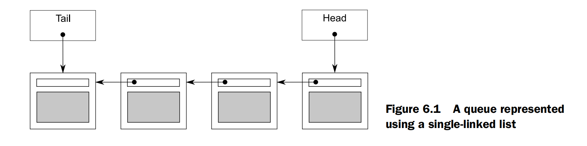

# 6.2.3 A thread-safe queue using fine-grained locks and condition variables

In listings 6.2 and 6.3 you have one protected data item (`data_queue`) and thus one mutex. In order to use finer-grained locking, you need to look inside the queue at its constituent(组成的) parts and associate one mutex with each distinct data item.

> NOTE:
>
> 一、简而言之: 每个元素一个lock

## *head* pointer

The simplest data structure for a queue is a singly linked list, as shown in figure 6.1. The queue contains a *head* pointer, which points to the first item in the list, and each item then points to the next item. Data items are removed from the queue by replacing the *head* pointer with the pointer to the next item and then returning the data from the old head.




## *tail* pointer

Items are added to the queue at the other end. In order to do this, the queue also contains a *tail* pointer, which refers to the last item in the list. New nodes are added by changing the *next* pointer of the last item to point to the new node and then updating the tail pointer to refer to the new item. When the list is empty, both the head and tail pointers are NULL.

## Listing 6.4 A simple single-threaded queue implementation

The following listing shows a simple implementation of such a queue based on a cutdown version of the interface to the queue in listing 6.2; you have only one `try_pop()` function and no `wait_and_pop()` because this queue supports only single-threaded use.


```c++
template <typename T>
class queue
{
private:
    struct node
    {
        T data;
        std::unique_ptr<node> next;
        node(T data_) : data(std::move(data_))
        {
        }
    };
    std::unique_ptr<node> head; // 1
    node *tail; // 2

public:
    queue()
    {
    }

    queue(const queue &other) = delete;
    queue &operator=(const queue &other) = delete;
    std::shared_ptr<T> try_pop()
    {
        if (!head)
        {
            return std::shared_ptr<T>();
        }
        std::shared_ptr<T> const res(
            std::make_shared<T>(std::move(head->data)));
        std::unique_ptr<node> const old_head = std::move(head);
        head = std::move(old_head->next);
        return res;
    }
    void push(T new_value)
    {
        std::unique_ptr<node> p(new node(std::move(new_value)));
        node *const new_tail = p.get();
        if (tail)
        {
            tail->next = std::move(p); // 4
        }
        else
        {
            head = std::move(p); // 5
        }
        tail = new_tail; // 6
    }
};
```

First off, note that listing 6.4 uses `std::unique_ptr<node>` to manage the nodes, because this ensures that they (and the data they refer to) get deleted when they’re no longer needed, without having to write an explicit delete. This **ownership chain** is managed from `head`, with `tail` being a raw pointer to the last node.

> NOTE:
>
> 一、如何理解ownership chain？
>
> 结合上述代码来说是指: 
>
> 1、`std::unique_ptr<node> head; // 1`
>
> 2、
>
> ```c++
> struct node
> {
>     std::unique_ptr<node> next;
> }
> ```
>
> 显然，这种写法的妙处就是: "without having to write an explicit delete"。
>
> 这种写法蕴含着: 每个node的掌握着它的 `next` 的ownership。
>
> 另外需要注意的是: 当只有一个node的时候，head和tail同时指向这个node
>
> 二、思考: 为什么`tail` 使用raw pointer？
>
> 1、**ownership chain** 是从前往后的，这就是说`tail`是不take ownership的
>
> 2、当只有一个node的时候，此时head 和 tail同时指向这个node，由于使用`unique_ptr`，显然只能有一个take ownership
>
> 

### 存在的问题

Although this implementation works fine in a single-threaded context, a couple of things will cause you problems if you try to use fine-grained locking in a multithreaded context. Given that you have two data items (`head` 1 and `tail` 2), you could in principle use two mutexes, one to protect `head` and one to protect `tail`, but there are a couple of problems with that.

The most obvious problem is that `push()` can modify both `head` 5 and `tail` 6, so it would have to lock both mutexes. This isn’t too much of a problem, although it’s unfortunate, because locking both mutexes would be possible. The critical problem is that both `push()` and `pop()` access the `next` pointer of a node: `push()` updates `tail->next` 4, and `try_pop()` reads `head->next` 3. If there’s a single item in the queue, then `head==tail`, so both `head->next` and `tail->next` are the same object, which therefore requires protection. Because you can’t tell if it’s the same object without reading both `head` and `tail`, you now have to lock the same mutex in both `push()` and `try_pop()`, so you’re no better off than before. Is there a way out of this dilemma?

> NOTE:
>
> 一、翻译如下:
>
> "关键的问题是，`push()` 和 `pop()` 都要访问某个节点的 `next` 指针。`push()`更新`tail->next`，`try_pop()`读取`head->next`。如果队列中只有一个节点，那么`head==tail`，即`head->next` 和 `tail->next` 是同一个对象，因此需要保护(两个thread同时access同一个对象显然是需要互斥的)。因为还没有读取`head` 和 `tail` 时，你无法分辨它们是否为同一个对象，你就必须在`push()` 和 `try_pop()`中锁定同一个互斥元，所以没有比以前做得更好。有没有办法摆脱这个困境呢？"
>
> 二、要如何理解上面这段话呢？
>
> 我是通过 "所以没有比以前做得更好" 为切入点从而理解作者想要表达的意思的: 因为选择作者在探讨的是使用 "fine-grained lock" 来提高concurrency，这段话中的"从前"指的是上一章节中的使用一个唯一的mutex来锁住这个linked list，作者上面这段话就是在讨论按照"Listing 6.4 A simple single-threaded queue implementation"中的写法就导致和上一章节中的使用一个唯一的mutex来锁住这个linked list相同的low concurrency。上面作者已经给出了具体的分析，简单的概括就是: `pop` 和 `push` 中需要lock 同一个 mutex，那这不就和上一章的情况一模一样的了。
>
> 理想情况是:
>
> 1、`push`的时候仅仅access `tail`，因此它仅仅lock `tail mutex` 即可
>
> 2、`pop`的时候仅仅access `head`，因此它仅仅lock `head mutex` 即可
>
> 这样能够保证最大的concurrency，因为它允许两个thread同时分别访问`head`、`tail`。
>
> 这种理想情况就是后面会进行介绍的，通过后面的内容可知通过"SEPARATING DATA"可以实现这种理想的情况，完整的demo code在"Listing 6.6 A thread-safe queue with fine-grained locking"中给出。


## ENABLING CONCURRENCY BY SEPARATING DATA

You can solve this problem by preallocating a **dummy node** with no data to ensure that there’s always at least one node in the queue to separate the node being accessed at the `head` from that being accessed at the `tail`.  For an empty queue, `head` and `tail` now both point to the **dummy node** rather than being `NULL`. This is fine, because `try_pop()` doesn’t access `head->next` if the queue is empty. If you add a node to the queue (so there’s one real node), then `head` and `tail` now point to separate nodes, so there’s no race on `head->next` and `tail->next`. The downside is that you have to add an extra level of indirection to store the data by pointer in order to allow the **dummy nodes**. The following listing shows how the implementation looks now.


## Listing 6.5 A simple queue with a dummy node

```c++
template <typename T>
class queue
{
private:
    struct node
    {
        std::shared_ptr<T> data; // 1
        std::unique_ptr<node> next;
    };
    std::unique_ptr<node> head;
    node *tail;

public:
    queue() : head(new node), tail(head.get()) // 2
    {
    }
    queue(const queue &other) = delete;
    queue &operator=(const queue &other) = delete;
    std::shared_ptr<T> try_pop()
    {
        if (head.get() == tail) // 3
        {
            return std::shared_ptr<T>();
        }
        std::shared_ptr<T> const res(head->data); // 4
        std::unique_ptr<node> old_head = std::move(head);
        head = std::move(old_head->next); // 5
        return res; // 6
    }
    void push(T new_value)
    {
        std::shared_ptr<T> new_data(
            std::make_shared<T>(std::move(new_value))); // 7
        std::unique_ptr<node> p(new node); // 8
        tail->data = new_data; // 9
        node *const new_tail = p.get();
        tail->next = std::move(p);
        tail = new_tail;
    }
};

```

### changes 

The changes to `try_pop()` are fairly minimal. First, you’re comparing `head` against `tail` 3 rather than checking for `NULL`, because the **dummy node** means that `head` is never `NULL`. Because head is a `std::unique_ptr<node>`, you need to call `head.get()` to do the comparison. Second, because the node now stores the data by pointer 1, you can retrieve the pointer directly 4 rather than having to construct a new instance of `T`. The big changes are in `push()`: you must first create a new instance of `T` on the heap and take ownership of it in a `std::shared_ptr<>` 7(note the use of `std::make_shared` to avoid the overhead of a second memory allocation for the reference count). The new node you create is going to be the new **dummy node**, so you don’t need to supply the `new_value` to the constructor 8. Instead, you set the data on the old **dummy node** to your newly allocated copy of the `new_value` 9. Finally, in order to have a **dummy node**, you have to create it in the constructor 2.

### gains

By now, I’m sure you’re wondering what these changes buy you and how they help with making the queue thread-safe. Well, `push()` now accesses only `tail`, not `head`, which is an improvement. `try_pop()` accesses both `head` and `tail`, but `tail` is needed only for the initial comparison, so the lock is short-lived. The big gain is that the `dummy node` means `try_pop()` and `push()` are never operating on the same node, so you no longer need an overarching(包罗万象) mutex. So, you can have one mutex for `head` and one for `tail`. Where do you put the locks?


You’re aiming for the maximum opportunities for concurrency, so you want to hold the locks for the smallest possible length of time. `push()` is easy: the mutex needs to be locked across all accesses to `tail`, which means you lock the mutex after the new node is allocated 8 and before you assign the data to the current `tail` node 9. The lock then needs to be held until the end of the function.

`try_pop()` isn’t so easy. First off, you need to lock the mutex on `head` and hold it until you’re finished with `head`. In essence, this is the mutex to determine which thread does the popping, so you want to do that first. Once `head` is changed 5, you can unlock the mutex; it doesn’t need to be locked when you return the result 6. That leaves the access to `tail` needing a lock on the tail mutex. Because you need to access `tail` only once, you can just acquire the mutex for the time it takes to do the read. This is best done by wrapping it in a function. In fact, because the code that needs the head mutex locked is only a subset of the member, it’s clearer to wrap that in a function too. The final code is shown here.

## Listing 6.6 A thread-safe queue with fine-grained locking

```c++
template <typename T>
class threadsafe_queue
{
private:
    struct node
    {
        std::shared_ptr<T> data;
        std::unique_ptr<node> next;
    };
    std::mutex head_mutex;
    std::unique_ptr<node> head;
    std::mutex tail_mutex;
    node *tail;
    node *get_tail()
    {
        std::lock_guard<std::mutex> tail_lock(tail_mutex);
        return tail;
    }
    std::unique_ptr<node> pop_head()
    {
        std::lock_guard<std::mutex> head_lock(head_mutex);

        if (head.get() == get_tail())
        {
            return nullptr;
        }
        std::unique_ptr<node> old_head = std::move(head);
        head = std::move(old_head->next);
        return old_head;
    }

public:
    threadsafe_queue() : head(new node), tail(head.get())
    {
    }
    threadsafe_queue(const threadsafe_queue &other) = delete;
    threadsafe_queue &operator=(const threadsafe_queue &other) = delete;
    std::shared_ptr<T> try_pop()
    {
        std::unique_ptr<node> old_head = pop_head();
        return old_head ? old_head->data : std::shared_ptr<T>();
    }
    void push(T new_value)
    {
        std::shared_ptr<T> new_data(
            std::make_shared<T>(std::move(new_value)));
        std::unique_ptr<node> p(new node);
        node *const new_tail = p.get();
        std::lock_guard<std::mutex> tail_lock(tail_mutex);
        tail->data = new_data;
        tail->next = std::move(p);
        tail = new_tail;
    }
};
```

Let’s look at this code with a critical eye, thinking about the guidelines listed in section 6.1.1. Before you look for broken invariants, you should be sure what they are:

1、`tail->next==nullptr`.

2、`tail->data==nullptr`.

3、`head==tail` implies an empty list.

4、A single element list has `head->next==tail`.

5、For each node `x` in the list, where `x!=tail`, `x->data` points to an instance of `T` and `x->next` points to the `next` node in the list. `x->next==tail` implies `x` is the last node in the list.

6、Following the next nodes from head will eventually yield tail.


## Broken implementation

It’s also important that the call to `get_tail()` occurs inside the lock on `head_mutex`. If it didn’t, the call to `pop_head()` could be stuck in between the call to `get_tail()` and the lock on the `head_mutex`, because other threads called `try_pop()` (and thus `pop_head()`) and acquired the lock first, thus preventing your initial thread from making progress:

```C++
std::unique_ptr<node> pop_head() // This is a broken implementation
{
    node *const old_tail = get_tail(); // Get old tail value outside lock on head_mutex
    std::lock_guard<std::mutex> head_lock(head_mutex);

    if (head.get() == old_tail) // 2
    {
        return nullptr;
    }
    std::unique_ptr<node> old_head = std::move(head);
    head = std::move(old_head->next); // 3
    return old_head;
}

```

In this *broken* scenario, where the call to `get_tail()` 1 is made outside the scope of the lock, you might find that both `head` and `tail` have changed by the time your initial thread can acquire the lock on `head_mutex`, and not only is the returned `tail` node no longer the tail, but it’s no longer even part of the list. This could then mean that the comparison of `head` to `old_tail` 2 fails, even if `head` really is the last node. Consequently, when you update `head` 3 you may end up moving head beyond tail and off the end of the list, destroying the data structure. In the correct implementation from listing 6.6, you keep the call to `get_tail()` inside the lock on `head_mutex`. This ensures that no other threads can change head, and tail only ever moves further away (as new nodes are added in calls to `push()`), which is perfectly safe. head can never pass the value returned from `get_tail()`, so the invariants are upheld(维护).