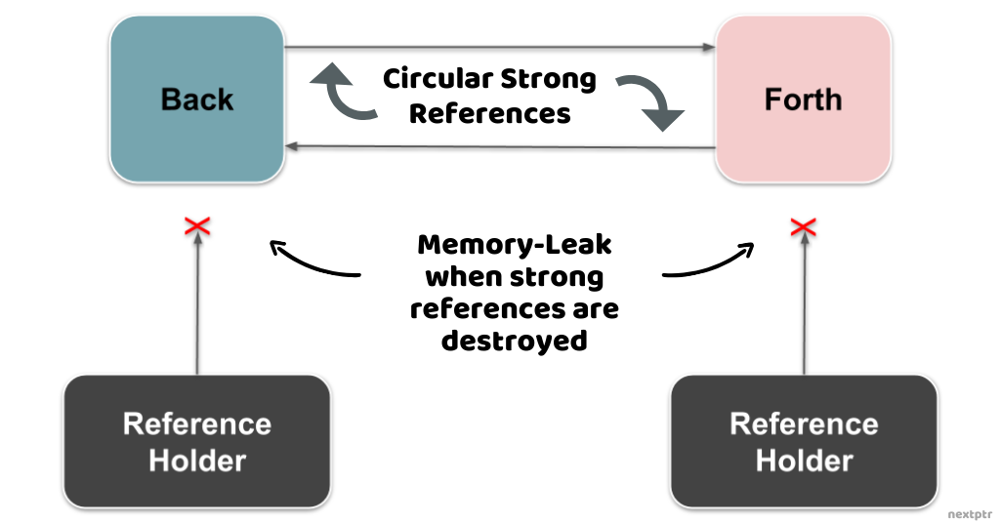
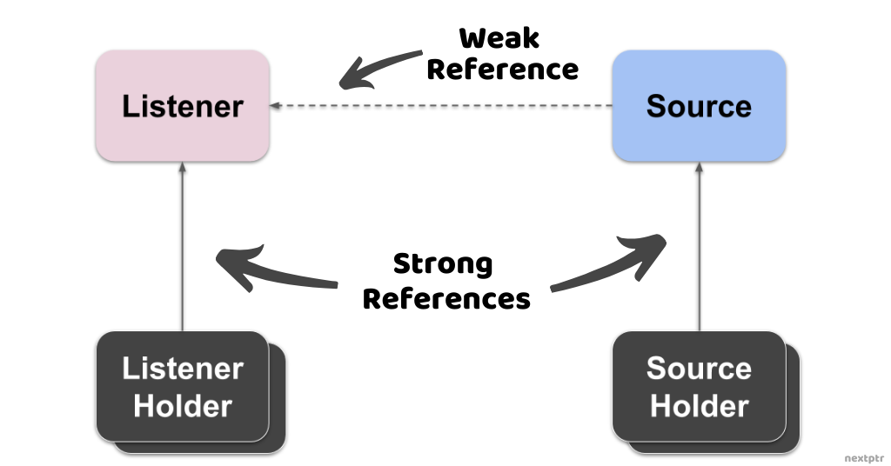

# nextptr [Using weak_ptr for circular references](https://www.nextptr.com/tutorial/ta1382183122/using-weak_ptr-for-circular-references)

## **What is weak_ptr?**

An *std::weak_ptr* is a non-owning smart pointer that maintains a **weak reference** to an *std::shared_ptr* managed object. Multiple *shared_ptr* instances can share the ownership of a managed object. The managed object is deleted when the last owning *shared_ptr* is destroyed. Therefore, a *shared_ptr* is a **strong reference** to a managed object. On the other hand, a *weak_ptr* is a weak reference that does not control the lifetime of a managed object but merely acts as a limited handle, from which a strong reference (*shared_ptr*) can be acquired when needed.

Let's look at an example of *weak_ptr*:

```C++
#include <memory>
#include <iostream>
#include <thread>
#include <atomic>
#include <vector>

std::thread observer;

void observe(std::weak_ptr<int> wp)
{
	//Start observer thread
	observer = std::thread([wp]()
	{
		while(true)
		{
			std::this_thread::sleep_for(std::chrono::seconds(1));

			        //Try acquiring a shared_ptr from weak_ptr
					if(std::shared_ptr<int> p = wp.lock())
					{
						//Success
						std::cout << "Observing: " << *p << "\n";
					}
					else
					{
						//The managed object is destroyed.
						std::cout << "Stop\n";
						break;
					}
				}
			});
}

int main()
{

	{ //Block Start
		auto sp = std::shared_ptr<int>(new int());
		//Create a weak_ptr<int> from sp for observing
		observe(sp);
		//Wait few seconds
		std::this_thread::sleep_for(std::chrono::seconds(5));

		//shared_ptr is destroyed and the
		// managed object is deleted when
		// block ends
	}

	//Wait for the observer thread to end
	observer.join();
	return 0;
}
// g++ --std=c++11 test.cpp -lpthread

```

> NOTE: 使用`weak_ptr`可以有效地避免dangling pointer问题

In the contrived(人为的) example above, an observer thread periodically checks the value of a *shared_ptr* managed object. The observer thread, however, does not own the object through a *shared_ptr*. It has a *weak_ptr* and periodically tries to acquire a temporary *shared_ptr* from it to access the object. The observer thread quits when it fails to obtain a *shared_ptr*.

The *main* thread starts the observer thread and provides a *weak_ptr<`int`>*. It lets the original owning *shared_ptr<`int`>* live for a few seconds by sleeping. When the original *shared_ptr* is destroyed, the managed object is deleted, and the observer thread quits because it cannot acquire a *shared_ptr*.

As shown above, it is not possible to directly access the managed object through a *weak_ptr*. A *weak_ptr* has to be converted to a *shared_ptr* to access the managed object. The conversion fails if the managed object gets deleted.

There are a few situations where *weak_ptr* can be quite useful. One of them is to avoid the **circular references** of *shared_ptr*. We will look at that in the next section.

## **Circular References**

One of the biggest concerns dealing with the raw pointers is that sometimes it is hard to ensure that a raw pointer is not dangling or valid. **Automatic memory management** by *shared_ptr* leads to a safer and easier to maintain code. As long as a component or function holds a *shared_ptr*, the object managed by the *shared_ptr* stays in memory.

> NOTE: 
>
> 1、dangling pointer在multithread application尤其严重
>
> 2、上面所描述的其实是manual memory management VS automatic memory management

However, there is a caveat(警告) related to the use of *shared_ptr* when it comes to cyclic dependencies or circular references. Two objects are said to have circular references when they hold references to each other. Circular references ordinarily(通常) manifest(展现) in **event-driven** applications. For instance, in the following code, classes *Back* and *Forth* communicate with one another through *shared_ptr* references to each other:

```C++
//Forward declaration
struct Forth;

struct Back {     
 //stuff...
 //Sends messages to Forth...
 std::shared_ptr<Forth> forth;
};

struct Forth {
 //stuff...
 //Sends messages to Back...
 std::shared_ptr<Back> back;
};
```

Using *shared_ptr* for cyclic dependency causes the lifetime of *Back* and *Forth* to depend on each other. The instances of *Back* and *Forth* can stay in memory and cause memory-leak even when no other part of the application can reach them because they are both holding the *shared_ptr* to each other.

> NOTE: 所谓的memory leak是指它们永远不会被释放

Following illustration shows the memory-leak when all other strong references to both *Back* and *Forth* are destroyed, and no part of the application can reach them:




## Dealing with Circular References

There are several ways to avoid the memory-leak mentioned above, and depending on an application, the workarounds could be very involved(复杂的) and ugly. For instance, in some cases, we might be able to change one of the references (e.g., the reference to *Back* in *Forth*) to a raw pointer. By doing that, we are letting only one class control the lifetime of the other and avoid a memory leak. However, that solution is too specific and is not applicable in those situations where the lives of *Back* and *Forth* should be entirely independent of each other. It is ideal to use weak references (*weak_ptr*) in these circumstances where classes need to have **cyclic links** without controlling the lifetime of each other.

> NOTE: cyclic line

Let's take a more realistic(现实的) example where we use weak references to avoid circular references. In an event-driven application (e.g., a UI application), there are sources of events and listeners that consume events. A *Listener* is registered with a *Source* for consuming events. An ostensibly(表面上) simple approach is that a *Source* keeps a strong reference to a *Listener* to dispatch events:

```c++
struct Event {
 //..
};

class Listener {
public:
 void onEvent(Event e) {
  //Handle event from Source
 }
 //...
};

class Source {
public: 
 void dispatchEvent(Event e) {
  if(listener)
   listener->onEvent(e);
 }

 void 
 registerListener(const std::shared_ptr<Listener>& lp) {
  listener = lp;
 }
 //...
private:
 //Strong reference to Listener
 std::shared_ptr<Listener> listener;
};
```

But the above design causes the lifetime of a *Listener* to be influenced by the lifetime of a *Source*. The situation could be further exacerbated(恶化) if a *Listener* is a big object and stays in memory for longer than it should. The existence of a *Source* and a *Listener* should be mutually independent, and only their respective holders should control their lifetimes.

It is tempting to use cyclic references here between *Source* and *Listener* so that they both can explicitly detach from one another when the time comes. But that would require both *Source* and *Listener* to be expressly disposed of by their holders, which might not be feasible or be very tricky at best. A better way is to use a weak reference from *Source* to *Listener*, as shown below:

```c++
class Source {
public: 
 void dispatchEvent(Event e) {
  //Acquire strong ref to listener
  if(auto listener = weakListener.lock()) {
    listener->onEvent(e);
  } else {
    //Handle if required
  }
 }

 void 
 registerListener(const std::shared_ptr<Listener>& lp) {
  weakListener = lp;
 }
 //...
private: 
 //Weak reference to Listener
 std::weak_ptr<Listener> weakListener;
};
```

Following illustration shows the relationships between *Source*, *Listener*, and their respective holders:



By having a weak reference to a *Listener*, we have separated the lifetimes of *Source* and *Listener*. A *Source* converts the *`weak_ptr<Listener>`* to a temporary *`shared_ptr<Listener>`* on-demand when it has to dispatch an event. When a *Listener* is destroyed, its *Source* cannot forward the events, and that can be handled appropriately depending on the application.

## **Conclusion**

A reference type that guarantees the existence of the referred object is of paramount(至高无上的) importance for writing a safer code. *std::shared_ptr* is a strong reference that provides this assurance. However, the firm control over the lifetime of an object by *shared_ptr* is not desirable in some cases. In those cases, a *weak_ptr* that can be converted to a strong reference on-demand is preferable for a more straightforward design.