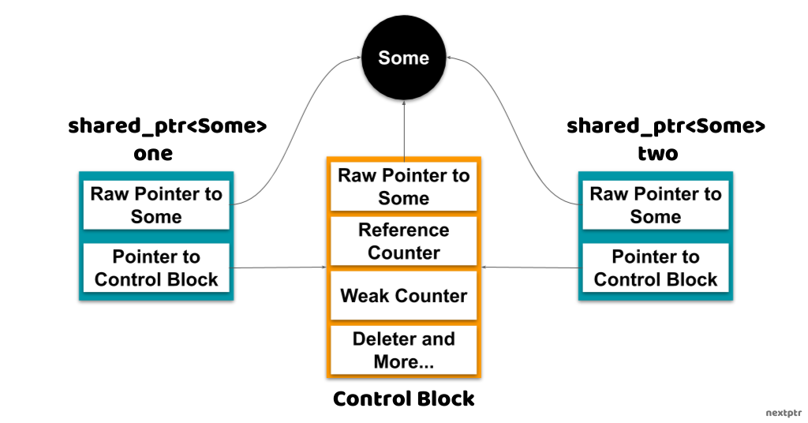
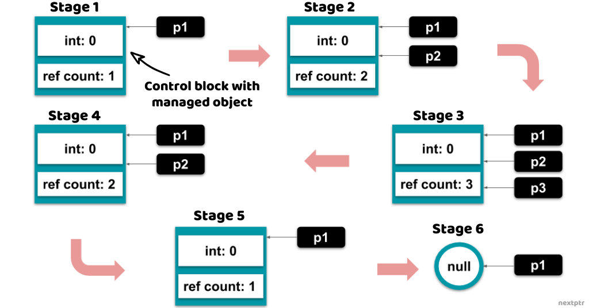

# nextptr [shared_ptr - basics and internals with examples](https://www.nextptr.com/tutorial/ta1358374985/shared_ptr-basics-and-internals-with-examples)

## **1. Overview**

The C++11 *`std::shared_ptr<T>`* is a **shared ownership smart pointer type**. Several *`shared_ptr`* instances can share the management of an object's lifetime through a common *control block*. The managed object is deleted when the last owning *`shared_ptr`* is destroyed (or is made to point to another object). 

Memory management by *`shared_ptr`* is deterministic because the timing of a managed object's destruction is predictable and in the developer's control. Hence, *`std::shared_ptr`* brings deterministic **automatic memory management** to C++, without the overhead of garbage collection. 

> NOTE: 这段话让我想起来:
>
> 1、make it computational、control theory
>
> 2、multithread and dangling pointer
>
> 3、automatic memory management  VS manual memory management，以及manual memory management的弊端，典型的就是dangling pointer

Here is a basic example of *`shared_ptr`*:

```C++
#include <memory>
#include <iostream>

//some struct
struct Some
{
	int x;
};

void useless(std::shared_ptr<Some> p)
{
	//Change the underlying object
	p->x = 20;
}

void spam()
{

	//Create/initialize shared_ptr<Some>
	auto one = std::shared_ptr<Some>(new Some());
	//Another shared_ptr<Some> pointing nowhere
	std::shared_ptr<Some> two;

	//Change the underlying object
	one->x = 10;
	//Read through shared_ptr
	std::cout << "x: " << one->x << "\n"; //x: 10

	//Pass to a function by value. This increases the ref count.
	useless(one);

	//Underlying object is changed
	std::cout << "x: " << one->x << "\n"; //x: 20

	//Assign to another shared_ptr
	two = one;

	//'one' and 'two' are pointing to the same object
	std::cout << std::boolalpha << (one.get() == two.get()) << "\n"; //true

	/*  On Return:
	 1. 'one' and 'two' are destroyed
	 2.  Ref count reaches zero
	 3. 'Some' is destroyed */
}
int main()
{
	spam();
}
// g++ --std=c++11 -Wall -pedantic test.cpp && a.out

```

This article is specific to general usage and internals of *`shared_ptr`*. It does not cover the fundamentals of smart pointers and assumes that the reader is familiar with those. Having looked at the basic usage, let's move on to the internals of *`shared_ptr`* that make it work.

## 2. Internals

> NOTE: 实现总结: 
>
> 1、reference counter是在control block中，而不是在object中
>
> 2、`shared_ptr`的实现也是依赖于RAII的:
>
> a、increment reference  counter in  constructor
>
> b、decrease reference counter in destructor
>
> `shared_ptr` object 的个数 和 control block中的reference counter的个数是一致的；
>
> 3、典型的object-based resource management
>
> 4、关于`shared_ptr`的code，参见 stackoverflow [How is the std::tr1::shared_ptr implemented?](https://stackoverflow.com/questions/9200664/how-is-the-stdtr1shared-ptr-implemented) # [A](https://stackoverflow.com/a/9201435)
>
> 通过阅读其中给出的code，可以很快的理解后面的内容。

In a typical implementation, a *`shared_ptr`* contains only two pointers: 

1、a raw pointer to the managed object that is returned by *get()*, and 

2、a pointer to the control block.

A *`shared_ptr`* control block at least includes 

1、a pointer to the managed object or the object itself, 

2、a **reference counter**, and 

3、a weak counter. 


And depending on how a *shared_ptr* is initialized, the control block can also contain other data, most notably, a `deleter` and an `allocator`. The following figure corresponds to the example in the previous section. It shows the conceptual memory layout of the two *`shared_ptr`* instances managing the object:



------

Next, we talk about the details of the most relevant parts of the **control bloc**k. You would see that the memory layout of *shared_ptr* can deviate(脱离) from the above illustration depending on how it is constructed.

### 2.1. Pointer to Managed Object (or Managed Object)

A control block contains a pointer to the **managed object**, which is used for deleting the object. 

One interesting fact is that the **managed pointer in the control block** could be different in type (and even value) from the **raw pointer in the *shared_ptr***. This leads to a few fascinating use cases. In the following example, the types of the raw pointer and the managed pointer are different, but they are compatible and have the same values:

> NOTE: 
>
> 1、关于上面这段话中给出的，参见 stackoverflow [How is the std::tr1::shared_ptr implemented?](https://stackoverflow.com/questions/9200664/how-is-the-stdtr1shared-ptr-implemented) # [A](https://stackoverflow.com/a/9201435) 中给出的example code是非常容易理解的

```C++
#include <memory>
#include <iostream>

int main()
{
	//A shared_ptr<void> managing an int
	//The raw pointer is void*
	auto vp = std::shared_ptr<void>(new int()); //OK
	//However, we can't do much with 'vp'

}
// g++ --std=c++11 -Wall -pedantic test.cpp && a.out

```

#### `std::shared_ptr` OOP interface、subtyping polymorphism

> NOTE: 
> 1、原文并没有这样的标题，这个标题是我基于下面的example总结的
>
> 2、下面的例子体现了`std::shared_ptr` OOP interface、、subtyping polymorphism，它使用`std::shared_ptr` 来实现reference semantic，它等价于使用raw pointer的如下写法:
>
> ```C++
> Base * ptr = new Derived;
> ```
>
> 

```C++
#include <memory>
#include <iostream>

//Another example
//Inheritance with no virtual destructor
struct A
{
	//stuff..
	~A()
	{
		std::cout << "~A\n";
	} //not virtual
};
struct B: A
{
	//stuff..
	~B()
	{
		std::cout << "~B\n";
	} //not virtual
};

int main()
{

	//shared_ptr<A> managing a B object
	//raw pointer is A* and managed pointer is B*
	auto pa = std::shared_ptr<A>(new B()); //OK

	pa.reset(); //Calls B's destructor

}
// g++ --std=c++11 -Wall -pedantic test.cpp && a.out

```

> NOTE: 输出如下:
>
> ```C++
> virtual void B::test()
> ~B
> ~A
> 
> ```
>
> 下面有基于上述例子的变式 。

The inheritance example above is rather contrived(人为的、不自然的). It shows that despite the destructor being not *virtual*, the correct derived class (*B*) destructor is invoked when the base class (*A*) *shared_ptr* is *reset*. That works because the control block is destroying the object through `*B`**, not through the raw pointer `*A`**. Nevertheless, the destructor should be declared *virtual* in the classes that are meant to be used polymorphically. This example intends to merely show how a *shared_ptr* works.

> NOTE: 
>
> ```C++
> //shared_ptr<A> managing a B object
> //raw pointer is A* and managed pointer is B*
> ```
>
> 理解上面这段话是理解上述**注释**的前提，下面是一些解释:
>
> 1、`std::shared_ptr<A>(new B())`，说明`std::shared_ptr` object中，raw pointer的type是 `A*`，因此"raw pointer is `A*`"
>
> 2、由于"the control block is destroying the object through `*B`**, not through the raw pointer `*A`**. "，因此 "managed pointer is `B*`"
>
> 上面这个例子能够非常好的value semantic VS reference semantic；结合下面的测试程序，能够更好地体现作者的意思；


> NOTE: 
>
> 测试程序2如下:
>
> ```C++
> #include <memory>
> #include <iostream>
> #include <thread>
> #include <atomic>
> #include <vector>
> 
> //Another example
> //Inheritance with no virtual destructor
> struct A
> {
> 	//stuff..
> 	~A()
> 	{
> 		std::cout << "~A\n";
> 	} //not virtual
> };
> struct B: A
> {
> 	//stuff..
> 	~B()
> 	{
> 		std::cout << "~B\n";
> 	} //not virtual
> 	void test2()
> 	{
> 		std::cout << __PRETTY_FUNCTION__ << std::endl;
> 	}
> };
> 
> int main()
> {
> 
> 	//shared_ptr<A> managing a B object
> 	//raw pointer is A* and managed pointer is B*
> 	auto pa = std::shared_ptr<A>(new B()); //OK
> 	pa->test2();
> 	pa.reset(); //Calls B's destructor
> }
> // g++ --std=c++11 test.cpp
> 
> ```
> 
> 上述程序，编译报错如下:
> 
> ```C++
>test.cpp: 在函数‘int main()’中:
> test.cpp:36:6: 错误：‘struct A’没有名为‘test2’的成员
>pa->test2();
> 
> ```
> 
> 


#### Aliasing constructor

There is an even more exotic(奇异的) *aliasing constructor* of *shared_ptr* that can initialize a *shared_ptr* from a raw pointer and an unrelated *shared_ptr*. Consequently, an aliasing constructor can produce a *shared_ptr* that shares the management of one object but points to another object (usually a subobject of the managed object). For instance:

```C++
struct Yolk { };
struct White { };
struct Egg {
 White w;
 Yolk y;
};

auto ep = std::shared_ptr<Egg>(new Egg());

//Aliasing constructor to construct shared_ptr<Yolk>
//yp shares ownership with ep but points to subobject ep->y
auto yp = std::shared_ptr<Yolk>(ep, &ep->y);  
```

> NOTE: 测试程序如下:
>
> ```C++
> #include <memory>
> #include <iostream>
> #include <thread>
> #include <atomic>
> #include <vector>
> 
> struct Yolk
> {
> 	~Yolk()
> 	{
> 		std::cout << __PRETTY_FUNCTION__ << std::endl;
> 	}
> 	void test()
> 	{
> 		std::cout << __PRETTY_FUNCTION__ << std::endl;
> 	}
> };
> struct White
> {
> 	~White()
> 	{
> 		std::cout << __PRETTY_FUNCTION__ << std::endl;
> 	}
> };
> struct Egg
> {
> 	~Egg()
> 	{
> 		std::cout << __PRETTY_FUNCTION__ << std::endl;
> 	}
> 	White w;
> 	Yolk y;
> };
> 
> int main()
> {
> 
> 	//shared_ptr<A> managing a B object
> 	auto ep = std::shared_ptr<Egg>(new Egg());
> 
> 	//Aliasing constructor to construct shared_ptr<Yolk>
> 	//yp shares ownership with ep but points to subobject ep->y
> 	auto yp = std::shared_ptr<Yolk>(ep, &ep->y);
> 	yp->test();
> }
> // g++ --std=c++11 test.cpp
> 
> ```
>
> 输出如下:
>
> ```
> void Yolk::test()
> Egg::~Egg()
> Yolk::~Yolk()
> White::~White()
> ```
>
> 

The in-depth treatment of **aliasing constructor** deserves(应得) its own space. I encourage you to check out "[Aliasing constructed shared_ptr as key of map or set](https://www.nextptr.com/question/qa1355324734/aliasing-constructed-shared_ptr-as-key-of-map-or-set)" for a more persuasive use case.

> NOTE: 这段话的意思是:  **aliasing constructor** 是一个较大的topic，需要专门进行介绍

There is more discussion about the managed object pointer in the 'Deleter' section below when we talk about the *type erasure*.

> NOTE: 
>
> 1、`std::shared_ptr`的实现也是依赖于type erasure technique的

#### *std::make_shared*

Before we delve(钻研) into more intricate(复杂的) details, let's talk about the *std::make_shared*. We mentioned above that the control block could either contain a pointer to the managed object or the object itself. The control block is dynamically allocated. Constructing the managed object in-place within the **control block** can avoid the two separate memory allocations for the object and the control block, resulting in an uncomplicated(简单的) control block and better performance. The *std::make_shared* is a preferred way to construct a *shared_ptr* because it builds the managed object within the control block:

```c++
auto sp = std::make_shared<std::string>("Hello"); //Creates the std::string in the control block 
std::cout << *sp << "\n"; //Hello
```

### **2.2. Reference Counter**

> NOTE: 讲述了reference counter的原理

The reference counter, which is incremented and decremented atomically, tracks the number of owning *shared_ptr* instances. The reference count increases as a new *shared_ptr* is constructed, and it decreases as an owning *shared_ptr* is destroyed. One exception to that is the reference count is left unchanged when a *shared_ptr* is *moved* because the **move-constructor transfers the ownership** from the source to the newly constructed *shared_ptr*. The managed object is disposed of when the reference count reaches zero.

> NOTE: 是否有copy constructor？有的，参见 cppreference [std::shared_ptr<T>::shared_ptr](https://en.cppreference.com/w/cpp/memory/shared_ptr/shared_ptr)。

#### Copy and move assignment operators

*std::shared_ptr* ownership is also affected by the copy and move assignment operators. The copy assignment operator decreases the reference count of the destination (LHS) *shared_ptr* and increases the reference count of the source (RHS) *shared_ptr*. Whereas, the move assignment operator decreases the reference count of the destination (LHS) but does not change the reference count of the source (RHS).

> NOTE: 上面这段话貌似有误；参见:
>
> 1、cppreference [std::shared_ptr<T>::operator=](https://en.cppreference.com/w/cpp/memory/shared_ptr/operator%3D)

Let's explore another example that exhibits the lifecycle of an object managed by a few *shared_ptr* instances. As you go through the code, refer the following figure for the different stages:

```c++
#include <memory>
#include <iostream>

void baz(std::shared_ptr<int> p3)
{
	//Stage 3
	std::cout << "@3 Ref Count: " << p3.use_count() << "\n"; //@3 Ref Count: 3
}

int main()
{
	//Create a shared_ptr<int>
	auto p1 = std::make_shared<int>(0);
	//Stage 1
	std::cout << "@1 Ref Count: " << p1.use_count() << "\n"; //@1 Ref Count: 1

	{ // Block
	  //Create copy
		auto p2 = p1;
		//Stage 2
		std::cout << "@2 Ref Count: " << p2.use_count() << "\n"; //@2 Ref Count: 2
		//Will create another copy
		baz(p2);
		//Stage 4
		std::cout << "@4 Ref Count: " << p2.use_count() << "\n"; //@4 Ref Count: 2
	}

	//Stage 5
	std::cout << "@5 Ref Count: " << p1.use_count() << "\n"; //@5 Ref Count: 1
	//reset
	p1.reset();
	//Stage 6
	std::cout << "@6 Ref Count: " << p1.use_count() << "\n"; //@6 Ref Count: 0
	return 0;
}
// g++ --std=c++11 test.cpp

```

> NOTE: 输出如下:
>
> ```C++
> @1 Ref Count: 1
> @2 Ref Count: 2
> @3 Ref Count: 3
> @4 Ref Count: 2
> @5 Ref Count: 1
> @6 Ref Count: 0
> ```
>
> 

------



------

### **2.3. Weak Counter**

A control block also keeps the count of *weak_ptr* associated with it in a weak counter. An *std::weak_ptr* is a smart pointer that serves as a weak reference to an *std::shared_ptr* managed object. When a *weak_ptr* is created from a *shared_ptr*, it refers to the same **control block** but does not share the ownership of the managed object. It is not possible to directly access the managed object through a *weak_ptr*. A *weak_ptr* must be copied to a *shared_ptr* to acquire access to the managed object.

The following multithreaded example shows how a *shared_ptr* can be created from a *weak_ptr* as long as the managed object is alive. A reader thread periodically tries to acquire a *shared_ptr<`std::atomic_int`>* from a *weak_ptr<`std::atomic_int`>* and logs the value. If the reader thread cannot acquire a *shared_ptr* in an iteration, it exits. A writer thread periodically changes the *shared_ptr* managed `std::atomic_int` value a few times and exits. When the writer thread exits, the *shared_ptr* held by it is destroyed, and the reader thread can no longer get a *shared_ptr* from its *weak_ptr*, which makes the reader thread to also exit. The program terminates when both the threads exit:

```c++
#include <memory>
#include <iostream>
#include <thread>
#include <atomic>
int main()
{
	auto sp = std::shared_ptr<std::atomic_int>(new std::atomic_int());

	//Reader
	//A weak_ptr is created and captured (syntax requires requires c++14).
	std::thread r([wp = std::weak_ptr<std::atomic_int>(sp)]()
	{ //weak_ptr created. ref count: 1, weak count: 1
						while(true)
						{
							//Acquire a shared_ptr through lock()
							if(auto p = wp.lock())
							{
								//shared_ptr acquired. ref count is 1 or 2
								std::cout << *p << "\n";
							}
							else
							{
								//shared_ptr could not be acquired. ref count 0
								break;
							}
							//sleep
							std::this_thread::sleep_for(std::chrono::seconds(1));
						}
					});

	//Writer
	//The shared_ptr is moved and captured so the ref count stays 1
	//If the shared_ptr is copied instead of moved, this program will never
	//     end because the reader would never exit (try that!).
	//Move in capture clause requires c++14
	std::thread w([mp = std::move(sp)]()
	{ //shared_ptr moved. ref count: 1
						for(int i=1; i<=5; i++)
						{
							*mp = i; //change managed object
							std::this_thread::sleep_for(std::chrono::seconds(1));
						}
					});

	//Join the threads.
	w.join();
	r.join();
	return 0;
}
// g++ --std=c++11 test.cpp

```

> NOTE: 虽然上述code中，虽然使用了C++14 feature，但是在gcc (GCC) 4.8.5 20150623 (Red Hat 4.8.5-28)中是能够 编译通过的，上述程序的运行结果如下:"
>
> ```
> 0
> 2
> 3
> 4
> 5
> ```


> NOTE: smart pointer是一种更加高级的控制方式，无需由programmer进行显式的停止，而是依赖于reference counting机制

The weak count is the number of existing *weak_ptr*. The weak count does not play any role in deciding the lifetime of the managed object, which is deleted when the reference count reaches zero. However, the control block itself is not deleted until the weak count also reaches zero

> NOTE: 上面这段话说明了: weak count的作用

### **2.4. Deleter**

When a *shared_ptr* is initialized with a pointer, its control block contains a **deleter function object** (or **function pointer**), which is invoked to destroy the managed object. If a custom deleter is not provided to the *shared_ptr* constructor, a default deleter (e.g., *std::default_delete*) is used that calls the `delete` operator.

The deleter is *type-erased* for two reasons:

1、First, a deleter is an optional argument to a *shared_ptr* constructor, not a template parameter. Hence, a *shared_ptr's* type is deleter **agnostic**(不知的). 

> NOTE: 这段话的意思是: deleter是不知道 "*shared_ptr's* type "

2、Second, a deleter is a function object (or a function pointer), e.g., *function<`void(T\*)`>*. This indirection makes *shared_ptr* independent of the details of how the managed object is deleted. This loose-coupling of *shared_ptr* with the deleter makes it quite flexible.

> NOTE: 
>
> 1、上面这一段中的"The deleter is *type-erased* "要如何理解？
>
> 结合 stackoverflow [How is the std::tr1::shared_ptr implemented?](https://stackoverflow.com/questions/9200664/how-is-the-stdtr1shared-ptr-implemented) # [A](https://stackoverflow.com/a/9201435) 中给出的source code:
>
> default deleter: 
>
> ```C++
>     template<class U>
>     struct default_deleter
>     {
>         void operator()(U* p) const { delete p; }
>     };
> 
>     template<class U>
>     explicit shared_ptr(U* pu) :pa(new auximpl<U,default_deleter<U> >(pu,default_deleter<U>())), pt(pu) {}
> ```
>
> 显然，default deleter是直接使用 `delete p;`，而`p`可以是incomplete type(opaque pointer)
>
> custom deleter: 
>
> ```C++
>     template<class U, class Deleter>
>     struct auximpl: public aux
>     {
>         U* p;
>         Deleter d;
> 
>         auximpl(U* pu, Deleter x) :p(pu), d(x) {}
>         virtual void destroy() { d(p); } 
>     };
>     template<class U, class Deleter>
>     shared_ptr(U* pu, Deleter d) :pa(new auximpl<U,Deleter>(pu,d)), pt(pu) {}
> ```
>
> 显然`Deleter`是一个function pointer

For instance, in the example below, a `vector<shared_ptr<T>>` can be in its compilation unit entirely oblivious(不在意的) to the knowledge of how an incomplete type *T* is deleted:

```C++
//A compilation unit
class Thing; //only declaration. 'Thing' is incomplete here.
void foo(std::shared_ptr<Thing> thing) {
 std::vector<std::shared_ptr<Thing>> vec;
 vec.push_back(thing);
}
//+------------------- + ---------------------------+
//Different compilation unit
struct Thing {
 //stuff..
};
void foo(std::shared_ptr<Thing>);

int main() {
 //Default deleter
 foo(std::shared_ptr<Thing>(new Thing()));
 //Custom lambda deleter 
 foo(std::shared_ptr<Thing>(new Thing(), [](Thing* p) {
  delete p;
 }));
}
```


### 2.5. Allocator

The control block itself is allocated by an allocator that must satisfy the [Allocator](https://en.cppreference.com/w/cpp/named_req/Allocator) requirements. When a custom allocator is not provided, the *std::allocator* is used that dynamically allocates the control block. The control block keeps a copy of the allocator, which is *type-erased* like the deleter. There are two ways to use a custom allocator. One is to provide a custom allocator when initializing the *shared_ptr* with a managed object pointer, as shown below. Note that this *shared_ptr* constructor also requires a deleter:

```C++
struct SomeData { };
//Allocator must be defined
auto sp = std::shared_ptr<SomeData>(new SomeData(), std::default_delete<SomeData>(), Allocator<SomeData>());
```

Another way to use a custom allocator is to utilize *std::allocate_shared* that can construct the managed object in-place within a custom allocated control block. Therefore, the *std::allocate_shared* is like *std::make_shared*, except that it takes a custom allocator:

```C++
auto sp = std::allocate_shared<SomeData>(Allocator<SomeData>());
```


## 3. Conclusion

> NOTE: 重要是对比`shared_ptr`和raw pointer

The *std::shared_ptr<`T`>* is a handy yet straightforward utility. But under its simplicity lie extensive details that make it work. Dereferencing a *shared_ptr* is nearly as fast as a **raw pointer**, but constructing or copying a *shared_ptr* is certainly more expensive. Nonetheless, for most applications, this cost is reasonable for **automatic memory management**.


