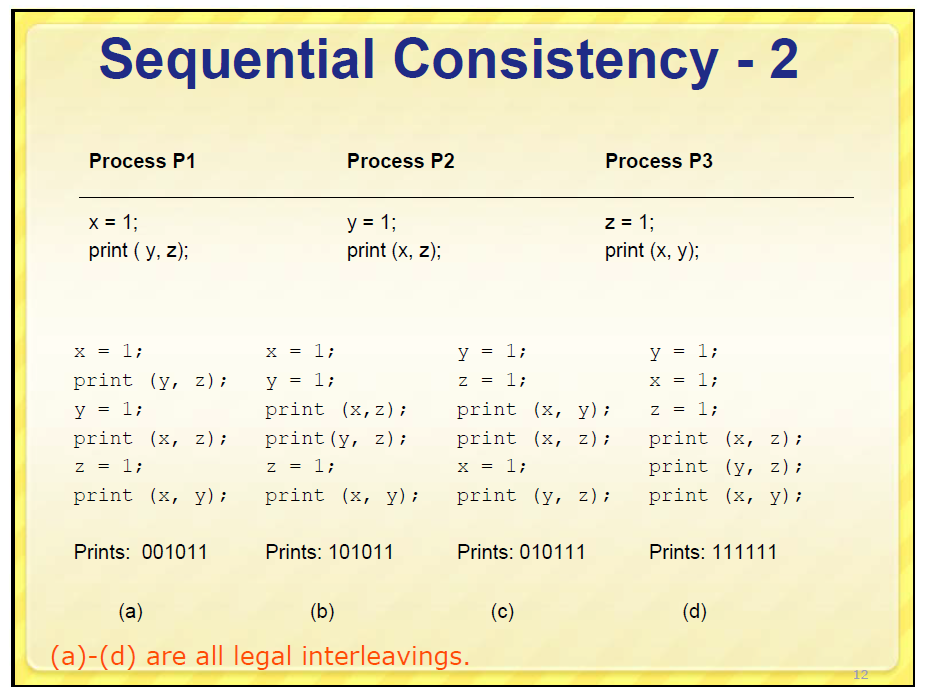

# Sequentially-consistent ordering

"sequential"的含义是"连续的"，由 [Leslie Lamport](https://en.wikipedia.org/wiki/Leslie_Lamport) 1979提出 [Sequential consistency](https://en.wikipedia.org/wiki/Sequential_consistency) :

> "... the result of any execution is the same as if the operations of all the processors were executed in some sequential order, and the operations of each individual processor appear in this sequence in the order specified by its program."[[1\]](https://en.wikipedia.org/wiki/Sequential_consistency#cite_note-1) 

sequential-consistency能够使用下面描述的方式进行**模拟**: 使用C++11 `std::atomic` 的 sequential consistency来进行模拟，下面简单地描述一下对应关系: 

1、所有entity按照program中的次序运行(program order)

2、每个entity对应一个thread，shared data对应process中所有线程共享的数据

3、在一个process中进行运行，可以得到在consistency model abstract machine上的运行结果。

> NOTE: 关于上述过程的具体例子，参见: stackoverflow [C++11 introduced a standardized memory model. What does it mean? And how is it going to affect C++ programming?](https://stackoverflow.com/questions/6319146/c11-introduced-a-standardized-memory-model-what-does-it-mean-and-how-is-it-g) # [A](https://stackoverflow.com/a/6319356)，其中有非常好的描述。

> 

其中的"as if"告诉我们需要进行模拟。


draft: 

1、**不带cache的多线程交错执行**、abstraction machine

2、是符合我们直观的对多线程程序的执行方式的


## csdn [一致性模型之Sequential Consistency](https://blog.csdn.net/qianfeng_dashuju/article/details/90642303)


Sequential Consistency的精确定义来自于Leslie Lamport老哥(以后我们会多次提到他)。他本来是定义了基于共享内存的多CPU并行计算的一致性模型，但是也可以推广到分布式系统中，实际上多CPU并行计算也都可以认为是分布式系统。模型的定义是:

> the result of any execution is the same as if the operations of all the processors were executed in some sequential order, and the operations of each individual processor appear in this sequence in the order specified by its program

放到分布式系统里，意思就是不管系统怎么运行，得到的结果就好像把所有节点的所有操作按照某个sequential order排序后运行，但是在这个sequential order顺序中，来自同一个节点的操作仍然保持着它们在节点中被指定的顺序（也就是他们在program中指定的顺序）。


## cppreference [std::memory_order](https://en.cppreference.com/w/cpp/atomic/memory_order) # Constants # `std::memory_order_seq_cst`

1、A load operation with this memory order performs an *acquire operation*, 

2、a store performs a *release operation*, and 

3、read-modify-write performs both an *acquire operation* and a *release operation*, plus a single total order exists in which all threads observe all modifications in the same order (see [Sequentially-consistent ordering](https://en.cppreference.com/w/cpp/atomic/memory_order#Sequentially-consistent_ordering) below)

> NOTE:
>
> 一、关于 "plus a single total order exists in which all threads observe all modifications in the same order (see [Sequentially-consistent ordering](https://en.cppreference.com/w/cpp/atomic/memory_order#Sequentially-consistent_ordering) below)"，后面会进行解释。

## cppreference [std::memory_order](https://en.cppreference.com/w/cpp/atomic/memory_order) # Explanation # Sequentially-consistent ordering

Atomic operations tagged `memory_order_seq_cst` not only order memory the same way as release/acquire ordering (everything that *happened-before* a store in one thread becomes a *visible side effect* in the thread that did a load), but also establish a *single total modification order* of all atomic operations that are so tagged.

> NOTE: 
>
> 一、"all threads observe all modifications in the same order (see [Sequentially-consistent ordering](https://en.cppreference.com/w/cpp/atomic/memory_order#Sequentially-consistent_ordering) below)"、"establish a *single total modification order* of all atomic operations that are so tagged" 要如何理解？
>
> 解答如下: 
>
> 1、我的理解：
>
> sequentially-consistent ordering是在所有的core之间建立modification order，需要注意的是，这里是所有的core，而不是所有的thread；因此每个shared data在全局只有一个modification order，因此从全局来看，所有的thread看到的所有的shared data的modification order是一致的，即它是全局一致的，因此就存在一个全局的single total modification order，这就保证了所有的thread看到相同的modification order。
>
> 2、zhihu [现代C++的内存模型](https://zhuanlan.zhihu.com/p/382372072):
>
> > 对于顺序一致模型，因为所有线程都参考全局的内存修改顺序。因此，我们可认为所有变量的读写都直接从内存进行，从而完全不用考虑Cache，Store Buffer这些因素
>
> 对于sequential-consistency，它要求"所有线程都参考全局的内存修改顺序"，也就是说所有的thread都需要看到相同的**内存修改顺序**。对于其它的memory model，则没有这样的要求，可能不同的thread看到不同的**内存修改顺序**。
>
> 3、csdn [C++ memory order循序渐进（三）—— 原子变量上组合应用memory order实现不同的内存序](https://blog.csdn.net/wxj1992/article/details/103843971)  # 4.Sequentially-consistent ordering
>
> 使用`memory_order_seq_cst`可以获得顺序一致，是atomic变量默认的内存序，也是最强的保证，在如果形成了该内存序，除了有release acquire的效果，还会外加一个**单独全序**，也就是保证所有的线程观察到内存操作完全**同样的顺序**。这也是代价很大的一种内存序，尤其是在arm等weak order平台上，因为要实现Sequentially-consistent需要全局的数据同步，因此如果对性能有较高要求，不是特别必要不要使用这个内存序。
>
> 4、wikipedia [Sequential consistency](https://en.wikipedia.org/wiki/Sequential_consistency) 

###  (until C++20)

> NOTE: 未阅读
> 


### (since C++20)

> NOTE: 未阅读

### Use case

Sequential ordering may be necessary for **multiple producer-multiple consumer** situations where all consumers must observe the actions of all producers occurring in the same order.

### Implementation

Total sequential ordering requires a **full memory fence CPU instruction** on all multi-core systems. This may become a performance bottleneck since it forces the affected memory accesses to propagate to every core.

> NOTE:
>
> 一、下面是一些补充素材:
>
> 1、preshing [Memory Barriers Are Like Source Control Operations ](https://preshing.com/20120710/memory-barriers-are-like-source-control-operations/) #StoreLoad
>
> A StoreLoad barrier ensures that all stores performed before the barrier are visible to other processors, and that all loads performed after the barrier receive the latest value that is visible at the time of the barrier. In other words, it effectively prevents reordering of all stores before the barrier against all loads after the barrier, respecting the way a [sequentially consistent](http://preshing.com/20120612/an-introduction-to-lock-free-programming#sequential-consistency) multiprocessor would perform those operations.
>
> 2、csdn [一致性模型之Sequential Consistency](https://blog.csdn.net/qianfeng_dashuju/article/details/90642303) # Sequential Consistency和硬件
>
> 同一个进程中保留操作顺序不是显而易见的么?实际上随着硬件技术，尤其是多核、多CPU技术的发展，一个CPU核心运行的进程，不一定能观测到另一个核心进程的操作顺序。
>
> CPU一般具有多个核心，每个核心都有自己的L1 cache和L2 cache，cache之上还有Load Buffer和Store Buffer。写入时，处理器很有可能仅仅将数据写入Store Buffer，稍后再将Store Buffer中的数据统一写回cache，有可能再过一会儿才将cache的数据写回内存。同样，一个核心读取的数据说不定也已经被另一个核心修改过，只是它不知道。
>
> 所以上述进程对a和b的赋值，很有可能没被对方感知。
>
> 为了保证**Sequential Consistency**，Leslie Lamport老哥在论文中提出了两个要求:
>
> 1、Each processor issues memory requests in the order specified by its program
>
> 2、Memory requests from all processors issued to an individual memory module are serviced from a single FIFO queue. Issuing a memory request consists of entering the request on this queue.
>
> 但是如果在硬件层满足Sequential Consistency，肯定会大大降低效率，所以一般这些工作就会交给上层的软件开发人员来做。

### Example

This example demonstrates a situation where sequential ordering is necessary. Any other ordering may trigger the assert because it would be possible for the threads `c` and `d` to observe changes to the atomics `x` and `y` in opposite order.

```C++
#include <thread>
#include <atomic>
#include <cassert>
#include <iostream>

std::atomic<bool> x = {false};
std::atomic<bool> y = {false};
std::atomic<int> z = {0};

void write_x()
{
    x.store(true, std::memory_order_seq_cst);
}

void write_y()
{
    y.store(true, std::memory_order_seq_cst);
}

void read_x_then_y()
{
    while (!x.load(std::memory_order_seq_cst))
        ;
    if (y.load(std::memory_order_seq_cst)) {
        ++z;
    }
}

void read_y_then_x()
{
    while (!y.load(std::memory_order_seq_cst))
        ;
    if (x.load(std::memory_order_seq_cst)) {
        ++z;
    }
}

int main()
{
    std::thread a(write_x);
    std::thread b(write_y);
    std::thread c(read_x_then_y);
    std::thread d(read_y_then_x);
    a.join(); b.join(); c.join(); d.join();
    assert(z.load() != 0);  // will never happen
    std::cout << z << std::endl;
}

```


#### 实现分析

1、thread `a` `write_x`、thread `b` `write_y`执行write，thread `c` `read_x_then_y`、thread `d` `read_y_then_x`执行read；

2、

thread `c` synchronize-with thread `a`，因此，`read_x_then_y`中，它可以观察到`x`；

thread `d` synchronize-with thread `b`，因此，`read_y_then_x`中，它可以观察到`y`；

但是:

thread `c`  没有 synchronize-with thread `b`，因此，如果没有 sequential consistent ordering，它可能无法观察到`y`；

thread `d`  没有 synchronize-with thread `a` ，因此，如果没有sequentially-consistent ordering，它可能无法观察到`x`；

#### 执行结果分析

下面以**函数名**来代替thread进行说明，因为**函数名**更加容易理解。可能的执行结果:

| 第一步                            | 第二步                                 | 第三步                                | 第四步                                 | 输出结果 |
| --------------------------------- | -------------------------------------- | ------------------------------------- | -------------------------------------- | -------- |
| `write_x` <br>(`x=true,y=false`)  | `read_x_then_y`<br/>(`x=true,y=false`) | `write_y`<br/>(`x=true,y=true`)       | `read_y_then_x`<br/>(`x=true,y=false`) | 1        |
| `write_y`<br/>(`x=false,y=true`)  | `read_y_then_x`<br/>(`x=false,y=true`) | `write_x` <br/>(`x=true,y=true`)      | `read_x_then_y`<br/>(`x=true,y=true`)  | 1        |
| `write_x` <br/>(`x=true,y=false`) | `write_y`<br/>(`x=true,y=true`)        | `read_x_then_y`<br/>(`x=true,y=true`) | `read_y_then_x`<br/>(`x=true,y=true`)  | 2        |
| ...                               |                                        |                                       |                                        |          |


## Sequential consistency classic example

sequential consistency 的典型的example: 

1、stackoverflow [C++11 introduced a standardized memory model. What does it mean? And how is it going to affect C++ programming?](https://stackoverflow.com/questions/6319146/c11-introduced-a-standardized-memory-model-what-does-it-mean-and-how-is-it-g) # [A](https://stackoverflow.com/a/6319356)

2、cppreference [std::memory_order](https://en.cppreference.com/w/cpp/atomic/memory_order) # Explanation # Sequentially-consistent ordering

3、stackoverflow [Sequential Consistency in Distributed Systems](https://stackoverflow.com/questions/30734060/sequential-consistency-in-distributed-systems) # [A](https://stackoverflow.com/a/32272780)


### stackoverflow [Sequential Consistency in Distributed Systems](https://stackoverflow.com/questions/30734060/sequential-consistency-in-distributed-systems) # [A](https://stackoverflow.com/a/32272780)

An execution `e` of operations is sequentially consistent if and only if it can be **permutated** into a sequence `s` of these operations such that:

1、the sequence `s` respects the program order of each process. That is, for any two operations `o1` and `o2` which are of the same process and if `o1` precedes `o2` in `e`, then `o1` should be placed before `o2` in `s`;

2、in the sequence `s`, each read operation returns the value of the last preceding write operation over the same variable.

------

For (a), `s` can be：

```
W(x)b [P2], R(x)b [P3], R(x)b [P4], W(x)a [P1], R(x)a [P3], R(x)a [P4]
```

For (c), `s` can be:

```
W(x)a [P1], R(x)a [P2], R(x)a [P3], R(x)a [P4], W(x)b [P3], R(x)b [P1], R(x)b [P2], R(x)b [P4]
```

However, for (b):

- the operations `R(x)b, R(x)a` from `P3` require that `W(x)b` come before `W(x)a`
- the operations `R(x)a, R(x)b` from `P4` require that `W(x)a` come before `W(x)b`

It is impossible to construct such a sequence `s`.

### cs.cmu [10-consistency](http://www.cs.cmu.edu/~srini/15-446/S09/lectures/10-consistency.pdf)





## wikipedia [Sequential consistency](https://en.wikipedia.org/wiki/Sequential_consistency) 

**Sequential consistency** is one of the [consistency models](https://en.wikipedia.org/wiki/Consistency_model) used in the domain of [concurrent computing](https://en.wikipedia.org/wiki/Concurrent_computing) (e.g. in [distributed shared memory](https://en.wikipedia.org/wiki/Distributed_shared_memory), [distributed transactions](https://en.wikipedia.org/wiki/Distributed_transaction), etc.).

It was first defined as the property that requires that

"... the result of any execution is the same as if the operations of all the processors were executed in some sequential order, and the operations of each individual processor appear in this sequence in the order specified by its program."[[1\]](https://en.wikipedia.org/wiki/Sequential_consistency#cite_note-1)

To understand this statement, it is essential to understand one key property of **sequential consistency**: execution order of program in the same processor (or thread) is the same as the **program order**, while（尽管） execution order of program between processors (or threads) is undefined. In an example like this:

```
 processor 1:     <-- A1 run --> <-- B1 run -->        <-- C1 run -->
 processor 2:       <-- A2 run --> <-- B2 run -->
 Time --------------------------------------------------------------------->
```

execution order between A1, B1 and C1 is preserved, that is, A1 runs before B1, and B1 before C1. The same for A2 and B2. But, as execution order between processors is undefined, B2 might run before or after C1 (B2 might physically run before C1, but the effect of B2 might be seen after that of C1, which is the same as "B2 run after C1")

Conceptually, there is single **global memory** and a "switch" that connects an arbitrary processor to memory at any time step. Each **processor** issues memory operations in **program order** and the switch provides the global serialization among all memory operations[[2\]](https://en.wikipedia.org/wiki/Sequential_consistency#cite_note-2)

> NOTE:
>
> 一、这段话的意思，其实就是cppreference [std::memory_order](https://en.cppreference.com/w/cpp/atomic/memory_order) # Explanation # Sequentially-consistent ordering中的 "all threads observe all modifications in the same order"所表达的意思。
>
> 

[](https://en.wikipedia.org/wiki/File:Rsz_selection_055.png)

The sequential consistency is weaker than [strict consistency](https://en.wikipedia.org/wiki/Strict_consistency), which requires a read from a location to return the value of the last write to that location; strict consistency demands that operations be seen in the order in which they were actually issued.


## Case study

### Case: zookeeper

zookeeper承诺Sequential Consistency，在 [ZooKeeper overview#Guarantees](https://zookeeper.apache.org/doc/r3.6.2/zookeeperOver.html#Guarantees) 中对此进行了说明:

> **Sequential Consistency** - Updates from a **client** will be applied in the order that they were sent.


### Case: C++ memory model

参见工程programming-language的`C++\Language-reference\Basic-concept\Abstract-machine\Memory-model`章节。


## TODO

stackoverflow [Memory Model in C++ : sequential consistency and atomicity](https://stackoverflow.com/questions/38425920/memory-model-in-c-sequential-consistency-and-atomicity)


## Sequential-consistency VS strict consistency model

相较于strict consistency model，放松了**所有的write立即生效**的限制，因此在consistency model abstract machine上的运行结果可能存在dirty data的；

