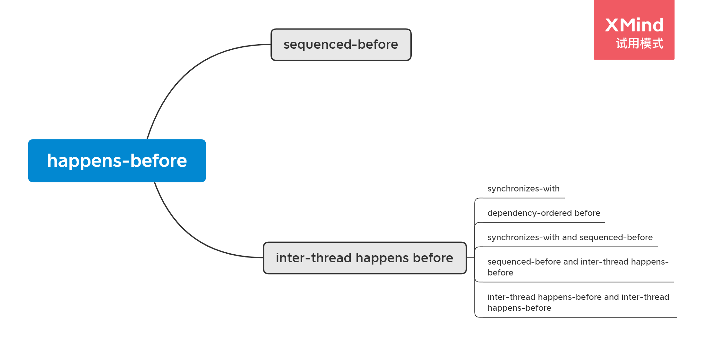

# cppreference [std::memory_order](https://en.cppreference.com/w/cpp/atomic/memory_order) # Formal description

> NOTE: 
>
> 1、C++的这个formal description的理论是非常好的，能够让programmer使用非常简洁、清晰的方式来描述 multi thread的行为，后续可以采用它的这套理论。
>
> 2、cppreference或者说C++ language design中，对memory ordering的描述是基于modification order的，因此可以看到后续所有的ordering都是基于这个概念来建立的；这个概念比较抽象，对于不了解具体的、底层细节的programmer而言，初次可能无法完全掌握它们，因此在进行解释的时候，需要补充一些实现细节的文章。

**Inter-thread synchronization** and **memory ordering** determine how *evaluations* and *side effects* of expressions are ordered between different threads of execution. 

> NOTE: 
>
> 一、理解本节内容的前提条件是对C++ expression evaluation有一个较好的认知，参见 `C++Order-of-evaluation` 章节
>
> 二、手段 和 目标
>
> 需要搞清楚**主被**、**因果**关系
>
> programmer使用 **inter-thread synchronization** 和 **memory ordering** 来对 "how *evaluations* and *side effects* of expressions are ordered between different threads of execution" 进行控制(control)。
>
> 从control theory的角度来看: **Inter-thread synchronization** and **memory ordering** 是**手段**，下面的这些是**目标**；
>
> 三、Inter-thread synchronization 
>
> 在下面的章节中，有总结。
>
> 四、如何理解side effect？
>
> 可以简单地理解: 
>
> 1、放到multicore中来理解: 一个thread运行于core1，它对memory的write，能够被运行于其他core的thread看到。
>
> 2、side effect对应的是memory、state，与它相对的是value computation
>
> 3、正式的理解参见 `C++Order-of-evaluation` 。
>
> 

They are defined in the following terms:


## Sequenced-before

> NOTE: 
>
> 1、描述的是同一个thread内的order
>
> 2、在 `C++Order-of-evaluation` 中，对它进行了深入分析

Within the same thread, evaluation A may be *sequenced-before* evaluation B, as described in [evaluation order](https://en.cppreference.com/w/cpp/language/eval_order).


## Carries dependency

> NOTE: 
>
> 1、描述的是同一个thread内的order
>
> 2、这段话的内容是容易理解的
>
> 3、Carries dependency是建立在sequenced-before基础上的
>
> 4、Carries dependency其实就是非常简单的dependency关系
>
> 5、compiler是能够分辨Carries dependency的，因此对于存在Carries dependency的，它是不会进行reordering的

Within the same thread, evaluation A that is *sequenced-before* evaluation B may also carry a dependency into B (that is, B depends on A), if any of the following is true

> NOTE: "A carry a dependency int B"的含义是: B 依赖于 A

1、The value of A is used as an operand of B, **except**

a) if B is a call to [std::kill_dependency](https://en.cppreference.com/w/cpp/atomic/kill_dependency)

> NOTE: 打破dependency

b) if A is the left operand of the built-in `&&`, `||`, `?:`, or `,` operators.

> NOTE: 为什么这些operator不形成dependency关系？

2、A writes to a scalar object M, B reads from M

3、A carries dependency into another evaluation X, and X carries dependency into B


## Modification order

All modifications to any particular atomic variable occur in a **total order** that is specific to this one atomic variable.

> NOTE: 
>
> 一、翻译如下: 
>
> " 对任何特定原子变量的所有修改都按照特定于这个原子变量的总顺序进行。"
>
> 本节内容非常重要，它是理解后续内容的基石，csdn [在 C++ memory order循序渐进（二）—— C++ memory order基本定义和形式化描述所需术语关系详解](https://blog.csdn.net/wxj1992/article/details/103656486) 中，有着非常好的描述。
>
> 二、我的理解
>
> 1、上面这段话中的"one atomic variable"就是shared data，显然会有多个thread同时对它进行read、write，因此就需要站在全局的角度对所有这些read、write进行分析
>
> 2、结合下面的内容来看，C++语言的设计者所采用的形式化的分析方法(formal)是: order，即:
>
> a、"对所有的发生于这个shared data的read、write建立order"、
>
> b、"从全局的角度对atomic variable的read、write order进行限制"
>
> 显然这是符合"make it computational ordering"思想的。
>
> 既然要建立total order，那么就需要采用一个统一的relation，通过下面的内容来看，它采用的relation是: **happen-before关系**(关于 *happens-before* ，在下面章节会进行介绍)。
>
> 显然按照**happen-before关系**来对所有的read、write operation进行排序，就建立了Modification order这个sequence，这就是本节标题"Modification order"。
>
> 3、只要建立了**happen-before关系**，那么下面列举的4条就能够保证，显然这样program的行为就是可预测的。
>
> 4、Modification order 可以看做是一个sequence，这一点从后面的"Release sequence"章节的标题可以看出
>
> 
>
> 三、csdn [在 C++ memory order循序渐进（二）—— C++ memory order基本定义和形式化描述所需术语关系详解](https://blog.csdn.net/wxj1992/article/details/103656486) # 2.3 Modification order
>
> Modification order，字面意思是"修改顺序"，这个是针对原子变量的一个概念，对于c++里的原子变量，有个很重要的保证，那就是：对于任意特定的原子变量的所有修改操作都会以一个特定于该原子变量的**全序**发生，因此也保证了原子变量的操作在各线程之间有如下四个一致性（为了描述简洁下面说的读写都是针对某一个特定的原子变量）：
>
> 1、写-写一致性:如果 **写A happens-before 写 B** ，那么在Modification order中A 比B早出现
>
> 2、读-读一致性: 如果 **读A happens-before 读B**, 并且如果 A 读到的是来自写X， 那么B读到的要么也是写X的值，要么是Modification order中比X后出现的一个写Y 的值.
>
> 3、读-写一致性: 如果 **读A happens-before 写B**, 那么A读到的值来自于modification order 中的一个早于B出现的写X
>
> 4、写-读一致性: 如果 **写X happens-before 读B** , 那么B读取的值可能来自写X或者modification order 中在X之后出现的写Y。
>
> happens-before是内存序里很重要的一种关系，下面会详细阐述，这里只需要记住，如果A Happens-before B，那么A对内存的修改将会在B操作之前对B可见。上面四条规则，看上去很复杂和繁琐，但阐述的内容其实很好理解。
>
> 四、如何理解coherence？
>
> 可以看到，下面的四个requirement都是以"coherence"来进行命名的，第一次阅读的时候，我觉得它是cache coherence，现在想来这种认知是错误的，分析如下:
>
> 1、design to an abstraction: 本节所讨论的是C++ programming language的design，它不不会这对于具体implementation
>
> 2、在 csdn [在 C++ memory order循序渐进（二）—— C++ memory order基本定义和形式化描述所需术语关系详解](https://blog.csdn.net/wxj1992/article/details/103656486) # 2.3 Modification order 中，将coherence翻译为 "一致性"，但是我觉得翻译为会更好(我记得之前的一篇文章中，也将它翻译为了"连续性")，因为"连续性"更好地对应了modification order、sequence。
>
> 3、下面的coherence的含义和cache coherence的内涵是相同的

The following four requirements are guaranteed for all atomic operations:

1、**Write-write coherence**: If evaluation A that modifies some atomic `M` (a write) *happens-before* evaluation B that modifies `M`, then A appears earlier than B in the *modification order* of `M`

2、**Read-read coherence**: if a value computation A of some atomic `M` (a read) *happens-before* a value computation B on `M`, and if the value of A comes from a write `X` on `M`, then the value of B is either the value stored by `X`, or the value stored by a side effect `Y` on `M` that appears later than X in the *modification order* of `M`.

3、**Read-write coherence**: if a value computation A of some atomic M (a read) *happens-before* an operation B on M (a write), then the value of A comes from a side-effect (a write) X that appears earlier than B in the *modification order* of `M`

4、**Write-read coherence**: if a side effect (a write) X on an atomic object M *happens-before* a value computation (a read) B of M, then the evaluation B shall take its value from X or from a side effect Y that follows X in the modification order of `M`


## Release sequence

> NOTE: 
>
> 一、csdn [在 C++ memory order循序渐进（二）—— C++ memory order基本定义和形式化描述所需术语关系详解](https://blog.csdn.net/wxj1992/article/details/103656486) # 2.3 Modification order
>
> Release sequence，指的是某个原子变量M上由一个release operation开始的一个序列，正式定义如下：
>
> 原子变量M上的release sequence headed by A指的是M的Modification order上的一个最大连续子序列，该序列由A开始，当前线程内对M的写操作，以及其他线程对M的read-modify-write操作组成。
>
> 对应的，有一个比较重要的release sequence rule，能够保证特定情况下多个acquire线程对单个release操作后面展开讲release acquire语义的时候会详细讲下，暂时了解Release sequence这个概念就行。
>
> 二、思考
>
> 为什么要建立release sequence这个概念？在下面的 "Dependency-ordered before" 章节中，使用了这个概念。

After a *release operation* A is performed on an atomic object M, the longest continuous **subsequence** of the **modification order** of M that consists of

1、Writes performed by the same thread that performed A(until C++20)

2、Atomic read-modify-write operations made to M by any thread

is known as *release sequence headed by A*


## Dependency-ordered before

> NOTE: 
>
> 一、csdn [在 C++ memory order循序渐进（二）—— C++ memory order基本定义和形式化描述所需术语关系详解](https://blog.csdn.net/wxj1992/article/details/103656486) # 2.6 Dependency-ordered before
>
> 这个关系是针对consume来的，对于分属不同线程的赋值A和赋值B，如果他们之间有以下关系之一：
>
> 1、A对某个原子变量M做release操作，B对M做consume操作，并且B读到了release sequence headed by A中的任意一个值。这条就是上面说的release sequence rule的关键。
>
> 2、A is dependency-ordered before X，并且 X carries dependency into B。前面说过了，carries dependency into是线程内的一种关系，这里就是X和B属于同一线程，并且B对X有依赖。
>
> 我们就说 A dependency-ordered before B。
>
> ### 参见
>
> 在下面文章中，也对 Dependency-ordered before 进行了描述:
>
> a、preshing [The Purpose of memory_order_consume in C++11](https://preshing.com/20140709/the-purpose-of-memory_order_consume-in-cpp11)

Between threads, evaluation A is *dependency-ordered before* evaluation B if any of the following is true

1) A performs a *release operation* on some atomic M, and, in a different thread, B performs a *consume operation* on the same atomic M, and B reads a value written by any part of the release sequence headed (until C++20) by A.

2) A is dependency-ordered before X and X carries a dependency into B.


## Synchronizes-with

> NOTE: 
>
> 1、原文并没有对Synchronizes-with进行说明，这是我添加的，在后面的"Inter-thread happens-before"章节中，会使用到这个概念
>
> 2、在 csdn [在 C++ memory order循序渐进（二）—— C++ memory order基本定义和形式化描述所需术语关系详解](https://blog.csdn.net/wxj1992/article/details/103656486)  中，也有相同的做法

1、"csdn [在 C++ memory order循序渐进（二）—— C++ memory order基本定义和形式化描述所需术语关系详解](https://blog.csdn.net/wxj1992/article/details/103656486) # 2.5 Synchronizes-with"

Synchronizes-with，也就是同步关系，用来描述对内存的修改操作（包括原子和非原子操作）对其他线程可见，有一点需要注意，这是一个**运行时的关系**，也就是说不是代码层面的，代码只是让程序在运行的时候有可能建立这种关系，并且一旦建立了就有可见性的保证。简单来说，如果A和B建立了Synchronizes-with关系，那么A之前的内存修改对B之后都可见，preshing大神给的例子很好，如下分别是建立了Synchronizes-with关系和没建立的情况：


下图中描述的运行情况是`g_guard`值在thread1中写入比thread2 中的读取晚，那么就没有建立**Synchronizes-With**关系，thread1中前面的内存不保证对thread2后面的操作可见。

在Synchronizes-With关系的实际应用中，往往有两个关键元素，用于建立Synchronizes-with关系的原子变量和需要在线程间共享的数据，比如上面图里的`g_guard`和`g_payload`，当然guard本身也可以是需要共享的数据，比如队列的top和bottom。

这里先提一嘴，release 和 acquire就能够建立Synchronizes-with关系。

2、preshing [The Synchronizes-With Relation](https://preshing.com/20130823/the-synchronizes-with-relation/) 

3、"Inter-thread synchronization"

在下面的"Inter-thread synchronization"段也对此进行了分析。

## Inter-thread happens-before

> NOTE: 
>
> 1、描述的是线程之间的order

Between threads, evaluation A *inter-thread happens before* evaluation B if any of the following is true

1) A *synchronizes-with* B

2) A is *dependency-ordered before* B

3) A *synchronizes-with* some evaluation X, and X is *sequenced-before* B

4) A is *sequenced-before* some evaluation X, and X *inter-thread happens-before* B

5) A *inter-thread happens-before* some evaluation X, and X *inter-thread happens-before* B

## Happens-before

Regardless of threads, evaluation A *happens-before* evaluation B if any of the following is true:

1) A is *sequenced-before* B

2) A *inter-thread happens before* B

> NOTE: 
>
> 一、happens-before relation的脑图
>
> 
>
> 二、综合 *sequenced-before* 和  *inter-thread happens before*
>
> intra-thread: sequenced-before
>
> inter-thread: inter-thread happens before
>
> 
>
> 三、Happens-before VS Inter-thread happens-before VS Sequenced-before
>
> stackoverflow [Why is there a distinct “inter-thread happens before” relation defined in ISO/IEC 14882:2011?](https://stackoverflow.com/questions/17768718/why-is-there-a-distinct-inter-thread-happens-before-relation-defined-in-iso-ie) 
>
> [A](https://stackoverflow.com/a/17769015)
>
> "Inter-thread happens before" is defined purely for exposition(说明、展示). Note how "happens before" is defined as "sequenced before or inter-thread happens before", and the notion of "inter-thread happens before" is not used for anything else. 
>
> "Sequenced before" describes evaluations happening on the same thread, 
>
> "inter-thread happens before" applies to evaluations happening on different threads; 
>
> "happens before" combines the two.
>
> 三、stackoverflow [Confusion about happens before relationship in concurrency](https://stackoverflow.com/questions/51580966/confusion-about-happens-before-relationship-in-concurrency)
>
> Below is an example given in **Concurrency in Action** , and the author says the `assert` may fire, but I don't understand why.
>
> ```cpp
> #include <atomic>
> #include <thread>
> #include <assert.h>
> std::atomic<bool> x,y;
> std::atomic<int> z;
> void write_x_then_y()
> {
>   x.store(true,std::memory_order_relaxed);
>   y.store(true,std::memory_order_relaxed);
> }
> void read_y_then_x()
> {
>   while(!y.load(std::memory_order_relaxed));
>   if(x.load(std::memory_order_relaxed))
>   ++z;
> }
> int main()
> {
>   x=false;
>   y=false;
>   z=0;
>   std::thread a(write_x_then_y);
>   std::thread b(read_y_then_x);
>   a.join();
>   b.join();
>   assert(z.load()!=0);
> }
> ```
>
> > NOTE:  `read_y_then_x()` 中，`while(!y.load(std::memory_order_relaxed));` 表明它需要等待 `y`，即它依赖`y`
>
> As far as I know, in each single thread, `sequenced before` also means `happens before`. So in thread `a` the store to `x` happens before `y`, which means `x` should be modified before `y` and the result `x.store` should be visible before `y` is modified.
>
> But in this example the author says that the store between `x` and `y` could be reordered, why? Does that violate the rule of `sequenced before` and `happens before`?
>
> **comments**
>
> This might explain things about **relaxed ordering** [en.cppreference.com/w/cpp/atomic/memory_order#Relaxed_ordering](https://en.cppreference.com/w/cpp/atomic/memory_order#Relaxed_ordering) – [Sami Kuhmonen](https://stackoverflow.com/users/1806780/sami-kuhmonen) [Jul 29 '18 at 13:54](https://stackoverflow.com/questions/51580966/confusion-about-happens-before-relationship-in-concurrency#comment90127305_51580966)
>
> @SamiKuhmonen **sequenced before** relationship does not prevent reordering? Then what's the usage of sequenced before? – [scottxiao](https://stackoverflow.com/users/9133378/scottxiao) [Jul 29 '18 at 14:13](https://stackoverflow.com/questions/51580966/confusion-about-happens-before-relationship-in-concurrency#comment90127596_51580966)
>
> `x.store` happens-before `y.store` and `y.load` happens-before `x.load` - but `x.store` doesn't happen-before `x.load`. Happens-before relationship is not necessarily transitive in the presence of relaxed operations; that's kind of their whole point. – [Igor Tandetnik](https://stackoverflow.com/users/1670129/igor-tandetnik) [Jul 29 '18 at 14:20](https://stackoverflow.com/questions/51580966/confusion-about-happens-before-relationship-in-concurrency#comment90127697_51580966)
>
> > NOTE: 上述happens-before relation是从源程序中抽象出来的
>
> @IgorTandetnik but `y.store` happens before `while(!y.load(std::memory_order_relaxed))` , so `x.store` hapeens before `x.load`? – [scottxiao](https://stackoverflow.com/users/9133378/scottxiao) [Jul 29 '18 at 14:21](https://stackoverflow.com/questions/51580966/confusion-about-happens-before-relationship-in-concurrency#comment90127709_51580966)
>
> > NOTE: 并不能保证 : `y.store` happens before `while(!y.load(std::memory_order_relaxed))` 
>
> The conclusion doesn't follow from the premise(前提). Yes, `y.store` happens-before `y.load`. No, `x.store` does not happen-before `x.load`. You have a sequentially-consistent model of execution in your head - but relaxed operations violate that model; that's why they are called "relaxed", and that's why they are difficult to reason about. – [Igor Tandetnik](https://stackoverflow.com/users/1670129/igor-tandetnik) [Jul 29 '18 at 14:23](https://stackoverflow.com/questions/51580966/confusion-about-happens-before-relationship-in-concurrency#comment90127735_51580966) 
>
> @IgorTandetnik since `y.store` happens before `y.load==true`, and happens before relationship is trasitive, why doesn't `x.store` happens before `x.load`? – [scottxiao](https://stackoverflow.com/users/9133378/scottxiao) [Jul 29 '18 at 14:38](https://stackoverflow.com/questions/51580966/confusion-about-happens-before-relationship-in-concurrency#comment90127998_51580966)
>
> Again, happens-before relationship is **not** in general transitive. In particular, it is not transitive in the presence of relaxed operations. Would it be too much to ask for you to read a comment in full before responding? – [Igor Tandetnik](https://stackoverflow.com/users/1670129/igor-tandetnik) [Jul 29 '18 at 14:58](https://stackoverflow.com/questions/51580966/confusion-about-happens-before-relationship-in-concurrency#comment90128326_51580966) 
>
> The **Concurrency in Action** says "It’s also a transitive relation: if A **inter-thread happens-before** B and B inter-thread happens-before C, then A inter-thread happens-before C.". – [scottxiao](https://stackoverflow.com/users/9133378/scottxiao) [Jul 29 '18 at 15:02](https://stackoverflow.com/questions/51580966/confusion-about-happens-before-relationship-in-concurrency#comment90128383_51580966) 
>
> *happens-before* and *inter-thread happens-before* are two different relations. Here, `y.load` does not inter-thread happens-before `x.load` (since both are on the same thread). – [Igor Tandetnik](https://stackoverflow.com/users/1670129/igor-tandetnik) [Jul 29 '18 at 15:14](https://stackoverflow.com/questions/51580966/confusion-about-happens-before-relationship-in-concurrency#comment90128578_51580966) 
>
> @IgorTandetnik What's the differences between happens before and inter-thread happens before? – [scottxiao](https://stackoverflow.com/users/9133378/scottxiao) [Jul 29 '18 at 15:41](https://stackoverflow.com/questions/51580966/confusion-about-happens-before-relationship-in-concurrency#comment90129053_51580966)
>
> [eel.is/c++draft/intro.multithread#intro.races-10](http://eel.is/c++draft/intro.multithread#intro.races-10) – [Igor Tandetnik](https://stackoverflow.com/users/1670129/igor-tandetnik) [Jul 29 '18 at 15:45](https://stackoverflow.com/questions/51580966/confusion-about-happens-before-relationship-in-concurrency#comment90129122_51580966)
>
> @IgorTandetnik Your linkage says they are not different relations, inter-thread happens before belongs to happens before. – [scottxiao](https://stackoverflow.com/users/9133378/scottxiao) [Jul 29 '18 at 16:14](https://stackoverflow.com/questions/51580966/confusion-about-happens-before-relationship-in-concurrency#comment90129628_51580966)
>
> They are different relations, where one is a subset of the other. The subset is transitive; the superset is not. In particular, if `A` inter-thread happens-before `B` and `B` is sequenced-before `C`, this doesn't necessarily mean that `A` happens-before `C` (even though `A` happens-before `B` and `B` happens-before `C`). – [Igor Tandetnik](https://stackoverflow.com/users/1670129/igor-tandetnik) [Jul 29 '18 at 16:23](https://stackoverflow.com/questions/51580966/confusion-about-happens-before-relationship-in-concurrency#comment90129770_51580966)
>
> **[A](https://stackoverflow.com/a/65337588)**
>
> From thread `a` perspective, it looks as if `x.store` happens before `y.store`. However, from thread b perspective, it can look as if they are reordered. https://koheiotsuka701.medium.com/memory-model-basic-d8b5f8fddd5f
>
> 

### Acyclic

The implementation is required to ensure that the *happens-before* relation is acyclic, by introducing additional synchronization if necessary (it can only be necessary if a consume operation is involved, see [Batty et al](http://www.cl.cam.ac.uk/~pes20/cpp/popl085ap-sewell.pdf))

> NOTE: 
>
> 1、make it computational ordering、structure

### Data race and happen-before

If one evaluation modifies a memory location, and the other reads or modifies the same memory location, and if at least one of the evaluations is not an atomic operation, the behavior of the program is undefined (the program has a [data race](https://en.cppreference.com/w/cpp/language/memory_model)) unless there exists a *happens-before* relationship between these two evaluations.


## Visible side-effects

> NOTE: 
>
> 一、csdn [在 C++ memory order循序渐进（二）—— C++ memory order基本定义和形式化描述所需术语关系详解](https://blog.csdn.net/wxj1992/article/details/103656486) # 2.9 Visible side-effects
>
> 可见副作用，通俗地讲就是写能被读看见，正式定义如下：
> 有对同一标量对象（float、int、指针枚举等）M的写A和读B，如果满足同时满足下述两个条件那么A的副作用对B可见：
>
> 1. A happens-before B。
> 2. 不存在一个对M有副作用的写X， A happens-before X 并且X happens-before B。
>
> 换句话说，就是A和B有happens-before 关系，并且二者之间没有其他的写，否则会读到其他写的内容，A的副作用就不可见了。

The side-effect A on a scalar M (a write) is *visible* with respect to value computation B on M (a read) if both of the following are true:

1) A *happens-before* B

2) There is no other side effect X to M where A *happens-before* X and X *happens-before* B

> NOTE: 两种之间没有发生任何事情，这非常类似于ABA problem

If side-effect A is visible with respect to the value computation B, then the longest contiguous subset of the side-effects to M, in *modification order*, where B does not *happen-before* it is known as the *visible sequence of side-effects*. (the value of M, determined by B, will be the value stored by one of these side effects)

### Inter-thread synchronization 

> NOTE: 原文这里并没有标题，这个标题是我添加的

Note: inter-thread synchronization **boils down to**(归结为) preventing data races (by establishing **happens-before relationships**) and defining which **side effects** become visible under what conditions

> NOTE: 
>
> 1、这段对 inter-thread synchronization 进行的总结是非常好的，它阐述了目的 和 手段

## Consume、acquire、release

### Consume operation

Atomic load with `memory_order_consume` or stronger is a consume operation. Note that [std::atomic_thread_fence](https://en.cppreference.com/w/cpp/atomic/atomic_thread_fence) imposes stronger synchronization requirements than a consume operation.

### Acquire operation

Atomic load with `memory_order_acquire` or stronger is an acquire operation. The `lock()` operation on a [*Mutex*](https://en.cppreference.com/w/cpp/named_req/Mutex) is also an acquire operation. Note that [std::atomic_thread_fence](https://en.cppreference.com/w/cpp/atomic/atomic_thread_fence) imposes stronger synchronization requirements than an acquire operation.

### Release operation

Atomic store with `memory_order_release` or stronger is a release operation. The `unlock()` operation on a [*Mutex*](https://en.cppreference.com/w/cpp/named_req/Mutex) is also a release operation. Note that [std::atomic_thread_fence](https://en.cppreference.com/w/cpp/atomic/atomic_thread_fence) imposes stronger synchronization requirements than a release operation.

> NOTE: 组合
>
> |       | ordering               |
> | ----- | ---------------------- |
> | load  | `memory_order_consume` |
> |       | `memory_order_acquire` |
> | store | `memory_order_release` |

