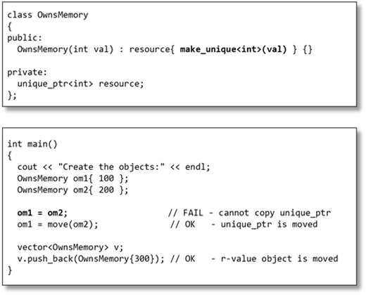
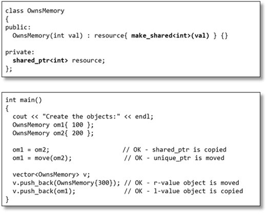
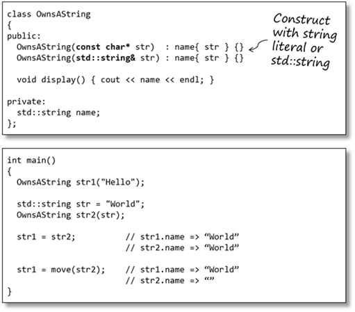
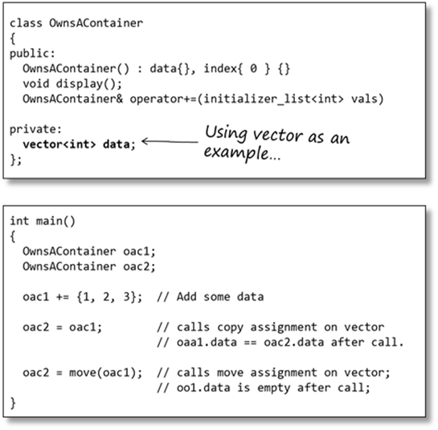

# feabhas [The Rule of Zero](https://blog.feabhas.com/2015/01/the-rule-of-zero/) 

In a previous article – ”[The Rule of the Big Four (and a half)](https://blog.feabhas.com/2015/01/the-rule-of-the-big-four-and-a-half-move-semantics-and-resource-management/)” we looked at resource management policies in C++.

> NOTE: a half所指的是`swap`

Resource management is the general term for using the mechanisms in C++ to ensure that resources – files, dynamic memory, sockets, mutexes, etc – have their lifetimes automatically controlled so as to prevent resource leaks, deadlocks, etc. C++ refers to these mechanisms as `RAII/RDID` ( “Resource Acquisition Is Initialisation / Resource Destruction is Deletion”)

In this article we’ll have a look at a complementary guideline to help simplify your application code, without risking resource management issues – *The Rule of Zero*.

The term The Rule of Zero was coined by R. Martinho Fernandes in his 2012 paper (http://flamingdangerzone.com/cxx11/2012/08/15/rule-of-zero.html). This article merely reflects Martinho Fernandes’ work and I highly recommend reading the original paper to get the full details of the concepts.

> NOTE: 
>
> "R. Martinho Fernandes in his 2012 paper (http://flamingdangerzone.com/cxx11/2012/08/15/rule-of-zero.html)" 已经收录了
>
> 

If you’re not already familiar with the concepts of resource management I’d suggest having a look at the previous articles – [The Rule of Three (and a half)](https://blog.feabhas.com/2014/12/the-rule-of-the-big-three-and-a-half-resource-management-in-c/) and [The Rule of Four (and a half)](https://blog.feabhas.com/2015/01/the-rule-of-the-big-four-and-a-half-move-semantics-and-resource-management/) before reading on.

## The four categories of resource manager

From a resource management perspective we can categorise types in four ways:

1、Objects that can be both moved and copied

2、Objects for which it makes sense to copy but not move

3、Objects for which it makes sense to move but not copy

4、Objects which should neither be moved not copied.

> NOTE: 
>
> 原文的这一段的内容和  [The Rule of Three (and a half)](https://blog.feabhas.com/2014/12/the-rule-of-the-big-three-and-a-half-resource-management-in-c/) and [The Rule of Four (and a half)](https://blog.feabhas.com/2015/01/the-rule-of-the-big-four-and-a-half-move-semantics-and-resource-management/) 中的内容是重复的

## The Rule of Zero

An alternative to “The Rule of The Big Four (and a half)” has appeared in the form of “*The Rule of Zero”*. “The Rule of Zero” basically states:

> *You should NEVER implement a destructor, copy constructor, move constructor or assignment operators in your code.*

With the (very important) corollary（推论） to this:

> *You should NEVER use a raw pointer to manage a resource.*

> NOTE: 
>
> 需要注意的是，是"NEVER implement a destructor, copy constructor, move constructor or assignment operators"，constructor还是要实现的。

The aim of The Rule of Zero is to simplify your application code by deferring all resource management to Standard Library constructs, and letting them do all the hard work for you.

> NOTE: 
>
> automatic resource management

> NOTE: 
>
> 后面都是一些比较简单的例子

### The Rule of Zero and dynamic memory

If your code must dynamically create objects prefer to use `std::unique_ptr` or `std::shared_ptr`. Use a `std::unique_ptr` if your class can be moved, but should not be copied:

Use a `shared_ptr` if you need to support copying as well as moving:

### The Rule of Zero and strings

In the case of strings The Rule of Zero says prefer to use `std::string` over arrays of characters – particularly dynamically allocated (that is, variable-sized) arrays of characters.

### The Rule of Zero and containers

### Summary

The Rule of Zero is a guideline for simplifying application code, whilst avoiding the major problems associated with resource management in C++ programs.

The Rule of Zero is the ‘modern’ way to write C++ and there is very little good reason to fall back on C-style manual resource management. Experience and evidence has shown us that we, as developers, are just not particularly adept at it.