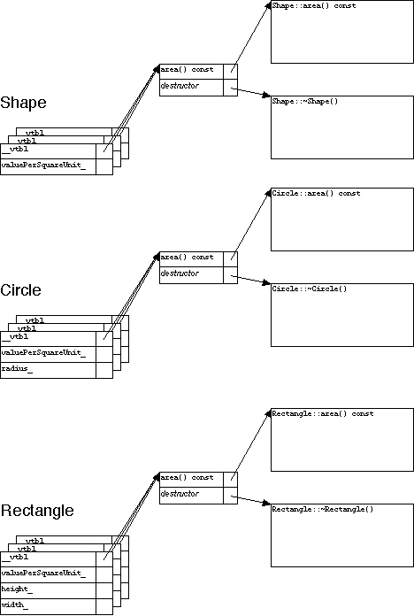
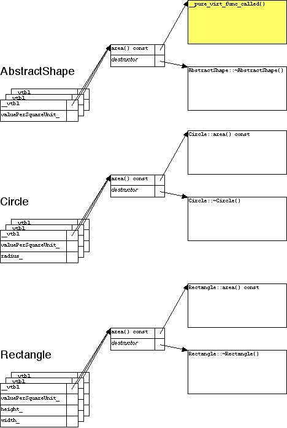

# artima ["Pure Virtual Function Called": An Explanation](https://www.artima.com/cppsource/pure_virtual.html)

## Object-Oriented C++: The Programmer's View

```c++
class Shape
{
public:
	virtual double area() const;
	double value() const;
	// Meyers 3rd Item 7:
	virtual ~Shape();
protected:
	Shape(double valuePerSquareUnit);
private:
	double valuePerSquareUnit_;
};

class Rectangle: public Shape
{
public:
	Rectangle(double width, double height, double valuePerSquareUnit);
	virtual double area() const;
	// Meyers 3rd Item 7:
	virtual ~Rectangle();
// ...
};

class Circle: public Shape
{
public:
	Circle(double radius, double valuePerSquareUnit);
	virtual double area() const;
	// Meyers 3rd Item 7:
	virtual ~Circle();
// ...
};

double
Shape::value() const
{
	// Area is computed differently, depending
	// on what kind of shape the object is:
	return valuePerSquareUnit_ * area();
}

```

> NOTE: virtual method是`area`

(The comments before the destructors refer to Item 7 in the third edition of Scott Meyers's *Effective C++*: "**Declare destructors virtual in polymorphic base classes**." This code follows a convention used on several projects, where references like this are put in the code, serving as reminders to maintainers and reviewers. To some people, the point is obvious and the reminder is distracting（分散注意力的）; but one person's distraction is another person's helpful hint, and programmers in a hurry often forget what should be "obvious.")

> NOTE: "析构函数之前的注释参考了Scott Meyers的有效c++第三版中的第7项:“在多态基类中声明析构函数是虚的。”这段代码遵循了在几个项目中使用的约定，其中像这样的引用被放在代码中，作为对维护人员和审阅人员的提醒。对一些人来说，这一点很明显，而这种提醒会让人分心;但是一个人的分心对另一个人来说是有用的提示，匆忙的程序员经常会忘记应该是“明显的”。"

A *pure* virtual function is declared, but not necessarily defined, by a base class.

> NOTE: 在某些情况下，pure virtual method是需要给出definition的。

## Object Oriented C++: Under the Covers

(You can skip this section if you already know what a "vtbl" is.)

How does all this run time magic happen? The usual implementation is, every class with any **virtual functions** has an array of **function pointers**, called a "**vtbl**". Every instance of such as class has a pointer to its class's *vtbl*, as depicted below.




**Figure 1. A class's vtbl points to the class's instance member functions.**

If an **abstract class** with a **pure virtual function** doesn't define the function, what goes in the corresponding place in the *vtbl*? Traditionally, C++ implementors have provided a special function, which prints "**Pure virtual function called**" (or words to that effect), and then crashes the program.



**Figure 2. An abstract class's vtbl can have a pointer to a special function.**

## Build 'em Up, Tear 'em Down

When you construct an instance of a derived class, what happens, exactly? If the class has a *vtbl*, the process goes something like the following.

Step 1: Construct the top-level base part:.

1. Make the instance point to the base class's *vtbl*.
2. Construct the base class instance member variables.
3. Execute the body of the base class constructor.

Step 2: Construct the derived part(s) (recursively):

1. Make the instance point to the derived class's *vtbl*.
2. Construct the derived class instance member variables.
3. Execute the body of the derived class constructor.

Destruction happens in reverse order, something like this:

Step 1: Destruct the derived part:

1. (The instance already points to the derived class's *vtbl*.)
2. Execute the body of the derived class destructor.
3. Destruct the derived class instance member variables.

Step 2: Destruct the base part(s) (recursively):

1. Make the instance point to the base class's vtbl.
2. Execute the body of the base class destructor.
3. Destruct the base class instance member variables.

## Two of the Classic Blunders（重大错误）

What if you try to call a virtual function from a base class constructor?

```c++
// From sample program 1:
AbstractShape(double valuePerSquareUnit)
        : valuePerSquareUnit_(valuePerSquareUnit)
{
        // ERROR: Violation of Meyers 3rd Item 9!
        std::cout << "creating shape, area = " << area() << std::endl;
}
```

> NOTE: `area()`是pure virtual method；

(Meyers, 3rd edition, Item 9: "Never call virtual functions during construction or destruction.")

This is obviously an attempt to call a **pure virtual function**. The compiler could alert us to this problem, and some compilers do. If a **base class destructor** calls a **pure virtual function** directly (sample program 2), you have essentially the same situation.

If the situation is a little more complicated, the error will be less obvious (and the compiler is less likely to help us):

```c++
// From sample program 3:
AbstractShape::AbstractShape(double valuePerSquareUnit)
        : valuePerSquareUnit_(valuePerSquareUnit)
{
        // ERROR: Indirect violation of Meyers 3rd Item 9!
        std::cout << "creating shape, value = " << value() << std::endl;
}
```

The body of this base class constructor is in step 1(c) of the construction process described above, which calls a instance member function (`value()`), which in turn calls a pure virtual function (`area()`). The object is still an `AbstractShape` at this point. What happens when it tries to call the pure virtual function? Your program likely crashes with a message similar to, "Pure virtual function called."

Similarly, calling a virtual function indirectly from a base class destructor (sample program 4) results in the same kind of crash. The same goes for passing a partially-constructed (or partially-destructed) object to any function that invokes virtual functions.

These are the most commonly described root causes of the "Pure Virtual Function Called" message. They're straightforward to diagnose from postmortem debugging; the stack trace will point clearly to the problem.

## Pointing Out Blame

There's at least one other problem that can lead to this message, which doesn't seem to be explicitly described anywhere in print or on the net. (There have been some discussions on the ACE mailing list that touch upon the problem but they don't go into detail.)

Consider the following (buggy) code:

```c++
        // From sample program 5:
        AbstractShape* p1 = new Rectangle(width, height, valuePerSquareUnit);
        std::cout << "value = " << p1->value() << std::endl;
        AbstractShape* p2 = p1;  // Need another copy of the pointer.
        delete p1;
        std::cout << "now value = " << p2->value() << std::endl;
```

Let's consider these lines one at a time.

```c++
AbstractShape* p1 = new Rectangle(width, height, valuePerSquareUnit);
```

A new object is created. It's constructed in two stages: Step 1, where the object acts like a **base class instance**, and Step 2, where it acts like a **derived class instance**.

```c++
std::cout << "value = " << p1->value() << std::endl;
```

Everything's working fine.

```c++
AbstractShape* p2 = p1;  // Need another copy of the pointer.
```

Something odd might happen to `p1`, so let's make a copy of it.

```c++
delete p1;
```

The object is destructed in two stages: Step 1, where the object acts like a derived class instance, and Step 2, where it acts like a base class instance.

Note that the value of `p1` might change after the call to `delete`. Compilers are allowed to "zero out" (i.e., render unusable) pointers after destructing their pointed-to data. Lucky (?) for us, we have another copy of the pointer, `p2`, which didn't change.

```c++
std::cout << "now value = " << p2->value() << std::endl;
```

Uh oh.

This is another classic blunder: going indirect on a "dangling" pointer. That's a pointer to an object that's been deleted, or memory that's been freed, or both. C++ programmers never write such code ... unless they're clueless (unlikely) or rushed (all too likely).

So now `p2` points to an ex-object. What does that thing look like? According to the C++ standard, it's "undefined". That's a technical term that means, in theory, anything can happen: the program can crash, or keep running but generate garbage results, or send Bjarne Stroustrup e-mail saying how ugly you are and how funny your mother dresses you. You can't depend on anything; the behavior might vary from compiler to compiler, or machine to machine, or run to run. In practice, there are several common possibilities (which may or may not happen consistently):

- The memory might be marked as deallocated. Any attempt to access it would immediately be flagged as the use of a dangling pointer. That's what some tools (BoundsChecker, Purify, valgrind, and others) try to do. As we'll see, the Common Language Runtime (CLR) from Microsoft's .NET Framework, and Sun Studio 11's dbx debugger, work this way.
- The memory might be deliberately scrambled. The memory management system might write garbage-like values into the memory after it's freed. (One such value is "dead beef": 0xDEADBEEF, unsigned decimal 3735928559, signed decimal -559038737.)
- The memory might be reused. If other code was executed between the deletion of the object and the use of dangling pointer, the memory allocation system might have created a new object out of some or all of the memory used by the old object. If you're lucky, this will look enough like garbage that the program will crash immediately. Otherwise the program will likely crash sometime later, possibly after curdling other objects, often long after the root cause problem occurred. This is the kind of problem that drives C++ programmers crazy (and makes Java programmers overly smug).
- The memory might have been left exactly the way it was.

The last is an interesting case. What was the object "exactly the way it was"? In this case, it was an instance of the abstract base class; certainly that's the way the *vtbl* was left. What happens if we try to call a pure virtual member function for such an object?

"Pure virtual function called".

(Exercise for the reader: Imagine a function that, unwisely and unfortunately, returned a pointer or reference to a local variable. This is a different kind of dangling pointer. How could this also generate this message?)

## Meanwhile, Back in the Real World

Nice theory. What happens in practice?

Consider five test programs, each with its own distinctive defect:

1. Directly calling a virtual function from a base class constructor.
2. Directly calling a virtual function from a base class destructor.
3. Indirectly calling a virtual function from a base class constructor.
4. Indirectly calling a virtual function from a base class destructor.
5. Calling a virtual function via a dangling pointer.

These were built and tested with several compilers (running on x86 Windows XP unless stated otherwise):

- Visual C++ 8.0

- Digital Mars C/C++ compiler version 8.42n

- Open Watcom C/C++ version 1.4

- SPARC Solaris 10, Sun Studio 11

- gcc:

- - x86 Linux (Red Hat 3.2), gcc 2.96 / 3.0 / 3.2.2
  - x86 Windows XP (Cygwin), gcc 3.4.4
  - SPARC Solaris 8, gcc 3.2.2
  - PowerPC Mac OS X.4 (Tiger), gcc 3.3 / 4.0

## Direct Invocation

Some compilers recognized what was happening in the first two examples, with various results.

Visual C++ 8.0, Open Watcom C/C++ 1.4, and gcc 4.x recognize that a base class's constructor or destructor can't possibly invoke a derived class's member function. As a result, these compilers optimize away any runtime polymorphism, and treat the call as an invocation of the base class member function. If that member function is not defined, the program doesn't link. If the member function is defined, the program runs without problems. gcc 4.x produces a warning ("abstract virtual 'virtual double AbstractShape::area() const' called from constructor" for the first program, and similarly for the destructor for the second program). Visual C++ 8.0 built the programs without any complaint, even at the maximum warning level (/Wall); similarly for Open Watcom C/C++ 1.4.

gcc 3.x and Digital Mars C/C++ compiler 8.42n rejected these programs, complaining, respectively, "abstract virtual `virtual double AbstractShape::area() const' called from constructor" (or "from destructor") and "Error: 'AbstractShape::area' is a pure virtual function".

Sun Studio 11 produced a warning, "Warning: Attempt to call a pure virtual function AbstractShape::area() const will always fail", but builds the programs. As promised, both crash, with the message, "Pure virtual function called".

## Indirect Invocation

The next two examples built without warning for all compilers. (That's to be expected; this is not the kind of problem normally caught by static analysis.) The resulting programs all crashed, with various error messages:

- Visual C++ 8.0: "R6025 - pure virtual function call (__vftpr[0] == __purecall)".
- Digital Mars C/C++ compiler 8.42n: did not generate an error message when the program crashed. (That's fine; this is "undefined" behavior, and the compiler is free to do whatever it wants.)
- Open Watcom C/C++ 1.4: "pure virtual function called!".
- Sun Studio 11: "Pure virtual function called" (same as for the first two programs).
- gcc: "pure virtual method called".


## [Example code](https://www.artima.com/forums/flat.jsp?forum=226&thread=196881)

## Example program 1

```c++
// Artima.com: The C++ Source: "Pure virtual function called",
// example 1, virtual function directly called in constructor.

#include <cstdlib>
#include <iostream>

class AbstractShape {
public:
	virtual double area() const = 0;
	double value() const;
	// Meyers 3rd Item 7:
	virtual ~AbstractShape();
protected:
	AbstractShape(double valuePerSquareUnit);
private:
	double valuePerSquareUnit_;
};

class Rectangle : public AbstractShape {
public:
	Rectangle(double width, double height, double valuePerSquareUnit);
	virtual double area() const;
	// Meyers 3rd Item 7:
	virtual ~Rectangle();
private:
	double width_;
	double height_;
};

AbstractShape::AbstractShape(double valuePerSquareUnit)
	: valuePerSquareUnit_(valuePerSquareUnit)
{
	// ERROR: Violation of Meyers 3rd Item 9!
	std::cout << "creating shape, area = " << area() << std::endl;
}

AbstractShape::~AbstractShape()
{
}

#ifdef DEFINE_PURE_VIRTUAL_FUNCTION

// Some compilers optimize away the vtbl, and try to directly call the base
// class version of the virtual function. If the function is defined, the
// program links and runs; if not, it doesn't link.

double
AbstractShape::area() const
{
	return 0;
}

#endif /* DEFINE_PURE_VIRTUAL_FUNCTION */

double
AbstractShape::value() const
{
	return valuePerSquareUnit_ * area();
}

Rectangle::Rectangle(double width, double height, double valuePerSquareUnit)
	: AbstractShape(valuePerSquareUnit),
	width_(width),
	height_(height)
{
}

Rectangle::~Rectangle()
{
}

double
Rectangle::area() const
{
	return width_ * height_;
}

int
main(int argc, char** argv)
{
	if (argc != 4) {
		std::cerr << "usage: " << argv[0] <<
		  " width height valuePerSquareUnit" << std::endl;
		return 1;  // Failure!
	}
	double width = std::atof(argv[1]);
	double height = std::atof(argv[2]);
	double valuePerSquareUnit = std::atof(argv[3]);

	Rectangle r(width, height, valuePerSquareUnit);
	std::cout << "value = " << r.value() << std::endl;

	return 0;  // Success!
}
```

上述代码的运行是有些不符合我们的认知的，结合cppreference abstract class中的解释，我们发现上述代码的运行结果有以下反常：

- 在constructor中调用了pure virtual method，并没有像前面的例子中那样抛出异常
- 必须要给出`AbstractShape::area()`的定义，否则上述代码链接报错

关于此，上述代码中的注释给出了解释：

```
Some compilers optimize away the vtbl, and try to directly call the base class version of the virtual function. If the function is defined, the program links and runs; if not, it doesn't link.
```

compiler的优化带来了与认知相反的现象。