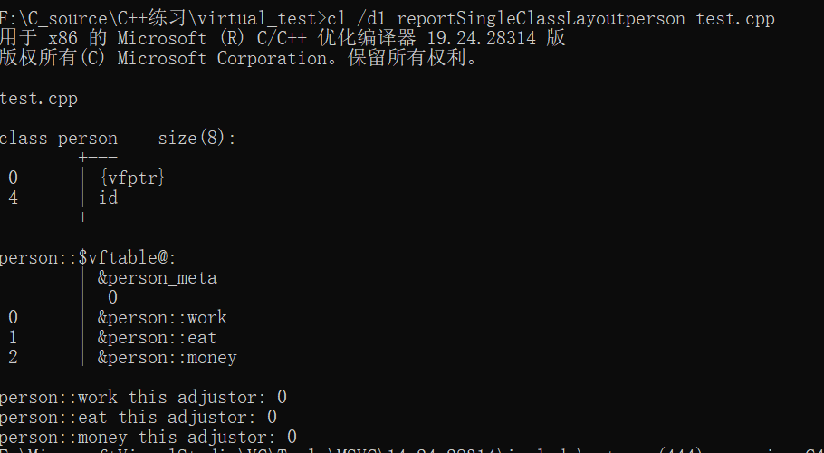
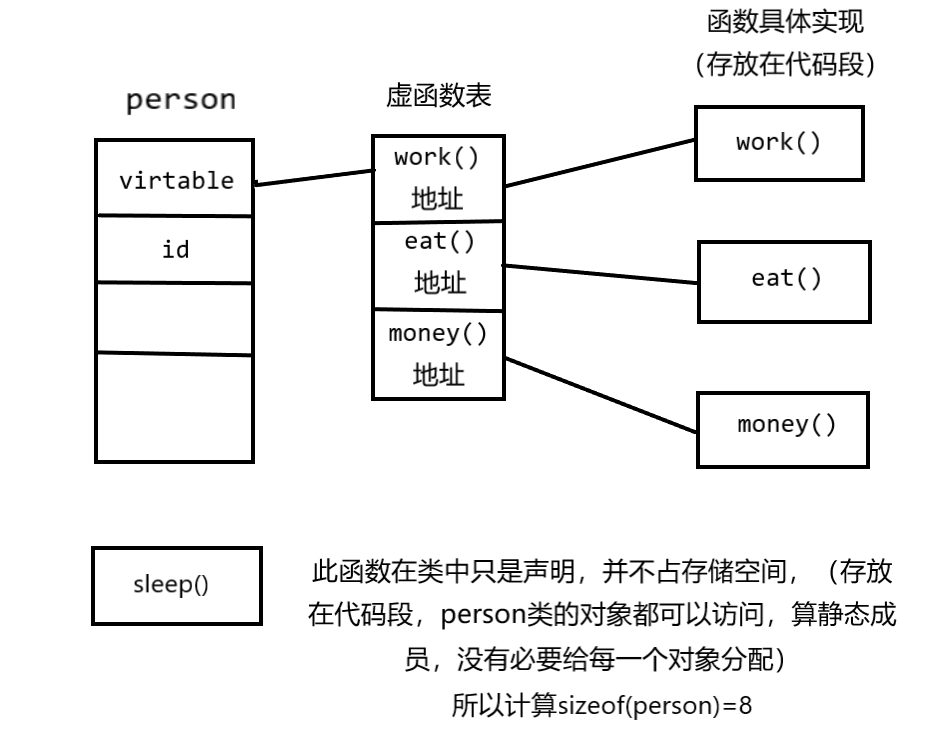
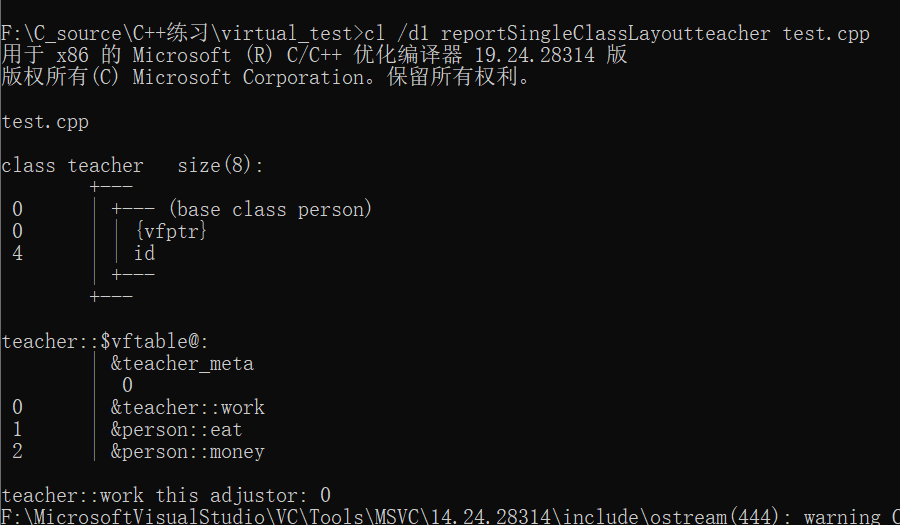
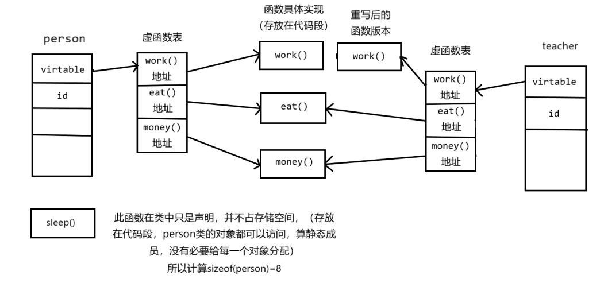
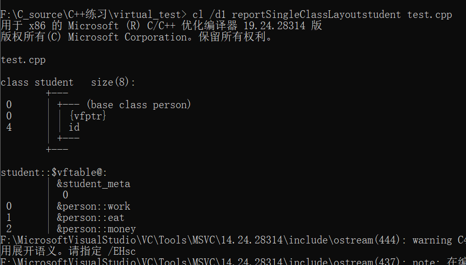

# csdn [C++ 虚函数和虚函数表详解（底层分析、代码测试）](https://blog.csdn.net/qq_24447809/article/details/110825780)

## 概述

C++编译器是保证虚函数表的指针存在于对象实例中最前面的位置(是为了保证取到虚函数表的最高的性能)，这样我们就能通过已经实例化的对象的地址得到这张虚函数表，再遍历其中的函数指针，并调用相应的函数。

> NOTE: 
>
> 1、这段话的内容是和 wikipedia Virtual method table的内容相矛盾的:
>
> > Many compilers place the virtual table pointer as the last member of the object; other compilers place it as the first; portable source code works either way.[[2\]](https://en.wanweibaike.com/wiki-Virtual table#cite_note-2) For example, [g++](https://en.wanweibaike.com/wiki-G%2B%2B) previously placed the pointer at the end of the object.[[3\]](https://en.wanweibaike.com/wiki-Virtual table#cite_note-3)
>
> 

**需要注意的几点：**
（1）同一个类的对象共享一个虚函数表。

（2）如果类存在虚函数表（有虚函数），那么这个类地址的起始位存放**虚函数表的地址**。

（3）子类继承父类虚函数表中的虚函数地址数据，不是同一张表，如果在子类中重写继承的虚函数，会覆盖虚函数表中相应的函数地址。

以上证明见下面分析：

## Visual调试分析

### （1）创建一个基类

```C++
class person
{
public:
	virtual void work();
	virtual void eat();
	virtual void money();
	void sleep();  //只是声明静态成员，函数存放在代码段，并不占用这个类的空间
private:
	int id=2;
};

```

输入指令，此指令可以查看person类的内存分配

```SHELL
cl /d1 reportSingleClassLayoutperson test.cpp
```


#### Memory layout

测试结果：




可以看出`person`类有一个虚函数表指针`vfptr`，指向的虚函数表vftable中有我们定义好的3个虚函数，注意每个虚函数函数前面加了作用域`person::`。

#### 直观图

直观的关系如图所示：



### （2）再创建一个子类teacher，重写了work虚函数

```C++
class teacher :public person
{
public:
	virtual void work();
};
```


输入指令查看teacher子类内存分配

```SHELL
cl /d1 reportSingleClassLayoutteacher test.cpp
```


测试结果：

如图，


子类继承了父类的id和虚函数表的函数指针数据（注意，并不是和父类同一个虚函数表，见下面代码测试），因为重写了work函数，work函数前面作用域变为了`teacher::`。

#### 多态实现原理

此处可以理解虚函数多态的底层实现原理。

虚函数多态条件：

（1）指针调用

（2）向上转型

（3）存在虚函数


```C++
teacher t;
person* p=&t
p->work();  //因为加了虚函数，此处发生多态，即在运行期决定调用哪个函数。
```

ps：父类指针可以指向子类对象，因为子类对象中必定含有父类的数据信息，反之需要强制转型（有风险）。

`p->work()`被编译器转为`person::work( p )`，`p`指向的`teacher`类对象的地址当作传入参数，作为调用哪个函数的依据。

程序运行到此处时先去查找`p`指向的虚函数表，此处会带一个偏移量`x`，在虚函数表中偏移`x`位找到函数地址，如果这个函数没有被重写，那么函数指针地址为`&person::work`,此处我们重写了虚函数`work`，所以查找到的地址为`&teaher::work`。



### （3）创建一个无重写函数子类

```C++
class student :public person
{
public:
	void stufunc();
};
```



子类正常继承父类虚函数表函数指针地址。

## 代码测试

### 原文的代码(存在错误)

```C++
#include<iostream>
using namespace std;

class person
{
public:
	person(int n = 0)
	{
		id = n;
	}
	;
	virtual void work();
	virtual void eat();
	virtual void money();
	void sleep();  //只是声明静态成员，函数存放在代码段，并不占用这个类的空间
private:
	int id = 2;
};

void person::money()
{
	cout << "person_money" << endl;
}
void person::sleep()
{
	std::cout << "person_sleep" << std::endl;
}
void person::work()
{
	std::cout << "person_work" << std::endl;
}
void person::eat()
{
	std::cout << "person_eat" << std::endl;
}

class teacher: public person
{
public:
	virtual void work();
};
void teacher::work()
{
	cout << "teacher_work" << endl;
}

class student: public person
{
public:
	void stufunc();
};
void student::stufunc()
{
	cout << "student func" << endl;
}

int main()
{
	person p1;
	int *person_addr = (int*) &p1;
	cout << "基类对象地址" << person_addr << endl;

	int *virTableptr = (int*) *(person_addr + 0); //对象地址最开始一位指向虚函数表
	cout << "虚函数表地址：" << virTableptr << endl;

	/*虚函数表中每一位存有函数指针，即函数入口地址*/
	int *func1 = (int*) *(virTableptr + 0);    //虚函数指针强转为int* ，方便显示
	void (*func1_ac)() = (void(*)()) func1;	  //可执行函数指针

	int *func2 = (int*) *(virTableptr + 1);
	void (*func2_ac)() = (void(*)()) func2;

	int *func3 = (int*) *(virTableptr + 2);
	void (*func3_ac)() = (void(*)()) func3;

	cout << "person_func:" << endl;
	cout << "work_addr:" << func1 << endl;  //打印函数地址
	func1_ac();  //函数执行

	cout << "eat_addr:" << func2 << endl;
	func2_ac();

	cout << "money_addr:" << func3 << endl;
	func3_ac();

	/*下面测试teacher类*/
	cout << endl;
	cout << "---------------------------" << endl;
	cout << "覆盖虚函数子类teacher测试" << endl;
	cout << "---------------------------" << endl;
	teacher p2;
	int *teacher_addr = (int*) &p2;
	cout << "子类teacher对象地址" << teacher_addr << endl;

	int *teacher_virTable = (int*) *(teacher_addr + 0);
	cout << "子类teacher虚函数表地址" << teacher_virTable << endl;

	cout << "teacher func" << endl;

	int *tfunc1 = (int*) *(teacher_virTable + 0);
	void (*tfunc1_ac)() = (void(*)())tfunc1;
	cout << "teacher_work_addr:" << tfunc1 << endl;
	tfunc1_ac();

	int *tfunc2 = (int*) *(teacher_virTable + 1);
	void (*tfunc2_ac)() = (void(*)())tfunc2;
	cout << "teacher_eat_addr:" << tfunc2 << endl;
	tfunc2_ac();

	int *tfunc3 = (int*) *(teacher_virTable + 2);
	void (*tfunc3_ac)() = (void(*)())tfunc3;
	cout << "teacher_money_addr:" << tfunc3 << endl;
	tfunc3_ac();

	/*测试student类*/
	cout << endl;
	cout << "---------------------------" << endl;
	cout << "未覆盖虚函数子类student测试" << endl;
	cout << "---------------------------" << endl;
	student p3;
	int *stu_addr = (int*) &p3;
	cout << "子类student对象地址:" << stu_addr << endl;

	int *stu_virtable = (int*) *(stu_addr + 0);
	cout << "子类student虚函数表地址:" << stu_virtable << endl;

	/*测试person同类*/
	cout << endl;
	cout << "---------------------------" << endl;
	cout << "同类person对象测试" << endl;
	cout << "---------------------------" << endl;
	person p4;
	int *p4_addr = (int*) &p4;
	cout << "同类person对象地址:" << p4_addr << endl;

	int *p4_virtable = (int*) *(p4_addr + 0);
	cout << "同类person虚函数表地址:" << p4_virtable << endl;

	return 0;
}
// g++ -Wall -pedantic test.cpp -g


```


### Object memory layout

```C++
Vtable for person
person::_ZTV6person: 5u entries
0     (int (*)(...))0
8     (int (*)(...))(& _ZTI6person)
16    (int (*)(...))person::work
24    (int (*)(...))person::eat
32    (int (*)(...))person::money

Class person
   size=16 align=8
   base size=12 base align=8
person (0x0x7fa63290b4e0) 0
    vptr=((& person::_ZTV6person) + 16u)

Vtable for teacher
teacher::_ZTV7teacher: 5u entries
0     (int (*)(...))0
8     (int (*)(...))(& _ZTI7teacher)
16    (int (*)(...))teacher::work
24    (int (*)(...))person::eat
32    (int (*)(...))person::money

Class teacher
   size=16 align=8
   base size=12 base align=8
teacher (0x0x7fa632900138) 0
    vptr=((& teacher::_ZTV7teacher) + 16u)
  person (0x0x7fa63290b540) 0
      primary-for teacher (0x0x7fa632900138)

Vtable for student
student::_ZTV7student: 5u entries
0     (int (*)(...))0
8     (int (*)(...))(& _ZTI7student)
16    (int (*)(...))person::work
24    (int (*)(...))person::eat
32    (int (*)(...))person::money

Class student
   size=16 align=8
   base size=12 base align=8
student (0x0x7fa6329001a0) 0
    vptr=((& student::_ZTV7student) + 16u)
  person (0x0x7fa63290b5a0) 0
      primary-for student (0x0x7fa6329001a0)


```


### 错误原因分析

上述code在64位系统上运行时，会core dump:

```C++
Core was generated by `./a.out'.
Program terminated with signal 11, Segmentation fault.
#0  0x0000000000000000 in ?? ()
Missing separate debuginfos, use: debuginfo-install glibc-2.17-222.el7.x86_64 libgcc-4.8.5-28.el7.x86_64 libstdc++-4.8.5-28.el7.x86_64
(gdb) where 
#0  0x0000000000000000 in ?? ()
#1  0x0000000000400b28 in main () at test.cpp:81
(gdb) 

```

1、看到了"signal 11, Segmentation fault"，我的第一反应是使用了无效的地址，于是

```C++
(gdb) b test.cpp:81
Breakpoint 1 at 0x400b22: file test.cpp, line 81.
(gdb) r
Starting program: /home/dengkai/a.out 
基类对象地址0x7fffffffe240
虚函数表地址：0x4012f0
person_func:
work_addr:0x400932
person_work
eat_addr:0

Breakpoint 1, main () at test.cpp:81
81		func2_ac();
Missing separate debuginfos, use: debuginfo-install glibc-2.17-222.el7.x86_64 libgcc-4.8.5-28.el7.x86_64 libstdc++-4.8.5-28.el7.x86_64
(gdb) p func2_ac
$1 = (void (*)(void)) 0x0
(gdb) 

```

果然，`func2` 的值为`0x0`无效值。

2、为什么是`0x0`呢？此时我头脑中想起了在 shaharmike [C++ vtables - Part 1 - Basics](https://shaharmike.com/cpp/vtable-part1/) 中输出的vtable的binary memory layout: 

```C++
(gdb) x/300xb 0x400b40
0x400b40 <vtable for Derived>:	0x00	0x00	0x00	0x00	0x00	0x00	0x00	0x00
0x400b48 <vtable for Derived+8>:	0x90	0x0b	0x40	0x00	0x00	0x00	0x00	0x00
0x400b50 <vtable for Derived+16>:	0x80	0x0a	0x40	0x00	0x00	0x00	0x00	0x00
0x400b58 <vtable for Derived+24>:	0x90	0x0a	0x40	0x00	0x00	0x00	0x00	0x00
0x400b60 <typeinfo name for Derived>:	0x37	0x44	0x65	0x72	0x69	0x76	0x65	0x64
0x400b68 <typeinfo name for Derived+8>:	0x00	0x36	0x50	0x61	0x72	0x65	0x6e	0x74
0x400b70 <typeinfo name for Parent+7>:	0x00	0x00	0x00	0x00	0x00	0x00	0x00	0x00
0x400b78 <typeinfo for Parent>:	0x90	0x20	0x60	0x00	0x00	0x00	0x00	0x00
0x400b80 <typeinfo for Parent+8>:	0x69	0x0b	0x40	0x00	0x00	0x00	0x00	0x00
0x400b88:	0x00	0x00	0x00	0x00	0x00	0x00	0x00	0x00
0x400b90 <typeinfo for Derived>:	0x10	0x22	0x60	0x00	0x00	0x00	0x00	0x00
0x400b98 <typeinfo for Derived+8>:	0x60	0x0b	0x40	0x00	0x00	0x00	0x00	0x00
0x400ba0 <typeinfo for Derived+16>:	0x78	0x0b	0x40	0x00	0x00	0x00	0x00	0x00
0x400ba8 <vtable for Parent>:	0x00	0x00	0x00	0x00	0x00	0x00	0x00	0x00
0x400bb0 <vtable for Parent+8>:	0x78	0x0b	0x40	0x00	0x00	0x00	0x00	0x00
0x400bb8 <vtable for Parent+16>:	0xa0	0x0a	0x40	0x00	0x00	0x00	0x00	0x00
0x400bc0 <vtable for Parent+24>:	0x90	0x0a	0x40	0x00	0x00	0x00	0x00	0x00
```

可以看到，vtable的每条记录的最后几条的值都是`0x00`，那会不会是因为正好读到了最后4byte呢？

3、vtable中，保存的是地址，也就是vtable的类型是pointer，一般在64-bit CPU中，pointer type的length是64-bit、32-bit CPU中，pointer type的length是32-bit，而我的CPU是64-bit的，而原文程序中使用的是`int*`，int的length是32-bit，这就导致了前面的直觉: 正好读到了最后4byte。


### 正确程序

```C++
#include<iostream>
using namespace std;

class person
{
public:
	person(int n = 0)
	{
		id = n;
	}
	;
	virtual void work();
	virtual void eat();
	virtual void money();
	void sleep();  //只是声明静态成员，函数存放在代码段，并不占用这个类的空间
private:
	int id = 2;
};

void person::money()
{
	cout << "person_money" << endl;
}
void person::sleep()
{
	std::cout << "person_sleep" << std::endl;
}
void person::work()
{
	std::cout << "person_work" << std::endl;
}
void person::eat()
{
	std::cout << "person_eat" << std::endl;
}

class teacher: public person
{
public:
	virtual void work();
};
void teacher::work()
{
	cout << "teacher_work" << endl;
}

class student: public person
{
public:
	void stufunc();
};
void student::stufunc()
{
	cout << "student func" << endl;
}

int main()
{
	person p1;
	long *person_addr = (long*) &p1;
	cout << "基类对象地址" << person_addr << endl;

	long *virTableptr = (long*) *(person_addr + 0); //对象地址最开始一位指向虚函数表
	cout << "虚函数表地址：" << virTableptr << endl;

	/*虚函数表中每一位存有函数指针，即函数入口地址*/
	long *func1 = (long*) *(virTableptr + 0);    //虚函数指针强转为long* ，方便显示
	void (*func1_ac)() = (void(*)()) func1;	  //可执行函数指针

	long *func2 = (long*) *(virTableptr + 1);
	void (*func2_ac)() = (void(*)()) func2;

	long *func3 = (long*) *(virTableptr + 2);
	void (*func3_ac)() = (void(*)()) func3;

	cout << "person_func:" << endl;
	cout << "work_addr:" << func1 << endl;  //打印函数地址
	func1_ac();  //函数执行

	cout << "eat_addr:" << func2 << endl;
	func2_ac();

	cout << "money_addr:" << func3 << endl;
	func3_ac();

	/*下面测试teacher类*/
	cout << endl;
	cout << "---------------------------" << endl;
	cout << "覆盖虚函数子类teacher测试" << endl;
	cout << "---------------------------" << endl;
	teacher p2;
	long *teacher_addr = (long*) &p2;
	cout << "子类teacher对象地址" << teacher_addr << endl;

	long *teacher_virTable = (long*) *(teacher_addr + 0);
	cout << "子类teacher虚函数表地址" << teacher_virTable << endl;

	cout << "teacher func" << endl;

	long *tfunc1 = (long*) *(teacher_virTable + 0);
	void (*tfunc1_ac)() = (void(*)())tfunc1;
	cout << "teacher_work_addr:" << tfunc1 << endl;
	tfunc1_ac();

	long *tfunc2 = (long*) *(teacher_virTable + 1);
	void (*tfunc2_ac)() = (void(*)())tfunc2;
	cout << "teacher_eat_addr:" << tfunc2 << endl;
	tfunc2_ac();

	long *tfunc3 = (long*) *(teacher_virTable + 2);
	void (*tfunc3_ac)() = (void(*)())tfunc3;
	cout << "teacher_money_addr:" << tfunc3 << endl;
	tfunc3_ac();

	/*测试student类*/
	cout << endl;
	cout << "---------------------------" << endl;
	cout << "未覆盖虚函数子类student测试" << endl;
	cout << "---------------------------" << endl;
	student p3;
	long *stu_addr = (long*) &p3;
	cout << "子类student对象地址:" << stu_addr << endl;

	long *stu_virtable = (long*) *(stu_addr + 0);
	cout << "子类student虚函数表地址:" << stu_virtable << endl;

	/*测试person同类*/
	cout << endl;
	cout << "---------------------------" << endl;
	cout << "同类person对象测试" << endl;
	cout << "---------------------------" << endl;
	person p4;
	long *p4_addr = (long*) &p4;
	cout << "同类person对象地址:" << p4_addr << endl;

	long *p4_virtable = (long*) *(p4_addr + 0);
	cout << "同类person虚函数表地址:" << p4_virtable << endl;

	return 0;
}
// g++ -Wall -pedantic test.cpp -g


```


#### 输出

```C++
基类对象地址0x7ffe86a50d30
虚函数表地址：0x4012d0
person_func:
work_addr:0x400932
person_work
eat_addr:0x40095c
person_eat
money_addr:0x4008de
person_money

---------------------------
覆盖虚函数子类teacher测试
---------------------------
子类teacher对象地址0x7ffe86a50d20
子类teacher虚函数表地址0x401290
teacher func
teacher_work_addr:0x400986
teacher_work
teacher_eat_addr:0x40095c
person_eat
teacher_money_addr:0x4008de
person_money

---------------------------
未覆盖虚函数子类student测试
---------------------------
子类student对象地址:0x7ffe86a50d10
子类student虚函数表地址:0x401250

---------------------------
同类person对象测试
---------------------------
同类person对象地址:0x7ffe86a50d00
同类person虚函数表地址:0x4012d0
```


#### 修改分析

1、上述程序使用`long*`替代`int*`，这是因为一般`long` type length等于Word length等于pointer length

2、上述程序没有使用`size_t`的原因是，intentional programming，上述程序所要表达的意图是arithmetic，显然long是更加符合arithmetic的