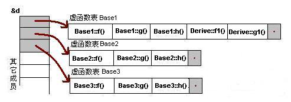

# csdn [详解virtual table](https://blog.csdn.net/wangweixaut061/article/details/7019994) 

> NOTE: 
>
> 1、C++并没有统一实现，因此不同的compiler的实现方式是不同的，本文所介绍的只是一种可能的实现方式，并不能够代表所有

C++中的虚函数的作用主要是实现了**多态**的机制。关于多态，简而言之就是用父类型别的指针指向其子类的实例，然后通过父类的指针调用实际子类的成员函数。这种技术可以让父类的指针有“多种形态”，这是一种泛型技术。所谓泛型技术，说白了就是试图使用不变的代码来实现可变的算法。比如：模板技术，RTTI技术，虚函数技术，要么是试图做到在编译时决议，要么试图做到运行时决议。

> NOTE: 
>
> 1、上面这段话中所述的"泛型技术"，并不准确


## 虚函数表

对C++ 了解的人都应该知道虚函数（Virtual Function）是通过一张虚函数表（Virtual Table）来实现的。简称为V-Table。 在这个表中，主是要一个类的**虚函数的地址表**，这张表解决了继承、覆盖的问题，保证其能真实反应实际的函数。这样，在有虚函数的类的实例中这个表被分配在了 这个实例的内存中，所以，当我们用父类的指针来操作一个子类的时候，这张虚函数表就显得由为重要了，它就像一个地图一样，指明了实际所应该调用的函数。

这里我们着重看一下这张虚函数表。在C++的标准规格说明书中说到，编译器必需要保证**虚函数表的指针**存在于对象实例中最前面的位置（这是为了保证正确取到**虚函数的偏移量**）。 这意味着我们通过对象实例的地址得到这张虚函数表，然后就可以遍历其中函数指针，并调用相应的函数。

> NOTE: 
>
> 1、这段话的内容是和 wikipedia Virtual method table的内容相矛盾的:
>
> > Many compilers place the virtual table pointer as the last member of the object; other compilers place it as the first; portable source code works either way.[[2\]](https://en.wanweibaike.com/wiki-Virtual table#cite_note-2) For example, [g++](https://en.wanweibaike.com/wiki-G%2B%2B) previously placed the pointer at the end of the object.[[3\]](https://en.wanweibaike.com/wiki-Virtual table#cite_note-3)

假设我们有这样的一个类：

```C++
class Base {

public:

virtual void f() { cout << "Base::f" << endl; }

virtual void g() { cout << "Base::g" << endl; }

virtual void h() { cout << "Base::h" << endl; }

};
```

按照上面的说法，我们可以通过`Base`的实例来得到虚函数表。 下面是实际例程：

```C++
#include <iostream>
using namespace std;
class Base
{

public:

	virtual void f()
	{
		cout << "Base::f" << endl;
	}

	virtual void g()
	{
		cout << "Base::g" << endl;
	}

	virtual void h()
	{
		cout << "Base::h" << endl;
	}

};
int main()
{
	typedef void (*Fun)(void);

	Base b;

	Fun pFun = NULL;

	cout << "虚函数表地址：" << (int*) (&b) << endl;

	cout << "虚函数表的第一个函数地址:" << (int*) *(int*) (&b) << endl; 

	// Invoke the first virtual function

	pFun = (Fun) *((int*) *(int*) (&b));

	pFun();
}

```

> NOTE: 
>
> 1、关于上述程序的理解，参见:
>
> a、`Pointer-to-function-and-function-type` 章节
>
> 2、输出如下: 

```C++
虚函数表地址：0x7ffccb400f20
虚函数表的第一个函数地址:0x400b10
Base::f
```

通过这个示例，我们可以看到，我们可以通过强行把`&b`转成`int *`，取得虚函数表的地址，然后，再次取址就可以得到第一个虚函数的地址了，也就是`Base::f()`，这在上面的程序中得到了验证（把`int*` 强制转成了函数指针）。通过这个示例，我们就可以知道如果要调用`Base::g()`和`Base::h()`，其代码如下：

```C++
(Fun)*((int*)*(int*)(&b)+0); // Base::f()

(Fun)*((int*)*(int*)(&b)+1); // Base::g()

(Fun)*((int*)*(int*)(&b)+2); // Base::h()
```

> NOTE:
>
> 1、需要注意的是: 由于indirection、C-style cast的precedence是高于arithmetic的，因此，上述expression的解释是:
>
> ```c++
> ((int*)*(int*)(&b))+2
> ```
>
> 2、multiple level pointer


这个时候你应该懂了吧。什么？还是有点晕。也是，这样的代码看着太乱了。没问题，让我画个图解释一下。如下所示：


### 结束标识

注意：在上面这个图中，我在虚函数表的最后多加了一个结点，这是虚函数表的结束结点，就像字符串的结束符“/0”一样，其标志了虚函数表的 结束。这个结束标志的值在不同的编译器下是不同的。在WinXP+VS2003下，这个值是NULL。而在Ubuntu 7.10 + Linux 2.6.22 + GCC 4.1.3下，这个值是如果1，表示还有下一个虚函数表，如果值是0，表示是最后一个虚函数表。

---

下面，我将分别说明“无覆盖”和“有覆盖”时的虚函数表的样子。没有覆盖父类的虚函数是毫无意义的。我之所以要讲述没有覆盖的情况，主要目的是为了给一个对比。在比较之下，我们可以更加清楚地知道其内部的具体实现。

## 一般继承（无虚函数覆盖）

下面，再让我们来看看继承时的虚函数表是什么样的。假设有如下所示的一个继承关系：


请注意，在这个继承关系中，子类没有重载任何父类的函数。那么，在派生类的实例中，其虚函数表如下所示：

对于实例：`Derive d;` 的虚函数表如下：


我们可以看到下面几点：

1）虚函数按照其声明顺序放于表中。

2）父类的虚函数在子类的虚函数前面。

我相信聪明的你一定可以参考前面的那个程序，来编写一段程序来验证。

## 一般继承（有虚函数覆盖）

覆盖父类的虚函数是很显然的事情，不然，虚函数就变得毫无意义。下面，我们来看一下，如果子类中有虚函数重载了父类的虚函数，会是一个什么样子？假设，我们有下面这样的一个继承关系。


为了让大家看到被继承过后的效果，在这个类的设计中，我只覆盖了父类的一个函数：`f()`。那么，对于派生类的实例，其虚函数表会是下面的一个样子：


我们从表中可以看到下面几点，

1）覆盖的`f()`函数被放到了虚表中原来父类虚函数的位置。

2）没有被覆盖的函数依旧。

这样，我们就可以看到对于下面这样的程序，

```C++
Base *b = new Derive();

b->f();
```

由`b`所指的内存中的虚函数表的`f()`的位置已经被`Derive::f()`函数地址所取代，于是在实际调用发生时，是`Derive::f()`被调用了。这就实现了多态。

## 多重继承（无虚函数覆盖）

下面，再让我们来看看多重继承中的情况，假设有下面这样一个类的继承关系。注意：子类并没有覆盖父类的函数。


对于子类实例中的虚函数表，是下面这个样子：



我们可以看到：

1） 每个父类都有自己的虚表。

2） 子类的成员函数被放到了第一个父类的表中。（所谓的第一个父类是按照声明顺序来判断的）

这样做就是为了解决不同的父类类型的指针指向同一个子类实例，而能够调用到实际的函数。

## 多重继承（有虚函数覆盖）

下面我们再来看看，如果发生虚函数覆盖的情况。

下图中，我们在子类中覆盖了父类的f()函数。


下面是对于子类实例中的虚函数表的图：


我们可以看见，三个父类虚函数表中的f()的位置被替换成了子类的函数指针。这样，我们就可以任一静态类型的父类来指向子类，并调用子类的f()了。如：

```C++
Derive d;

Base1 *b1 = &d;

Base2 *b2 = &d;

Base3 *b3 = &d;

b1->f(); //Derive::f()

b2->f(); //Derive::f()

b3->f(); //Derive::f()

b1->g(); //Base1::g()

b2->g(); //Base2::g()

b3->g(); //Base3::g()
```

## 安全性

每次写C++的文章，总免不了要批判一下C++。这篇文章也不例外。通过上面的讲述，相信我们对虚函数表有一个比较细致的了解了。水可载舟，亦可覆舟。下面，让我们来看看我们可以用虚函数表来干点什么坏事吧。

**一、通过父类型的指针访问子类自己的虚函数**

我们知道，子类没有重载父类的虚函数是一件毫无意义的事情。因为多态也是要基于函数重载的。虽然在上面的图中我们可以看到`Base1`的虚表中有`Derive`的虚函数，但我们根本不可能使用下面的语句来调用子类的自有虚函数：

```C++
Base1 *b1 = new Derive();

b1->f1(); //编译出错
```

**二、访问non-public** **的虚函数**

另外，如果父类的虚函数是private或是protected的，但这些非public的虚函数同样会存在于虚函数表中，所以，我们同样可以使用访问虚函数表的方式来访问这些non-public的虚函数，这是很容易做到的。

```C++
#include <iostream>
using namespace std;
class Base
{

private:

	virtual void f()
	{
		cout << "Base::f" << endl;
	}

};

class Derive: public Base
{

};

typedef void (*Fun)(void);

int main()
{

	Derive d;

	Fun pFun = (Fun) *((int*) *(int*) (&d) + 0);

	pFun();

}
// g++ test.cpp -Wall -pedantic

```

> NOTE:
>
> 1、输出如下:
>
> 


```
[dengkai@localhost ~]$ g++ test.cpp -Wall -pedantic
test.cpp: 在函数‘int main()’中:
test.cpp:27:39: 警告：将一个整数转换为大小不同的指针 [-Wint-to-pointer-cast]
  Fun pFun = (Fun) *((int*) *(int*) (&d) + 0);
                                       ^
test.cpp:27:44: 警告：将一个整数转换为大小不同的指针 [-Wint-to-pointer-cast]
  Fun pFun = (Fun) *((int*) *(int*) (&d) + 0);
                                            ^
[dengkai@localhost ~]$ ./a.out 
Base::f

```

## 结束语

C++这门语言是一门Magic的语言，对于程序员来说，我们似乎永远摸不清楚这门语言背着我们在干了什么。需要熟悉这门语言，我们就必需要了解C++里面的那些东西，需要去了解C++中那些危险的东西。不然，这是一种搬起石头砸自己脚的编程语言。