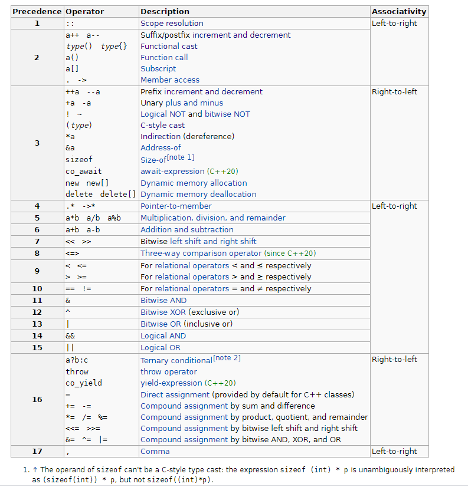

# Operator Precedence and associativity

记住一些常见的operator precedence和associativity是理解一些expression的前提。

## cppreference [C++ Operator Precedence](https://en.cppreference.com/w/cpp/language/operator_precedence)




**Operators** that have the same precedence are **bound** to their arguments in the direction of their **associativity**. For example, the expression `a = b = c` is parsed as `a = (b = c)`, and not as `(a = b) = c` because of right-to-left associativity of assignment, but `a + b - c` is parsed `(a + b) - c` and not `a + (b - c)` because of left-to-right associativity of addition and subtraction.

> NOTE: 同级按照优先级来进行绑定

### Unary operators

Associativity specification is redundant for unary operators and is only shown for completeness: 

1) **unary prefix operators** always associate right-to-left (`delete ++*p` is `delete(++(*p))`) 

2) **unary postfix operators** always associate left-to-right (`a[1][2]++` is `((a[1])[2])++`). 

Note that the associativity is meaningful for member access operators, even though they are grouped with unary postfix operators: `a.b++` is parsed `(a.b)++` and not `a.(b++)`.

> NOTE: 没有理解

## Precedence规律

下面总结的一些规律

### [Scope resolution](https://en.cppreference.com/w/cpp/language/identifiers#Qualified_identifiers) **Precedence** 最高

静态的

### 创建 temporary 的次之

创建temporary的: 


| operator          | 解释                                                         |                     |
| ----------------- | ------------------------------------------------------------ | ------------------- |
| `a++   a--`       | Suffix/postfix [increment and decrement](https://en.cppreference.com/w/cpp/language/operator_incdec) | 会创建一个temporary |
| `type()   type{}` | [Functional cast](https://en.cppreference.com/w/cpp/language/explicit_cast) | 会创建一个temporary |

### Member access的优先级再次之

member access:

| operator |                                                              |
| -------- | ------------------------------------------------------------ |
| `a[]`    | [Subscript](https://en.cppreference.com/w/cpp/language/operator_member_access#Built-in_subscript_operator) |
| `.   ->` | [Member access](https://en.cppreference.com/w/cpp/language/operator_member_access#Built-in_member_access_operators) |


### [Increment/decrement operators](Increment/decrement operators) 高于 [Indirection operator](https://en.cppreference.com/w/cpp/language/operator_member_access#Built-in_indirection_operator)

C++中将[Indirection operator](https://en.cppreference.com/w/cpp/language/operator_member_access#Built-in_indirection_operator)归入到了[Member access operators](https://en.cppreference.com/w/cpp/language/operator_member_access)中，需要注意的是: [Increment/decrement operators](Increment/decrement operators) 高于 [Indirection operator](https://en.cppreference.com/w/cpp/language/operator_member_access#Built-in_indirection_operator)，可以依照前面的"创建 temporary "来进行记忆，因为`a++   a--`创建temporary，创建temporary的precedence是第二的，所以 [Increment/decrement operators](Increment/decrement operators) 高于 [Indirection operator](https://en.cppreference.com/w/cpp/language/operator_member_access#Built-in_indirection_operator)。


### [Relational operators](https://en.cppreference.com/w/cpp/language/operator_comparison) 和 [Logical operator](https://en.cppreference.com/w/cpp/language/operator_logical) 的优先级

[Relational operators](https://en.cppreference.com/w/cpp/language/operator_comparison) 和 [Logical operator](https://en.cppreference.com/w/cpp/language/operator_logical) 相关:  [Relational operators](https://en.cppreference.com/w/cpp/language/operator_comparison) 的结果类型是bool类型，可以应用于logical operator，本节对它们的precedence进行说明: 

| precedence | operator |                                                              |
| ---------- | -------- | ------------------------------------------------------------ |
| 3          | `!`  `~` | [Logical NOT](https://en.cppreference.com/w/cpp/language/operator_logical) and [bitwise NOT](https://en.cppreference.com/w/cpp/language/operator_arithmetic#Bitwise_logic_operators) |


| precedence | operator   |                                                              |
| :--------: | ---------- | ------------------------------------------------------------ |
|     9      | `<`  `<=`  | For [relational operators](https://en.cppreference.com/w/cpp/language/operator_comparison) < and ≤ respectively |
|            | `>`  `>=`  | For [relational operators](https://en.cppreference.com/w/cpp/language/operator_comparison) > and ≥ respectively |
|     10     | `==`  `!=` | For [relational operators](https://en.cppreference.com/w/cpp/language/operator_comparison) = and ≠ respectively |
|     11     | `&`        | [Bitwise AND](https://en.cppreference.com/w/cpp/language/operator_arithmetic#Bitwise_logic_operators) |
|     12     | `^`        | [Bitwise XOR](https://en.cppreference.com/w/cpp/language/operator_arithmetic#Bitwise_logic_operators) (exclusive or) |
|     13     | `|`        | [Bitwise OR](https://en.cppreference.com/w/cpp/language/operator_arithmetic#Bitwise_logic_operators) (inclusive or) |
|     14     | `&&`       | [Logical AND](https://en.cppreference.com/w/cpp/language/operator_logical) |
|     15     | `||`       | [Logical OR](https://en.cppreference.com/w/cpp/language/operator_logical) |

这样设计的目的是: 在一定程度上它能够简化我们的expression，在不使用**括号**的情况下能够使用  [Logical operator](https://en.cppreference.com/w/cpp/language/operator_logical) 将多个 logical expression进行连接，比如下面的例子: 

```C++
1 < 2 && 3 < 4
```


### Assignment operator的优先级倒数第二低

| precedence |     operator     |                                                              |
| ---------- | :--------------: | ------------------------------------------------------------ |
| 16         |     `a?b:c`      | [Ternary conditional](https://en.cppreference.com/w/cpp/language/operator_other#Conditional_operator)[[note 2\]](https://en.cppreference.com/w/cpp/language/operator_precedence#cite_note-2) |
|            |     `throw`      | [throw operator](https://en.cppreference.com/w/cpp/language/throw) |
|            |    `co_yield`    | [yield-expression](https://en.cppreference.com/w/cpp/language/coroutines) (C++20) |
|            |       `=`        | [Direct assignment](https://en.cppreference.com/w/cpp/language/operator_assignment#Builtin_direct_assignment) (provided by default for C++ classes) |
|            |    `+=`  `-=`    | [Compound assignment](https://en.cppreference.com/w/cpp/language/operator_assignment#Builtin_compound_assignment) by sum and difference |
|            | `*=`  `/=`  `%=` | [Compound assignment](https://en.cppreference.com/w/cpp/language/operator_assignment#Builtin_compound_assignment) by product, quotient, and remainder |
|            |   `<<=`  `>>=`   | [Compound assignment](https://en.cppreference.com/w/cpp/language/operator_assignment#Builtin_compound_assignment) by bitwise left shift and right shift |
|            | `&=`  `^=`  `|=` | [Compound assignment](https://en.cppreference.com/w/cpp/language/operator_assignment#Builtin_compound_assignment) by bitwise AND, XOR, and OR |


### Precedence of arithmetic operator is higher than the conditional operator

这是cppreference [C++ Operator Precedence](https://en.cppreference.com/w/cpp/language/operator_precedence)中给出的:

> For example, [std::cout](http://en.cppreference.com/w/cpp/io/cout) << a ? b : c; parses as ([std::cout](http://en.cppreference.com/w/cpp/io/cout) << a) ? b : c; because the precedence of arithmetic left shift is higher than the conditional operator.

## Precedence and associativity

从cppreference [C++ Operator Precedence](https://en.cppreference.com/w/cpp/language/operator_precedence)给出的图中可以看出，具体相同precedence 的operator是具有相同associativity的。


## Operator precedence and operator overload

在cppreference [C++ Operator Precedence](https://en.cppreference.com/w/cpp/language/operator_precedence)中对此进行了说明: 

> Operator precedence is unaffected by [operator overloading](https://en.cppreference.com/w/cpp/language/operators).

## Example

### [std::cout](http://en.cppreference.com/w/cpp/io/cout) `<< a & b`

`(std::cout << a) & b`


### `*p++`

`*(p++)`

### sqlite CSV virtual table

https://sqlite.org/src/file/ext/misc/csv.c

取成员变量的地址: `&obj->member`，`->`的优先级高于`&`

```C
static int csvtabOpen(sqlite3_vtab *p, sqlite3_vtab_cursor **ppCursor){
  CsvTable *pTab = (CsvTable*)p;
  CsvCursor *pCur;
  size_t nByte;
  nByte = sizeof(*pCur) + (sizeof(char*)+sizeof(int))*pTab->nCol;
  pCur = sqlite3_malloc64( nByte );
  if( pCur==0 ) return SQLITE_NOMEM;
  memset(pCur, 0, nByte);
  pCur->azVal = (char**)&pCur[1];
  pCur->aLen = (int*)&pCur->azVal[pTab->nCol];
  *ppCursor = &pCur->base;
  if( csv_reader_open(&pCur->rdr, pTab->zFilename, pTab->zData) ){
    csv_xfer_error(pTab, &pCur->rdr);
    return SQLITE_ERROR;
  }
  return SQLITE_OK;
}
```

