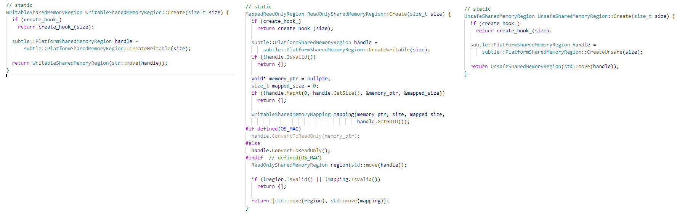

# shared memory region


## interface

|                              | header file                                                  | mode              |
| ---------------------------- | ------------------------------------------------------------ | ----------------- |
| `ReadOnlySharedMemoryRegion` | [chromium](https://github.com/chromium/chromium)/[base](https://github.com/chromium/chromium/tree/master/base)/[memory](https://github.com/chromium/chromium/tree/master/base/memory)/**[writable_shared_memory_region.h](https://github.com/chromium/chromium/blob/master/base/memory/writable_shared_memory_region.h)** | `Mode::kReadOnly` |
| `WritableSharedMemoryRegion` | [chromium](https://github.com/chromium/chromium)/[base](https://github.com/chromium/chromium/tree/master/base)/[memory](https://github.com/chromium/chromium/tree/master/base/memory)/**[read_only_shared_memory_region.h](https://github.com/chromium/chromium/blob/master/base/memory/read_only_shared_memory_region.h)** | `Mode::kWritable` |
| `UnsafeSharedMemoryRegion`   | [chromium](https://github.com/chromium/chromium)/[base](https://github.com/chromium/chromium/tree/master/base)/[memory](https://github.com/chromium/chromium/tree/master/base/memory)/**[unsafe_shared_memory_region.h](https://github.com/chromium/chromium/blob/master/base/memory/unsafe_shared_memory_region.h)** | `Mode::kUnsafe`   |

一、有如上三种类型的shared memory region，它们三种都使用的是 [chromium](https://github.com/chromium/chromium)/[base](https://github.com/chromium/chromium/tree/master/base)/[memory](https://github.com/chromium/chromium/tree/master/base/memory)/**[platform_shared_memory_region.h](https://github.com/chromium/chromium/blob/master/base/memory/platform_shared_memory_region.h)** 中提供的implementation。

```C++
 private:
  friend class SharedMemoryHooks;

  explicit UnsafeSharedMemoryRegion|WritableSharedMemoryRegion|ReadOnlySharedMemoryRegion(subtle::PlatformSharedMemoryRegion handle);

  static void set_create_hook(CreateFunction* hook) { create_hook_ = hook; }

  static CreateFunction* create_hook_;

  subtle::PlatformSharedMemoryRegion handle_;
```

需要注意，`handle_`的类型是 `subtle::PlatformSharedMemoryRegion`。

二、Scoped move-only handle

三、Default constructor initializes an invalid instance

四、`DISALLOW_COPY_AND_ASSIGN`

### `static create`




### `WritableSharedMemoryRegion`

[chromium](https://github.com/chromium/chromium)/[base](https://github.com/chromium/chromium/tree/master/base)/[memory](https://github.com/chromium/chromium/tree/master/base/memory)/**[writable_shared_memory_region.h](https://github.com/chromium/chromium/blob/master/base/memory/writable_shared_memory_region.h)** 

>  These mappings remain valid even after the region handle is moved or destroyed.

这段话要如何理解？


### `ReadOnlySharedMemoryRegion`

[chromium](https://github.com/chromium/chromium)/[base](https://github.com/chromium/chromium/tree/master/base)/[memory](https://github.com/chromium/chromium/tree/master/base/memory)/**[read_only_shared_memory_region.h](https://github.com/chromium/chromium/blob/master/base/memory/read_only_shared_memory_region.h)**


### [chromium](https://github.com/chromium/chromium)/[base](https://github.com/chromium/chromium/tree/master/base)/[memory](https://github.com/chromium/chromium/tree/master/base/memory)/**[shared_memory_hooks.h](https://github.com/chromium/chromium/blob/master/base/memory/shared_memory_hooks.h)**


## Implementation 

### `platform_shared_memory_region`

[chromium](https://github.com/chromium/chromium)/[base](https://github.com/chromium/chromium/tree/master/base)/[memory](https://github.com/chromium/chromium/tree/master/base/memory)/**[platform_shared_memory_region.h](https://github.com/chromium/chromium/blob/master/base/memory/platform_shared_memory_region.h)**


#### Implementation class

这是一个新的概念

> Implementation class for shared memory regions.


> IMPORTANT NOTE: Users should never use this directly, but `ReadOnlySharedMemoryRegion`, `WritableSharedMemoryRegion` or `UnsafeSharedMemoryRegion` since this is an implementation class.

#### Resource token、resource ID

> Holds a 128-bit unique identifier used to uniquely identify the same kernel region resource across processes (used for memory tracking).

它的实现是采用的:

```C++
UnguessableToken guid_;
```


### Android

[chromium](https://github.com/chromium/chromium)/[base](https://github.com/chromium/chromium/tree/master/base)/[memory](https://github.com/chromium/chromium/tree/master/base/memory)/**[platform_shared_memory_region_android.cc](https://github.com/chromium/chromium/blob/master/base/memory/platform_shared_memory_region_android.cc)**


### POSIX: Linux、iOS

[chromium](https://github.com/chromium/chromium)/[base](https://github.com/chromium/chromium/tree/master/base)/[memory](https://github.com/chromium/chromium/tree/master/base/memory)/**[platform_shared_memory_region_posix.cc](https://github.com/chromium/chromium/blob/master/base/memory/platform_shared_memory_region_posix.cc)**


### Windows

[chromium](https://github.com/chromium/chromium)/[base](https://github.com/chromium/chromium/tree/master/base)/[memory](https://github.com/chromium/chromium/tree/master/base/memory)/**[platform_shared_memory_region_win.cc](https://github.com/chromium/chromium/blob/master/base/memory/platform_shared_memory_region_win.cc)**


### Mac

[chromium](https://github.com/chromium/chromium)/[base](https://github.com/chromium/chromium/tree/master/base)/[memory](https://github.com/chromium/chromium/tree/master/base/memory)/**[platform_shared_memory_region_mac.cc](https://github.com/chromium/chromium/blob/master/base/memory/platform_shared_memory_region_mac.cc)**


## Abstract resource handle、plateform resource handle

下面是在 [chromium](https://github.com/chromium/chromium)/[base](https://github.com/chromium/chromium/tree/master/base)/[memory](https://github.com/chromium/chromium/tree/master/base/memory)/**[platform_shared_memory_region.h](https://github.com/chromium/chromium/blob/master/base/memory/platform_shared_memory_region.h)** 中定义的"plateform resource handle": 


```C++
// Platform-specific shared memory type used by this class.
#if defined(OS_MAC)
  using PlatformHandle = mach_port_t;
  using ScopedPlatformHandle = mac::ScopedMachSendRight;
#elif defined(OS_FUCHSIA)
  using PlatformHandle = zx::unowned_vmo;
  using ScopedPlatformHandle = zx::vmo;
#elif defined(OS_WIN)
  using PlatformHandle = HANDLE;
  using ScopedPlatformHandle = win::ScopedHandle;
#elif defined(OS_ANDROID)
  using PlatformHandle = int;
  using ScopedPlatformHandle = ScopedFD;
#else
  using PlatformHandle = FDPair;
  using ScopedPlatformHandle = ScopedFDPair;
#endif
```


那 abstract resource handle 是什么呢？从[chromium](https://github.com/chromium/chromium)/[base](https://github.com/chromium/chromium/tree/master/base)/[memory](https://github.com/chromium/chromium/tree/master/base/memory)/**[writable_shared_memory_region.h](https://github.com/chromium/chromium/blob/master/base/memory/writable_shared_memory_region.h)** 、[chromium](https://github.com/chromium/chromium)/[base](https://github.com/chromium/chromium/tree/master/base)/[memory](https://github.com/chromium/chromium/tree/master/base/memory)/**[read_only_shared_memory_region.h](https://github.com/chromium/chromium/blob/master/base/memory/read_only_shared_memory_region.h)**、来看，它们都有如下成员:

```C++
subtle::PlatformSharedMemoryRegion handle_;
```

也就是说，它们都将 `subtle::PlatformSharedMemoryRegion` 来作为 "abstract resource handle"。


