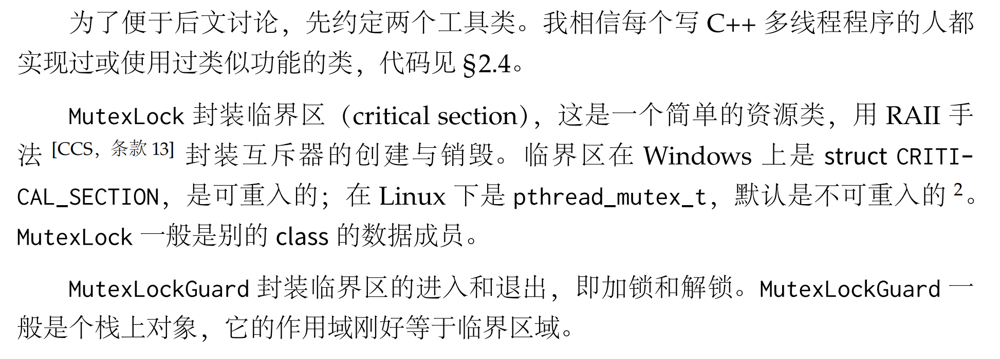
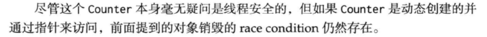
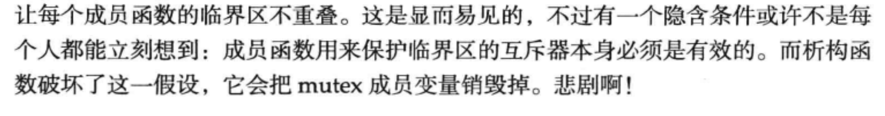
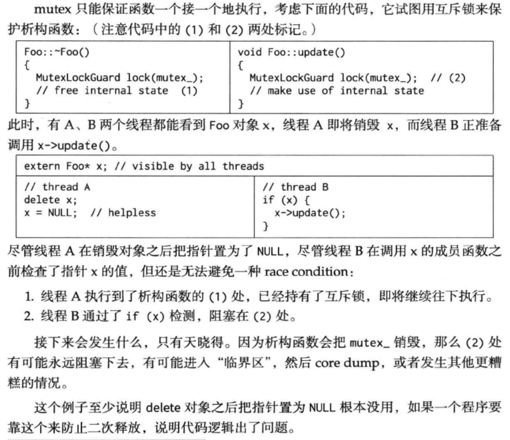

# 第一章: 线程安全的对象生命周期管理

## 1.1 当析构函数遇到多线程

> NOTE:
>
> 构造函数执行的时候还没有对象，析构函数执行的时候对象已经存在，它已经暴露给了多线程，因此相对而言，析构函数面临更多的多线程安全问题: race condition。

### 1.1.2 `MutexLock` 与`MutexLockGuard`

> NOTE: 
>
> 一、原文的这一段描述的含义是不清晰的，下面是对它的一些注解:
>
> 1、`MutexLock` 其实更加准确的说是mutex，它是使用RAII的方式来进行封装的: 在constructor中new mutex，在destructor中delete mutex，在Windows中，它使用的system implementation是 `struct CRITICAL_SECTION`；在Linux上，它使用的system implementation是`pthread_mutex_t`。
>
> 2、对于mutex，它的用法是lock、unlock，`MutexLockGuard` 其实也是使用RAII的方式封装这两个操作。
>
> 二、上面提及了"可重入"、"不可重入"，这在chapter2.1中进行了描述，它的含义其实是recursive

### 1.1.3 一个线程安全的 **Counter** 示例

> NOTE: 这一段中给出的例子是非常简单的

## 1.2 对象的创建很简单

## 1.3 销毁太难

> NOTE: 上面总结地非常好

### 1.3.1 mutex不是办法

> NOTE: 
>
> 这一段的例子非常好，它所描述的其实就是前面的"隐含条件"。这个例子其实就是使用数据成员mutex来保护**析构函数**，这个例子说明了1.3.2标题的含义: "做为数据成员的mutex不能保护析构"。

> NOTE: 最后一段的总结

### 1.3.2 做为数据成员的mutex不能保护析构

> NOTE: 
>
> 一、第一段话是结论: "做为数据成员的 `MutexLock` 只能用于同步本class的其他数据成员的读和写，它不能安全地保护析构函数"
>
> 二、思考: "保护析构"是什么含义？