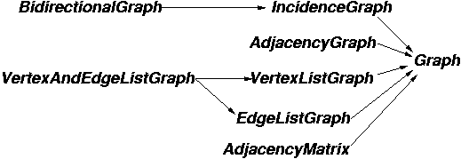

# [Graph Concepts](https://www.boost.org/doc/libs/1_73_0/libs/graph/doc/graph_concepts.html)

> NOTE: 原文的前两段是必读的。其实这两段所描述的核心内容是：
>
> 什么是interface？“define how a graph can be examined and manipulated in a data-structure neutral fashion”。
>
> 如何来定义interface？“The reason for this is that the purpose of a concept is to summarize the requirements for *particular* algorithms. ”

## Graph Structure Concepts Overview

**Figure 1:** The graph concepts and refinement relationships.

| concept                                   | explanation                                                  |
| ----------------------------------------- | ------------------------------------------------------------ |
| Graph                                     | The Graph concept contains a few requirements that are common to all the graph concepts. |
| IncidenceGraph refines Graph              | The IncidenceGraph concept provides an interface for efficient access to the out-edges of each vertex in the graph. |
| BidirectionalGraph refines IncidenceGraph | The BidirectionalGraph concept refines [IncidenceGraph](./IncidenceGraph.html) and adds the requirement for efficient access to the in-edges of each vertex. |
| AdjacencyGraph refines Graph              | The AdjacencyGraph concept provides and interface for efficient access of the adjacent vertices to a vertex in a graph. |
| VertexListGraph refines Graph             | The VertexListGraph concept refines the Graph concept, and adds the requirement for efficient traversal of all the vertices in the graph. |
| EdgeListGraph refines Graph               | The EdgeListGraph concept refines the [Graph](./Graph.html) concept, and adds the requirement for efficient access to all the edges in the graph. |
| AdjacencyMatrix refines Graph             | The AdjacencyMatrix concept refines [Graph](./Graph.html) concept and adds the requirement for efficient access to any edge in the graph given the source and target vertices. |
| MutableGraph refines Graph                | A MutableGraph can be changed via the addition or removal of edges and vertices. |
| PropertyGraph refines Graph               | A PropertyGraph is a graph that has some property associated with each of the vertices or edges in the graph. |

> NOTE: 基于concept的设计，concept是behavior-based的，它是duck-type，它比较类似于interface。