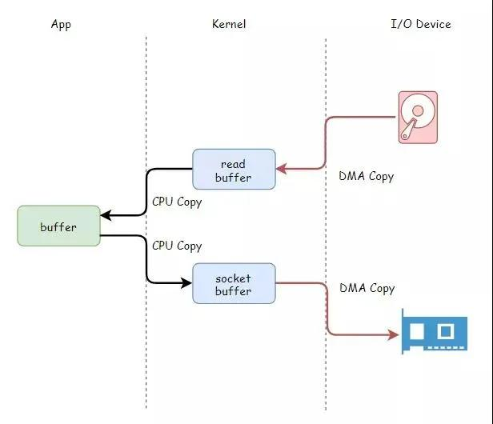
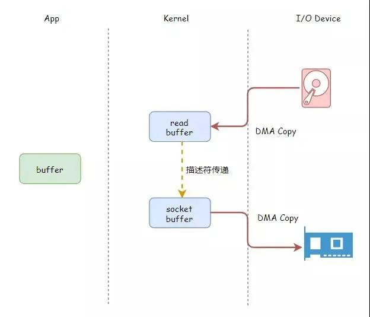
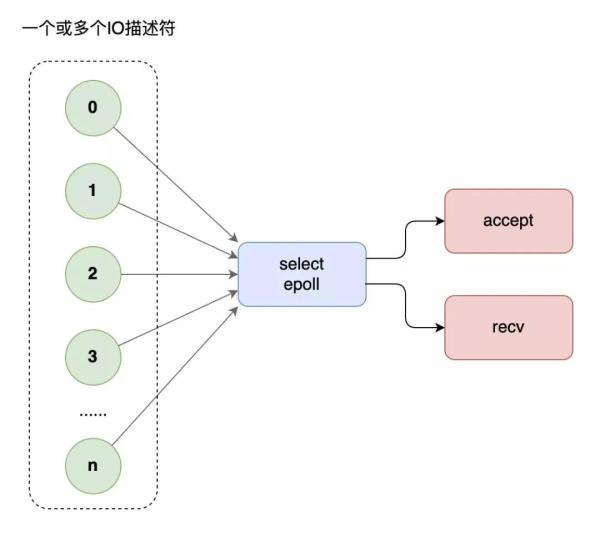
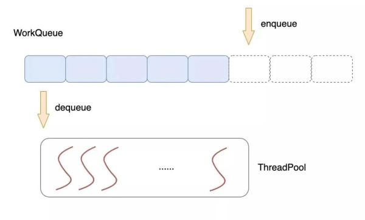

# developer.51cto [高性能开发的“十大武器”，爱了爱了！](https://developer.51cto.com/art/202011/630654.htm)

这篇文章，我们循序渐进，从内存、磁盘 I/O、网络 I/O、CPU、缓存、架构、算法等多层次递进，串联起高性能开发十大必须掌握的核心技术：

- \- I/O优化：零拷贝技术
- \- I/O优化：多路复用技术
- \- 线程池技术
- \- 无锁编程技术
- \- 进程间通信技术
- \- RPC&序列化技术
- \- 数据库索引技术
- \- 缓存技术&布隆过滤器
- \- 全文搜索技术
- \- 负载均衡技术


准备好了吗，坐稳了，发车!首先，我们从最简单的模型开始。

老板告诉你，开发一个静态 Web 服务器，把磁盘文件(网页、图片)通过网络发出去，怎么做?

- 你花了两天时间，撸了一个 1.0 版本：
- 主线程进入一个循环，等待连接。
- 来一个连接就启动一个工作线程来处理。

工作线程中，等待对方请求，然后从磁盘读文件、往套接口发送数据，完事儿。

上线一天，老板发现太慢了，大一点的图片加载都有卡顿感。让你优化，这个时候，你需要：**零拷贝技术**。

## I/O 优化：零拷贝技术

上面的工作线程，从磁盘读文件、再通过网络发送数据，数据从磁盘到网络，兜兜转转需要拷贝四次，其中 CPU 亲自搬运都需要两次。




**零拷贝技术**，解放 CPU，文件数据直接从内核发送出去，无需再拷贝到**应用程序缓冲区**，白白浪费资源。



Linux API：

```C
ssize_t sendfile( 
  int out_fd,  
  int in_fd,  
  off_t *offset,  
  size_t count 
  ); 
```

函数名字已经把函数的功能解释的很明显了：发送文件。指定要发送的**文件描述符**和**网络套接字描述符**，一个函数搞定!

用上了零拷贝技术后开发了 2.0 版本，图片加载速度明显有了提升。不过老板发现同时访问的人变多了以后，又变慢了，又让你继续优化。这个时候，你需要：多路复用技术。

> NOTE: 关于`sendfile`，参见工程Linux-OS的`Network\Programming\Send-file`章节

用上了零拷贝技术后开发了 2.0 版本，图片加载速度明显有了提升。不过老板发现同时访问的人变多了以后，又变慢了，又让你继续优化。这个时候，你需要：多路复用技术。

## I/O 优化：多路复用技术

前面的版本中，每个线程都要阻塞在 `recv` 等待对方的请求，这来访问的人多了，线程开的就多了，大量线程都在阻塞，系统运转速度也随之下降。

这个时候，你需要多路复用技术，使用`select`模型，将所有等待(`accept`、`recv`)都放在主线程里，工作线程不需要再等待。



过了一段时间之后，网站访问的人越来越多了，就连 `select` 也开始有点应接不暇，老板继续让你优化性能。这个时候，你需要升级多路复用模型为 `epoll`。

select 有三弊，epoll 有三优：

- `select` 底层采用数组来管理套接字描述符，同时管理的数量有上限，一般不超过几千个，`epoll` 使用**树**和**链表**来管理，同时管理数量可以很大。
- `select` 不会告诉你到底哪个套接字来了消息，你需要一个个去询问。epoll 直接告诉你谁来了消息，不用轮询。
- `select` 进行系统调用时还需要把套接字列表在用户空间和内核空间来回拷贝，循环中调用 select 时简直浪费。`epoll` 统一在内核管理套接字描述符，无需来回拷贝。

用上了 `epoll` 多路复用技术，开发了 3.0 版本，你的网站能同时处理很多用户请求了。

但是贪心的老板还不满足，不舍得升级硬件服务器，却让你进一步提高服务器的吞吐量。

你研究后发现，之前的方案中，工作线程总是用到才创建，用完就关闭，大量请求来的时候，线程不断创建、关闭、创建、关闭，开销挺大的。这个时候，你需要：线程池技术。

## 线程池技术

我们可以在程序一开始启动后就批量启动一波**工作线程**，而不是在有请求来的时候才去创建，使用一个公共的**任务队列**，请求来临时，向队列中投递任务，各个**工作线程**统一从队列中不断取出任务来处理，这就是**线程池技术**。



**多线程技术**的使用一定程度提升了服务器的并发能力，但同时，多个线程之间为了**数据同步**，常常需要使用**互斥体**、**信号**、**条件变量**等手段来同步多个线程。

这些重量级的同步手段往往会导致线程在**用户态**/**内核态**多次切换，**系统调用**，**线程切换**都是不小的开销。

在线程池技术中，提到了一个公共的任务队列，各个工作线程需要从中提取任务进行处理，这里就涉及到多个工作线程对这个公共队列的同步操作。

有没有一些轻量级的方案来实现多线程安全的访问数据呢?这个时候，你需要：**无锁编程技术**。

## 无锁编程技术

多线程并发编程中，遇到公共数据时就需要进行线程同步。而这里的同步又可以分为阻塞型同步和非阻塞型同步。

阻塞型同步好理解，我们常用的互斥体、信号、条件变量等这些操作系统提供的机制都属于阻塞型同步，其本质都是要加“锁”。

与之对应的非阻塞型同步就是在**无锁**的情况下实现同步，目前有三类技术方案：

- **Wait-free**
- **Lock-free**
- **Obstruction-free**

三类技术方案都是通过一定的算法和技术手段来实现不用阻塞等待而实现同步，这其中又以 Lock-free 最为应用广泛。

Lock-free 能够广泛应用得益于目前主流的 CPU 都提供了原子级别的 read-modify-write 原语，这就是著名的 CAS(Compare-And-Swap)操作。在 Intel x86 系列处理器上，就是 cmpxchg 系列指令。

> NOTE: 关于lock free，参见工程parallel-computing的`Concurrent-computing\Concurrency-control\Concurrency-control\Lock-free`章节