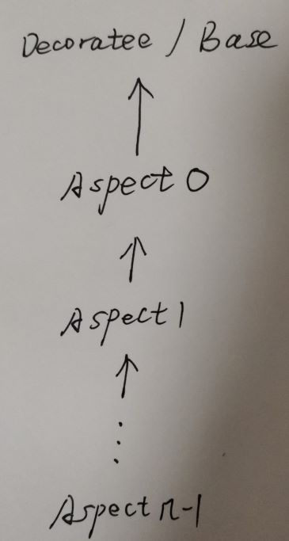

# 使用C++11 template alias实现CRTP + AOP

source code:

github [hugoArregui](https://github.com/hugoArregui)/[CPP_AOP-CRTP](https://github.com/hugoArregui/CPP_AOP-CRTP)/[cpp11_template_alias](https://github.com/hugoArregui/CPP_AOP-CRTP/tree/master/cpp11_template_alias)/[aop.h](https://github.com/hugoArregui/CPP_AOP-CRTP/blob/master/cpp11_template_alias/aop.h)

github [hugoArregui](https://github.com/hugoArregui)/[CPP_AOP-CRTP](https://github.com/hugoArregui/CPP_AOP-CRTP)/[cpp11_template_alias](https://github.com/hugoArregui/CPP_AOP-CRTP/tree/master/cpp11_template_alias)/[test.cpp](https://github.com/hugoArregui/CPP_AOP-CRTP/blob/master/cpp11_template_alias/test.cpp)


```C++
#ifndef AOP_H
#define AOP_H

namespace aop
{

template <class A>
class NullAspect
{};

template <template <template <class> class> class Base>
struct Decorate
{
private:
    struct None {};

    template <template <class> class ... Aspects>
    struct Apply;

    template <template <class> class T>
    struct Apply<T>
    {
        template <class E>
        using Type = T<E>;
    };

    template<template <class> class A1, template <class> class ... Aspects>
    struct Apply<A1, Aspects...>
    {
        template <class T>
        using Type = A1<typename Apply<Aspects...>::template Type<T>>;
    };

public:
    template<template <class> class ... Aspects>
    struct with
    {
        template <class T>
        using AspectsCombination = typename Apply<Aspects...>::template Type<T>;

        typedef AspectsCombination<Base<AspectsCombination>> Type;
    };
};
}
#endif
```

1、`struct Apply`做的事情是比较简单的，即将所有的aspect串联起来，显然就形成了aspects list，这对应的是source code中的`AspectsCombination`

对于aspect list，即`AspectsCombination`，其实它只需要一个template argument: decoratee，aspect list中的第一个aspect继承自它，aspect list中的其他aspect都继承自它的前一个aspect，如下图所示:




2、上述是recursive class template，它是基于specialization的

3、下面就是使用CRTP的:

```C++
template <class T>
using AspectsCombination = typename Apply<Aspects...>::template Type<T>;

typedef AspectsCombination<Base<AspectsCombination>> Type;
```

4、aspect list是通过inheritance chain而形成的