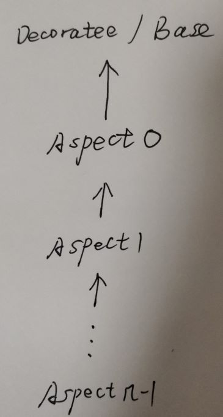

# accu [CURIOUSLY RECURSIVE TEMPLATE PROBLEMS WITH ASPECT ORIENTED PROGRAMMING](https://accu.org/journals/overload/20/109/arregui_1916/)

> NOTE: 
>
> 一、初读这篇文章是难以理解的，并且阅读它的source code也是不容易理解的，理解本文的前提是:
>
> 1、对decorator pattern有一定了解
>
> 2、对AOP有一定了解，文章中会使用aspect list这样的概念。
>
> 原文给出的source code链接" The complete code of the library and examples both for C++11 and C++98 can be accessed in [http://cpp-aop.googlecode.com](http://cpp-aop.googlecode.com/)
>
> 试了一下，这个链接无法访问，下面是github上收录了这个的 [hugoArregui](https://github.com/hugoArregui)/**[CPP_AOP-CRTP](https://github.com/hugoArregui/CPP_AOP-CRTP)**
>
> 二、典型的mixin from below，可以用于实现strong type
>
> 


## AOP

Aspect Oriented Programming (AOP) is a programming paradigm that makes possible to clearly express programs separated into ‘aspects’, including appropriate isolation, composition and reuse of the aspect code [ [Kiczales97 ](https://accu.org/journals/overload/20/109/arregui_1916/#[Kiczales97])]. AOP defines *weaving* as the process of composing the aspects into a single entity.

> NOTE: 
>
> 一、它是典型的composition: chain
>
> 二、通过后面的描述可以知道，它是通过inheritance来进行weave的、通过inheritance chain来构成**aspect list**，**aspect list**是非常重要的一个概念，图示如下:
>
> 
>
> 1、上述decoratee表示的是被装饰的。
>
> 
>
> 三、它的这种做法是比较类似于decorator pattern的，添加aspect的过程相当于decorate的过程
>
> 四、通过inheritance chain形成aspect list

## CRTP

Independently, there are situations in which a base class needs to know its subclass, e.g. for type-safe downcasts. The Curiously Recurring Template Pattern (CRTP) is a C++ idiom in which a class `X` derives from a class template instantiation using `X` itself as template argument [ [Abrahams04 ](https://accu.org/journals/overload/20/109/arregui_1916/#[Abrahams04])]. This way, the base class can know the derived type.

> NOTE: 
>
> 1、CRTP中，base class知道derived class，同时derived class也知道base class

---

Both AOP and the CRTP are widely adopted C++ programming techniques. In particular, there exists an AOP easy implementation using templates [ [Spinczyk05 ](https://accu.org/journals/overload/20/109/arregui_1916/#[Spinczyk05])]. However, a C++ grammar incompatibility(不相容) arises when combining AOP and CRTP. While there exists a C++ dialect called AspectC++ [ [Spinczyk05 ](https://accu.org/journals/overload/20/109/arregui_1916/#[Spinczyk05])], we don’t evaluate in this work its ability to combine AOP and CRTP since it requires its own compiler extensions and so its not standard C++. Here we look at a simple solution implemented in standard C++ that addresses the issue without any overhead penalty.


## Problems combining AOP + CRTP

There are some situations where combining the benefits of AOP and CRTP are desirable; however, as we will show below, some problems arise when applying together the individual standard procedures of each technique.

The code in Listing 1 shows an attempt of adding functionality, through aspects, to a base class named `Number `.

> NOTE: 
>
> 1、这段话让我想到了decorator pattern，并且下面的code的comment中使用了"decorating"


```C++
//basic class
class Number
{
  protected:
  UnderlyingType n;
};

//aspects
template <class NextAspect>
struct ArithmeticAspect: public NextAspect
{
  FULLTYPE operator+
    (const FULLTYPE& other) const;
    // What type is FULLTYPE?
  FULLTYPE operator- 
    (const FULLTYPE& other) const;
  FULLTYPE& operator+= 
    (const FULLTYPE& other);
  FULLTYPE& operator-= 
    (const FULLTYPE& other);
};

template <class NextAspect>
struct LogicalAspect : public NextAspect
{
  bool operator! () const;
  bool operator&& (const FULLTYPE& other) const;
  bool operator|| (const FULLTYPE& other) const;
};

//decorating Number with aspectual code
typedef LogicalAspect
  <ArithmeticAspect<Number > > MyIntegralType;
```

> NOTE:
>
> 1、上述是典型的使用"Parameterized-Base-Class"的写法
>
> 2、每个aspect从他的base class中取出`FullType` ，`FullType`其实就是concrete type
>
> 3、`FullType` 正是问题的症结所在，如何来描述`FullType` 呢？本文后面就是对此进行说明。

### 问题症结所在

We can observe that the return type of `ArithmeticAspect`’s operator `+ `and `- `needs to know the ‘complete type’ ( `FULLTYPE `) when trying to extend the base class functionality through operator overloading. We will address this issue in the following sections.


## A minimal solution

The basic principle of this solution does not differ in essence from the traditional solution mentioned before.

### Problem

`Number ` takes the place of the last aspect in the **aspects list**. However, `Number `itself needs to know (as a template template argument) the aspects list, to which it itself belongs, leading to a ‘chicken or egg’ grammatical dilemma.

> NOTE: 
>
> 1、"dilemma"困境
>
> 2、上面这段话再次描述了问题的症结: `Number`需要将"aspects list"作为它的template argument，从而可以得到它的concrete definition，而从下面的picture可以看出，aspect list的第一个aspect需要将`Number`作为它的template argument，因此两者就形成了相互的dependency，这就是前面所说的‘chicken or egg’ 。通过后面的描述可知: CRTP是可以解决这种问题的。
>
> 3、对于aspect list，其实它只需要一个template argument: decoratee，aspect list中的第一个aspect继承自它，aspect list中的其他aspect都继承自它的前一个aspect。
>
> 
>
> 

For example, if `Number `knew the complete type, it could use it as a return type for its operators as shown in Listing 2.

```C++
template <template <class> class Aspects>
class Number
{
  typedef Aspects<Number<Aspects>> FullType;
...
};
ArithmeticAspect<Number<ArithmeticAspect>>
```

> NOTE: 
>
> 1、`Number`是一个class template，它有一个template template parameter `Aspects`，也就是`Aspects`有一个template parameter，它需要一个template argument。在`Number`的class body中可以看出，它将`Number<Aspects>`作为了`Aspects`的template argument。这种写法是和我平时所运用的CRTP不同的，我平时所运用的CRTP是基于inheritance的，而上述写发放显然不是基于inheritance的，这种写法比我平时所运用的CRTP还要复杂，我之前用的CRTP最最复杂的是: `Derived-class-template-CRTP`，上面这种写法和 `Derived-class-template-CRTP`有些类似: 底层是一个class template。

#### Weave multiple aspect

> NOTE: 
>
> 1、当需要weave multiple aspect，此时需要将aspect list作为`Number`的template argument，那这如何实现呢？其实这就是问题所在，这对应下面的`  LogicalAspect<ArithmeticAspect<Number<??>>>` 中的 `??`。
>
> 后面的两种solution就是为了解决这个问题，显然，它 的实现是依赖于template alias的。
>
> 

This shows the weaving of a single aspect with CRTP, which works perfectly:

```C++
  LogicalAspect<ArithmeticAspect<Number<??>>>
```

On the other hand, this exposes the problem when trying to weave one additional aspect, since it requires a template template argument, which the aspects lists can’t grammatically fulfill as coded above.

We present two solutions: the first being the simplest using C++11’s template alias [ [Reis ](https://accu.org/journals/overload/20/109/arregui_1916/#[Reis])], and the second using variadic templates (templates that take a variable number of arguments, recently introduced in C++11 [ [Gregor ](https://accu.org/journals/overload/20/109/arregui_1916/#[Gregor])]) as the only C++11’s feature, which in turn, can also be easily implemented in C++98 as well. Both use a common language idiom introduced next, which aims to be used as a library providing a friendly syntax and reduced reusable code.

### The proposed language idiom

> NOTE: 
>
> 总的来说
>
> 1、C++ 11 template alias
>
> 2、Without template alias: type generator

A possible solution would be to apply some handcrafted per-case base template aliases, as shown below:

```C++
  //with template alias:
  template <class T>
  using LogicalArithmeticAspect =
     LogicalAspect<ArithmeticAspect<T>>;

  //without template alias:
  template <class T>
  struct LogicalArithmeticAspect
  {
    typedef 
       LogicalAspect<ArithmeticAspect<T>> Type;
  };

and with minor changes in the Number
 base class’s code, we could write the following declaration:
  LogicalArithmeticAspect
  <
    Number<LogicalArithmeticAspect>
  >
```

Although this does the trick it tends to be impractical, and also would increment linearly the number of related lines of code in terms of the amount of combinations to be used, which would cause a copy-paste code bloat.

> NOTE: 
>
> 1、combination explode

### Encapsulate the method into a library

Therefore, in order to provide a user-oriented and easy to use library, we'll use C++11’s new variadic-templates so we can cleanly express our intention: to ‘decorate’ the base class with a list of aspects. An example of what we intend to achieve is shown below:

```C++
  Decorate<Number>::with<ArithmeticAspect,
                         LogicalAspect>
```


The skeleton of the `Decorate `class is shown in Listing 3, the details of which will vary in the solutions below.

```C++
template
  <template <template <class> class> class Base>
class Decorate
{
  public:
    template<template <class> class ... Aspects>
    struct with
    {
      //...
    };

    //...

  private:
    struct Apply 
    { … 
    };
};
	
```

In both solutions, the `with `nested class and the `Apply `internal helper will have different implementations.


## Solution 1: Using C++11’s template alias

In this solution, the `Decorate::with `implementation is as shown in Listing 4, and the internal helper `Apply `structure also uses templates aliases (see Listing 5).

```C++
template<template <class> class ... Aspects>
struct with
{
  template <class T>
  using AspectsCombination = 
     typename Apply<Aspects...>::template Type<T>;
  typedef
    AspectsCombination
      <Base<AspectsCombination>> Type;
};
```


```C++
template<template <class> class A1,
         template <class> class ... Aspects>
struct Apply<A1, Aspects...>
{
  template <class T>
  using Type = A1
    <typename Apply
       <Aspects...>::template Type<T>>;
};
```

## Solution 2: Not using C++11’s template alias

> NOTE: 
>
> 1、它显然使用type generator idiom

### Combining aspects

### Applying the list of Aspects to the Number class

## Using the library

The library that implements this idiom provides two tools: the means to obtain the `FullType `, and the means to build it.

Listing 10 shows a way of obtaining the `FullType `with an `Aspect `.

```C++
//basic class
template 
   <template <class> class Aspects>
   class Number
{
  typedef Aspects<Number<Aspects>> FullType;
  //...
};

// aspect example
template <class NextAspect>
struct ArithmeticAspect: public NextAspect
{
  typedef typename NextAspect::FullType FullType;
  FullType
     operator+ (const FullType& other) const;
  // ...
};
```

Let’s see a final example, using two of the aspects mentioned before:

```c++
  typedef Decorate<Number>::with<ArithmeticAspect,
            LogicalAspect>::Type
			ArithmeticLogicalNumber;
```

Please note that both solutions presented before expose the same interface so this snippet is equally applicable to them.


