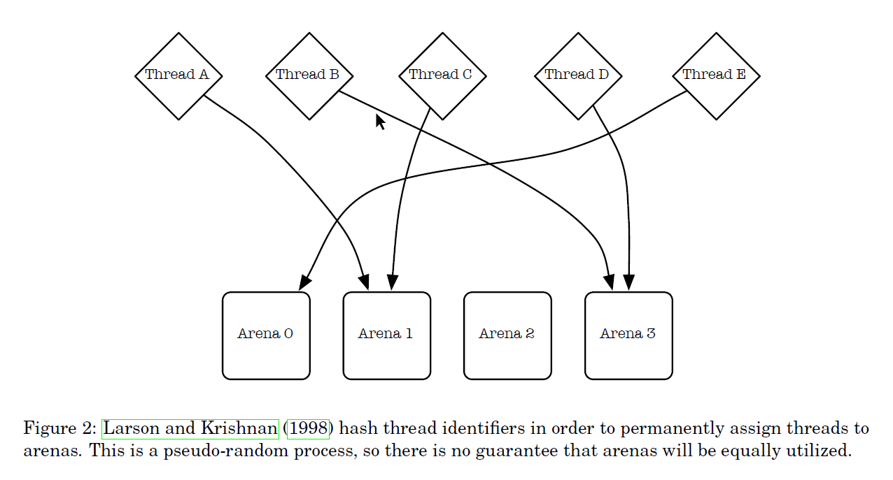

# freebsd [A Scalable Concurrent malloc(3) Implementation for FreeBSD](https://people.freebsd.org/~jasone/jemalloc/bsdcan2006/jemalloc.pdf)

## Introduction

> NOTE: 
>
> 1、总的来说，就是在各种影响因素中，进行tradeoff

### Fragmentation

Fragmentation can be thought of in terms of internal fragmentation and external fragmentation. Internal fragmentation is a measure of wasted space that is associated with individual allocations, due to unusable leading or trailing space(其实就是padding). External fragmentation is a measure of space that is physically backed by the virtual memory system, yet is not being directly used by the application. 

> NOTE: 
>
> 1、internal fragmentation是由于padding

### False sharing 

If two threads are simultaneously running on separate processors and manipulating separate objects that are in the same cache line, then the processors must arbitrate ownership of the cache line (Figure 1). This false cache line sharing can cause serious performance degradation. 

> TODO: 需要截图过来，原图非常好

Figure 1: Two allocations that are used by separate threads share the same line in the physical memory cache (false cache sharing). If the threads concurrently modify the two allocations, then the processors must fight over ownership of the cache line.

#### jemalloc的策略

jemalloc instead relies on multiple allocation arenas to reduce the problem, and leaves it up to the application writer to pad allocations in order to avoid false cache line sharing in performance-critical code, or in code where one thread allocates objects and hands them off to multiple other threads.

> NOTE: 
>
> 1、jemalloc的arena是per-core的，并且每个thread会被安排到一个arena，这就是避免了false sharing的可能

### Reduce lock contention for multi-threaded applications 

> NOTE: 
>
> 1、如何降低lock contention ，这非常重要
>
> 2、从下面的描述来看，Larson and Krishnan (1998) 的思想是: "divide to reduce lock granularity"，即"They tried pushing locks down in their allocator, so that rather than using a single allocator lock, each free list had its own lock"，显然，这降低了lock granularity。
>
> 3、jemalloc 借鉴了Larson and Krishnan (1998) 的"multiple arenas"策略，但是"uses a more reliable mechanism than hashing for assignment of threads to arenas"，通过后文可知，是"round-robin"
>
> 在下面的图中，解释了"hashing of the thread identifiers"的劣势，简单而言: 伪随机过程，并不能够保证均等，因此无法保证load balance（此处使用load balance是不准确的）

One of the main goals for this allocator was to reduce lock contention for multi-threaded applications running on multi-processor systems. Larson and Krishnan (1998) did an excellent job of presenting and testing strategies. They tried pushing locks down in their allocator, so that rather than using a single allocator lock, each free list had its own lock. This helped some, but did not scale adequately, despite minimal lock contention. They attributed this to “cache sloshing” – the quick migration of cached data among processors during the manipulation of allocator data structures. Their solution was to use multiple arenas for allocation, and assign threads to arenas via hashing of the thread identifiers (Figure 2). This works quite well, and has since been used by other implementations (Berger et al., 2000; Bonwick and Adams, 2001). jemalloc uses multiple arenas, but uses a more reliable mechanism than hashing for assignment of threads to arenas.

The rest of this paper describes the primary jemalloc algorithms and data structures, presents
benchmarks that measure performance and scalability of multi-threaded applications on a multiprocessor system, as well as performance and memory usage of single-threaded applications, and discusses measurement of memory fragmentation.

> NOTE: 
>
> 1、jemalloc的设计是非常强调"scalability of multi-threaded applications on a multiprocessor system"的

## Algorithms and data structures

