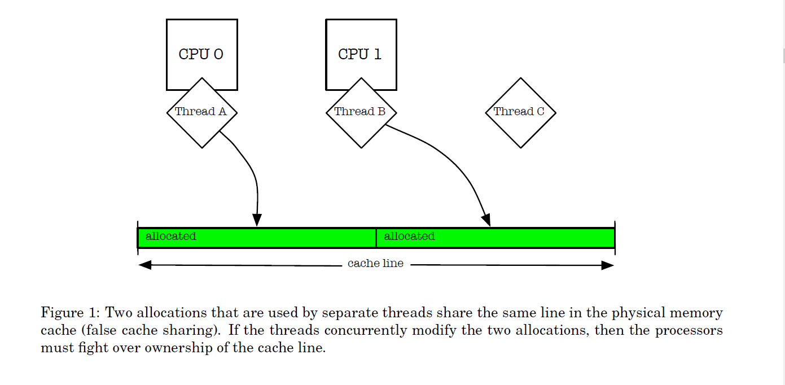
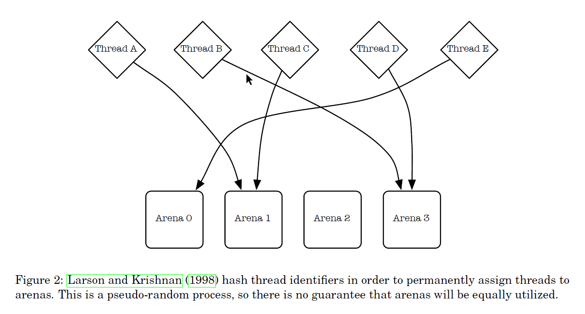

# freebsd [A Scalable Concurrent malloc(3) Implementation for FreeBSD](https://people.freebsd.org/~jasone/jemalloc/bsdcan2006/jemalloc.pdf)

> NOTE: 
>
> 1、从下面的内容来看，jemalloc的设计其实非常注重的是scalability，这也是它的优势，显然这是"意图决定最终的结果"	

## Introduction

> NOTE: 
>
> 1、总的来说，就是在各种影响因素中，进行tradeoff

### Fragmentation

Fragmentation can be thought of in terms of internal fragmentation and external fragmentation. Internal fragmentation is a measure of wasted space that is associated with individual allocations, due to unusable leading or trailing space(其实就是padding). External fragmentation is a measure of space that is physically backed by the virtual memory system, yet is not being directly used by the application. 

> NOTE: 
>
> 1、internal fragmentation是由于padding

### False sharing 

If two threads are simultaneously running on separate processors and manipulating separate objects that are in the same cache line, then the processors must arbitrate ownership of the cache line (Figure 1). This false cache line sharing can cause serious performance degradation. 

> TODO: 需要截图过来，原图非常好

Modern multi-processor systems preserve a coherent view of memory on a per-cache-line basis. If two threads are simultaneously running on separate processors and manipulating separate objects that are in the same cache line, then the processors must arbitrate ownership of the cache line (Figure 1). This false cache line sharing can cause serious performance degradation. One way of fixing this issue is to pad allocations, but padding is in direct opposition to the goal of packing objects as tightly as possible; it can cause severe internal fragmentation. jemalloc instead relies on multiple allocation arenas to reduce the problem, and leaves it up to the application writer to pad allocations in order to avoid false cache line sharing in performance-critical code, or in code where one thread allocates objects and hands them off to multiple other threads.

> NOTE: 
>
> 1、"tag-padding-to-cache line-optimization-avoid false sharing"
>
> 实现方式有多种，通过上述tag，可以找到实现方式

#### jemalloc的策略

jemalloc instead relies on multiple allocation arenas to reduce the problem, and leaves it up to the application writer to pad allocations in order to avoid false cache line sharing in performance-critical code, or in code where one thread allocates objects and hands them off to multiple other threads.

> NOTE: 
>
> 1、jemalloc的arena是per-core的，并且每个thread会被安排到一个arena，这就是避免了false sharing的可能

### Reduce lock contention for multi-threaded applications 

> NOTE: 
>
> 1、如何降低lock contention ，这非常重要
>
> 2、从下面的描述来看，Larson and Krishnan (1998) 的思想是: "divide to reduce lock granularity"，即"They tried pushing locks down in their allocator, so that rather than using a single allocator lock, each free list had its own lock"，显然，这降低了lock granularity。
>
> 3、jemalloc 借鉴了Larson and Krishnan (1998) 的"multiple arenas"策略，但是"uses a more reliable mechanism than hashing for assignment of threads to arenas"，通过后文可知，是"round-robin"
>
> 这是cache optimization，为了避免"cache sloshing-晃动"，所谓的"cache sloshing-晃动"，其实就是 "cache coherence flood-broadcast-bus traffic-interconnect contention-memory synchronization多核同步内存"。
>
> 在下面的图中，解释了"hashing of the thread identifiers"的劣势，简单而言: 伪随机过程，并不能够保证均等，因此无法保证load balance（此处使用load balance是不准确的）

One of the main goals for this allocator was to reduce lock contention for multi-threaded applications running on multi-processor systems. Larson and Krishnan (1998) did an excellent job of presenting and testing strategies. They tried pushing locks down in their allocator, so that rather than using a single allocator lock, each free list had its own lock. This helped some, but did not scale adequately, despite minimal lock contention. They attributed this to “cache sloshing” – the quick migration of cached data among processors during the manipulation of allocator data structures. Their solution was to use multiple arenas for allocation, and assign threads to arenas via hashing of the thread identifiers (Figure 2). This works quite well, and has since been used by other implementations (Berger et al., 2000; Bonwick and Adams, 2001). jemalloc uses multiple arenas, but uses a more reliable mechanism than hashing for assignment of threads to arenas.

The rest of this paper describes the primary jemalloc algorithms and data structures, presents
benchmarks that measure performance and scalability of multi-threaded applications on a multiprocessor system, as well as performance and memory usage of single-threaded applications, and discusses measurement of memory fragmentation.

> NOTE: 
>
> 1、jemalloc的设计是非常强调"scalability of multi-threaded applications on a multiprocessor system"的

## Algorithms and data structures

### Arenas 

Each application is configured at run-time to have a fixed number of arenas. By default, the number of arenas depends on the number of processors:

#### Single processor: 

Use one arena for all allocations. There is no point in using multiple arenas, since contention within the allocator can only occur if a thread is preempted during allocation.

#### Multiple processors: 

Use four times as many arenas as there are processors. By assigning threads to a set of arenas, the probability of a single arena being used concurrently decreases.

### Hashing VS round-robin and Dynamic re-balancing 

The first time that a thread allocates or deallocates memory, it is assigned to an arena. Rather than hashing the thread’s unique identifier, the arena is chosen in round-robin fashion, such that arenas are guaranteed to all have had approximately the same number of threads assigned to them. 

Reliable pseudo-random hashing of thread identifiers (in practice, the identifiers are pointers) is notoriously(众所周知的) difficult, which is what eventually motivated this approach. It is still possible for threads to contend with each other for a particular arena, but on average, it is not possible to do initial assignments any better than round-robin assignment. 

Dynamic re-balancing could potentially decrease contention, but the necessary bookkeeping would be costly, and would rarely be sufficiently beneficial to warrant the overhead.

### Thread-local storage

Thread-local storage (TLS) is important to the efficient implementation of round-robin arena assignment, since each thread’s arena assignment needs to be stored somewhere. Non-PIC code and some architectures do not support TLS, so in those cases, the allocator uses thread identifier hashing. The thread-specific data (TSD) mechanism that is provided by the pthreads library (Butenhof, 1997) would be a viable alternative to TLS, except that FreeBSD’s pthreads implementation allocates memory internally, which would cause infinite recursion if TSD were used by the allocator.