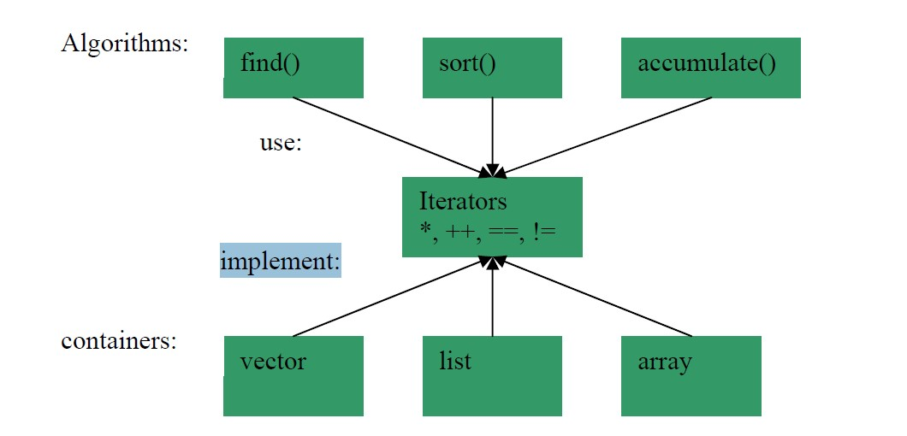

# Design and implementation STL

## wikipedia [Standard Template Library](https://en.wikipedia.org/wiki/Standard_Template_Library)

> https://en.wanweibaike.com/wiki-C%2B%2B_Standard_Library

It provides four components called *[algorithms](https://en.wikipedia.org/wiki/Algorithm_(C%2B%2B))*, *[containers](https://en.wikipedia.org/wiki/Container_(data_structure))*, *[functions](https://en.wikipedia.org/wiki/Function_object)*, and *[iterators](https://en.wikipedia.org/wiki/Iterator)*.

> NOTE: 参见下面的章节

The STL achieves its results through the use of [templates](https://en.wikipedia.org/wiki/Template_(programming)). This approach provides [compile-time polymorphism](https://en.wikipedia.org/wiki/Compile-time_polymorphism) that is often more efficient than traditional [run-time polymorphism](https://en.wikipedia.org/wiki/Polymorphism_in_object-oriented_programming).

The STL was created as the first library of generic algorithms and data structures for C++, with four ideas in mind: 

> NOTE: STL的设计理念。

1、[generic programming](https://en.wikipedia.org/wiki/Generic_programming), 

2、[abstractness](https://en.wikipedia.org/wiki/Abstraction_(computer_science)) without loss of efficiency, 

3、the [Von Neumann computation model](https://en.wikipedia.org/wiki/Von_Neumann_architecture), and 

> NOTE: 
>
> 这不理解

4、[value semantics](https://en.wikipedia.org/wiki/Value_semantics).

> NOTE: 
>
> pass by value

### [Composition](https://en.wikipedia.org/wiki/Standard_Template_Library#Composition)

> NOTE: 
>
> 1、composition 能够实现`N * M` code reuse
>
> 2、下面展示了composition
>
> stroustrup [C++ in 2005](http://www.stroustrup.com/DnE2005.pdf)
>
> 

#### Containers

#### Iterators

#### Algorithms

#### Functions

> NOTE: 在本文中，所谓的“function”，其实就是functor。

### Criticisms

#### [Other issues](https://en.wikipedia.org/wiki/Standard_Template_Library#Other_issues)

> NOTE: 原文的这一段是非常值得一读的，其中所描述的问题，其实是很多programmer都非常任意范的

1、Initialization of STL [containers](https://en.wikipedia.org/wiki/Container_(data_structure)) with constants within the source code is not as easy as data structures inherited from C (addressed in [C++11](https://en.wikipedia.org/wiki/C%2B%2B11) with [initializer lists](https://en.wikipedia.org/wiki/C%2B%2B11#Initializer_lists)).

2、STL containers are not intended to be used as base classes (their destructors are deliberately non-virtual); deriving from a container is a common mistake.

> NOTE: 这一点需要注意

3、The [concept](https://en.wikipedia.org/wiki/Concept_(generic_programming)) of iterators as implemented by STL can be difficult to understand at first: for example, if a value pointed to by the iterator is deleted, the iterator itself is then no longer valid. This is a common source of errors. Most implementations of the STL provide a debug mode that is slower, but can locate such errors if used. A similar problem exists in other languages, for example [Java](https://en.wikipedia.org/wiki/Java_(programming_language)). [Ranges](https://en.wikipedia.org/wiki/Range_(computer_science)#Range_as_an_alternative_to_iterator) have been proposed as a safer, more flexible alternative to iterators.

4、Certain iteration patterns do not map to the STL iterator model. For example, callback enumeration APIs cannot be made to fit the STL model without the use of [coroutines](https://en.wikipedia.org/wiki/Coroutine), which are platform-dependent or unavailable, and will be outside the C++ standard until C++20.

> NOTE: 

## stroustrup [C++ in 2005](http://www.stroustrup.com/DnE2005.pdf)

Stroustrup的这篇文章介绍地也比较好。

## geeksforgeeks [The C++ Standard Template Library (STL)](https://www.geeksforgeeks.org/the-c-standard-template-library-stl/)

**Flowchart of Adaptive Containers and Unordered Containers**

**Flowchart of Sequence conatiners and ordered containers**

## Implementations

本章描述的是C++标准库的实现，其实它和language的implementation是对应的，显然，它有：

| implementation                                               |      |
| ------------------------------------------------------------ | ---- |
| [llvm-project](https://github.com/llvm/llvm-project)/[libcxx](https://github.com/llvm/llvm-project/tree/main/libcxx) |      |
| [gcc](https://github.com/gcc-mirror/gcc)/[libstdc++-v3](https://github.com/gcc-mirror/gcc/tree/master/libstdc%2B%2B-v3) |      |
| [microsoft](https://github.com/microsoft)/**[STL](https://github.com/microsoft/STL)** |      |

### TO READ

http://www.stroustrup.com/DnE2005.pdf

http://www.josuttis.com/libbook/

https://www.eventhelix.com/RealtimeMantra/Patterns/stl_design_patterns.htm

https://justinmeiners.github.io/sgi-stl-docs/design_documents.html

