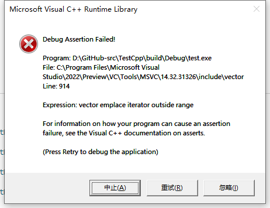

# Iterator-adaptors

本章描述`c++`的`insert_iterator`系列，每种`insert_iterator`都有对应的`inserter`函数来生成`insert_iterator`，显然这是采用的[Object Generator](https://en.wikibooks.org/wiki/More_C%2B%2B_Idioms/Object_Generator) idiom，它的目的是简化代码，充分利用compiler的auto type deduction，在下面的 cppreference [std::insert_iterator](https://en.cppreference.com/w/cpp/iterator/insert_iterator) 章节中，给出了对比的例子。

在STL中，有如下`insert_iterator`：

| `insert_iterator`                                            | `inserter` function                                          | member function                                              | 插入位置 |
| ------------------------------------------------------------ | ------------------------------------------------------------ | ------------------------------------------------------------ | -------- |
| [std::insert_iterator](https://en.cppreference.com/w/cpp/iterator/insert_iterator) | [std::inserter](https://en.cppreference.com/w/cpp/iterator/inserter) | [`insert`](https://en.cppreference.com/w/cpp/container/vector/insert) | 任意位置 |
| [std::front_insert_iterator](https://en.cppreference.com/w/cpp/iterator/front_insert_iterator) | [std::front_inserter](https://en.cppreference.com/w/cpp/iterator/front_inserter) | `push_front()`                                               | front    |
| [std::back_insert_iterator](https://en.cppreference.com/w/cpp/iterator/back_insert_iterator) | [std::back_inserter](https://en.cppreference.com/w/cpp/iterator/back_inserter) | `push_back()`                                                | back     |


## `insert_iterator` and `inserter`


### geeksforgeeks [std::inserter in C++](https://www.geeksforgeeks.org/stdinserter-in-cpp/)


```c++

#include <iostream>
#include <iterator>
#include <deque>
#include <algorithm>
using namespace std;
int main()
{
    // Declaring first container
    deque<int> v1 = {1, 2, 3};

    // Declaring second container for
    // copying values
    deque<int> v2 = {4, 5, 6};

    deque<int>::iterator i1;
    i1 = v2.begin() + 1;
    // i1 points to next element of 4 in v2

    // Using std::inserter inside std::copy
    std::copy(v1.begin(), v1.end(), std::inserter(v2, i1));
    // v2 now contains 4 1 2 3 5 6

    std::for_each(v2.begin(), v2.end(), [](const auto &i)
                  { std::cout << i << ","; });
    std::cout << std::endl;
}
```


```c++
4,1,2,3,5,6,
```

**How is it helpful ?**

1、**Inserting values anywhere**

```c++

// C++ program to demonstrate std::inserter
#include <iostream>
#include <iterator>
#include <vector>
#include <algorithm>
using namespace std;
int main()
{
    // Declaring first container
    vector<int> v1 = {1, 2, 3, 7, 8, 9};

    // Declaring second container
    vector<int> v2 = {4, 5, 6};

    auto i1 = v1.begin() + 2;
    // i1 points to next element of 5 in v2

    // Using std::inserter inside std::copy
    std::copy(v2.begin(), v2.end(), std::inserter(v1, i1));
    // v2 now contains 4 5 1 2 3 7 8 9 6

    for (auto &&i : v1)
    {
        cout << i << " ";
    }
    return 0;
}
```

> NOTE: 
>
> 输出如下:
>
> ```C++
> 1 2 4 5 6 3 7 8 9 
> ```
>
> 

### cppreference [std::insert_iterator](https://en.cppreference.com/w/cpp/iterator/insert_iterator) 

`std::insert_iterator` is a [*LegacyOutputIterator*](https://en.cppreference.com/w/cpp/named_req/OutputIterator) that inserts elements into a container for which it was constructed, at the position pointed to by the supplied iterator. The container's `insert()` member function is called whenever the iterator (whether dereferenced or not) is assigned to. Incrementing the `std::insert_iterator` is a no-op.

> NOTE: 
>
> 一、每次调用“container's `insert()` member function”，保证了可以连续地insert。
>
> 二、在指定的任意位置插入。


```C++

#include <vector>
#include <list>
#include <iostream>
#include <iterator>
#include <algorithm>

int main()
{
    std::vector<int> v{1, 2, 3, 4, 5};
    std::list<int> l{-1, -2, -3};
    std::copy(v.begin(), v.end(), // may be simplified with std::inserter
              std::insert_iterator<std::list<int>>(l, std::next(l.begin())));
    for (int n : l)
        std::cout << n << ' ';
    std::cout << '\n';
}
```

>NOTE: 
>
>输出如下:
>
>```C++
>-1 1 2 3 4 5 -2 -3 
>```


```c++

#include <vector>
#include <list>
#include <iostream>
#include <iterator>
#include <algorithm>

int main()
{
    std::vector<int> v{1, 2, 3, 4, 5};
    std::list<int> l{-1, -2, -3};
    std::copy(v.begin(), v.end(), // may be simplified with std::inserter
              std::inserter(l, std::next(l.begin())));
    for (int n : l)
        std::cout << n << ' ';
    std::cout << '\n';
}
```


### cppreference [std::inserter](https://en.cppreference.com/w/cpp/iterator/inserter) 


## `front_insert_iterator` and `front_inserter`


### cppreference [std::front_insert_iterator](https://en.cppreference.com/w/cpp/iterator/front_insert_iterator)

`std::front_insert_iterator` is an [*LegacyOutputIterator*](https://en.cppreference.com/w/cpp/named_req/OutputIterator) that prepends elements to a container for which it was constructed. The container's `push_front()` member function is called whenever the iterator (whether dereferenced or not) is assigned to. Incrementing the `std::front_insert_iterator` is a no-op.


### cppreference [front_inserter](https://en.cppreference.com/w/cpp/iterator/front_inserter)


## `back_insert_iterator` and `back_inserter`


### cppreference `std::back_insert_iterator`

`std::back_insert_iterator` is an [*LegacyOutputIterator*](https://en.cppreference.com/w/cpp/named_req/OutputIterator) that appends to a container for which it was constructed. The container's `push_back()` member function is called whenever the iterator (whether dereferenced or not) is assigned to. Incrementing the `std::back_insert_iterator` is a no-op.


### cppreference [std::back_inserter](https://en.cppreference.com/w/cpp/iterator/back_inserter)


```c++

#include <iostream>
#include <vector>
#include <algorithm>
#include <iterator>

int main()
{
    std::vector<int> v{1, 2, 3, 4, 5, 6, 7, 8, 9, 10};
    std::fill_n(std::back_inserter(v), 3, -1);
    for (int n : v)
        std::cout << n << ' ';
}
```

> NOTE: 
>
> 输出如下:
>
> ```
> 1 2 3 4 5 6 7 8 9 10 -1 -1 -1
> ```
>
> 


## fluentcpp [How the STL inserter iterator really works](https://www.fluentcpp.com/2017/10/06/stl-inserter-iterators-work/)


```c++

#include <iostream>
#include <vector>
#include <algorithm>
#include <iterator>
using namespace std;

int main()
{
    std::vector<int> v = {1, 2, 3, 4, 5, 6};
    std::vector<int> newElements = {7, 8, 9, 10};

    std::copy(begin(newElements), end(newElements), std::inserter(v, v.end()));

    for (int i : v)
        std::cout << i << ' ';
}
```

> NOTE: 
>
> 输出如下:
>
> ```c++
> 1 2 3 4 5 6 7 8 9 10 
> ```
>
> 上述写法等价于：
>
> ```c++
> 
> #include <iostream>
> #include <vector>
> #include <algorithm>
> #include <iterator>
> using namespace std;
> 
> int main()
> {
>     std::vector<int> v = {1, 2, 3, 4, 5, 6};
>     std::vector<int> newElements = {7, 8, 9, 10};
> 
>     std::copy(begin(newElements), end(newElements), std::back_inserter(v));
> 
>     for (int i : v)
>         std::cout << i << ' ';
> }
> ```
>
> 

### What it looks like it does

Let’s try to simulate the behaviour we were assuming `std::inserter` had. We take a position inside a container, and repeatedly insert elements at this position:

```c++

#include <iostream>
#include <vector>
#include <algorithm>
#include <iterator>
using namespace std;

int main()
{
    std::vector<int> v = {1, 2, 3, 4, 5, 6};
    std::vector<int> newElements = {7, 8, 9, 10};

    auto position = v.end();
    for (int i : newElements)
        v.insert(position, i);

    for (int i : v)
        std::cout << i << ' ';
}
```

The following code outputs:

```
Segmentation fault
```

Just as we expected. The vector’s buffer is reallocated and `position` is invalidated. The next insertion through it leads to undefined behaviour.

> NOTE: 
>
> 一、上面这段话总结地非常好，非常点题。
>
> 二、下面是demo程序：
>
> demo程序一：
>
> ```C++
> 
> #include <iostream>
> #include <vector>
> #include <algorithm>
> #include <iterator>
> using namespace std;
> 
> int main()
> {
>     std::vector<int> v = {1, 2, 3, 4, 5, 6};
>     std::vector<int> newElements = {7, 8, 9, 10};
> 
>     auto position = v.end();
>     v.insert(position, 7);
> 
>     for (int i : v)
>         std::cout << i << ' ';
> }
> ```
>
> 上述程序正常，输出如下:
>
> ```C++
> 1 2 3 4 5 6 7 
> ```
>
> demo程序二：
>
> ```c++
> 
> #include <iostream>
> #include <vector>
> #include <algorithm>
> #include <iterator>
> using namespace std;
> 
> int main()
> {
>     std::vector<int> v = {1, 2, 3, 4, 5, 6};
>     std::vector<int> newElements = {7, 8, 9, 10};
> 
>     auto position = v.end();
>     v.insert(position, 7);
>     v.insert(position, 8);
> 
>     for (int i : v)
>         std::cout << i << ' ';
> }
> ```
>
> 报错如下:
>
> 


Let’s try to work around this by reserving buffer space in advance:

```c++

#include <iostream>
#include <vector>
#include <algorithm>
#include <iterator>
using namespace std;

int main()
{
    std::vector<int> v = {1, 2, 3, 4, 5, 6};
    std::vector<int> newElements = {7, 8, 9, 10};

    v.reserve(10);
    auto position = v.end();
    for (int i : newElements)
        v.insert(position, i);

    for (int i : v)
        std::cout << i << ' ';
}
```

> NOTE:
>
> 一、上述程序在windows下报错如下:
>
> 

### What it actually does

So how does `std::inserter` do to insert the elements in the right order without crashing? **How does it just do the right thing**?

Let’s look into an implementation of the STL to understand what’s going on. Here is the code that actually performs the insertion of an element inside the container:

```c++
_Self& operator=(const typename _Container::value_type& __val) {
  _M_iter = container->insert(_M_iter, __val);
  ++_M_iter;
  return *this;
}
```

`_M_iter` is the position that was passed to `std::inserter`. As you can see, there is more than just an insertion:

1、the position is **refreshed** by using the one returned by the `insert` method. `insert` returns the position of the inserted element. This ensures to always keep `_M_iter` in the vector’s current buffer, even if it was just reallocated.

> NOTE: 
>
> 一、这是一种非常好的避免iterator invalidation的方法
>
> 二、上述是典型的STL algorithm pattern: 返回一个iterator，然后以这个iterator的下一个作为起点继续。

2、the position is incremented. This way each inserted element is positioned right **after** the previous one. This ensures to have the elements inserted in the right order.

## TODO

stackoverflow [Using front_inserter instead of back_inserter](https://stackoverflow.com/questions/16926575/using-front-inserter-instead-of-back-inserter)