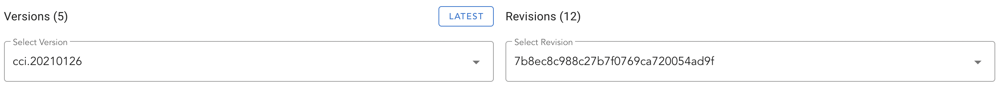

# 进阶实践

本节将描述一些在开发过程中使用的进阶技巧，他们并不难但可能在你需要的时候能非常快速的解决你的问题。

## 自定义编译选项

在使用 Conan 管理三方库过程中，并不是所有包都提供了单独的配置选项可以做一些细节的控制，比如 iOS 下的 -fembed-bitcode、-fvisibility-hidden 等，这些配置都是经常用到的。而我们如何能统一设置三方库的这些配置选项呢？其实通过 profile 的 env 配置我们可以很方便的传递给三方库。如下所示：

```
include(default)

[settings]
arch=armv8
compiler=apple-clang
compiler.libcxx=libc++
compiler.cppstd=14
os=iOS
os.version=9.3
os.sdk=iphoneos

[options]

[env]
CFLAGS="-fembed-bitcode -fvisibility=hidden -fvisibility-inlines-hidden"
CXXFLAGS="-fembed-bitcode -fvisibility=hidden -fvisibility-inlines-hidden"
OBJCFLAGS="-fembed-bitcode -fvisibility=hidden -fvisibility-inlines-hidden"
```

当目标系统使用该 profile 进行编译时，所有三方库都会添加 `-fembed-bitcode` `-fvisibility=hidden` `-fvisibility-inlines-hidden` 编译选项。值得注意的是 `OBJCFLAGS` 是传递给哪些 C++ 与 ObjC 混编的场景下使用的。

::: tip 提示
Conan 官方虽然静默承认有这样的方式可以提供给开发者设置三方库编译选项，但这并不是他们推荐的方式。在 Conan 2.0 中，期望开发者通过 [conf] 配置选项来给三方库传递关键配置参数，但由于并非所有三方库配方文件都支持 Conan 2.0 语法，所以目前的情况推荐大家还是使用 [env] 方式设置三方库编译选项。这是个漫长但值得期待的过程。
:::

## 使用包版本范围

当团队业务需要，我们可能会抽离一些基础组件库提供各个平台其他语言使用。但这些库的更新会比较频繁，内部库如果以 git describe 方式命名包版本那么每次都需要更新使用方的 conanfile 配置。幸亏 Conan 是支持版本范围的，只要你的包版本遵守 semver 规则，那么 Conan 就可以使用版本范围语法来自动更新依赖包。那么我们都需要做哪些事情呢？

首先你需要包版本修改为正规的 semver 版本格式，我们编写了以下示例代码让库在上传时使用类似 0.1.1-alpha.100 风格的版本号：

```python
def get_version():
    git = tools.Git()
    git_describe = ""
    try:
        git_describe = git.run("describe --tags --long --abbrev=8")
    except:
        return git_describe
    # match 1.1.1 like
    match_result = re.search('^\d+.\d+.\d+$', git_describe)
    if match_result != None:
        return git_describe
    # get branch name
    git_branch = git.run('rev-parse --abbrev-ref HEAD')
    semver_version = ""
    semver_split = "-"
    # semver
    match_object = re.match(r'^(\d+).(\d+).(\d+)-(\d+).+$', git_describe, re.M | re.I)
    semver_major = match_object.group(1)
    semver_minor = match_object.group(2)
    semver_patch = match_object.group(3)
    semver_commit = match_object.group(4)
    # develop branch
    if git_branch == 'develop':
        next_release = int(semver_minor) + 1
        semver_version = '%s.%s.%s-%s.%s' % (semver_major, str(next_release), semver_patch, 'alpha', semver_commit)
    if git_branch.startswith('release') or git_branch.startswith('hotfix'):
        release_match = re.search('^.*/(\d+.\d+.\d+)$', git_branch)
        if release_match != None:
            semver_version = '%s-%s.%s' % (release_match.group(1), 'beta', semver_commit)
    if semver_version != '':
        return semver_version
```

这样包在制作完成后，规则就符合 semver 版本规则了。develop 下使用 alpha+提交次数，release 下使用 beta+提交次数。

随后在引入方您需要将具体版本号修改为版本范围格式如下所示：

```python
def requirements(self):
    self.requires("ne_phoenix/[>0.1.0, include_prerelease=True]@yunxin/testing")
```

这表示大于 0.1.x 的功能迭代和缺陷修复都会使用下载使用。但当 major 版本提升（如 1.0.0），则不会自动下载使用，始终使用最新的 0.x.x 系列版本。具体规则请参考 semver 2.0。include_prerelease 表示我们接受 alpha、beta 的最新迭代（pre-release）版本。

在设置完版本范围引入后，最后需要再您的 conan install 中添加 --update 参数，如：

```bash
$ conan intall .. --build=missing --update
```

使用 conan.cmake 时只需要传递 `UPDATE` 参数即可，如下所示：

```cmake
conan_cmake_install(PATH_OR_REFERENCE .. BUILD missing UPDATE SETTINGS ${settings})
```

- [semver 参考资料](https://semver.org/lang/zh-CN/)
- [semver-node](https://www.npmjs.com/package/semver)
- [Conan Version ranges](https://docs.conan.io/en/latest/versioning/version_ranges.html)

::: tip 提示
前文中我们介绍 tool_requires 和普通 requires 无法使用 override 覆盖冲突包，您完全可以使用版本范围巧妙的解决该问题。前提是这些包您都是内部可控的。
:::

## 拷贝三方库产物

有些 Conan 管理的三方库并不是静态库形式，我们期望将其产物一同拷贝跟随 SDK 发布出去。这种场景下我们可以借助 conanfile.py 的 `imports()` 方法自动拷贝所依赖的库文件到当前工程指定目录下，如下所示：

```python
def imports(self):
    self.copy("*.dll", "bin", "bin", "nrtc")
    self.copy("*.dll", "bin", "bin", "nim_audio")
    self.copy("*.dll", "bin", "bin", "h_available")
    self.copy("*.dll", "bin", "bin", "nim_tools_http")
    self.copy("*.dylib", "lib", "lib", "h_available")
    self.copy("*.dylib", "lib", "lib", "nim_tools_http")
    self.copy("*.so", "lib", "lib", "h_available")
    self.copy("*.so", "lib", "lib", "nim_tools_http")
    self.copy("*.pdb", "pdb", "pdb")
    self.copy("*.h", "include", "include", "nim_tools_http")
```

以上为 IM1 C++ 跨平台 SDK 示例，我们根据需要拷贝了 nrtc.dll、nim_audio.dll、h_available.dll、nim_tools_http.dll 到当前工程的 bin 目录。拷贝 macOS 下的 dylib 到 lib 目录，拷贝 Linux 的 so 文件到 lib 目录。最后我们还可以拷贝三方库的头文件一起跟随我们 SDK 一起发布。这解决了相互依赖 SDK 之间的数据拷贝问题。

虽然通过 `imports` 方法可以让我们在本地开发时就自动将依赖产物拷贝到工程目录下，但往往我们在发布 SDK 过程中需要将这些预编译好的产物跟随 SDK 一起发布。SDK 的打包通过 CMake install 流程就可以完成，但通过 Conan 管理的三方库则不可行。我们需要在 install 前就将产物拷贝到 CMAKE_INSTALL_PREFIX 目录下。在你的 CMakeLists.txt 中增加如下脚本可以让依赖的三方库自动拷贝到 CMAKE_INSTALL_PREFIX 目录：

```cmake
add_custom_target(conan-install ALL
    COMMAND conan imports ${CMAKE_CURRENT_LIST_DIR}/conanfile.py -imf ${CMAKE_INSTALL_PREFIX}
    DEPENDS nim
    COMMENT "Import Conan dependencies......."
)
```

参考资料：[https://github.com/conan-io/conan/issues/7402](https://github.com/conan-io/conan/issues/7402)

## 非源码包制作

云信 SDK 除了会发布到各端原生语言的生态以外，我们同时会将产物上传到官网。通过一个 CDN 下载地址提供开发者下载。如果内部或外部客户期望通过 Conan 集成我们所发布的 SDK 而我们又不可能把源码暴露给外界。此时我们可以制作一个依赖外部 URL 产物的 Conan 包。

::: tip 提示
目前 Conan 官方 conan-center-index 就是以这种方式在维护所有包的 recipe，这样就可以完全让 Conan recipes 与三方库源代码分离，同时也支持从一个固定的 URL、镜像站下载已经预编译好的产物备用。
:::

以已经发布到官网的 NIM CPP SDK 举例，我们来制作一个脱离源码的 Conan 配方，首先创建一个类似结构的目录：

```bash
└── recipes
    └── nim
        ├── all
        │   ├── conandata.yml
        │   └── conanfile.py
        ├── config.yml
        └── test_package
            ├── CMakeLists.txt
            ├── conanfile.py
            └── test_package.cc
```

其中 `recipes` 目录用于储存所有与源码分离的包，我们期望目录结构尽量简洁让您更好理解，这里只存放了 nim 目录对应我们官网的 NIM CPP SDK。这里最重要的文件是 `conandata.yml`，它描述了某个版本所有已经编译好的包下载地址，如下所示：

```yml
sources:
  "9.5.2":
    Windows:
      x86:
        url: "https://yx-web-nosdn.netease.im/package/nim-win32-ia32-refs-tags-9.5.2.1619-build.267.tar.gz"
        sha256: "5f65b1e6407a476ddaba4c0228742b420ed0edb0e07367816b2d10116af2e66c"
      x86_64:
        url: "https://yx-web-nosdn.netease.im/package/nim-win32-x64-refs-tags-9.5.2.1619-build.267.tar.gz"
        sha256: "2ed96bf73516387a772512cf30a1d86b530586516b8c46230f6b9a563173ffad"
    Linux:
      x86_64:
        url: "https://yx-web-nosdn.netease.im/package/nim-linux-x64-refs-tags-9.5.2.1619-build.267.tar.gz"
        sha256: "d86f089285c970b1cd22d6f97bbba51ff514ab1db2b10b2a76ae77964ff82985"
      armv8:
        url: "https://yx-web-nosdn.netease.im/package/nim-linux-arm64-refs-tags-9.5.2.1619-build.267.tar.gz"
        sha256: "79ffcd2978e21b79fd7f4fe61e0c9bdd05c5660424137f350445c6c917e8df91"
    Macos:
      x86_64:
        url: "https://yx-web-nosdn.netease.im/package/nim-darwin-x64-refs-tags-9.5.2.1619-build.267.tar.gz"
        sha256: "2e0e42aac6d797e112a3b8325f9391938375b35ff117a57fcebe78de022a71ec"
      armv8:
        url: "https://yx-web-nosdn.netease.im/package/nim-darwin-arm64-refs-tags-9.5.2.1619-build.267.tar.gz"
        sha256: "46793093886e015177bc9c672cf5c4177fead8bc2b613dabba6443b2de545eb7"
```

首先最上层是以版本号作为区分的，其次是平台，最后是架构。每个已经上传到官网的包都有一个唯一的 sha256 校验和用来确保下载过程中包的完整性。然后我们打开 `conanfile.py` 文件，写下如下内容：

```python
import os
from conans import ConanFile, tools, CMake


class NetEaseIMConan(ConanFile):
    name = "nim"
    description = "NetEase IM cross-platform SDK"
    license = "GNU Public License or the Artistic License"
    homepage = "https://yunxin.163.com/"
    url = "https://github.com/netease-im/yunxin-center-index"
    topics = ("conan", "im", "nim", "rtc")
    options = {
        "shared": [True, False],
        "fPIC": [True, False]
    }
    default_options = {
        "shared": False,
        "fPIC": True,
    }
    settings = "os", "arch"
    short_paths = True

    def config_options(self):
        if self.settings.os == "Windows":
            del self.options.fPIC

    def build(self):
        arch = str(self.settings.arch)
        os = str(self.settings.os)
        tools.get(**self.conan_data["sources"][self.version][os][arch])
        cmake = CMake(self)
        print("cmake version %s" % cmake.get_version())
        cmake.definitions["CMAKE_CXX_STANDARD"] = "11"
        cmake.definitions["BUILD_SHARED_LIBS"] = "ON" if self.options.shared else "OFF"
        cmake.configure(source_folder="wrapper", build_folder="build_subfolder")
        cmake.build(target="install")

    def package(self):
        self.copy("*", "bin", "bin")
        self.copy("*", "lib", "lib", symlinks=True)
        self.copy("*.h", "include", "include")

    def package_info(self):
        self.cpp_info.libdirs = ["lib"]
        self.cpp_info.includedirs = ["include"]
        self.cpp_info.libs = tools.collect_libs(self)
```

config_options、package、package_info 方法我们前面都介绍过，这里唯一有一些区别的就是 build 方法，它首先通过 `tools.get` 方法从 `conandata.yml` 的 sources 字段中按平台、架构等信息获取了应该下载的包，执行完该行代码后，Conan 会自动根据配置文件的下载地址下载我们上传到官网的包然后自动解压到准备编译得目录。

随后我们按原来的套路，通过 CMake 初始化 `wrapper` 目录下的工程，设置子目录为 `build_subfolder`，最后在调用 CMake build 的时候指定了 target 为 install。这样在 C++ 封装层编译完成后会自动将所需的库文件拷贝到解压后的 bin、lib、include 目录。

最后我们通过 package 和 package_info 两个方法将产物所需的内容拷贝到 Conan package 目录即可。随后我们再 `recipes/nim/all` 目录下执行如下语句创建这个包：

```bash{42}
$ conan create . 9.5.2@
Exporting package recipe
nim/9.5.2 exports: File 'conandata.yml' found. Exporting it...
nim/9.5.2 exports: Copied 1 '.yml' file: conandata.yml
nim/9.5.2: A new conanfile.py version was exported
nim/9.5.2: Folder: /Users/jj.deng/.conan/data/nim/9.5.2/_/_/export
nim/9.5.2: Using the exported files summary hash as the recipe revision: 86944681336b1de5be1d4605182e8dd9 
nim/9.5.2: Package recipe modified in export, forcing source folder removal
nim/9.5.2: Use the --keep-source, -k option to skip it
nim/9.5.2: Removing the local binary packages from different recipe revisions
nim/9.5.2: Exported revision: 86944681336b1de5be1d4605182e8dd9
Configuration:
[settings]
arch=armv8
arch_build=armv8
build_type=Release
compiler=apple-clang
compiler.cppstd=14
compiler.libcxx=libc++
compiler.version=13.1
os=Macos
os.version=10.14
os_build=Macos
[options]
[build_requires]
[env]

nim/9.5.2: Forced build from source
Installing package: nim/9.5.2
Requirements
    nim/9.5.2 from local cache - Cache
Packages
    nim/9.5.2:40ba2ab1a343793fce9837f134fde3769ccd8e58 - Build

Installing (downloading, building) binaries...
nim/9.5.2: Configuring sources in /Users/jj.deng/.conan/data/nim/9.5.2/_/_/source
nim/9.5.2: Copying sources to build folder
nim/9.5.2: Building your package in /Users/jj.deng/.conan/data/nim/9.5.2/_/_/build/40ba2ab1a343793fce9837f134fde3769ccd8e58
nim/9.5.2: Generator txt created conanbuildinfo.txt
nim/9.5.2: Aggregating env generators
nim/9.5.2: Calling build()
Downloading nim-darwin-arm64-refs-tags-9.5.2.1619-build.267.tar.gz completed [15689.93k] 
```

最后一行 Downloading 就是在下载我们配置文件中指定的压缩包。在一切完成后，我们为了测试包是否可用。在 test_package 目录添加一个简单的工程来验证我们的包，其中 conanfile.py 非常简单，你甚至不需要告诉他要去引入哪个包，内容如下：

```python
from conans import ConanFile, CMake, tools
import os


class TestPackageConan(ConanFile):
    settings = "os", "arch", "compiler", "build_type"
    generators = "cmake", "cmake_find_package_multi"

    def build(self):
        cmake = CMake(self)
        cmake.configure()
        cmake.build()

    def test(self):
        if not tools.cross_building(self):
            bin_path = os.path.join("bin", "test_package")
            self.run(bin_path, run_environment=True)
```

这里与其他常规 conaofile.py 有所不同的是多了一个 test 函数，该函数判断如果不是交叉编译场景，则直接运行编译后的文件。接下来是 `CMakeLists.txt` 和 `test_package.cc`

```cmake{3-4,6}
cmake_minimum_required(VERSION 3.10)
project(test_package)
include(${CMAKE_BINARY_DIR}/conanbuildinfo.cmake)
conan_basic_setup()
add_executable(${PROJECT_NAME} test_package.cc)
target_link_libraries(${PROJECT_NAME} ${CONAN_LIBS})
```

测试源代码中仅是导入了 NIM CPP SDK 的头文件，调用了初始化和反初始化接口以验证编译和运行是否正常。

```cpp
#include <iostream>
#include "nim_cpp_wrapper/nim_cpp_api.h"

int main(int argc, char* argv[]) {
    nim::Client::Init("", "", "", nim::SDKConfig());
    nim::Client::Cleanup2();
}
```

最后来验证测试程序是否通过，在 `recipes/nim` 目录下执行 `conan test test_package nim/9.5.2@`，如果一切顺利，Conan 会自动引入已经创建好的 nim 包并导入到工程中，然后编译 test_package 工程并执行该文件进行验证测试。

参考工程：[https://g.hz.netease.com/neteaseconan/netease-conan-index](https://g.hz.netease.com/neteaseconan/netease-conan-index)

## 绑定 Revision

大家可以注意到，Conan 官方提供的包版本与实际开源项目的版本是一致的。但这中间如果他们更新了包的配方（recipe）信息我们如何感知呢？特别是当你使用了 `--update` 参数时，会自动更新最新配方的包信息。这可能会导致新配方 + 旧版本 Conan 出现不兼容情况。

实际每一个包都有一个 Revision 的概念，每一次配方（但源码不更新，主要为了适配新的 Conan 特性和配方缺陷修复）的更新都会生成一个全新的 Revision，通过 Conan center 就可以看到每个包的 Revision ID：



要使用具体某个 Revision 版本的包，您首先要开启全局支持，使用如下命令打开全局支持：

```bash
$ conan config set general.revisions_enabled=True
```

同时修改包版本依赖，在包名、版本号后增加 #REV，如下所示：

```python
def requirements(self):
    self.requires("c-ares/1.18.1#f6cf892fe94ae51a1b4dba565ad82e5e")
    self.requires("aws-c-common/0.7.5#d98410ae6f77b81086e390b86d87c609")
    self.requires("sqlite3/3.38.1#da99b567036f22b3aabe4e110fb2669f")
    self.requires("jsoncpp/1.9.5#536d080aa154e5853332339bf576747c")
    self.requires("zlib/1.2.11#6579cd83d7728bdb0df70b512d9b1a11")
    self.requires("nlohmann_json/3.11.2#a41bc0deaf7f40e7b97e548359ccf14d")
```

最后也需要在 conan install 的时候携带 `--update` 参数。

```bash
conan install .. --build=missing --update
```

这样我们就将版本原子锁定到一个版本上，除非 Conan center 宕机，否则永远不会出现变更。

参考资料：[https://docs.conan.io/en/latest/versioning/revisions.html](https://docs.conan.io/en/latest/versioning/revisions.html)
