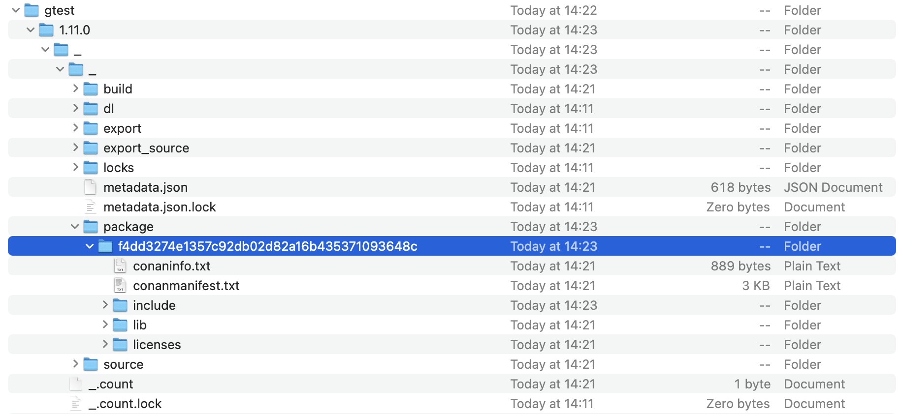
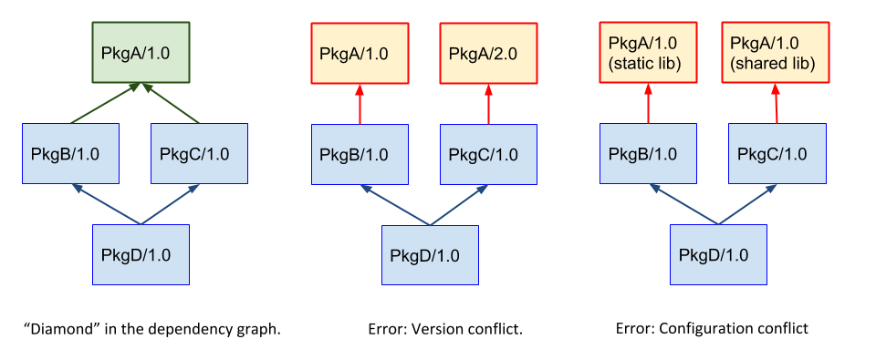

# 入门实践

本章将描述如何使用和制作一个简单的 Conan 包，以及在开发过程中需要编译目标产物所使用的的工具链是如何在 Conan 中进行导入的。

## 初次引入 Conan 包

通过 conanfile.py 或 conanfile.txt 我们可以很方便的指定下载所需的预编译二进制文件包到本地进行编译。

```python
from conans import ConanFile, tools
import platform


class ModuleConan(ConanFile):
    name = "yunxin-library"
    description = "An example of a CMake conan package"
    settings = "os", "compiler", "build_type", "arch"
    options = {"shared": [True, False], "fPIC": [True, False]}
    default_options = {
        "shared": False,
        "fPIC": True,
    }
    generators = "cmake"
    exports_sources = "*"

    def requirements(self):
        self.requires("nlohmann_json/3.11.1")
        self.requires("gtest/1.11.0")
```

`generators` 描述要生成 CMake 工程所依赖的库文件信息，我们引入了 `nlohmann_json` 和 `gtest` 两个包，用来解析 JSON 数据和运行单元测试。当我们在缓存目录下执行 `conan install ..` 后（.. 代表 conanfile.txt 或 conanfile.py 所在目录），conan 会先尝试从远端（conan remote list）下载与当前环境匹配的预编译包。本机的当前环境信息在用户目录下的 `.conan/profiles/default` 文件中记录。您可以通过命令 `conan profile show default` 查看当前本机默认配置信息，如下所示：

```bash
$ conan profile show default
Configuration for profile default:

[settings]
os=Macos
os_build=Macos
arch=armv8
arch_build=armv8
compiler=apple-clang
compiler.version=13.1
compiler.libcxx=libc++
build_type=Release
[options]
[conf]
[build_requires]
[env]
```

conan 通过读取 conanfile.py|txt 了解到你需要安装哪些包，然后根据 default profile 进行 install 流程，相当于执行了以下命令：

```bash
$ conan install .. -s os=Macos -s os_build=Macos -s arch=armv8 -s arch_build=armv8 -s compiler=apple-clang -s compiler.version=13.1 -s compiler.libcxx=libc++ -s build_type=Release
```

有了 default profile 我们可以尽量简化 conan install 的流程。当你在缓存目录执行 conan install 时，您可以会碰到如下问题：

```bash
Installing (downloading, building) binaries...
ERROR: Missing binary: gtest/1.11.0:f4dd3274e1357c92db02d82a16b435371093648c

gtest/1.11.0: WARN: Can't find a 'gtest/1.11.0' package for the specified settings, options and dependencies:
- Settings: arch=armv8, build_type=Release, compiler=apple-clang, compiler.cppstd=14, compiler.libcxx=libc++, compiler.version=13.1, os=Macos, os.version=10.14
- Options: build_gmock=True, fPIC=True, hide_symbols=False, no_main=False, shared=False
- Dependencies: 
- Requirements: 
- Package ID: f4dd3274e1357c92db02d82a16b435371093648c

ERROR: Missing prebuilt package for 'gtest/1.11.0'
Use 'conan search gtest/1.11.0 --table=table.html -r=remote' and open the table.html file to see available packages
Or try to build locally from sources with '--build=gtest'

More Info at 'https://docs.conan.io/en/latest/faq/troubleshooting.html#error-missing-prebuilt-package'
```

以上错误表示在下载 gtest 时没有找到您指定相关参数的预编译包，那都有哪些预编译包呢？我们可以通过 conan search 命令来搜索当前该包都有哪些预编译版本：

```bash
$ conan search gtest/1.11.0@ --table=file.html -r=conancenter
```

执行该命令后会在当前目录下生成一个 file.html 文件，打开该 html 文件后就可以看到所有预编译的产物信息了。其中的确不包含我们的 13.1 版本 apple-clang 的预编译产物。


这种情况下，我们只需要在 conan install 后面新增一个 `--build=mssing` 的参数，conan 将自动下载源码从本地编译：

```bash
$ conan install .. --build=missing
```

这样我们的三方库包就下载好了，他们存放在用户目录下 `~/.conan/data/` 目录，打开该目录您就可以看到所有预编译的包内容了。



打开这个目录下的 conaninfo.txt 文件就可以看到当时编译该产物时锁使用的编译参数和架构等信息时怎样的了：

```
[settings]
    arch=armv8
    build_type=Release
    compiler=apple-clang
    compiler.cppstd=14
    compiler.libcxx=libc++
    compiler.version=13.1
    os=Macos
    os.version=10.14
[requires]
[options]
    build_gmock=True
    fPIC=True
    hide_symbols=False
    shared=False
[full_settings]
    arch=armv8
    build_type=Release
    compiler=apple-clang
    compiler.cppstd=14
    compiler.libcxx=libc++
    compiler.version=13.1
    os=Macos
    os.version=10.14
[full_requires]
[full_options]
    build_gmock=True
    fPIC=True
    hide_symbols=False
    no_main=False
    shared=False
[recipe_hash]
    7475482232fcd017fa110b0b8b0f936e
```

在 conan install 完成后，会在执行命令的当前目录生成一个 `conanbuildinfo.cmake` 文件，该文件中保存了所有依赖的三方库的头文件搜索路径、库文件搜索路径、所需链接库的文件名等信息。接下来使用 CMakeLists.txt 引入该文件，我们就可以使用其中的三方库了：

```cmake
cmake_minimum_required(VERSION 3.19)
project(JsonParser)

include(${CMAKE_BINARY_DIR}/conanbuildinfo.cmake)
conan_basic_setup()

add_executable(${PROJECT_NAME} entry.cpp)

target_link_libraries(${PROJECT_NAME} ${CONAN_LIBS})
```

其中 `${CONAN_LIBS}` 变量在 conanbuildinfo.cmake 中定义。在引入三方库的代码中则直接 include 头文件即可：

```cpp
#include <iostream>
#include "nlohmann/json.hpp"

void JsonHelper::ParseJson(const std::string& json_string) {
    nlohmann::json json_obj = nlohmann::json::parse(json_string);
    std::cout << json_obj.dump() << std::endl;
}
```

## 自动安装 Conan 包

每次手动执行 Conan install 流程是非常繁琐且痛苦的，Conan 官方提供了 conan.cmake 工具包，该工具包会自动分析当前 CMake 的初始化环境，将 CMake 变量中的数据传递给 conan 自动执行 install 流程，这样我们只需要关注一次 CMake 的初始化即可，无需关注 conan install 的具体流程和参数了。

包地址：[https://github.com/conan-io/cmake-conan.git](https://github.com/conan-io/cmake-conan.git)

引入示例代码：

```cmake
# conan
if (NOT EXISTS ${CMAKE_BINARY_DIR}/conanbuildinfo.cmake)
    if (NOT EXISTS "${CMAKE_BINARY_DIR}/conan.cmake")
        MESSAGE(STATUS "Downloading conan.cmake from https://github.com/conan-io/cmake-conan")
        FILE(DOWNLOAD "https://raw.githubusercontent.com/conan-io/cmake-conan/master/conan.cmake" "${CMAKE_BINARY_DIR}/conan.cmake")
    endif ()
    include(${CMAKE_BINARY_DIR}/conan.cmake)
    conan_add_remote(NAME NetEaseConan URL http://yunxin-conan.netease.im:8082/artifactory/api/conan/NetEaseConan)
    if (CONAN_PROFILE_BUILD AND CONAN_PROFILE_HOST)
        conan_cmake_install(PATH_OR_REFERENCE .. BUILD missing
            SETTINGS_HOST build_type=${CMAKE_BUILD_TYPE}
            SETTINGS_BUILD build_type=${CMAKE_BUILD_TYPE}
            PROFILE_BUILD ${CONAN_PROFILE_BUILD}
            PROFILE_HOST ${CONAN_PROFILE_HOST})
    else ()
        conan_cmake_autodetect(settings)
        conan_cmake_install(PATH_OR_REFERENCE .. BUILD missing SETTINGS ${settings})
    endif ()
endif ()
include(${CMAKE_BINARY_DIR}/conanbuildinfo.cmake)
conan_basic_setup()
```

代码判断如果当前 CMake 缓存目录没有 `conanbuildinfo.cmake` 文件证明需要安装 conan 依赖，并且判断如果没有发现 `conan.cmake` 文件则自动从 github 地址中将该文件下载下来，include 该 cmake 文件后调用 `conan_cmake_autodetect` 方法检查当前 CMake 环境信息如平台、架构、Release or Debug 等信息后保存到 `settings` 变量传递给 conan 进行 install 流程。

::: warning 注意
大陆境内移动、电信、联通网络访问 github 非常不稳定，conan.cmake 文件可能下载失败或者只能下载为一个 0 字节文件。在实际开发调试中可以将该文件始终保存下来没必要每次下载。
:::

大家可能看到代码中有另外的判断逻辑 `if (CONAN_PROFILE_BUILD AND CONAN_PROFILE_HOST)`，这部分我们将在交叉编译中详细进行讲解。

## 制作一个 Conan 包

以上都是我们在使用 Conan center 中提供的库，而在内部，我们一样有一些基础组件库急迫的需要通过这种方式来管理，如何将我们自己的包制作为一个可以让其他项目通过 Conan 引入的包呢？我们通过内部一个基础的 C 网络库 tinyNET 来举例说明。

### 创建 conanfile.py

要创建一个 Conan 包你需要先创建一个 conanfile.py 文件，

```python
from conans import ConanFile, tools, CMake
import platform

def get_version():
    git = tools.Git()
    try:
        return git.run("describe --tags --long --abbrev=8")
    except:
        return None

class TinyNETConan(ConanFile):
    name = "tinyNET"
    version = get_version()
    author = "Dylan <dengjiajia@corp.netease.com>"
    url = "https://g.hz.netease.com/nim-pc/california/tinynet.git"
    description = "tinyNET"
    settings = "os", "compiler", "build_type", "arch"
    options = {"shared": [True, False], "fPIC": [True, False]}
    default_options = {"shared": False, "fPIC": True}
    generators = "cmake"
    exports_sources = "*"

    def requirements(self):
        print("Current platform: " + platform.system())
        self.requires("tinySAK/0.1.0-6-g9d5a42ca@yunxin/testing")

    def config_options(self):
        if self.settings.os == "Windows":
            del self.options.fPIC

    def build(self):
        cmake = CMake(self)
        cmake.definitions["BUILD_SHARED_LIBS"] = "ON" if self.options.shared else "OFF"
        cmake.configure()
        cmake.build()

    def package(self):
        self.copy("*.h", src="src", dst="include")
        self.copy("*.a", dst="lib", keep_path=False)
        self.copy("*.lib", dst="lib", keep_path=False)
        self.copy("*.pdb", dst="pdb", keep_path=False)

    def package_info(self):
        self.cpp_info.libdirs = ["lib"]
        self.cpp_info.includedirs = ["include"]
        self.cpp_info.libs = tools.collect_libs(self)
```

 - 包版本我们通过 git describe 来获取当前 tag 及提交信息作为 conan 包版本
 - `options` 提供了一些编译选项，如是否编译为动态库，是否开启 fPIC 选项等。
 - `default_options` 提供了默认的编译选项，如期望该库默认编译为静态库，则将 shared 设置为 false
 - `requirements()` 方法中包含该包还依赖哪些三方库
 - `config_options()` 方法可以在编译前配置一些选项信息，比如我们在 Windows 下需要移除 -fPIC 选项
 - `build()` 方法就是我们调用 CMake 初始化及 build 要实际传递的参数了，比如是否编译动态库通过 BUILD_SHARED_LIBS 传递
 - `pacakge()` 方法告诉 conan 收集器，你要将哪些文件拷贝到最终输出的包目录结构下，包含头文件、库文件、符号文件、授权信息等
 - `package_info()` 方法告诉 conan 收集器，你要将哪些库和头文件暴露给最终引入方使用，如果这里没有显示指定引入方是无法正常链接到的

::: tip 提示
以上方式是 Conan v1 系列版本的推荐用法，目前 Conan 官方已经着手在将所有 recipes 调整为 Conan v2 支持的模式，我们将持续关注新特性带来的好处随时更新此文档。
:::

### 本地测试

包创建完成后我们可以在本地尝试创建包，使用如下命令创建一个包：

```bash
$ conan create . yunxin/testing --settings compiler.cppstd=14 --build missing
```

与 conan install 一样，如果该包也依赖了其他的三方库，我们也需要使用 --build missing 命令来解决三方库可能没有预编译包的情况。执行 conan create 后会在本地进行编译，并自动拷贝产物到 ~/.conan/data 目录下，内容如下：

```bash
.........
tinyNET/0.1.0-14-g9c2b8910@yunxin/testing: Package 'a186b18349810574d99bce49f90333b8ed2a9dca' built
tinyNET/0.1.0-14-g9c2b8910@yunxin/testing: Build folder /Users/jj.deng/.conan/data/tinyNET/0.1.0-14-g9c2b8910/yunxin/testing/build/a186b18349810574d99bce49f90333b8ed2a9dca
tinyNET/0.1.0-14-g9c2b8910@yunxin/testing: Generated conaninfo.txt
tinyNET/0.1.0-14-g9c2b8910@yunxin/testing: Generated conanbuildinfo.txt
tinyNET/0.1.0-14-g9c2b8910@yunxin/testing: Generating the package
tinyNET/0.1.0-14-g9c2b8910@yunxin/testing: Package folder /Users/jj.deng/.conan/data/tinyNET/0.1.0-14-g9c2b8910/yunxin/testing/package/a186b18349810574d99bce49f90333b8ed2a9dca
tinyNET/0.1.0-14-g9c2b8910@yunxin/testing: Calling package()
tinyNET/0.1.0-14-g9c2b8910@yunxin/testing package(): Packaged 223 '.h' files
tinyNET/0.1.0-14-g9c2b8910@yunxin/testing package(): Packaged 1 '.a' file: libtinyNET.a
tinyNET/0.1.0-14-g9c2b8910@yunxin/testing: Package 'a186b18349810574d99bce49f90333b8ed2a9dca' created
tinyNET/0.1.0-14-g9c2b8910@yunxin/testing: Created package revision 787acdd01fb6c31b600cd92c35d6a51c
```

其中 `0.1.0-14-g9c2b8910` 就是通过 git describe 获取的包版本信息，您现在已经可以在其他工程中使用这个包了，因为 Conan 的默认搜索行为是先从本地进行搜索。

### 上传到内部服务器

当包在本地测试通过确认无问题后，您就可以将该包上传到内部的服务器中了。

```bash
conan upload tinyNET/0.1.0-14-g9c2b8910@yunxin/testing -r NetEaseConan --force --confirm --all --retry 2
```

这样该包就可以在团队中共享使用了，你指需要告诉适用放包的版本即可，如：`tinyNET/0.1.0-14-g9c2b8910@yunxin/testing`

## 配置包属性

一些三方库提供了一些编译属性，以 SQLite3 举例，它提供了[丰富的编译开关](https://www.sqlite.org/compile.html)，如果我们需要再编译时修改这些开关，首先要看在 Conan 配方中是否处理了这些开关。打开 Conan center SQLite3 的 conanfile.py，在配方中提供了这些开关，直接对应 SQLite3 官方提供的编译选项，并且这些编译选项均提供了默认值：

```python{18-44}
from conans import ConanFile, CMake, tools
from conans.errors import ConanInvalidConfiguration
import os
import textwrap
import functools

required_conan_version = ">=1.43.0"

class Sqlite3Conan(ConanFile):
    name = "sqlite3"
    description = "Self-contained, serverless, in-process SQL database engine."
    license = "Unlicense"
    url = "https://github.com/conan-io/conan-center-index"
    homepage = "https://www.sqlite.org"
    topics = ("sqlite", "database", "sql", "serverless")
    settings = "os", "arch", "compiler", "build_type"
    options = {
        "shared": [True, False],
        "fPIC": [True, False],
        "threadsafe": [0, 1, 2],
        "enable_column_metadata": [True, False],
        "enable_dbstat_vtab": [True, False],
        "enable_explain_comments": [True, False],
        "enable_fts3": [True, False],
        "enable_fts3_parenthesis": [True, False],
        "enable_fts4": [True, False],
        "enable_fts5": [True, False],
        "enable_json1": [True, False],
        "enable_soundex": [True, False],
        "enable_preupdate_hook": [True, False],
        "enable_rtree": [True, False],
        "use_alloca": [True, False],
        "omit_load_extension": [True, False],
        "omit_deprecated": [True, False],
        "enable_math_functions": [True, False],
        "enable_unlock_notify": [True, False],
        "enable_default_secure_delete": [True, False],
        "disable_gethostuuid": [True, False],
        "max_column": "ANY",
        "max_variable_number": "ANY",
        "max_blob_size": "ANY",
        "build_executable": [True, False],
        "enable_default_vfs": [True, False],
        "enable_dbpage_vtab": [True, False],
    }
    default_options = {
        "shared": False,
        "fPIC": True,
        "threadsafe": 1,
        "enable_column_metadata": True,
        "enable_dbstat_vtab": False,
        "enable_explain_comments": False,
        "enable_fts3": False,
        "enable_fts3_parenthesis": False,
        "enable_fts4": False,
        "enable_fts5": False,
        "enable_json1": False,
        "enable_soundex": False,
        "enable_preupdate_hook": False,
        "enable_rtree": True,
        "use_alloca": False,
        "omit_load_extension": False,
        "omit_deprecated": False,
        "enable_math_functions": True,
        "enable_unlock_notify": True,
        "enable_default_secure_delete": False,
        "disable_gethostuuid": False,
        "max_column": None,             # Uses default value from source
        "max_variable_number": None,    # Uses default value from source
        "max_blob_size": None,          # Uses default value from source
        "build_executable": True,
        "enable_default_vfs": True,
        "enable_dbpage_vtab": False,
    }
```

如果你需要在引入 SQLite3 包时修改这些默认值，只需要在您主工程的 conanfile.py 中设置 `default_options` 配置即可，语法格式是 `包名:开关名: Value`。如下所示：

```python{8-9}
class ModuleConan(ConanFile):
    name = "nim"
    description = "NetEase IM cross-platform SDK generation two"
    settings = "os", "compiler", "build_type", "arch"
    generators = "cmake"
    default_options = {
        "h_available:shared": False,
        "sqlite3:enable_fts5": True,
        "sqlite3:threadsafe": 2
    }
```

## 包版本覆盖

在使用 Conan center 的包时，你分别使用了两个不同的三方库，但这两个三方库又同时使用了另外一个三方库如 protobuf，但他们依赖的版本是不一致的。这样安装时会有错误如：

```bash
ERROR: Conflict in googleapis/cci.20220711:
    'googleapis/cci.20220711' requires 'protobuf/3.21.4' while 'googleapis/cci.20220711' requires 'protobuf/3.21.1'.
    To fix this conflict you need to override the package 'protobuf' in your root package.
```

Conan 官方给出了几种出现该错误的可能，如下图：



解决该问题的方案也非常简单，我们只要在最上层的包明确声明以下您要使用 `protobuf/3.21.4` 还是 `protobuf/3.21.1` 版本进行覆盖即可，后续依赖该库的包均会使用您指定的版本，Conan 官方称为 override。

除了官方包以外，您甚至可以通过内网私有化包来覆盖官方包，还是上面的场景，我们可以使用 protobuf/3.21.4@yunxin/testing 包来覆盖三方库中依赖的版本。在覆盖后，依赖的三方库会基于您覆盖的版本重新进行编译。

参考文档：[https://docs.conan.io/en/1.45/versioning/introduction.html](https://docs.conan.io/en/1.45/versioning/introduction.html)

## 使用 Conan 工具包

有些场景下我们在编译工程时会依赖一些本地工具，比如 Elite SDK 在生成 Objective-C 导出接口的 SDK 时，会先调用一个内部开发的 auto-wrapper 的程序来根据当前工程目录下的头文件自动化生成 Objective-C 的粘合层代码。我们需要将 auto-wrapper 也作为一个 Conan 包，因为它在 Windows、macOS 都会使用到。

但我们考虑一个问题，如果我们是交叉编译的场景（macOS 下编译 iOS 产物），如果 auto-wrapper 程序也被交叉编译为 iOS 产物，那在 macOS 上是无法运行的，也就生成不了 Objective-C 封装层，这违背了我们的初衷。

为了解决这个问题，在使用 Conan 时，我们将 auto-wrapper 作为 tool_requires，tool_requires 就是为了这种场景设计而来，使用 tool_requires 引入的包将使用本机的环境配置来生成产物，以使得该产物可以在当前系统环境下运行，它不影响目标产物的平台和架构信息。如下所示：

```python
def build_requirements(self):
    if self.settings.os != "Android":
        self.tool_requires("smart-wrapper/[>0.1.0, include_prerelease=True]@yunxin/testing")
        if platform.system() == "Windows":
            self.tool_requires("llvm/14.0.6@yunxin/testing")
```

我们在目标系统非 Android 时，引入了 auto-wrapper 工具包，并且仅在 Windows 下引入 LLVM 工具包。

::: warning 注意
tool_requires 与常规的 requires 是无法进行版本覆盖的，该问题官方 issue 也在处理中。他们希望通过 Conan v2 来彻底解决，但这还比较遥远。我们在后面的文章中通过版本范围来规避该问题。
:::
