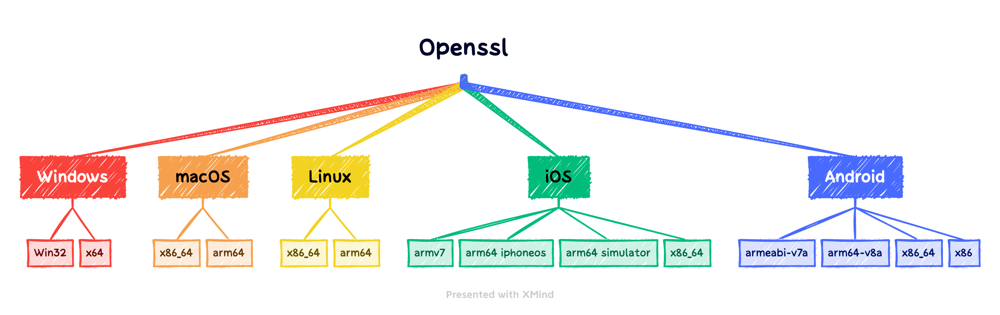

# 历史问题

在历史的 C++ 项目开发过程中，我们对三方库的管理有各种各样的方式，如使用 git submodule 方式源码编译、使用预编译后 push 到仓库中等方式。无论何种方式我们都多多少少会碰到一些问题。在 Elite 使用 C++ 作为基建全端开发后这些问题就越发明显，我们需要让 C++ 基础能力支持所有平台（Android、iOS、macOS、Windows、Linux like），特别是使用到的一些三方库，如 openssl、libcurl、aws-cpp-sdk 等。以 openssl 举例，如果我们要支持所有平台所有架构，我们至少需要编译 14 个产物



这将带来以下几个重要的问题：

## 版本管理混乱

三方库的版本虽然一旦确定就不会轻易的修改，但作为开发者，你一定要考虑到升级和维护的问题，当需要升级版本时（特别是一些开源加密库，个别应用商店会有限制）我们该如何快速完成这部分工作。

使用预编译库 + 源码头文件的方式集成到仓库中时，仓库体积会不断增大，并且一旦某次更新了预编译库而没有更新头文件，在出现问题时你很难将三方库的符号与实际仓库中的代码对应起来。这是很容易出现的，IM 第一代 SDK 在维护过程中就多次碰到类似问题。我们不能完全依靠流程制度来限定开发人员的行为，一旦新人进来没有完全了解流程制度后就及其容易出错。

## 各平台产物维护难

以前是单个平台或者两个平台，如 Windows 和 macOS 就满足需求了。当所有平台都需要统一一份 C++ 代码时，你会发现维护的库文件是这样一个系数：

```
三方库数量 * 平台数量 * 架构数量 * 工具链版本（可有可无）
```

传统 C 库很少碰到 ABI 兼容问题，但 C++ 则不一样，Debug 下编译的产物不能在 Release 下使用，轻则出现链接错误，重则运行时崩溃。如果你使用预编译库的方式那么所有 C++ 库都需要提供 Debug 和 Release 的版本。这样就不是上图中我们提到的只有 14 个产物那么简单了。而如果你还是使用 `git submodule` 源码方式集成，CI 的时间将会大大增加，这种方式虽然可以临时解决但也不可取。

## 难以传承

传统预编译三方库存放到工程的方式虽然是最短平快的手段，但这只能解一时的燃眉之急。最好的结果是开发人员在编译完成后留下完善的编译文档，可从目前我们能找到的文档来看少之又少。在团队人员不断迭代换新的情况下，新接手的开发人员需要对三方库进行升级维护时，很可能是将上一任做过的工作重复的做一次。最好的方式是将所有依赖保存在与实际业务关联的代码仓库中，减少口口相传带来的麻烦。

## 限定开发环境

除了使用子模块管理三方库源码的方式以外，如果我们使用预编译库上传到仓库的形式，那么就要求所有开发人员需要与当时编译产物的工具链保持一致，比如 MSVC15 编译的 C++ 产物可能无法在 MSVC12 或高版本的 MSVC16 中使用。那么所有开发人员就必须安装 MSVC15 工具链。时间久了以后，开发人员想使用新的 IDE 或新的语言特性时，就要考虑升级三方库的编译工具链，这时就就会陷入到升级难的陷阱中。

## 脱离社区

无论是使用子模块源码方式集成还是预编译库的方式集成，这些代码最终都会固化在工程里面。当开发人员发现三方库有问题时首先想到的是修改源码解决，当然这对于团队内部来说是高效的。而一旦你需要升级该三方库版本时，你不得不将原来的定制化修改再次应用到新的版本中。

这就造成了代码分叉，你的修改并不是通过正常的渠道先反馈给社区，社区讨论修复后重新集成到代码仓库中。缺少了非常重要的社区沟通。
