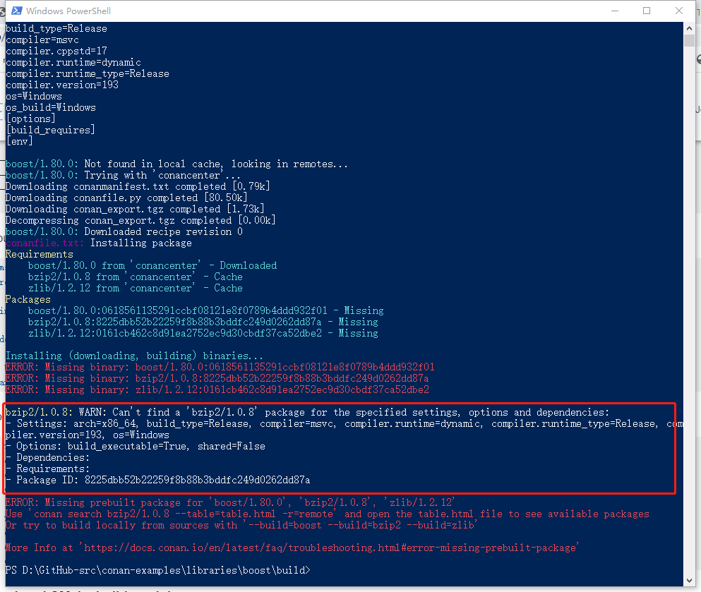

# Conan


## 官网 [Conan](https://docs.conan.io/en/latest/introduction.html) 

Conan is a dependency and package manager for C and C++ languages.

> NOTE: 
>
> 一、上述package是什么含义？


## [Docs](https://docs.conan.io/en/latest/index.html) # [Introduction](https://docs.conan.io/en/latest/introduction.html)


### Decentralized package manager

[](https://docs.conan.io/en/latest/_images/conan-systems.png)

### Binary management

One of the most powerful features of Conan is that it can create and manage pre-compiled binaries for any possible platform and configuration.

A package is defined by a “conanfile.py”. This is a file that defines the package’s dependencies, sources, how to build the binaries from sources, etc. One package “conanfile.py” recipe can generate any arbitrary number of binaries, one for each different platform and configuration: operating system, architecture, compiler, build type, etc. These binaries can be created and uploaded to a server with the same commands in all platforms, having a single source of truth for all packages and not requiring a different solution for every different operating system.

> NOTE:
>
> 一、在 [Docs](https://docs.conan.io/en/latest/index.html) » [Mastering Conan](https://docs.conan.io/en/latest/mastering.html) » [Use conanfile.py for consumers](https://docs.conan.io/en/latest/mastering/conanfile_py.html) 中对“conanfile.py”的补充:
>
> > You can use a `conanfile.py` for installing/consuming packages, even if you are not creating a package with it. You can also use the existing `conanfile.py` in a given package while developing it to install dependencies. There’s no need to have a separate `conanfile.txt`.


## [Docs](https://docs.conan.io/en/latest/index.html) # [Getting Started](https://docs.conan.io/en/latest/getting_started.html) 


```shell
$ conan search gtest/1.11.0@ --table=file.html -r=conancenter
$ conan install .. --build=missing
$ conan inspect poco/1.9.4
```


```shell
$ conan profile new default --detect  # Generates default profile detecting GCC and sets old ABI
$ conan profile update settings.compiler.libcxx=libstdc++11 default  # Sets libcxx to C++11 ABI
```


```shell
$ mkdir build && cd build
$ conan install ..
```


```shell
$ conan search "*"
```


### Installing Dependencies

The **conan install** command downloads the binary package required for your configuration (detected the first time you ran the command), **together with other (transitively required by Poco) libraries, like OpenSSL and Zlib**. 

It will also create the *conanbuildinfo.cmake* file in the current directory, in which you can see the CMake variables, and a *conaninfo.txt* in which the settings, requirements and optional information is saved.


It is very important to understand the installation process. When the **conan install** command runs, settings specified on the command line or taken from the defaults in *`<userhome>/.conan/profiles/default`* file are applied.

```shell
conan install .. --settings os="Linux" --settings compiler="gcc"
```


### Building with other configurations

In this example, we have built our project using the default configuration detected by Conan. This configuration is known as the [default profile](https://docs.conan.io/en/latest/reference/config_files/default_profile.html#default-profile).

A profile needs to be available prior to running commands such as **conan install**. When running the command, your settings are automatically detected (compiler, architecture…) and stored as the default profile. You can edit these settings *`~/.conan/profiles/default`* or create new profiles with your desired configuration.


For example, if we have a profile with a 32-bit GCC configuration in a file called *gcc_x86*, we can run the following:

```shell
$ conan install .. --profile=gcc_x86
```


> We strongly recommend using [Profiles](https://docs.conan.io/en/latest/reference/profiles.html#profiles) and managing them with [conan config install](https://docs.conan.io/en/latest/reference/commands/consumer/config.html#conan-config-install).


However, the user can always override the profile settings in the **conan install** command using the **--settings** parameter. As an exercise, try building the 32-bit version of the hash calculator project like this:

```shell
$ conan install .. --settings arch=x86
```


## [Docs](https://docs.conan.io/en/latest/index.html) # [Reference](https://docs.conan.io/en/latest/reference.html) # [Generators](https://docs.conan.io/en/latest/reference/generators.html)

Generators are specific components that provide the information of dependencies calculated by Conan in a suitable format for a **build system**. They normally provide Conan users with a *conanbuildinfo.XXX* file that can be included or injected to the specific **build system**. The file generated contains information of dependencies in form of different variables and sometimes function helpers too.

> NOTE:
>
> 一、上面这段话中的dependency指的是需要按照的package
>
> 二、generator其实就对应了build system
>
> 三、上面这段话其实也提示了我们conan和build system之间的关联:
>
> 1、conan是管理dependency，在build之前需要首先install dependency，显然它是build system的上游
>
> 2、conan是可以集成到build system中的，这在  [Docs](https://docs.conan.io/en/latest/index.html) »  [Integrations](https://docs.conan.io/en/latest/integrations.html) » [Build systems](https://docs.conan.io/en/latest/integrations/build_system.html) 中进行了介绍

| File                                                         |                             |
| ------------------------------------------------------------ | --------------------------- |
| [conanfile.txt](https://docs.conan.io/en/latest/reference/conanfile_txt.html#conanfile-txt-reference) | `[generators]` section      |
| [conanfile.py](https://docs.conan.io/en/latest/reference/conanfile.html#conanfile-reference) | `generators` attribute      |
| command line                                                 | `conan install --generator` |


## [Docs](https://docs.conan.io/en/latest/index.html) # [Reference](https://docs.conan.io/en/latest/reference.html) # [conanfile.txt](https://docs.conan.io/en/latest/reference/conanfile_txt.html)


## [Docs](https://docs.conan.io/en/latest/index.html) » [Reference](https://docs.conan.io/en/latest/reference.html) » [Configuration files](https://docs.conan.io/en/latest/reference/config_files.html) » [settings.yml](https://docs.conan.io/en/latest/reference/config_files/settings.yml.html)

> NOTE:
>
> 其中指定了编译器的版本范围，如果编译器版本不在这个范围内，则需要将其删除，然后重新生成。


## Profiles


一、practice

一般不要修改它。

二、素材

stackoverflow [Conan on windows claims setting isn't set, it is set](https://stackoverflow.com/questions/70587488/conan-on-windows-claims-setting-isnt-set-it-is-set)

三、

本机的当前环境信息在用户目录下的 `~/.conan/profiles/default` 文件中记录。您可以通过命令 `conan profile show default` 查看当前本机默认配置信息，如下所示：

```bash
$ conan profile show default
Configuration for profile default:

[settings]
os=Macos
os_build=Macos
arch=armv8
arch_build=armv8
compiler=apple-clang
compiler.version=13.1
compiler.libcxx=libc++
build_type=Release
[options]
[conf]
[build_requires]
[env]
```

conan 通过读取 conanfile.py|txt 了解到你需要安装哪些包，然后根据 default profile 进行 install 流程，相当于执行了以下命令：

```bash
$ conan install .. -s os=Macos -s os_build=Macos -s arch=armv8 -s arch_build=armv8 -s compiler=apple-clang -s compiler.version=13.1 -s compiler.libcxx=libc++ -s build_type=Release
```

有了 default profile 我们可以尽量简化 conan install 的流程。

### [Docs](https://docs.conan.io/en/latest/index.html) » [Reference](https://docs.conan.io/en/latest/reference.html) » [Profiles](https://docs.conan.io/en/latest/reference/profiles.html) 


### [Docs](https://docs.conan.io/en/latest/index.html) » [Reference](https://docs.conan.io/en/latest/reference.html) » [Configuration files](https://docs.conan.io/en/latest/reference/config_files.html) » [profiles/default](profiles/default)


## 首次执行记录


```shell
kaideng@ETHANKDENG-MB1 build % conan install .. --build=missing
Auto detecting your dev setup to initialize the default profile (/Users/kaideng/.conan/profiles/default)
Found apple-clang 14.0
apple-clang>=13, using the major as version
Default settings
	os=Macos
	os_build=Macos
	arch=armv8
	arch_build=armv8
	compiler=apple-clang
	compiler.version=14
	compiler.libcxx=libc++
	build_type=Release
*** You can change them in /Users/kaideng/.conan/profiles/default ***
*** Or override with -s compiler='other' -s ...s***


WARN: Remotes registry file missing, creating default one in /Users/kaideng/.conan/remotes.json
Configuration:
[settings]
arch=armv8
arch_build=armv8
build_type=Release
compiler=apple-clang
compiler.libcxx=libc++
compiler.version=14
os=Macos
os_build=Macos
[options]
[build_requires]
[env]
```


## `~/.conan`

一、目录:

```shell
~/.conan
```


`data` 目录保存库文件


## build missing




```shell
$ conan install .. --build=missing
```


## Good resource

guorongfei [C++包管理器——conan](http://blog.guorongfei.com/2018/04/23/conan-tutorial/)

这篇文章非常好

stackoverflow [What is the difference between conanfile.py, conanfile.txt, conanprofile and settings.yml?](https://stackoverflow.com/questions/69739319/what-is-the-difference-between-conanfile-py-conanfile-txt-conanprofile-and-set)

