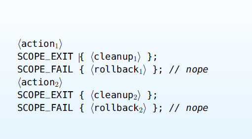
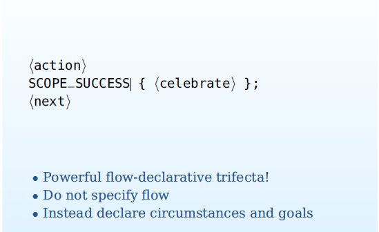
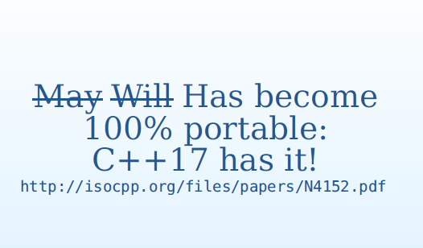

# [CppCon 2015](https://channel9.msdn.com/Events/CPP/CppCon-2015) Declarative Control Flow


## Slide

### Challenge

1、Define a transactional file copy function

2、Either succeed

3、. . . or fail successfully

### Cheat Sheet

From `boost::filesystem`:

```C++
void copy_file(const path& from, const path& to);
```

### Implementation

```c++
void copy_file_transact(const path &from, const path &to)
{
	bf::path t = to.native() + ".deleteme";//temporary
	try
	{
		bf::copy_file(from, t);
		bf::rename(t, to);
	} catch (...)
	{
		::remove(t.c_str());
		throw;
	}
}

```

> NOTE: 上述实现方式是比较考究的，它能让实现strong exception safety，它比较类似于copy-and-swap: 先构造temporary，成功后，再删除temporary。
>
> 上述实现，其实存在这样的一种情况: 如果OS中`to`文件，则overwrite。
>
> 要么成功，要么回滚到原状态；

### Meh

1、We now have explicit control flow

- Not dedicated to core logic

2、Of 8 lines, only 4 do “work”

3、Y u play baseball?

### Composition

> NOTE: "Composition"的含义使用前面的`copy_file_transact`来实现`move_file_transact`

1、Define a transactional file `move` function

2、Either succeed

3、. . . or fail successfully

### Implementation

```C++
void move_file_transact(const path &from, const path &to)
{
	try
	{
		bf::copy_file_transact(from, to);
		bf::remove(from);
	} catch (...)
	{
		::remove(to.c_str());
		throw;
	}
}

```

### Ehm

1、Same issues
2、Also, functions that throw don’t compose all that well
3、Oops, there’s a bug

> NOTE: bug 是 `bf::copy_file_transact(from, to);`  抛出exception，在 `catch` 中，`::remove(to.c_str());`将`to`文件给错误地删除了。

### Implementation (fixed)

```C++
void move_file_transact(const path &from, const path &to)
{
	bf::copy_file_transact(from, to);
	try
	{
		bf::remove(from);
	} catch (...)
	{
		::remove(to.c_str());
		throw;
	}
}

```

### What Tools Do We Have?

1、RAII tenuous

2、ScopeGuard tenuous

3、Composition only makes it worse

◦ Series/nesting of try/catch
◦ Urgh

4、Meantime in CppCoreStandards:

“E.18: Minimize the use of explicit try/catch”

### Suddenly. . .

`goto fail`; doesn’t look that bad anymore, eh?

### Explicit Control Flow = Fail


### Declarative Programming

1、Focus on stating needed accomplishments

> NOTE: 专注于阐述需要完成的事情；即: 描述目标，而不关注如何实现；"accomplishment"的表面意思是: 完成，引申义为: 目标；

2、As opposed to describing steps

> NOTE:  无需说明如何实现

3、Control flow typically minimal/absent

> NOTE: 在 Declarative Programming 中，通常不需要Control flow。

4、Execution is implicit, not explicit

5、Examples: SQL, regex, make, config,. . .

6、Let’s take a page from their book!

### Surprising Insight

1、Consider bona fide RAII with destructors:

States needed accomplishment?

> NOTE: RAII 能够实现

Implicit execution?

> NOTE: RAII 能够实现

Control flow minimal?

> NOTE: RAII 能够实现

2、RAII is declarative programming!

> NOTE: 这是结论，即"RAII is declarative programming!"

### More RAII: ScopeGuard

1、Also declarative

2、Less syntactic baggage than cdtors

3、Flow is “automated” through placement

4、Macro `SCOPE_EXIT` raises it to pseudo-statement status

### Pseudo-Statement (old hat!)

```C++
#include <utility>
namespace detail
{
enum class ScopeGuardOnExit
{
};
template<typename Fun>
ScopeGuard<Fun> operator+(ScopeGuardOnExit, Fun &&fn)
{
	return ScopeGuard<Fun>(std::forward<Fun>(fn));
}
}
#define SCOPE_EXIT \
auto ANONYMOUS_VARIABLE(SCOPE_EXIT_STATE) \
= ::detail::ScopeGuardOnExit() + [&]()

#define CONCATENATE_IMPL(s1, s2) s1##s2

#define CONCATENATE(s1, s2) CONCATENATE_IMPL(s1, s2)

#ifdef __COUNTER__
#define ANONYMOUS_VARIABLE(str) \
CONCATENATE(str, __COUNTER__)
#else
#define ANONYMOUS_VARIABLE(str) \
CONCATENATE(str, __LINE__)
#endif

```

### Use (old hat!)

```C++
void fun()
{
	char name[] = "/tmp/deleteme.XXXXXX";
	auto fd = mkstemp(name);
	SCOPE_EXIT{	fclose(fd); unlink(name);};
	auto buf = malloc(1024 * 1024);
	SCOPE_EXIT {	free(buf);};
//... use fd and buf ...
}

```

### Painfully Close to Ideal!

> NOTE: 非常接近理想




### One more for completeness





### N4152

“When in doubt, replace bool with int”

```C++
namespace std
{
bool uncaught_exception(); // old and bad
int uncaught_exceptions(); // new and rad
}

```


### Using `std::uncaught_exceptions`

```C++
#include <exception>

class UncaughtExceptionCounter
{
	int getUncaughtExceptionCount() noexcept;
	/**
	 * 异常个数
	 */
	int exceptionCount_;
public:
	UncaughtExceptionCounter() :
					exceptionCount_(std::uncaught_exceptions())
	{
	}
	/**
	 * @brief 是否有新异常
	 *
	 * @return
	 */
	bool newUncaughtException() noexcept
	{
		return std::uncaught_exceptions() > exceptionCount_;
	}
};

```

> NOTE: 获得未捕获的异常的个数

### Layering

```C++
#include <utility>
/**
 * @brief 新exception的scope guard
 *
 * @tparam FunctionType
 * @tparam executeOnException
 */
template<typename FunctionType, bool executeOnException>
class ScopeGuardForNewException
{
	FunctionType function_;
	UncaughtExceptionCounter ec_;
public:
	explicit ScopeGuardForNewException(const FunctionType &fn) :
					function_(fn)
	{
	}
	explicit ScopeGuardForNewException(FunctionType &&fn) :
					function_(std::move(fn))
	{
	}
	~ScopeGuardForNewException() noexcept (executeOnException)
	{
		if (executeOnException == ec_.isNewUncaughtException())
		{
			function_();
		}
	}
};

```

### Icing

```C++
#include<type_traits>
#include<utility>
enum class ScopeGuardOnFail
{
};

template<typename FunctionType>
ScopeGuardForNewException<typename std::decay<FunctionType>::type, true> operator+(detail::ScopeGuardOnFail, FunctionType &&fn)
{
	return ScopeGuardForNewException<typename std::decay<FunctionType>::type, true>(std::forward<FunctionType>(fn));
}

```

### Cake Candles

```C++
#define SCOPE_FAIL \
auto ANONYMOUS_VARIABLE(SCOPE_FAIL_STATE) \
= ::detail::ScopeGuardOnFail() + [&]() noexcept

```

### Transactional Copy

```C++
void copy_file_transact(const path &from, const path &to)
{
	bf::path t = to.native() + ".deleteme";
	SCOPE_FAIL{	::remove(t.c_str());};
	bf::copy_file(from, t);
	bf::rename(t, to);
}

```

### Transactional Move

```C++
void move_file_transact(const path &from, const path &to)
{
	bf::copy_file_transact(from, to);
	SCOPE_FAIL{	::remove(to.c_str());};
	bf::remove(from);
}

```

