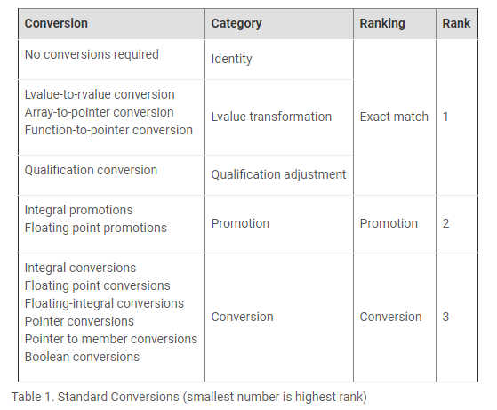

# accu [Overload Resolution - Selecting the Function](https://accu.org/journals/overload/13/66/kilpelainen_268/)


## Overview of Overloading Process

Declaring two or more items with the same name in a scope is called *overloading* . In C++ the items which can be overloaded are **free functions**, **member functions** and **constructors**, which are collectively referred to as **functions**. The compiler selects which function to use at compile time according to the **argument list**, including the **object** itself in the case of **member functions**. The functions that have the same name and are visible in a specific context are called *candidates* . First the usable functions are selected from the set of **candidates**. These usable functions are called *viable functions* . A function is viable if it can be called, that is the **parameter count** matches the arguments and an *implicit conversion sequence* exists for every argument to the corresponding parameter. A function having more parameters than there are arguments in an argument list can also be viable if default arguments exist for all the extra parameters. In such cases the extra parameters are not considered for the purpose of overload resolution. **Access control** is applied after **overload resolution**, meaning that if the function selected is not accessible in the specified context, the program is ill-formed.

**Phases of the function call process:**

1. Name lookup
2. Overload resolution
3. Access control

Many different contexts of overloading exist and each has its own set of rules for finding the set of candidate functions and arguments. Those rules are not covered here except for a few important cases which involve a **user-defined conversion**. After defining the candidates and the arguments for each context, the rest of the overload process is identical for all contexts.


## Ordering of Viable Functions

A viable function is better than another viable function if (and only if) it does not have a worse **implicit conversion sequence** for any of its arguments than the other function and has one of the following properties:

- It has at least one better **conversion sequence** than the other function.
- It is a non-template and the other function is a template specialisation.（这段话的意思是：非模板优于模板？是这样的，在“Function Templates With Overloading”章节对此进行了说明）
- Both are templates and it is more specialised than the other function according to the **partial ordering rules**.（关于partial ordering rule，参见`C++\Language-reference\Template\Implementation`）

The ordering of **implicit conversion sequences** is explained later. If only one function is better than other functions in the set of viable functions then it is called the *best viable function* and is selected by the **overload resolution**. Otherwise the call is ill-formed and diagnostics are reported.

> NOTE: 这段总结得非常好，它总结了overload resolution中进行ordering的核心思想。

## Member Functions and Built-in Operators With Overloading

> NOTE: 这段解释非常好，它的视角是站在设计者的角度，告诉了我们这样做的原因。这是符合`C++\Language-reference\Basic-concept\index.md`中提出的“Uniform function model”的。

For overload resolution, **member functions** are considered as free functions with an extra parameter taking the object itself. This is called the *implicit object parameter* . The cv-qualification [ [1 ](https://accu.org/journals/overload/13/66/kilpelainen_268/#ftn.d0e82)] of the implicit parameter is the same as the cv-qualification of the specified member function. The object is matched to the **implicit object parameter** to make the overload resolution possible. This is an easy way to make the overloading rules uniform for the member functions and free functions. The **implicit object argument** is just like other arguments, except for a few special rules: 

- the related conversions cannot introduce temporaries, 

- no user-defined conversions are allowed and 

- an rvalue can be bound to a non-constant reference. 

For static member functions the implicit object parameter is not considered since there is no object to match it. 

Also the built-in operators are considered free functions for the purpose of overload resolution.

**Examples:**

```C++
struct type {
  void func(int) const;
  void other();
};
```

The member functions are considered as

```C++
void func(type const&, int);
void other(type&);

char* p;
p[0];
```

The subscript operator is considered as

```C++
T& operator[](T*, ptrdiff_t);
```

where `T `is a cv-(un)qualified type.


## Conversions

> NOTE: 本段对conversion的总结是非常好的。

The **implicit conversion sequences** are based on **single conversions**. These simple implicit conversions provide a great deal of flexibility and can be helpful if used correctly. Even though single conversions are quite easy, the interaction between the sequences of conversions and the overloading is far from simple. The **standard conversions** are the built-in conversions, those are categorised and ranked to form an intuitive（直觉的） order. This is the basis for ranking the conversion sequences consisting of only standard conversions. There are three ranks for these conversions (see Table 1). In addition to those standard conversions, a derived-to-base conversion exists but only in the description of implicit conversion sequences. It has a conversion rank.

> NOTE: 
>
> 上面这段话的意思是： **implicit conversion sequences** 是由一个一个的single conversion构成的，显然这是one-by-one（参见工程discrete的`Relation-structure-computation\Computation`章节）。
>
> 为什么叫conversion **sequence**呢？这是因为parameter list，即函数的parameter可以是多个的。
>
> 为什么是implicit conversion？argument到parameter之间的conversion，它是由compiler来完成的，所以是implicit conversion。
>
> implicit conversion包含哪些？在下面回答了这个问题。

**Examples:**

`char `➔ `int `(integral promotion)
`float `➔ `long `(floating-integral conversion)
type ➔ type `const `(qualification conversion)
type ➔ type (identity conversion)

Besides **standard conversions** there are the **user-defined conversions**, meaning **conversion functions** and **converting constructors**. **User-defined conversions** are applied only if they are unambiguous. It is good to know that at most one **user-defined conversion** is implicitly applied to a single value. Three forms of conversion sequences can be constructed from these different conversions:

- Standard conversion sequence
- User-defined conversion sequence
- Ellipsis conversion sequence

> NOTE: 原文后面对这三种conversion进行了专门介绍




## Standard Conversion Sequences

The **standard conversion sequence** is either an identity conversion or consists of one to three standard conversions from the four categories when identity is not considered, at most one conversion per category. The **standard conversions** are always applied in a certain order: Lvalue transformation, Promotion or Conversion and Qualification adjustment. The **standard conversion sequence** is ranked according to the conversions it contains, the conversion with the lowest rank dictates（决定了） the rank of the whole sequence.

**Examples:**

`bool `➔ `short `(conversion rank)
`char `➔ `char const `(exact match rank)
`char `➔ `int `➔ `int const `(promotion rank)
`float[] `➔ `float* `➔ `float const* `(exact match rank)

## User-Defined Conversion Sequences

A **user-defined conversion sequence** is a composition of three pieces: first an initial standard conversion sequence followed by a **user-defined conversion**（可以是conversion function、constructor） and then followed by another standard conversion sequence. In the case when the user-defined conversion is a **conversion function**, the first conversion sequence converts the **source type** to the **implicit object parameter** so that the user-defined conversion can be applied.

> NOTE: 最后一句话需要结合下面的例子来进行理解：`long var = A();`，需要将`A`转换为`long`，即source type是`A`，destination type是`long`；`A`有成员函数`operator int()`，所以最终需要调用这个conversion function，那么这就需要首先将source type转换为 **implicit object parameter** ，说白了就是在“Member Functions and Built-in Operators With Overloading”中介绍的，member function的implicit object parameter。
>
> source type到implicit object parameter的转换是我之前的知识盲区。

**Examples:**

```C++
#include <iostream>
struct A
{
	operator int()
	{
		std::cout << __PRETTY_FUNCTION__ << std::endl;
	}
};
int main()
{
	long var = A();
}
// g++ test.cpp

```

A ➔ `int `➔ `long`

On the other hand, if the **user-defined conversion** is a **constructor**, the source type is converted to a type required by the constructor. After the **user-defined conversion** is applied, the second standard conversion sequence converts the result to a destination type. If the **user-defined conversion** is a **template conversion function**, the second standard conversion sequence is required to have an exact match rank. A conversion from a type to the same type is given an exact match rank even though a **user-defined conversion** is used. This is natural when passing parameters by value and hence using a copy constructor.

> NOTE: 结合下面的例子来理解上面这段话的内容

**Examples:**

```C++
#include <iostream>
struct B
{
	B(float)
	{
		std::cout << __PRETTY_FUNCTION__ << std::endl;
	}
};
void func(B const&)
{
	std::cout << __PRETTY_FUNCTION__ << std::endl;
}

int main()
{
	func(0);
}
// g++ test.cpp

```


int ➔ float ➔ B ➔ B const

## Ellipsis Conversion Sequences

The last and third form of conversion sequence is an ellipsis conversion sequence, which happens when matching an argument to an ellipsis parameter.

**Examples:**

```C++
#include <iostream>

void func(...)
{
	std::cout << __PRETTY_FUNCTION__ << std::endl;
}

int main()
{
	func(0); // an ellipsis conversion sequence,
			 // int matching to an ellipsis
			 // parameter.
}
// g++ test.cpp

```


## Reference and Non-Reference Parameters

> NOTE: 本段所讨论的是，函数入参是否为reference的情况

If a parameter type is not a reference, the **implicit conversion sequence** models a **copy-initialisation**. In that case any difference in top level cv-qualification is not considered as a **conversion**. Also the use of a **copy constructor** is not ranked as a **user-defined conversion** but as an exact match and hence is not a **conversion**. 

However, if the parameter is a reference, binding to a reference occurs. The binding is considered an **identity conversion** and hence if the destination type binds directly to the source expression, it is an exact match. An rvalue can not be bound to a non-const reference and a candidate requiring such is not viable. If the **type** of the **argument** does not directly bind to the **parameter**, the **implicit conversion sequence** models a copy-initialisation of a temporary to the underlying type of the reference, similar to the case of a non-reference.

> NOTE: 对于最后一段话所描述的情况，显然会创造一个temporary，temporary是rvalue，那么当函数的入参是非const的reference的时候，此时是否会编译报错呢？

## Basic Ordering of Conversion Sequences

The implicit conversion sequences for the nth parameters of the viable functions need to be ordered to select the best viable function if one exists. The three basic forms of sequences are ordered so that the **standard conversion sequence** is better than the **user-defined conversion sequence** and the **user-defined conversion sequence** is better than the **ellipsis conversion sequence**. In case that two conversion sequences cannot be ordered, they are said to be indistinguishable. This is rather easy and intuitive ordering but there is a lot more to it.

> NOTE: 简而言之:
>
> **standard conversion sequence** > **user-defined conversion sequence** >  **ellipsis conversion sequence**

## Ordering of Standard Conversion Sequences

**Standard conversion sequences** are ordered by their rank. The higher the rank, the better the sequence. Another important ordering is that a proper subsequence of another sequence is better than the other sequence. The comparison excludes **lvalue transformations**. An identity conversion is considered to be a subsequence of any non-identity conversion sequence. Also there are other rules that apply with the **standard conversion sequences**: 

If two sequences have the same conversion rank, they are indistinguishable（相同的） unless one is a conversion of a **pointer to bool** which is a worse conversion than other conversions. 

In case of converting a type to its direct or indirect base class, the conversion to a base class closer in the inheritance hierarchy is a better conversion than a conversion to a base class that is further away. 

The same applies with pointers and references, also with pointers `void* ` is considered to be the furthest in the hierarchy.

> NOTE: 上述Ordering of Standard Conversion Sequence的描述是非常值得思考的

## Ordering of User-Defined Conversion Sequences

User-defined conversion sequences are somewhat more difficult to order. 

Constructing a **user-defined conversion sequence** for a specific parameter means first using the **overload resolution** to select the best **user-defined conversion** for the sequence. This works just like ordinary overloading but now the first parameter of a **converting constructor** is considered as a **destination type** and similarly in the case of a **conversion function** the implicit object parameter. 

> NOTE: 理解这段话，需要结合前面的“User-Defined Conversion Sequences”段中的内容，在“User-Defined Conversion Sequences”中，我们知道，有两种user-defined conversion：
>
> - converting constructor
> - conversion function
>
> 上面这段话的最后一段中，作者分别对这两种情况中的overload resolution进行了说明：
>
> | conversion             | first parameter           |
> | ---------------------- | ------------------------- |
> | converting constructor | **destination type**      |
> | conversion function    | implicit object parameter |
>
> 在“User-Defined Conversion Sequences”中，我们知道User-Defined Conversion Sequences有three pieces组成，这个知识对于理解本节的内容至关重要。

In case there is more than one **best user-defined conversion**, the second **standard conversion sequence** is used to decide which conversion sequence is better than the other. If there is no best conversion sequence for that specific parameter, the sequence is an *ambiguous conversion sequence* . It is treated as any user-defined conversion sequence because it always involves a **user-defined conversion**. 

The purpose of an ambiguous conversion sequence is to keep a specific function viable. Removing the function from the set of viable functions could cause some other function to become the best viable function even if it clearly is not. If a function using an ambiguous conversion sequence is selected as the best viable function, the call is ill-formed.

**Examples:**

```C++
#include <iostream>

struct A;
struct B
{
	B(A const&)
	{
		std::cout << __PRETTY_FUNCTION__ << std::endl;
	}
};

struct A
{
	operator B() const
	{
		std::cout << __PRETTY_FUNCTION__ << std::endl;
	}
	operator int() const
	{
		std::cout << __PRETTY_FUNCTION__ << std::endl;
	}
};
void func(B)
{
	std::cout << __PRETTY_FUNCTION__ << std::endl;
}
void func(int)
{
	std::cout << __PRETTY_FUNCTION__ << std::endl;
}

int main()
{
	func(A());
}
// g++ test.cpp
```

> NOTE: 上述函数编译报错如下: 
>
> ```c++
> test.cpp: 在函数‘int main()’中:
> test.cpp:34:10: 错误：调用重载的‘func(A)’有歧义
>   func(A());
>           ^
> test.cpp:34:10: 附注：备选是：
> test.cpp:23:6: 附注：void func(B)
>  void func(B)
>       ^
> test.cpp:27:6: 附注：void func(int)
>  void func(int)
> 
> ```
>
> 因为`class A`有如下两个conversion function:
>
> - `operator B()`
> - `operator int()`
>
> 函数`func`的两个重载的入参类型正好是:
>
> - `func(B)`
> - `func(int)`
>
> 所以，compiler无法决定到底使用哪个overload。

The call is ambiguous, however, the parameter *`B `* has an ambiguous conversion sequence and if the function having this parameter was eliminated the call would not be ambiguous. This is because there would be only one function to select.

For each argument the implicit conversion sequences are constructed. After that the sequences are compared and ordered. Two user-defined conversion sequences are indistinguishable unless they use the same user-defined conversion in which case the second standard conversion sequence is conclusive（决定性的）.


## Difficulties With User-Defined Conversions

There are a few oddities（奇怪） with **user-defined conversions**, mostly when the **destination type** is a reference.

One such context is an initialisation by **conversion function** for direct reference binding. This means that a conversion function converting to a type which is reference-compatible with the destination type exists. In this case the candidates for selecting the user-defined conversion are only the conversion functions returning a reference that is compatible with the destination reference.

Another thing is that in the same context, the second standard conversion sequence is considered to be an identity conversion if the result binds directly to the destination, or a derived-to-base conversion in the case of a base class. This means for example that there is no ordering for different cv-qualifications. The rules concerning this might change in future standards to make the rules consistent and to meet one's expectations.


## Another Way to Handle User-Defined Conversion Sequences

Considering the overload rules for user-defined conversions, it is easy to notice that the selection of the user-defined conversion can be combined with the rest of the overload process. This leads to a few rules:

If the destination parameter is the same for two sequences, the first standard conversion sequences are used to order these user-defined conversion sequences.

> NOTE: 这个观点，在前面已经阐述了 

After that the second standard conversion sequence is used to select the best conversion sequence.

Of course one has to be careful not to mix those with the conversion sequences that do not have the same destination.


## Function Templates With Overloading

In most cases a function template behaves just like a normal function when considering overload resolution. The template argument deduction is applied, if it succeeds, the function is added to the candidates set. Such a function is handled like any other function, except when two viable functions are equally good, the non-template one is selected. In case both are a specialisation of a function template, partial ordering rules are applied. The partial ordering rules are out of the scope of this article.

> NOTE: 在“Ordering of Viable Functions”章节中，对此进行了介绍:
>
> It is a non-template and the other function is a template specialisation
>
> 

## Conclusion

This just about covers all there is to know about conversion sequences. However there are a lot of subjects to cover which are related to the subject of this article, to mention a few: finding candidate sets, overloadable declaration and partial ordering. It can be somewhat hard to remember all the rules related to the issue, however, only a subset is normally needed. The basic ideas are easy enough to remember and those are the ones usually needed and of course it is always possible to look up the exact rules.

## Acknowledgements

Thank you to Rani Sharoni, Terje Slettebø, Stefan de Bruijn and Paul Grenyer for providing important comments.

## References


[ISO14882] ISO/IEC 14882-2003, Standard for the C++ language


[Vandevoorde-] David Vandevoorde and Nicolai M. Josuttis, *C++ templates: The Complete Guide* , Addison Wesley 2002