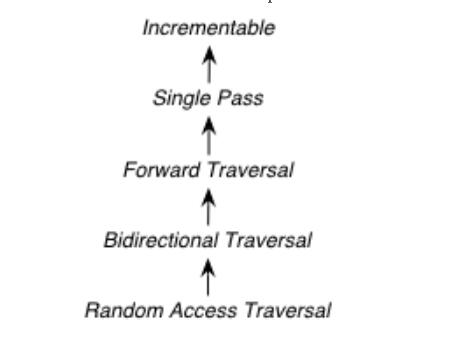
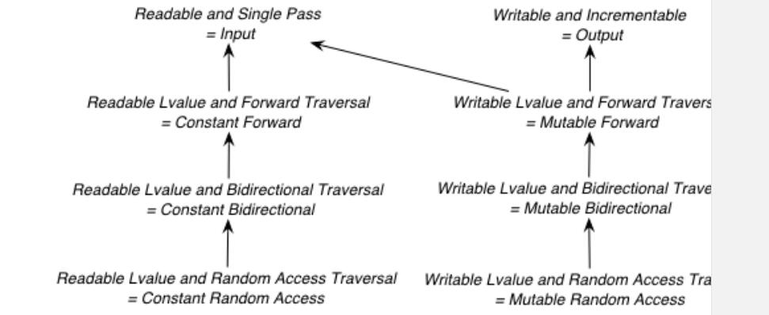

# New Iterator Concepts

## Motivation

The standard iterator categories and requirements are flawed because they use a single hierarchy of concepts to address two orthogonal issues: **iterator traversal** and **value access**. 

> NOTE: 关于上面这一段中的orthogonal ，参见维基百科[Orthogonality (programming)](https://en.wikipedia.org/wiki/Orthogonality_(programming))

As a result, many algorithms with requirements expressed in terms of the iterator categories are too strict. Also, many real-world iterators can not be accurately categorized. A proxy-based iterator with random-access traversal, for example, may only legally have a category of “input iterator”, so generic algorithms are unable to take advantage of its random-access capabilities. The current iterator concept hierarchy is geared towards **iterator traversal** (hence the category names), while requirements that address **value access** sneak in at various places. The following table gives a summary of the current **value access requirements** in the iterator categories.

### Value Access Requirements in Existing Iterator Categories
|      |      |
| ---- | ---- |
|Output Iterator |`*i = a`|
|Input Iterator |`*i` is convertible to `T`|
|Forward Iterator| `*i` is `T&` (or `const T&` once issue 200 is resolved) |
|Random Access Iterator |`i[n]` is convertible to `T` (also `i[n] = t` is required for mutable iterators once issue 299 is resolved)|

Because iterator traversal and value access are mixed together in a single hierarchy, many useful iterators can not be appropriately categorized. For example, `vector<bool>::iterator` is almost a random access iterator, but the return type is not `bool&` (see issue 96 and Herb Sutter’s paper J16/990008 = WG21 N1185). Therefore, the iterators of `vector<bool>` only meet the requirements of **input iterator** and **output iterator**. This is so nonintuitive that the C++ standard contradicts itself on this point. In paragraph 23.2.4/1 it says that a vector is a sequence that supports **random access iterators**.

> NOTE: 上面这段中关于`vector<boo>`的讨论，搜索 “`vector<bool>` is not a container, and its iterators aren't random access iterators”，可以获得详细的介绍
>
> 关于random access iterator的named requirement，参见[C++ named requirements: *LegacyRandomAccessIterator*](https://en.cppreference.com/w/cpp/named_req/RandomAccessIterator)

Another difficult-to-categorize iterator is the **transform iterator**, an **adaptor** which applies a unary function object to the dereferenced value of the some underlying iterator (see [transform iterator](http://www.boost.org/libs/utility/transform_iterator.htm)). For unary functions such as times, the return type of `operator*` clearly needs to be the `result_type` of the function object, which is typically not a **reference**. Because **random access iterators** are required to return lvalues from `operator*`, if you wrap `int*` with a **transform iterator**, you do not get a random access iterator as might be expected, but an input iterator.

> NOTE: transform iterator是一个adaptor，所以它有一个underlying iterator 

A third example is found in the vertex and edge iterators of the Boost Graph Library. These iterators return vertex and edge descriptors, which are lightweight handles created on-the-fly. They must be returned by-value. As a result, their current standard iterator category is `input_iterator_tag`, which means that, strictly speaking, you could not use these iterators with algorithms like `min_element()`. As a temporary solution, the concept **Multi-Pass Input Iterator** was introduced to describe the vertex and edge descriptors, but as the design notes for the concept suggest, a better solution is needed.

In short, there are many useful iterators that do not fit into the current standard iterator categories.

As a result, the following bad things happen:

-  Iterators are often mis-categorized.
- Algorithm requirements are more strict than necessary, because they cannot separate the need for random access or bidirectional traversal from the need for a true reference return type.

## Impact on the Standard

### Possible (but not proposed) Changes to the Working Paper

#### Changes to Algorithm Requirements

For the next working paper (but not for TR1), the committee should consider the following changes to the type requirements of algorithms. These changes are phrased as textual substitutions, listing the algorithms to which each textual substitution applies.

Forward Iterator -> Forward Traversal Iterator and Readable Iterator

`find_end`, `adjacent_find`, `search`, `search_n`, `rotate_copy`, `lower_bound`, `upper_bound`, `equal_range`, `binary_search`, `min_element`, `max_element`

#### Deprecations

For the next working paper (but not for TR1), the committee should consider deprecating the old iterator tags, and `std::iterator traits`, since it will be superceded by individual traits metafunctions.

#### `vector<bool>`

For the next working paper (but not for TR1), the committee should consider reclassifying `vector<bool>::iterator` as a Random Access Traversal Iterator and Readable Iterator and Writable
Iterator.

## Design

The iterator requirements are to be separated into two groups. One set of concepts handles the syntax and semantics of value access:

- Readable Iterator
- Writable Iterator
- Swappable Iterator
- Lvalue Iterator

The access concepts describe requirements related to `operator*` and `operator->`, including the `value_type`, `reference`, and pointer associated types.

The other set of concepts handles traversal:

- Incrementable Iterator
- Single Pass Iterator
- Forward Traversal Iterator
- Bidirectional Traversal Iterator
- Random Access Traversal Iterator

The refinement relationships for the traversal concepts are in the following diagram.

The reason for the fine grain slicing of the concepts into the **Incrementable** and **Single Pass** is to provide concepts that are exact matches with the original input and output iterator requirements.

> NOTE: incremental 和 single pass之间是什么区别？

This proposal also includes a concept for specifying when an iterator is interoperable with another iterator, in the sense that `int*` is interoperable with `int const*`.

- Interoperable Iterators

A difficult design decision concerned the `operator[]`. The direct approach for specifying `operator[]` would have a return type of reference; the same as `operator*`. However, going in this direction would mean that an iterator satisfying the old Random Access Iterator requirements would not necessarily be a model of Readable or Writable Lvalue Iterator. Instead we have chosen a design that matches the preferred resolution of issue 299: operator[] is only required to return something convertible to the `value_type` (for a **Readable Iterator**), and is required to support assignment `i[n] = t` (for a **Writable Iterator**).