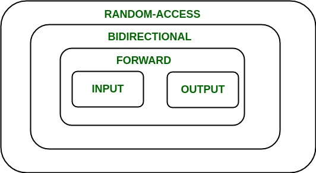

# Iterator library

## geeksforgeeks[Introduction to Iterators in C++](https://www.geeksforgeeks.org/introduction-iterators-c/)

Now each one of these iterators are not supported by all the containers in STL, different containers support different iterators, like vectors support [Random-access iterators](https://www.geeksforgeeks.org/random-access-iterators-in-cpp/), while lists support [bidirectional iterators.](https://www.geeksforgeeks.org/bidirectional-iterators-in-cpp/) The whole list is as given below:

**Types of iterators**: Based upon the functionality of the iterators, they can be classified into five major categories:

1. [**Input Iterators**](https://www.geeksforgeeks.org/input-iterators-in-cpp/): They are the weakest of all the iterators and have very limited functionality. They can only be used in a single-pass algorithms, i.e., those algorithms which process the container sequentially, such that no element is accessed more than once.
2. [**Output Iterators**](https://www.geeksforgeeks.org/output-iterators-cpp/): Just like [input iterators](https://www.geeksforgeeks.org/input-iterators-in-cpp/), they are also very limited in their functionality and can only be used in single-pass algorithm, but not for accessing elements, but for being assigned elements.
3. [**Forward Iterator**](https://www.geeksforgeeks.org/forward-iterators-in-cpp/): They are higher in the hierarachy than[ input](https://www.geeksforgeeks.org/input-iterators-in-cpp/) and [output iterators](https://www.geeksforgeeks.org/output-iterators-cpp/), and contain all the features present in these two iterators. But, as the name suggests, they also can only move in a forward direction and that too one step at a time.
4. [**Bidirectional Iterators**](https://www.geeksforgeeks.org/bidirectional-iterators-in-cpp/): They have all the features of[ forward iterators](https://www.geeksforgeeks.org/forward-iterators-in-cpp/) along with the fact that they overcome the drawback of [forward iterators](https://www.geeksforgeeks.org/forward-iterators-in-cpp/), as they can move in both the directions, that is why their name is bidirectional.
5. [**Random-Access Iterators**](https://www.geeksforgeeks.org/random-access-iterators-in-cpp/): They are the most powerful iterators. They are not limited to moving sequentially, as their name suggests, they can randomly access any element inside the container. They are the ones whose functionality are same as pointers.

## cppreference [Iterator library](https://en.cppreference.com/w/cpp/iterator)

Instead of being defined by specific types, each category of iterator is defined by the operations that can be performed on it. This definition means that any type that supports the necessary operations can be used as an iterator -- for example, a pointer supports all of the operations required by [*LegacyRandomAccessIterator*](https://en.cppreference.com/w/cpp/named_req/RandomAccessIterator), so a pointer can be used anywhere a [*LegacyRandomAccessIterator*](https://en.cppreference.com/w/cpp/named_req/RandomAccessIterator) is expected.

> NOTE: 

> NOTE: STL是基于template的，而template是基于behavior的，所以在STL中，下面罗列的几种类型的iterator并没有对应的type，这一点和我们习惯的对OOP的认知是相左的。但是有些iterator定义了对应的type的，这些iterator并不属于下面罗列的几种类型的iterator，下面对这两种情况进行总结：
>
> 没有定义iterator type：
>
> [Containers library](https://en.cppreference.com/w/cpp/container)中的各种container的iterator都没有统一的定义iterator的type。
>
> 定义iterator type：
>
> **基类**：
>
> [std::iterator](https://en.cppreference.com/w/cpp/iterator/iterator)
>
> **insert iterator**：
>
> - [back_insert_iterator](https://en.cppreference.com/w/cpp/iterator/back_insert_iterator)
>
> - [front_insert_iterator](https://en.cppreference.com/w/cpp/iterator/front_insert_iterator)
>
> - [insert_iterator](https://en.cppreference.com/w/cpp/iterator/insert_iterator)
>
> **Stream iterators**：
>
> | input iterator                                               | output iterator                                              |
> | ------------------------------------------------------------ | ------------------------------------------------------------ |
> | [istream_iterator](https://en.cppreference.com/w/cpp/iterator/istream_iterator) | [ostreambuf_iterator](https://en.cppreference.com/w/cpp/iterator/ostreambuf_iterator) |
> | [istreambuf_iterator](https://en.cppreference.com/w/cpp/iterator/istreambuf_iterator) | [ostream_iterator](https://en.cppreference.com/w/cpp/iterator/ostream_iterator) |
>
> 这些定义了iterator type的，需要通过iterator type来显式地构造iterator。

## cppreference [Named requirements of  iterator](https://en.cppreference.com/w/cpp/named_req#Iterator)