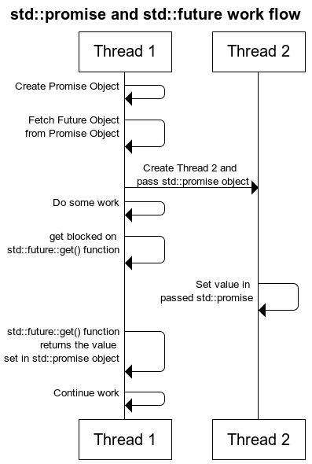

# `std::promise` and `std::future`  


## thispointer [C++11 Multithreading – Part 8: std::future , std::promise and Returning values from Thread](https://thispointer.com/c11-multithreading-part-8-stdfuture-stdpromise-and-returning-values-from-thread/)

A `std::future` object can be used with `std::asyc`, `std::packaged_task` and `std::promise`. In this article will mainly focus on using `std::future` with `std::promise` object.

Many times we encounter a situation where we want a thread to return a result.

Now question is how to do this?

Lets take an example,

Suppose in our application we created a thread that will compress a given folder and we want this thread to return the new zip file name and its size in result.

Now to do this we have 2 ways,

### 1.) Old Way : Share data among threads using pointer

Pass a pointer to the new thread and this thread will set the data in it. Till then in main thread keep on waiting using a condition variable. When new thread sets the data and signals the condition variable, then main thread will wake up and fetch the data from that pointer.

To do a simple thing we used a condition variable, a mutex and a pointer i.e. 3 items to catch a returned value.
Now suppose we want this thread to return 3 different values at different point of time then problem will become more complex. Could there be a simple solution for returning the value from threads.

The answer is yes using `std::future`, checkout next solution for it.

### 2.) C++11 Way : Using `std::future` and `std::promise`

**std::future** is a class template and its object stores the future value.

Now what the hell is this future value.

Actually a **std::future** object internally stores a value that will be assigned in future and it also provides a mechanism to access that value i.e. using `get()` member function. But if somebody tries to access this associated value of future through `get()` function before it is available, then `get()` function will block till value is not available.

**std::promise** is also a class template and its object promises to set the value in future. Each `std::promise` object has an associated `std::future` object that will give the value once set by the `std::promise` object.

A **std::promise** object shares data with its associated **std::future** object.

Lets see step by step,

Create a `std::promise` object in Thread1.

```C++
std::promise<int> promiseObj;
```

As of now this **promise object** doesn’t have any associated value. But it **gives a promise** that somebody will surely set the value in it and once its set then you can get that value through associated `std::future` object.

But now suppose Thread 1 created this promise object and passed it to Thread 2 object. Now how Thread 1 can know that when Thread 2 is going to set the value in this promise object?

**The answer is using `std::future` object.**

Every `std::promise` object has an associated `std::future` object, through which others can fetch the value set by promise.

So, Thread 1 will create the `std::promise` object and then fetch the `std::future` object from it before passing the `std::promise` object to thread 2 i.e.

```C++
std::future<int> futureObj = promiseObj.get_future();
```


Now Thread 1 will pass the `promiseObj` to Thread 2.

Then Thread 1 will fetch the value set by Thread 2 in `std::promise` through `std::future`’s `get` function,

```C++
int val = futureObj.get();
```

But if value is not yet set by thread 2 then this call will get blocked until thread 2 sets the value in promise object i.e.

```c++
promiseObj.set_value(45);
```

Check out complete flow in following Diagram,




Lets see a complete `std::future` and `std::promise` example,

```C++
#include <iostream>
#include <thread>
#include <future>
void initiazer(std::promise<int> *promObj)
{
	std::cout << "Inside Thread" << std::endl;
	promObj->set_value(35);
}
int main()
{
	std::promise<int> promiseObj;
	std::future<int> futureObj = promiseObj.get_future();
	std::thread th(initiazer, &promiseObj);
	std::cout << futureObj.get() << std::endl;
	th.join();
	return 0;
}
// g++ --std=c++11 test.cpp -lpthread


```

If `std::promise` object is destroyed before setting the value the calling `get()` function on associated `std::future` object will throw exception.

A part from this, if you want your thread to return multiple values at different point of time then just pass multiple `std::promise` objects in thread and fetch multiple return values from thier associated multiple `std::future` objects.

In the next article we will see how to use `std::future` with `std::async` and `std::packaged_task`.