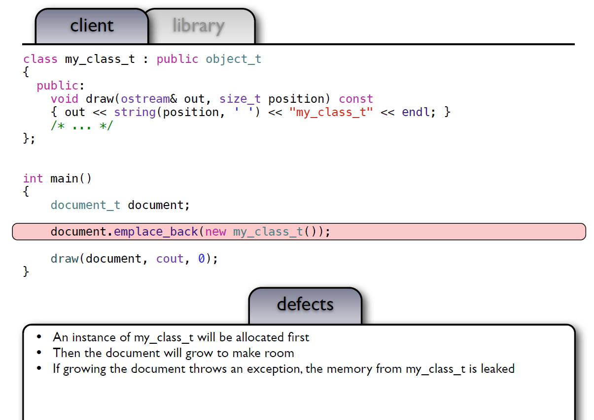

# sean-parent [Value Semantics and Concept-based Polymorphism](https://sean-parent.stlab.cc/papers-and-presentations/#value-semantics-and-concept-based-polymorphism)

## Outline of Talk

1、Defining Value Semantics

2、“Polymorphic Types”

3、Demo of Photoshop History

4、Implement History

## Disclaimer

In the following code, the proper use of header files, `inline` functions, and namespaces are ignored for clarity

## Client、library、guideline

> NOTE: 这一段，作者使用一个简单的例子来说明client、library的概念，后面的demo程序都是基于client、library的概念的

### client

```C++
int main()
{
	document_t document;
	document.emplace_back(0);
	document.emplace_back(1);
	document.emplace_back(2);
	document.emplace_back(3);
	draw(document, cout, 0);
}

```

### library

```C++
using object_t = int;
void draw(const object_t &x, ostream &out, size_t position)
{
	out << string(position, ' ') << x << endl;
}
using document_t = vector<object_t>;
void draw(const document_t &x, ostream &out, size_t position)
{
	out << string(position, ' ') << "<document>" << endl;
	for (const auto &e : x)
		draw(e, out, position + 2);
	out << string(position, ' ') << "</document>" << endl;
}

```

### 完整程序

```C++
#include <iostream>
#include <vector>
using namespace std;

using object_t = int;
void draw(const object_t &x, ostream &out, size_t position)
{
	out << string(position, ' ') << x << endl;
}
using document_t = vector<object_t>;
void draw(const document_t &x, ostream &out, size_t position)
{
	out << string(position, ' ') << "<document>" << endl;
	for (const auto &e : x)
		draw(e, out, position + 2);
	out << string(position, ' ') << "</document>" << endl;
}
int main()
{
	document_t document;
	document.emplace_back(0);
	document.emplace_back(1);
	document.emplace_back(2);
	document.emplace_back(3);
	draw(document, cout, 0);
}
//g++ --std=c++11 -Wall -pedantic test.cpp && ./a.out

```

> NOTE: 输出如下:
>
> ```C++
> <document>
>   0
>   1
>   2
>   3
> </document>
> ```
>
> 


### guidelines

Write all code as a library:

1、Reuse increases your productivity.
2、Writing unit tests is simplified.


## Polymorphism

What happens if we want the document to hold any drawable object?

### library

```C++
class object_t
{
public:
	virtual ~object_t()
	{
	}
	virtual void draw(ostream&, size_t) const = 0;
};
using document_t = vector<shared_ptr<object_t>>;
void draw(const document_t &x, ostream &out, size_t position)
{
	out << string(position, ' ') << "<document>" << endl;
	for (const auto &e : x)
		e->draw(out, position + 2);
	out << string(position, ' ') << "</document>" << endl;
}

```

### client

```c++
class my_class_t: public object_t
{
public:
	void draw(ostream &out, size_t position) const
	{
		out << string(position, ' ') << "my_class_t" << endl;
	}
	/* ... */
};
int main()
{
	document_t document;
	document.emplace_back(new my_class_t());
	draw(document, cout, 0);
}

```

### 完整程序

```C++
#include <iostream>
#include <vector>
#include <memory>

using namespace std;

class object_t
{
public:
	virtual ~object_t()
	{
	}
	virtual void draw(ostream&, size_t) const = 0;
};
using document_t = vector<shared_ptr<object_t>>;
void draw(const document_t &x, ostream &out, size_t position)
{
	out << string(position, ' ') << "<document>" << endl;
	for (const auto &e : x)
		e->draw(out, position + 2);
	out << string(position, ' ') << "</document>" << endl;
}

class my_class_t: public object_t
{
public:
	void draw(ostream &out, size_t position) const
	{
		out << string(position, ' ') << "my_class_t" << endl;
	}
	/* ... */
};
int main()
{
	document_t document;
	document.emplace_back(new my_class_t());
	draw(document, cout, 0);
}
//g++ --std=c++11 -Wall -pedantic test.cpp && ./a.out

```

> NOTE: 输出如下:
>
> ```C++
> <document>
>   my_class_t
> </document>
> 
> ```
>
> 

### defects




## Deep problem #1