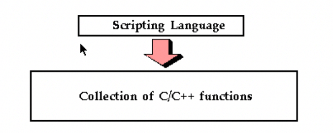

# 4 Scripting Languages

> NOTE: 本节的内容对于理解SWIG的implementation非常重要。

## 4.1 The two language view of the world

When a **scripting language** is used to control a C program, the resulting system tends to look as follows:



The two-language model of computing is extremely powerful because it exploits the strengths of each language. C/C++ can be used for maximal performance and complicated systems programming tasks. Scripting languages can be used for rapid prototyping, interactive debugging, scripting, and access to high-level data structures such associative arrays. 

> NOTE: 这段话提出了一个非常好的概括: "the two-language model of computing"


## 4.2 How does a scripting language talk to C?

**Scripting languages** are built around a parser that knows how to execute commands and scripts. Within this parser, there is a mechanism for **executing commands** and **accessing variables**. Normally, this is used to implement the builtin features of the language. 

However, by extending the interpreter, it is usually possible to add new commands and variables. To do this, most languages define a special API for adding new commands. Furthermore, a special **foreign function interface** defines how these new commands are supposed to hook into the interpreter. 

Typically, when you add a new command to a scripting interpreter you need to do two things: 

1、first you need to write a special "wrapper" function that serves as the glue between the interpreter and the underlying C function. 

2、Then you need to give the interpreter information about the wrapper by providing details about the name of the function, arguments, and so forth. 

The next few sections illustrate the process. 

### 4.2.1 Wrapper functions 

Suppose you have an ordinary C function like this 

```c
int fact(int n)
{
  if (n <= 1)
    return 1;
  else
    return n * fact(n - 1);
}
```

In order to access this function from a scripting language, it is necessary to write a special "wrapper" function that serves as the glue between the scripting language and the underlying C function. A wrapper function must do three things : 

1、Gather function arguments and make sure they are valid. 

2、Call the C function. 

3、Convert the return value into a form recognized by the scripting language.

As an example, the Tcl wrapper function for the **fact()** function above example might look like the following : 

```c

int wrap_fact(ClientData clientData, Tcl_Interp *interp, int argc, char *argv[])
{
  int result;
  int arg0;
  if (argc != 2)
  {
    interp->result = "wrong # args";
    return TCL_ERROR;
  }
  arg0 = atoi(argv[1]);
  result = fact(arg0);
  sprintf(interp->result, "%d", result);
  return TCL_OK;
}

```

Once you have created a wrapper function, the final step is to tell the scripting language about the new function. This is usually done in an initialization function called by the language when the module is loaded. For example, adding the above function to the Tcl interpreter requires code like the following : 

```c

int Wrap_Init(Tcl_Interp *interp)
{
  Tcl_CreateCommand(interp, "fact", wrap_fact, (ClientData)NULL, (Tcl_CmdDeleteProc *)NULL);
  return TCL_OK;
}

```

When executed, Tcl will now have a new command called "**fact** " that you can use like any other Tcl command. 


### 4.2.2 Variable linking


Variable linking refers to the problem of mapping a C/C++ global variable to a variable in the scripting language interpreter.


```tcl
$a = $Foo * 2.3; # Evaluation 
$Foo = $a + 2.0; # Assignment
```

To provide such access, variables are commonly manipulated using a pair of get/set functions. 

### 4.2.3 Constants

### 4.2.4 Structures and classes

The most straightforward technique for handling structures is to implement a collection of **accessor functions** that hide the underlying representation of a structure. For example, 

```c++
struct Vector
{
  Vector();
  ~Vector();
  double x, y, z;
};
```

can be transformed into the following set of functions : 


```c++
Vector *new_Vector();
void delete_Vector(Vector *v);
double Vector_x_get(Vector *v);
double Vector_y_get(Vector *v);
double Vector_z_get(Vector *v);
void Vector_x_set(Vector *v, double x);
void Vector_y_set(Vector *v, double y);
void Vector_z_set(Vector *v, double z);
```


Now, from an interpreter these function might be used as follows:

```tcl
% set v [new_Vector] 
% Vector_x_set $v 3.5 
% Vector_y_get $v 
% delete_Vector $v 
% ...
```


Since accessor functions provide a mechanism for accessing the internals of an object, the interpreter does not need to know anything about the actual representation of a **Vector**. 


### 4.2.5 Proxy classes

In certain cases, it is possible to use the low-level accessor functions to create a **proxy class**, also known as a **shadow class**. A **proxy class** is a special kind of object that gets created in a scripting language to access a C/C++ class (or struct) in a way that looks like the original structure (that is, it proxies the real C++ class). For example, if you have the following C++ definition : 

```c++
struct Vector
{
  Vector();
  ~Vector();
  double x, y, z;
};
```

A proxy classing mechanism would allow you to access the structure in a more natural manner from the interpreter. For example, in Python, you might want to do this: 

```TCL
>>> v = Vector() 
>>> v.x = 3 
>>> v.y = 4 
>>> v.z = -13 
>>> ... 
>>> del v
```


## 4.3 Building scripting language extensions

The final step in using a scripting language with your C/C++ application is adding your extensions to the scripting language itself. There are two primary approaches for doing this. The preferred technique is to build a dynamically loadable extension in the form of a shared library. Alternatively, you can recompile the scripting language interpreter with your extensions added to it. 

