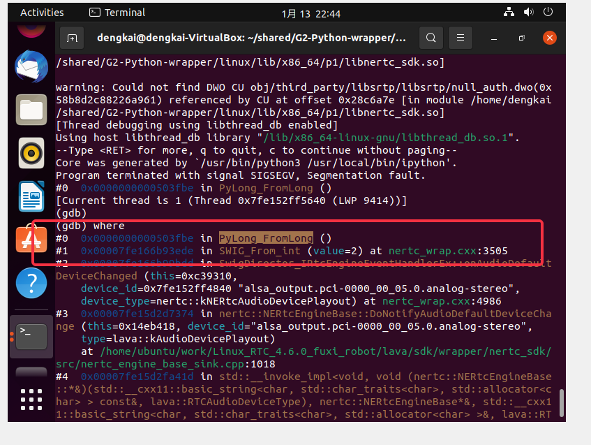

# callback and multithread

"昨天的segment fault的问题解决了；本质上应该是多线程竞争导致的，我们用Python写的回调是由C++SDK中的线程执行的，并且同一个回调函数可能会被多次执行，这就导致了Python解释器的竞争；CPython提供了Global Interpreter Lock (GIL)，所以改法就是为所有的回调函数都上锁；之前在dart ffi中也有类似的问题，dart提供的方法是queue；"




参见:

### 一、Google "`PyLong_FromLong` core dump" 

一、在 [**Bug 1788918**](https://bugzilla.redhat.com/show_bug.cgi?id=1788918) **- librepo fails to build with Python 3.9 (segmentation fault in %check)** 中，找到了关键的解决方法；粗略的浏览了一下这个bugzilla，找到了两条关键思路:

1、small integer

```
Lukáš Hrázký 2020-01-13 16:20:10 UTC
```


2、GIL

```
Victor Stinner 2020-01-15 15:27:56 UTC
```

其中罗列了关键信息


后面因此按照上述两个思路进行尝试。

二、small integer

1、thecodingforums [PyObject_CallObject code dump after calling 4 times](https://www.thecodingforums.com/threads/pyobject_callobject-code-dump-after-calling-4-times.566237/)

2、[Debugging crash in Python 3.6 #884](https://github.com/pythonnet/pythonnet/issues/884)

三、GIL

swig doc 32.13 Support for Multithreaded Applications

通过全局搜索 "GIL" 找到了正解。

二、猜测原因: link-time error

1、stackoverflow [segfault using SWIG converted code for tcl](https://stackoverflow.com/questions/18375668/segfault-using-swig-converted-code-for-tcl)

2、stackoverflow [C++: linked library disappears and gives segfault during execution](https://stackoverflow.com/questions/18379452/c-linked-library-disappears-and-gives-segfault-during-execution)

`ldd -r ` 看了一下，的确有很多的undefined symbol，我着重看了以 `_` 打头的，发现其中有 `_Py_NoneStruct` ，按照stackoverflow [Boost Python - undefined reference to `_Py_NoneStruct'](https://stackoverflow.com/questions/63139865/boost-python-undefined-reference-to-py-nonestruct) 中的解答，我添加了对Python dynamic library的dynamic link:

```C++
-L/usr/lib/x86_64-linux-gnu -lpython3.9 
```


三、source code

https://github.com/python/cpython/blob/main/Objects/longobject.c


四、

