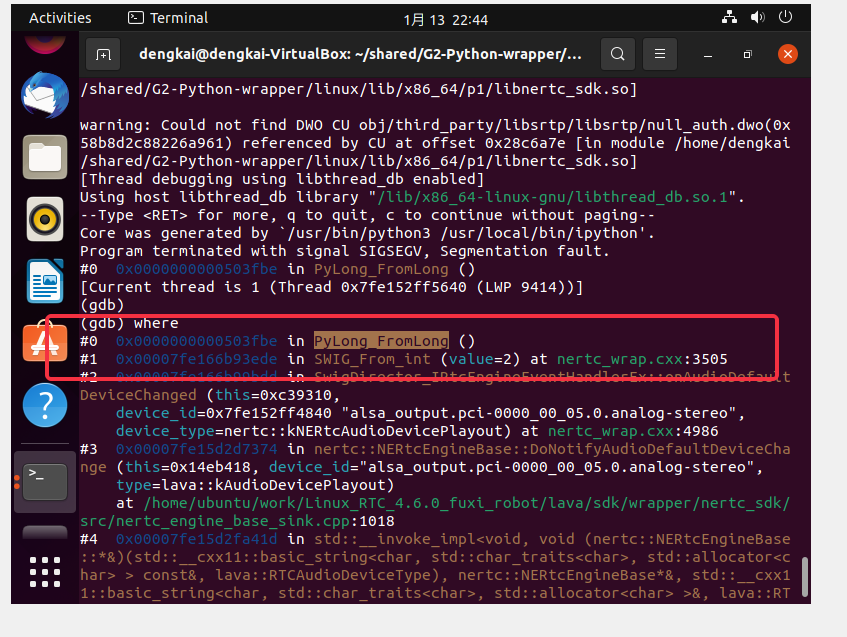

# SWIG director

一、`D:\Program Files\swigwin-4.0.2\Examples\python\callback`

二、

5.1 Running SWIG

```
-directors - Turn on director mode for all the classes, mainly for testing
-nodirprot - Do not wrap director protected members
```

5.4.9 Pointers to functions and callbacks

> The 'director' feature can be used to make callbacks from C/C++ into the target language, see Callbacks to the target language.

6.29 Callbacks to the target language

> C/C++ function pointers are often used for callbacks and this is discussed in the Pointers to functions and callbacks section. The callback techniques described therein provide a way to control callbacks to a C/C++ function but not callbacks into the target language. The techniques described below show how the director feature can be used to support callbacks from C/C++ to the target language.


三、Google: swig c++ virtual class、swig c++ pure virtual function

1、stackoverflow [Using SWIG to wrap C++ class with virtual methods and overriding them in python](https://stackoverflow.com/questions/6684253/using-swig-to-wrap-c-class-with-virtual-methods-and-overriding-them-in-python)

[A](https://stackoverflow.com/a/6737491/10173843)

> NOTE: 
>
> 其中涉及了:
>
> ```C++
> %typemap(directorin)
> ```


2、github [Python and C++ : Overloading virtual function #897](https://github.com/swig/swig/issues/897)

[A](https://github.com/swig/swig/issues/897#issuecomment-281733842)

I have not yet tried to call Python function from C++ code. However, this seems possible by using a [SWIG director class](http://www.swig.org/Doc3.0/Python.html#Python_nn34).

Looking for [SWIG + Python + director](https://encrypted.google.com/search?hl=en&q=SWIG %2B Python %2B director) on gogole may help you!

For example: http://rjp.io/2013/05/07/swigdirectors-subclassing-from-python/

四、github [Python and C++ : Overloading virtual function #897](https://github.com/swig/swig/issues/897) # [Disambiguate overloaded virtual calls based on function argument count](https://github.com/swig/swig/issues/897#issuecomment-314125854)	

非常好的内容。

五、stackoverflow [Swig directors and smart pointers in Python](https://stackoverflow.com/questions/48206146/swig-directors-and-smart-pointers-in-python)

六、stackoverflow [SWIG JAVA how to wrap C++ multiple inheritance with %interface and pure virtual methods](https://stackoverflow.com/questions/38358017/swig-java-how-to-wrap-c-multiple-inheritance-with-interface-and-pure-virtual)

## implementation


## callback 和 多线程

"昨天的segment fault的问题解决了；本质上应该是多线程竞争导致的，我们用Python写的回调是由C++SDK中的线程执行的，并且同一个回调函数可能会被多次执行，这就导致了Python解释器的竞争；CPython提供了Global Interpreter Lock (GIL)，所以改法就是为所有的回调函数都上锁；之前在dart ffi中也有类似的问题，dart提供的方法是queue；"




参见:

### 一、Google "`PyLong_FromLong` core dump" 

一、在 [**Bug 1788918**](https://bugzilla.redhat.com/show_bug.cgi?id=1788918) **- librepo fails to build with Python 3.9 (segmentation fault in %check)** 中，找到了关键的解决方法；粗略的浏览了一下这个bugzilla，找到了两条关键思路:

1、small integer

```
Lukáš Hrázký 2020-01-13 16:20:10 UTC
```


2、GIL

```
Victor Stinner 2020-01-15 15:27:56 UTC
```

其中罗列了关键信息


后面因此按照上述两个思路进行尝试。

二、small integer

1、thecodingforums [PyObject_CallObject code dump after calling 4 times](https://www.thecodingforums.com/threads/pyobject_callobject-code-dump-after-calling-4-times.566237/)

2、[Debugging crash in Python 3.6 #884](https://github.com/pythonnet/pythonnet/issues/884)

三、GIL

swig doc 32.13 Support for Multithreaded Applications

通过全局搜索 "GIL" 找到了正解。

二、猜测原因: link-time error

1、stackoverflow [segfault using SWIG converted code for tcl](https://stackoverflow.com/questions/18375668/segfault-using-swig-converted-code-for-tcl)

2、stackoverflow [C++: linked library disappears and gives segfault during execution](https://stackoverflow.com/questions/18379452/c-linked-library-disappears-and-gives-segfault-during-execution)

`ldd -r ` 看了一下，的确有很多的undefined symbol，我着重看了以 `_` 打头的，发现其中有 `_Py_NoneStruct` ，按照stackoverflow [Boost Python - undefined reference to `_Py_NoneStruct'](https://stackoverflow.com/questions/63139865/boost-python-undefined-reference-to-py-nonestruct) 中的解答，我添加了对Python dynamic library的dynamic link:

```C++
-L/usr/lib/x86_64-linux-gnu -lpython3.9 
```


三、source code

https://github.com/python/cpython/blob/main/Objects/longobject.c


四、


## test

```C
%{
int binary_op(int a, int b, int (*op)(int, int)) {
return op(a, b);
}
%}
%feature("director") BinaryOp;
%inline %{
struct BinaryOp {
virtual int handle(int a, int b) = 0;
virtual ~BinaryOp() {}
};
%}
%{
static BinaryOp *handler_ptr = NULL;
static int handler_helper(int a, int b) {
// Make the call up to the target language when handler_ptr
// is an instance of a target language director class
return handler_ptr->handle(a, b);
}
// If desired, handler_ptr above could be changed to a thread-local variable in order to make thread-safe
%}
%inline %{
int binary_op_wrapper(int a, int b, BinaryOp *handler) {
handler_ptr = handler;
int result = binary_op(a, b, &handler_helper);
handler = NULL;
return result;
}
%}
```


```Python
class Test(BinaryOp):
    def __init__(self):
        super(Test, self).__init__()

    def handle(self, a, b):
        """

        """
        print(f"a={a}, b={b}")
        return a + b

```

## swig director exception

stackoverflow [Swig exception in Python director class](https://stackoverflow.com/questions/55489154/swig-exception-in-python-director-class)