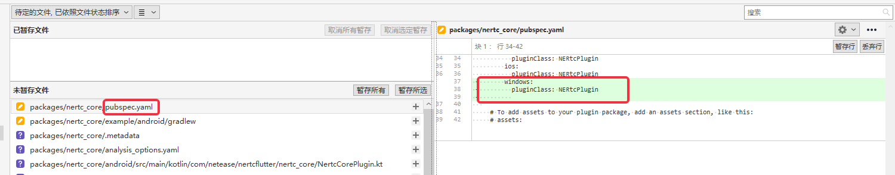

# diary yunxin rtc windows plugin

按照在 docs [Developing packages & plugins](https://docs.flutter.dev/development/packages-and-plugins/developing-packages)  中的介绍，执行如下命令：

```shell
flutter create --template=plugin --platforms=windows . --org com.netease.nertcflutter
```

在docs [Developing packages & plugins # Add support for platforms in an existing plugin project](https://docs.flutter.dev/development/packages-and-plugins/developing-packages#add-support-for-platforms-in-an-existing-plugin-project) 中也介绍了如何向一个existing project中添加新的platform的支持。


命令执行过程的记录：

```shell
PS D:\NetEase\yunxin-sdk-flutter\packages\nertc_core> flutter create --template=plugin --platforms=windows . --org com.netease.nertcflutter
Flutter assets will be downloaded from https://storage.flutter-io.cn. Make sure you trust this source!
Recreating project ....
  .idea\runConfigurations\example_lib_main_dart.xml (created)
  .metadata (created)
  analysis_options.yaml (created)
  android\nertc_core_android.iml (created)
  android\src\main\kotlin\com\netease\nertcflutter\nertc_core\NertcCorePlugin.kt (created)
  ios\Classes\NertcCorePlugin.h (created)
  ios\Classes\NertcCorePlugin.m (created)
  ios\Classes\SwiftNertcCorePlugin.swift (created)
  ios\nertc_core.podspec (created)
  lib\nertc_core.dart (created)
  test\nertc_core_test.dart (created)
  windows\CMakeLists.txt (created)
  windows\include\nertc_core\nertc_core_plugin.h (created)
  windows\nertc_core_plugin.cpp (created)
Running "flutter pub get" in nertc_core...                         508ms
  example\.idea\libraries\Dart_SDK.xml (created)
  example\.idea\libraries\KotlinJavaRuntime.xml (created)
  example\.idea\modules.xml (created)
  example\.idea\runConfigurations\main_dart.xml (created)
  example\.idea\workspace.xml (created)
  example\analysis_options.yaml (created)
  example\android\app\src\main\kotlin\com\netease\nertcflutter\nertc_core_example\MainActivity.kt (created)
  example\android\nertc_core_example_android.iml (created)
  example\android\app\src\main\res\drawable-v21\launch_background.xml (created)
  example\android\app\src\main\res\values-night\styles.xml (created)
  example\ios\Runner\AppDelegate.swift (created)       
  example\ios\Runner\Runner-Bridging-Header.h (created)
  example\ios\Runner.xcodeproj\project.xcworkspace\xcshareddata\IDEWorkspaceChecks.plist (created)
  example\ios\Runner.xcworkspace\xcshareddata\IDEWorkspaceChecks.plist (created)
  example\ios\Runner.xcworkspace\xcshareddata\WorkspaceSettings.xcsettings (created)
  example\nertc_core_example.iml (created)
  example\windows\.gitignore (created)
  example\windows\CMakeLists.txt (created)
  example\windows\flutter\CMakeLists.txt (created)
  example\windows\runner\CMakeLists.txt (created)
  example\windows\runner\flutter_window.cpp (created)
  example\windows\runner\flutter_window.h (created)
  example\windows\runner\main.cpp (created)
  example\windows\runner\resource.h (created)
  example\windows\runner\resources\app_icon.ico (created)
  example\windows\runner\runner.exe.manifest (created)
  example\windows\runner\Runner.rc (created)
  example\windows\runner\utils.cpp (created)
  example\windows\runner\utils.h (created)
  example\windows\runner\win32_window.cpp (created)
  example\windows\runner\win32_window.h (created)
Running "flutter pub get" in example...                          1,950ms
Wrote 48 files.

All done!

Your plugin code is in .\lib\nertc_core.dart.

Your example app code is in .\example\lib\main.dart.


Host platform code is in the windows directories under ..
To edit platform code in an IDE see https://flutter.dev/developing-packages/#edit-plugin-package.


You need to update ./pubspec.yaml to support windows.


To add platforms, run `flutter create -t plugin --platforms <platforms> .` under ..
For more information, see https://flutter.dev/go/plugin-platforms.

```


输出中，下面内容被标红了：

```
You need to update ./pubspec.yaml to support windows.
```

它是为了提示工程师，需要在 `./pubspec.yaml` 中添加Windows channel的支持，我参考 [Agora-Flutter-SDK](https://github.com/AgoraIO/Agora-Flutter-SDK)/[**pubspec.yaml**](https://github.com/AgoraIO/Agora-Flutter-SDK/blob/master/pubspec.yaml) 中的写法，做了如下修改：




## 如何build flutter windows plugin？

首先我按照在 [Desktop support for Flutter # Build a release app](https://docs.flutter.dev/desktop#build-a-release-app) 中的介绍，运行如下命令：

```shell
flutter build windows
```

报错如下：

```shell
Target file "lib\main.dart" not found.
```

其实这个问题更加准确的描述是"Testing your plugin"，在 [Developing packages & plugins # Testing your plugin](https://docs.flutter.dev/development/packages-and-plugins/developing-packages#testing-your-plugin) 中有着描述。


## betterprogramming [Create a Flutter Plugin To Write Platform-specific Code for Windows](https://betterprogramming.pub/flutter-platform-plugin-windows-1-8b7c0a96fac4)


```
C:\Program Files\Microsoft Visual Studio\2022\Community\VC\Tools\MSVC\14.31.31103\bin\HostX64\x64\CL.exe 
/c /I"D:\NetEase\yunxin-sdk-flutter\packages\nertc_core\example\windows"
/I"D:\NetEase\yunxin-sdk-flutter\packages\nertc_core\example\windows\flutter\ephemeral" 
/I"D:\NetEase\yunxin-sdk-flutter\packages\nertc_core\example\windows\flutter\ephemeral\cpp_client_wrapper\include"

/I"D:\NetEase\yunxin-sdk-flutter\packages\nertc_core\example\windows\flutter\ephemeral\.plugin_symlinks\nertc\windows\include" 
/nologo /W4 /WX /diagnostics:column /O2 /Ob2 /D _UNICODE /D UNICODE /D WIN32 /D _WINDOWS /D    
NDEBUG /D _HAS_EXCEPTIONS=0 /D NOMINMAX /D UNICODE /D _UNICODE /D "CMAKE_INTDIR=\"Release\"" /Gm- /EHsc /MD /GS /fp:precise /Zc:wchar_t /Zc:forScope /Zc:inline /GR /std:c++17 /Fo"nertc_example.dir\Release\\"
/Fd"nertc_example.dir\Release\vc143.pdb" /external:W4 /Gd /TP /wd4100 /errorReport:queue "D:\NetEase\yunxin-sdk-flutter\packages\nertc_core\example\windows\runner\flutter_window.cpp"
"D:\NetEase\yunxin-sdk-flutter\packages\nertc_core\example\windows\runner\main.cpp" "D:\NetEase\yunxin-sdk-flutter\packages\nertc_core\example\windows\runner\utils.cpp"
"D:\NetEase\yunxin-sdk-flutter\packages\nertc_core\example\windows\runner\win32_window.cpp" "D:\NetEase\yunxin-sdk-flutter\packages\nertc_core\example\windows\flutter\generated_plugin_registrant.cc"
[ +102 ms]   flutter_window.cpp
```


## 消息传递

### pigeon的原理

pigeon显然是基于在 [Writing custom platform-specific code](https://docs.flutter.dev/development/platform-integration/platform-channels?tab=type-mappings-c-plus-plus-tab) 中介绍的dart 和 c++ 类型的对应关系而建立的

| Dart                       | C++                                                        |
| -------------------------- | ---------------------------------------------------------- |
| null                       | EncodableValue()                                           |
| bool                       | EncodableValue(bool)                                       |
| int                        | `EncodableValue(int32_t)`                                  |
| int, if 32 bits not enough | `EncodableValue(int64_t)`                                  |
| double                     | `EncodableValue(double)`                                   |
| String                     | `EncodableValue(std::string)`                              |
| Uint8List                  | `EncodableValue(std::vector)`                              |
| Int32List                  | `EncodableValue(std::vector)`                              |
| Int64List                  | `EncodableValue(std::vector)`                              |
| Float32List                | `EncodableValue(std::vector)`                              |
| Float64List                | `EncodableValue(std::vector)`                              |
| List                       | `EncodableValue(std::vector)`                              |
| Map                        | `EncodableValue(std::map<EncodableValue, EncodableValue>)` |

可以看到，`Map` 对应的是 `EncodableValue(std::map<EncodableValue, EncodableValue>)`。

pigeon采用的是JSON来作为数据传输的格式，其实所谓JSON，其实就是 `std::map` 。

理论上来说，由于dart是跨平台的，因此在dart端生成的代码，应该是可以维持不变的。

#### serialization and deserialization

`encode` 将dart对象转换为JSON

`decode` 从JSON转换为dart对象 

在Java中，有 `Object` 类型，因此可以使用 `Map<String, Object>` 来统一的描述

在c++中，flutter使用`EncodableValue` 


#### pigeon支持PC

github [[pigeon] Add support for Windows #73739](https://github.com/flutter/flutter/issues/73739)

github [[pigeon] Add support for macOS #73738](https://github.com/flutter/flutter/issues/73738)

在其中提及了，使用pigeon生成的iOS代码在macOS上是同样可以使用的，只需要进行一点修改即可，关于此，参见 https://github.com/flutter/flutter/issues/73738#issuecomment-903927725 。

github [[pigeon] Add support for Linux #73740](https://github.com/flutter/flutter/issues/73740)


## flutter windows plugin

betterprogramming [Create a Flutter Plugin To Write Platform-specific Code for Windows](https://betterprogramming.pub/flutter-platform-plugin-windows-1-8b7c0a96fac4)

stackoverflow [Flutter Desktop Windows: How to call native code via Method Channel. (Make api calls in  header file)](https://stackoverflow.com/questions/67460070/flutter-desktop-windows-how-to-call-native-code-via-method-channel-make-api-c)

### examples

[flutter-desktop-embedding](https://github.com/google/flutter-desktop-embedding)/[**plugins**](https://github.com/google/flutter-desktop-embedding/tree/master/plugins)/