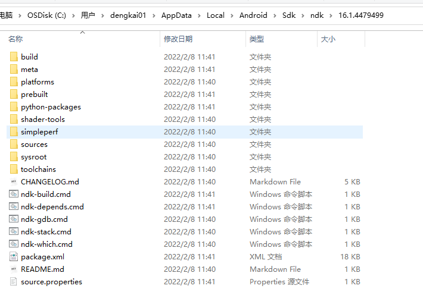
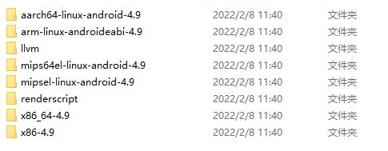
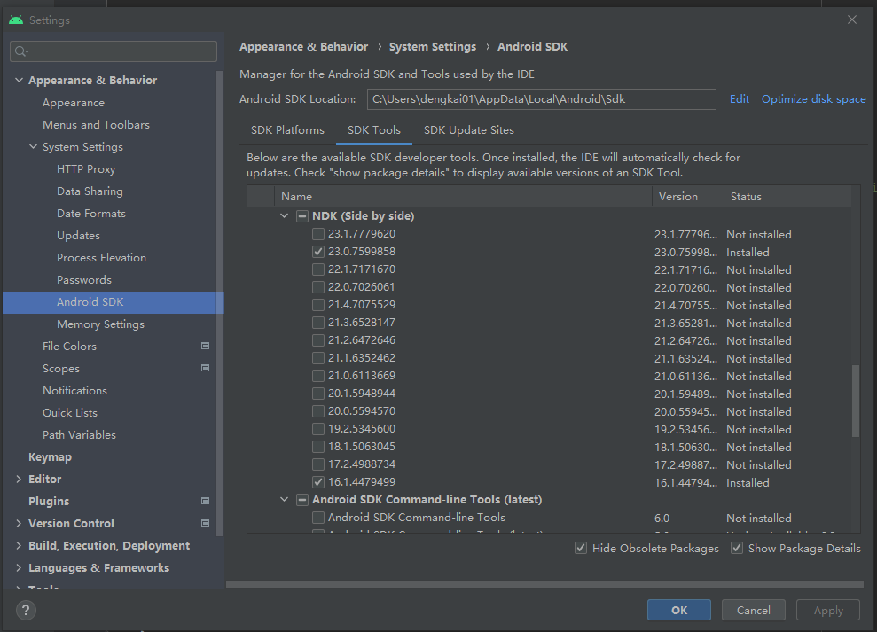

# [Android NDK](https://developer.android.com/ndk)

## [Get started with the NDK](https://developer.android.com/ndk/guides)

The Native Development Kit (NDK) is a set of tools that allows you to use C and C++ code with Android, and provides [platform libraries](https://developer.android.com/ndk/guides/stable_apis) you can use to manage native activities and access physical device components, such as sensors and touch input. 

> NOTE: 
>
> 一、主要内容如下:
>
> 
>
> 比如`toolchains`中包含的内容如下:
>
> 
>
> 其中llvm目录包含了prebuild llvm，包括compiler、linker等。
>
> 通过 [Use existing libraries](https://developer.android.com/ndk/guides/libs) 章节可知，除此之外，它还提供了一些prebuild library。
>
> 二、如何安装指定版本的NDK?
>
> 
>
> 

Using [Android Studio 2.2 and higher](https://developer.android.com/studio), you can use the NDK to compile C and C++ code into a native library and package it into your APK using Gradle, the IDE's integrated build system. Your Java code can then call functions in your native library through the [Java Native Interface (JNI)](http://docs.oracle.com/javase/7/docs/technotes/guides/jni/spec/jniTOC.html) framework. To learn more about Gradle and the Android build system, read [Configure Your Build](https://developer.android.com/studio/build).

> NOTE: 
>
> 上面这段话概括了使用流程


## Writing C/C++Code


> NOTE: 
>
> 一、compiler的路径: 
>
> ```shell
> /home/dengkai/Android/Sdk/ndk/16.1.4479499/toolchains/llvm/prebuilt/linux-x86_64/bin/clang++
> ```
>
> 

### C++ library support

