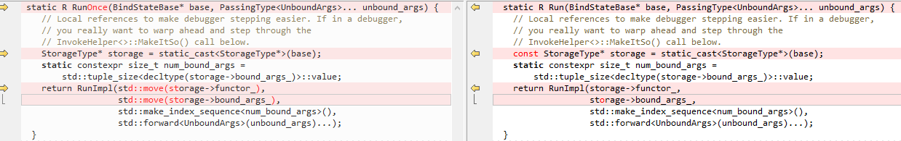

# Invokation

自顶向下进行分析

## polymorphic invoke实现概述

显然，function pointer是需要保存在 `BindStateBase` 中，在 `CallbackBase`  中有成员 `bind_state_`，它提供了 `polymorphic_invoke()` 来实现从 `bind_state_` 中取function pointer。在 `BindStateBase` 中，function的type是 void pointer:

```C++
// In C++, it is safe to cast function pointers to function pointers of
// another type. It is not okay to use void*. We create a InvokeFuncStorage
// that that can store our function pointer, and then cast it back to
// the original type on usage.
using InvokeFuncStorage = void(*)();
```

它采用的type erasure策略: 在base中，使用void pointer给出统一的表示，在implementation中给出concrete type:

1、`OnceCallback`

```C++
  using PolymorphicInvoke = R (*)(internal::BindStateBase*,
                                  internal::PassingType<Args>...);
```

2、`RepeatingCallback`

```C++
  using PolymorphicInvoke = R (*)(internal::BindStateBase*,
                                  internal::PassingType<Args>...);
```


## base class

使用 void function pointer 实现的:


一、在 `class BASE_EXPORT BindStateBase` ( [chromium](https://github.com/chromium/chromium)/[base](https://github.com/chromium/chromium/tree/master/base)/**[callback_internal.h](https://github.com/chromium/chromium/blob/master/base/callback_internal.h)** ) 中，有成员变量:

```C++
  using InvokeFuncStorage = void(*)();
  InvokeFuncStorage polymorphic_invoke_;
```


二、在 `class BASE_EXPORT CallbackBase` ( [chromium](https://github.com/chromium/chromium)/[base](https://github.com/chromium/chromium/tree/master/base)/**[callback_internal.h](https://github.com/chromium/chromium/blob/master/base/callback_internal.h)** ) 中，有成员函数:

```C++
using InvokeFuncStorage = BindStateBase::InvokeFuncStorage;
InvokeFuncStorage polymorphic_invoke() const {
    return bind_state_->polymorphic_invoke_;
}
```


## `CallbackBase` implementation

```C++
  using PolymorphicInvoke = R (*)(internal::BindStateBase*,
                                  internal::PassingType<Args>...);
```

总的来说，两个`CallBack`中给出的concrete type是一致的: 

1、参数 `internal::BindStateBase*` 代表的是bound args

2、参数 `internal::PassingType<Args>...` 代表的是unbound args


一、在 [class OnceCallback<R(Args...)> : public internal::CallbackBase](https://github.com/chromium/chromium/blob/main/base/callback.h) ( [chromium](https://github.com/chromium/chromium)/[base](https://github.com/chromium/chromium/tree/main/base)/**[callback.h](https://github.com/chromium/chromium/blob/main/base/callback.h)** ) 中，

```C++
template <typename R, typename... Args>
class OnceCallback<R(Args...)> : public internal::CallbackBase {
  using PolymorphicInvoke = R (*)(internal::BindStateBase*,
                                  internal::PassingType<Args>...);
  R Run(Args... args) && {
    // Move the callback instance into a local variable before the invocation,
    // that ensures the internal state is cleared after the invocation.
    // It's not safe to touch |this| after the invocation, since running the
    // bound function may destroy |this|.
    OnceCallback cb = std::move(*this);
    PolymorphicInvoke f =
        reinterpret_cast<PolymorphicInvoke>(cb.polymorphic_invoke());
    return f(cb.bind_state_.get(), std::forward<Args>(args)...);
  }
};
```


二、在 [`class RepeatingCallback<R(Args...)> : public internal::CallbackBaseCopyable`](https://github.com/chromium/chromium/blob/main/base/callback.h#L180) ( [chromium](https://github.com/chromium/chromium)/[base](https://github.com/chromium/chromium/tree/main/base)/**[callback.h](https://github.com/chromium/chromium/blob/main/base/callback.h)** ) 中，

```C++
template <typename R, typename... Args>
class RepeatingCallback<R(Args...)> : public internal::CallbackBaseCopyable {
  using PolymorphicInvoke = R (*)(internal::BindStateBase*,
                                  internal::PassingType<Args>...);
  R Run(Args... args) const & {
    PolymorphicInvoke f =
        reinterpret_cast<PolymorphicInvoke>(this->polymorphic_invoke());
    return f(this->bind_state_.get(), std::forward<Args>(args)...);
  }

  R Run(Args... args) && {
    // Move the callback instance into a local variable before the invocation,
    // that ensures the internal state is cleared after the invocation.
    // It's not safe to touch |this| after the invocation, since running the
    // bound function may destroy |this|.
    RepeatingCallback cb = std::move(*this);
    PolymorphicInvoke f =
        reinterpret_cast<PolymorphicInvoke>(cb.polymorphic_invoke());
    return f(std::move(cb).bind_state_.get(), std::forward<Args>(args)...);
  }
};
```


## bind implementation

通过 `BindImpl` 来创建`{Once|Repeating}Callback`，显然，此时 `CallbackT` 是已经具备 `PolymorphicInvoke` 的完整类型了。从下面实现可以看出，在 `BindImpl` 中是需要 `CallbackType::PolymorphicInvoke` type的，它需要使用此来构造具体的 `invoke_func` 的implementation。显然，在创建 `{Once|Repeating}Callback` object的时候，就已经知道了它的具体的 `invoke_func`，由于chromium采用的是design to an abstraction

存的时候，用opaque handle、type erasure，用的时候在转化为concrete type。`std::any` 貌似也采用了这种玩法

对于chromium `{Once|Repeating}Callback` 而已，它需要关联 `{Once|Repeating}Callback` 对象 和 它绑定的function、绑定的argument，并且需要绑定的参数是未知的，因此它使用了type erasure技术:

1、对于 `{Once|Repeating}Callback`，在编译时是能够确定它的 `invoke_func` 的具体类型的，compiler在进行编译的时候，是会通过替换的方式生成一个函数的，只是保存在 `{Once|Repeating}Callback` 中，使用的是一个opaque handle。

compiler在进行编译的时候，是能够生成具体的`BindState` 类型的 ( `using BindState = MakeBindStateType<Functor, Args...>;` )


2、在 `{Once|Repeating}Callback` 中，在编译时是可以知道它的 `PolymorphicInvoke` 类型的，即它的`RunType`


3、通过上述分析可知，它是能够实现static type safety的

### `BindImpl`

三、在 [`decltype(auto) BindImpl(Functor&& functor, Args&&... args)`](https://chromium.googlesource.com/chromium/src/base/+/refs/heads/main/bind_internal.h#1251) ( [chromium](https://github.com/chromium/chromium/tree/master)/[base](https://github.com/chromium/chromium/tree/master/base)/**[bind_internal.h](https://github.com/chromium/chromium/blob/master/base/bind_internal.h)** ) 中，有如下实现:

```C++
template <template <typename> class CallbackT,
          typename Functor,
          typename... Args>
decltype(auto) BindImpl(Functor&& functor, Args&&... args) {
  // This block checks if each |args| matches to the corresponding params of the
  // target function. This check does not affect the behavior of Bind, but its
  // error message should be more readable.              
  ......
  using Invoker = Invoker<BindState, UnboundRunType>;
  using CallbackType = CallbackT<UnboundRunType>;    
  // Store the invoke func into PolymorphicInvoke before casting it to
  // InvokeFuncStorage, so that we can ensure its type matches to
  // PolymorphicInvoke, to which CallbackType will cast back.
  using PolymorphicInvoke = typename CallbackType::PolymorphicInvoke;
  PolymorphicInvoke invoke_func =
      GetInvokeFunc<Invoker>(bool_constant<kIsOnce>());
  using InvokeFuncStorage = BindStateBase::InvokeFuncStorage;
  return CallbackType(BindState::Create(
      reinterpret_cast<InvokeFuncStorage>(invoke_func),
      std::forward<Functor>(functor), std::forward<Args>(args)...));
}
```

1、可以看到，`PolymorphicInvoke` 是  `CallbackType` (对应的是 `OnceCallback`、 `RepeatingCallback`) 中定义的，它会被传入到 `BindState` 中。

2、在将 `invoke_func` 传入之前，会将它 `reinterpret_cast<InvokeFuncStorage>(invoke_func)` 。


### `GetInvokeFunc`

它到底执行是什么函数？通过查看 `GetInvokeFunc` 我们可以得出这个答案。

```C++
// Used below in BindImpl to determine whether to use Invoker::Run or
// Invoker::RunOnce.
// Note: Simply using `kIsOnce ? &Invoker::RunOnce : &Invoker::Run` does not
// work, since the compiler needs to check whether both expressions are
// well-formed. Using `Invoker::Run` with a OnceCallback triggers a
// static_assert, which is why the ternary expression does not compile.
// TODO(crbug.com/752720): Remove this indirection once we have `if constexpr`.
template <typename Invoker>
constexpr auto GetInvokeFunc(std::true_type) {
  return Invoker::RunOnce;
}

template <typename Invoker>
constexpr auto GetInvokeFunc(std::false_type) {
  return Invoker::Run;
}
```

显然由 `using Invoker = Invoker<BindState, UnboundRunType>;` 来决定。


### `bind_internal`: `Invoker`

[chromium](https://github.com/chromium/chromium)/[base](https://github.com/chromium/chromium/tree/main/base)/**[bind_internal.h](https://github.com/chromium/chromium/blob/main/base/bind_internal.h)**

> `Invoker<>` -- Unwraps the curried parameters and executes the `Functor`.


```C++
// Invoker<>
//
// See description at the top of the file.
template <typename StorageType, typename UnboundRunType>
struct Invoker;

template <typename StorageType, typename R, typename... UnboundArgs>
struct Invoker<StorageType, R(UnboundArgs...)> {
  static R RunOnce(BindStateBase* base,
                   PassingType<UnboundArgs>... unbound_args) {
    // Local references to make debugger stepping easier. If in a debugger,
    // you really want to warp ahead and step through the
    // InvokeHelper<>::MakeItSo() call below.
    StorageType* storage = static_cast<StorageType*>(base);
    static constexpr size_t num_bound_args =
        std::tuple_size<decltype(storage->bound_args_)>::value;
    return RunImpl(std::move(storage->functor_),
                   std::move(storage->bound_args_),
                   std::make_index_sequence<num_bound_args>(),
                   std::forward<UnboundArgs>(unbound_args)...);
  }

  static R Run(BindStateBase* base, PassingType<UnboundArgs>... unbound_args) {
    // Local references to make debugger stepping easier. If in a debugger,
    // you really want to warp ahead and step through the
    // InvokeHelper<>::MakeItSo() call below.
    const StorageType* storage = static_cast<StorageType*>(base);
    static constexpr size_t num_bound_args =
        std::tuple_size<decltype(storage->bound_args_)>::value;
    return RunImpl(storage->functor_, storage->bound_args_,
                   std::make_index_sequence<num_bound_args>(),
                   std::forward<UnboundArgs>(unbound_args)...);
  }

 private:
  template <typename Functor, typename BoundArgsTuple, size_t... indices>
  static inline R RunImpl(Functor&& functor,
                          BoundArgsTuple&& bound,
                          std::index_sequence<indices...>,
                          UnboundArgs&&... unbound_args) {
    static constexpr bool is_method = MakeFunctorTraits<Functor>::is_method;

    using DecayedArgsTuple = std::decay_t<BoundArgsTuple>;
    static constexpr bool is_weak_call =
        IsWeakMethod<is_method,
                     std::tuple_element_t<indices, DecayedArgsTuple>...>();

    return InvokeHelper<is_weak_call, R>::MakeItSo(
        std::forward<Functor>(functor),
        Unwrap(std::get<indices>(std::forward<BoundArgsTuple>(bound)))..., // unwrap args
        std::forward<UnboundArgs>(unbound_args)...);
  }
};
```

只有一个 `struct Invoker` 的specialization。

### `RunOnce` VS `Run`



#### 注释的含义

> Local references to make debugger stepping easier. If in a debugger, you really want to warp ahead and step through the `InvokeHelper<>::MakeItSo()` call below.

"warp ahead"的意思是"向前移动"

"step through"的意思是"单步调试"

#### `RunImpl`

它的入参可以分为:

一、functor

二、bound args

三、unbound args

`InvokeHelper` 会区分 `WeakPtr<>` ，因此在 `RunImpl` 中会判定 `is_weak_call`。

可以看到，它最终还是会通过调用 `InvokeHelper<is_weak_call, R>::MakeItSo` 来进行实现

#### `Unwrap`

`Unwrap(std::get<indices>(std::forward<BoundArgsTuple>(bound)))...`

上述是unwrap args的地方。

#### `std::tuple` as function args

上述code展示了"`std::tuple` as function args"的典型用法。


### `bind_internal`: `InvokeHelper`

[chromium](https://github.com/chromium/chromium)/[base](https://github.com/chromium/chromium/tree/main/base)/**[bind_internal.h](https://github.com/chromium/chromium/blob/main/base/bind_internal.h)**

> `InvokeHelper<>` -- Take a `Functor` + arguments and actually invokes it. Handle the differing syntaxes needed for `WeakPtr<>` support.  This is separate from `Invoker` to avoid creating multiple version of `Invoker<>`.

由`InvokeHelper` 来实现对 `WeakPtr<>` 的区分，它的实现方式是template specialization，显然`InvokeHelper` 只是一个小抽象层。


> There are 2 logical `InvokeHelper<>` specializations: normal, WeakCalls.
>
> The normal type just calls the underlying runnable.
>
> WeakCalls need special syntax that is applied to the first argument to check if they should no-op themselves.


```c++
template <bool is_weak_call, typename ReturnType>
struct InvokeHelper;

template <typename ReturnType>
struct InvokeHelper<false, ReturnType> {
  template <typename Functor, typename... RunArgs>
  static inline ReturnType MakeItSo(Functor&& functor, RunArgs&&... args) {
    using Traits = MakeFunctorTraits<Functor>;
    return Traits::Invoke(std::forward<Functor>(functor),
                          std::forward<RunArgs>(args)...);
  }
};

template <typename ReturnType>
struct InvokeHelper<true, ReturnType> {
  // WeakCalls are only supported for functions with a void return type.
  // Otherwise, the function result would be undefined if the WeakPtr<>
  // is invalidated.
  static_assert(std::is_void<ReturnType>::value,
                "weak_ptrs can only bind to methods without return values");

  template <typename Functor, typename BoundWeakPtr, typename... RunArgs>
  static inline void MakeItSo(Functor&& functor,
                              BoundWeakPtr&& weak_ptr,
                              RunArgs&&... args) {
    if (!weak_ptr)
      return;
    using Traits = MakeFunctorTraits<Functor>;
    Traits::Invoke(std::forward<Functor>(functor),
                   std::forward<BoundWeakPtr>(weak_ptr),
                   std::forward<RunArgs>(args)...);
  }
};

```

通过上述code可知: 它最终还是通过调用 `FunctorTrait::Invoke` 来实现对原函数的调用。