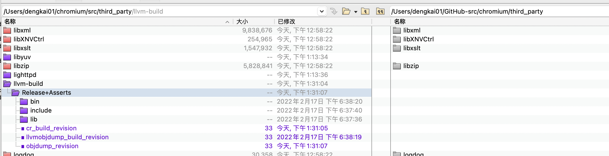

# Build & test

一、chromium如何来build clang、如何来进行test。

二、发布物地址:

http://commondatastorage.googleapis.com/chromium-browser-clang/index.html

三、CI

https://ci.chromium.org/p/chromium/g/chromium.clang/console

四、结合 文档 和 程序来进行理解

五、chromium是在install的时候，下载llvm toolchain的




## chromium doc [Configurations supported by the toolchain team](https://chromium.googlesource.com/chromium/src/+/HEAD/docs/toolchain_support.md)

> NOTE: 
>
> 从官方文档 [Toolchain support](https://chromium.googlesource.com/chromium/src/+/HEAD/docs/toolchain_support.md) 中的内容可知，chromium团队中有专门的 "toolchain team"，他们专门负责clang、lld的维护工作。

### Background

This toolchain is used to build Chromium for **7+ platforms** (Android, Chromecast, Chrome OS, Fuchsia, iOS, Linux, macOS, Windows) targeting **4+ CPUs** (arm, arm64, x86, x64) in **6+ build modes** (debug (component non-optimized), release (static build optimized), official build (very optimized and on some platforms LTO+CFI), asan+lsan, msan, tsan), resulting in **130+** different test binaries.

> NOTE: 
>
> 对于cross-plateform application，上述总结是非常好的

## chromium doc [Updating Clang](https://chromium.googlesource.com/chromium/src/+/HEAD/docs/updating_clang.md) 

We distribute prebuilt packages of LLVM binaries, including clang and lld, that all developers and bots pull at `gclient runhooks` time. 

> NOTE: 
>
> 一、通过上面这段话可知: 在chromium中，并没有随包带上clang binary，而是由`gclient runhooks` 自动去拉取的
>
> 二、它实际使用的script是 [chromium](https://github.com/chromium/chromium)/[tools](https://github.com/chromium/chromium/tree/main/tools)/[clang](https://github.com/chromium/chromium/tree/main/tools/clang)/[scripts](https://github.com/chromium/chromium/tree/main/tools/clang/scripts)/[**update.py**](https://github.com/chromium/chromium/blob/main/tools/clang/scripts/update.py) 
>
> 


## chromium doc [Clang Sheriffing](https://chromium.googlesource.com/chromium/src/+/HEAD/docs/clang_sheriffing.md)

> NOTE: 
>
> 一、这篇文章主要讨论chromium如何来测试它编译出的clang的


## script

先build，然后在package，最后programmer可以拿到发布物并进行使用了。

### build

#### [chromium](https://github.com/chromium/chromium)/[tools](https://github.com/chromium/chromium/tree/main/tools)/[clang](https://github.com/chromium/chromium/tree/main/tools/clang)/[scripts](https://github.com/chromium/chromium/tree/main/tools/clang/scripts)/[**build.py**](https://github.com/chromium/chromium/blob/main/tools/clang/scripts/build.py)

> This script is used to build clang binaries. It is used by `package.py` to create the prebuilt binaries downloaded by `update.py` and used by developers. The expectation is that update.py downloads prebuilt binaries for everyone, and nobody should run this script as part of normal development.

这个script比较冗长。

#### [chromium](https://github.com/chromium/chromium)/[tools](https://github.com/chromium/chromium/tree/main/tools)/[clang](https://github.com/chromium/chromium/tree/main/tools/clang)/[scripts](https://github.com/chromium/chromium/tree/main/tools/clang/scripts)/[**build_clang_tools_extra.py**](https://github.com/chromium/chromium/blob/main/tools/clang/scripts/build_clang_tools_extra.py)

> NOTE: 
>
> A script for fetching LLVM monorepo and building clang-tools-extra binaries.
>
> Example: build clangd and clangd-indexer


理解上面这段话需要搞清楚如下概念:

1、monorepo

quuxplusone [How to build LLVM from source, monorepo version](https://quuxplusone.github.io/blog/2019/11/09/llvm-from-scratch/)

> This is an update of my previous post [“How to build LLVM from source”](https://quuxplusone.github.io/blog/2018/04/16/building-llvm-from-source) (2018-04-16), which is now out-of-date. LLVM has moved to a “monorepo” design instead of a collection of smaller tool-specific repositories. So this new post has fewer steps!

2、clang-tools-extra

docs [Extra Clang Tools 15.0.0git documentation](https://clang.llvm.org/extra/index.html#)

它包括：

clang-tidy

clangd

### package

[chromium](https://github.com/chromium/chromium)/[tools](https://github.com/chromium/chromium/tree/main/tools)/[clang](https://github.com/chromium/chromium/tree/main/tools/clang)/[scripts](https://github.com/chromium/chromium/tree/main/tools/clang/scripts)/[**package.py**](https://github.com/chromium/chromium/blob/main/tools/clang/scripts/package.py)


### download、update

[chromium](https://github.com/chromium/chromium)/[tools](https://github.com/chromium/chromium/tree/main/tools)/[clang](https://github.com/chromium/chromium/tree/main/tools/clang)/[scripts](https://github.com/chromium/chromium/tree/main/tools/clang/scripts)/[**update.py**](https://github.com/chromium/chromium/blob/main/tools/clang/scripts/update.py) 

> This script is used to download prebuilt clang binaries. It runs as a "`gclient hook`" in Chromium checkouts.

这段话的意思是在执行checkout的时候，`update.py` 会被调用来download prebuilt clang binary。

> It can also be run stand-alone as a convenient way of installing a well-tested near-tip-of-tree clang version:
>
> ```shell
> $ curl -s https://raw.githubusercontent.com/chromium/chromium/main/tools/clang/scripts/update.py | python3 - --output-dir=/tmp/clang
> ```
>
> 