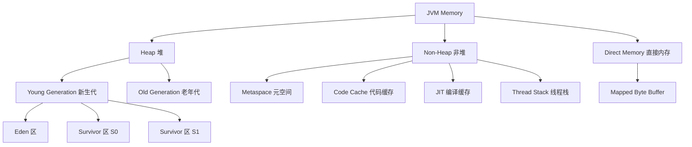

# JVM memory management

[juejin 拜托搞清楚，JVM是程序员必'备'，不是必'背'，每天20分钟带你从入门到揭秘JVM](https://juejin.cn/post/7018463316330676255)


[juejin Java 黑科技——Serviceability Agent](https://juejin.cn/post/6992108216695930917)


## JVM 内存布局

思考过程：
好的，用户问的是JVM的内存布局。我需要详细解释JVM内存的各个部分，包括堆、栈、方法区等。首先想到的是用户可能是Java开发者或者正在学习JVM，需要了解内存结构来优化程序或解决内存问题。

用户可能已经了解基础概念，但需要更深入的细节。比如，堆的分代结构（新生代、老年代）、各个部分的作用，还有非堆区域如方法区（元空间）、直接内存等。另外，不同版本的JVM是否有变化，比如元空间替代永久代，这点很重要，必须提到。

还要考虑用户可能的实际应用场景，比如内存溢出或性能调优。因此，在解释布局时，需要结合实际问题，例如哪些区域容易发生OOM，如何监控和调整这些区域的大小。

可能需要用图表来辅助说明，但因为是文字回复，可以用文字描述结构。另外，应该提到常用的JVM参数，比如-Xmx、-Xss等，帮助用户配置内存。

需要检查是否有遗漏的部分，比如程序计数器、本地方法栈，这些虽然不如堆和栈常见，但也是JVM内存布局的一部分。同时，解释各个区域是线程共享还是线程私有，这对多线程编程有帮助。

用户可能对元空间和永久代的区别有疑问，需明确说明从JDK8开始的变化。另外，直接内存（NIO使用的）属于JVM外的内存，但常被忽视，应该包括进来。

最后，总结各部分的作用和常见问题，帮助用户整体理解。确保内容结构清晰，分点列出，便于阅读。

回答：
以下是 JVM 内存布局的详细解析，包含各区域的作用、配置参数和常见问题：

---

### **JVM 内存布局（Hotspot 实现）**



---

### **1. 堆内存（Heap）**

#### **核心区域**

| 区域           | 描述                                   | 默认占比   | 溢出错误                                | 参数调整                                  |
| ------------ | ------------------------------------ | ------ | ----------------------------------- | ------------------------------------- |
| **Eden**     | 新对象分配区，发生 Minor GC 时存活对象复制到 Survivor | 80%    | `OutOfMemoryError: Java heap space` | `-XX:NewRatio`<br>`-XX:SurvivorRatio` |
| **Survivor** | 存放经过 Minor GC 存活的对象（S0/S1交替使用）       | 10% x2 | 同 Eden                              | `-XX:InitialSurvivorRatio`            |
| **Old Gen**  | 存放长期存活对象（晋升年龄阈值默认15）                 | 可变     | 同 Eden                              | `-Xmx`<br>`-Xms`                      |

#### **关键机制**

- **对象分配流程**：
  
  ```java
  // 伪代码流程
  if (对象大小 > Eden区剩余空间) {
     触发 Minor GC;
     if (Minor GC 后空间仍不足) {
         直接分配 Old Gen（大对象）;
     }
  }
  ```

- **晋升条件**：
  
  - 对象年龄超过 `MaxTenuringThreshold`
  - Survivor 区同年龄对象总大小超过 Survivor 空间 50%

---

### **2. 非堆内存（Non-Heap）**

#### **主要区域**

| 区域               | 描述                       | 溢出错误                          | 参数调整                        |
| ---------------- | ------------------------ | ----------------------------- | --------------------------- |
| **Metaspace**    | 存储类元数据（JDK8+ 替代 PermGen） | `OutOfMemoryError: Metaspace` | `-XX:MaxMetaspaceSize`      |
| **Code Cache**   | 存储 JIT 编译后的本地代码          | `OutOfMemoryError: CodeCache` | `-XX:ReservedCodeCacheSize` |
| **Thread Stack** | 线程私有栈（栈帧存储局部变量、操作数栈等）    | `StackOverflowError`          | `-Xss`（如 `-Xss1m`）          |

#### **元空间（Metaspace）详解**

- **组成结构**：
  - **Klass Metaspace**：存储类的元信息（如方法字节码）
  - **Non-Klass Metaspace**：存储方法区其他数据
- **内存来源**：默认使用本地内存（Native Memory），而非堆内存
- **监控命令**：`jstat -gcutil <pid>` 查看 `MC`（Metaspace Capacity）和 `MU`（Metaspace Used）

---

### **3. 直接内存（Direct Memory）**

- **定义**：通过 `ByteBuffer.allocateDirect()` 分配的堆外内存
- **特点**：
  - 不受 GC 管理，通过 `System.gc()` 触发 `Cleaner` 回收
  - 读写性能高（减少一次数据拷贝）
- **溢出错误**：`OutOfMemoryError: Direct buffer memory`
- **参数控制**：`-XX:MaxDirectMemorySize=256m`

---

### **4. 其他内存区域**

| 区域            | 描述  | 参数/监控 |
| ------------- | --- | ----- |
| **程序计数器（PC）** |     |       |

## New object memory allocation

在下面文章中有涉及:

[juejin 一行代码引发的性能暴跌 10 倍](https://juejin.cn/post/7276999034962280508?searchId=202502081115080952EE3C5DE6B77465C5) 

[juejin JVM调优之逃逸分析与TLAB](https://juejin.cn/post/6985386868405698596?searchId=202502081115080952EE3C5DE6B77465C5) 

[juejin TLAB的全称是Thread Local Allocation Buffer(线程本地分配缓存)](https://juejin.cn/post/7107292213758918670?searchId=202502081115080952EE3C5DE6B77465C5) 

思考过程：
嗯，用户问的是JVM创建对象时使用的内存次序。我得先回忆一下JVM的内存结构。JVM的内存区域主要包括堆、栈、方法区、程序计数器这些。那对象创建的时候，哪些区域会被用到呢？

首先，我知道对象实例通常是在堆内存中分配的。那堆是所有线程共享的，所以当new一个对象时，堆上会分配内存。不过，用户问的是内存次序，可能需要更详细的步骤。

创建对象的过程我记得有几个步骤：类加载检查、分配内存、初始化零值、设置对象头、执行init方法。那这些步骤中涉及到的内存区域可能包括方法区和堆，还有可能栈吗？

分配内存的时候有两种方式，指针碰撞和空闲列表，这取决于堆是否规整。如果是用指针碰撞，那堆内存是连续分配的，这时候可能需要同步处理，因为有并发问题。如果是用CAS加失败重试或者TLAB，那可能每个线程在堆里有自己的一块TLAB区域，这样分配内存的时候可以避免竞争。

那内存分配的次序应该是先在堆里分配内存空间，然后初始化零值，这时候对象的实例变量会被设为默认值，比如0、null这些。这时候可能需要用到方法区，因为类信息在方法区，知道对象的结构。接着设置对象头，对象头里包括哈希码、GC分代年龄、锁状态标志这些，还有类型指针指向方法区的类元数据。这些都是在堆内存中的对象头部分完成的。

然后执行init方法，也就是构造函数，这里可能会给实例变量赋实际的值，还可能执行其他初始化代码。这时候栈内存可能被用到，因为方法调用是在栈帧中进行的，比如构造函数的调用，参数传递，局部变量这些。

还有一种情况是逃逸分析，如果JVM发现对象没有逃逸方法的作用域，可能会进行栈上分配，这时候对象的内存是在栈上分配的，这样不需要垃圾回收，提高性能。但栈上分配不是普遍情况，默认可能还是堆分配。

另外，JIT编译器优化的时候可能会有标量替换，把对象拆解成基本类型，放在栈上或者寄存器里，这样可能都不需要分配内存了。但这也是优化的情况。

所以用户的问题，内存次序可能指的是各个内存区域在对象创建时的使用顺序。可能的步骤是：

1. 检查类是否加载，如果没有则先加载，这部分用到方法区。
2. 在堆中分配内存空间，或者栈上分配（如果逃逸分析允许）。
3. 初始化内存为零值，实例变量设默认值。
4. 设置对象头，包括指向方法区的类元数据。
5. 执行构造函数，这时候涉及栈的执行，方法的调用。
6. 对象引用被分配到栈上的局部变量表中，或者堆中的其他对象。

那内存的次序应该是先方法区（类加载），然后堆分配，同时栈可能在后续的构造函数执行时被使用。可能还有TLAB的情况，这时候是堆中的线程私有区域，但整体还是堆内存的一部分。

需要注意区分不同的内存区域和它们的用途。比如，方法区存放类元数据，堆存放对象实例，栈存放局部变量和操作数栈等。对象创建过程中，主要的内存分配在堆，但是涉及到类信息需要方法区，执行构造函数需要栈。

有没有可能用户的问题其实是问对象在堆内的分配过程，比如指针碰撞或空闲列表的选择，或者内存分配的线程安全问题？比如，用CAS或者TLAB来解决并发问题？

或者用户可能想知道具体的内存分配步骤，比如先分配内存，再初始化，再设置对象头，再调用构造函数，这样的次序？

或者是否涉及到内存屏障或者指令重排序的问题？比如在发布对象时，需要保证内存可见性，防止指令重排序导致的问题，这涉及到volatile或者synchronized等机制。

不过根据问题描述，用户可能更想了解JVM在创建对象时，各个内存区域的使用顺序，而不仅仅是步骤。比如，先使用堆还是栈，或者方法区的作用。

总结一下，可能的回答结构是：

1. 类加载检查：使用方法区，确认类是否已加载。
2. 内存分配：在堆中分配对象所需内存（可能通过指针碰撞或空闲列表，或者TLAB）。
3. 初始化零值：将堆中分配的内存空间初始化为零值，保证实例变量默认值。
4. 设置对象头：在堆中的对象头写入元数据，包括指向方法区的类元信息、哈希码、GC信息等。
5. 执行<init>方法：在栈中执行构造函数，初始化对象的字段和其他设置。
6. 引用分配：将对象引用存储在栈帧的局部变量表或操作数栈中，或者作为其他对象的成员变量存储在堆中。

此外，可能提到逃逸分析和栈上分配的情况，这时候内存分配在栈上，而不是堆。

这样，整个过程中涉及的内存区域包括方法区、堆、栈，按顺序使用。不同的JVM实现可能有差异，比如是否启用逃逸分析或者TLAB，但大体流程是这样的。

回答：
在Java虚拟机（JVM）中，创建对象时的内存使用次序涉及多个内存区域的协作。以下是详细的内存使用流程和次序：

---

### **1. 类加载检查（方法区）**

- **触发条件**：当遇到`new`指令时，JVM首先检查该类是否已加载、解析和初始化。
- **内存区域**：**方法区**（或元空间，取决于JVM版本），用于存储类的元数据（如类结构、字段、方法等）。
- **作用**：若未加载，则触发类加载过程；若已加载，继续分配内存。

---

### **2. 内存分配（堆）**

- **目标区域**：**堆内存**，用于存储对象实例数据。
- **分配方式**：
  - **指针碰撞**（Bump the Pointer）：堆内存规整时，通过移动指针分配连续空间。
  - **空闲列表**（Free List）：堆内存不规整时，通过链表记录空闲内存块。
- **并发处理**：
  - **TLAB（Thread-Local Allocation Buffer）**：为每个线程在堆中预先分配一小块私有内存，避免全局竞争。
  - **CAS + 失败重试**：通过原子操作处理并发分配。

---

### **3. 初始化零值（堆）**

- **操作**：将分配的内存空间初始化为**零值**（如`int`初始化为`0`，引用初始化为`null`）。
- **目的**：保证对象字段的默认初始值，无需依赖代码显式赋值。

---

### **4. 设置对象头（堆）**

- **对象头结构**：
  - **Mark Word**：存储哈希码、GC分代年龄、锁状态等。
  - **类元数据指针**：指向方法区中的类元数据（类型信息）。
  - （若为数组）数组长度。
- **操作**：在堆内存中写入对象头信息，完成对象身份标识。

---

### **5. 执行`<init>`方法（栈）**

- **操作**：调用构造函数（`<init>`方法），显式初始化字段值并执行用户逻辑。
- **内存区域**：
  - **虚拟机栈**：构造函数的调用通过栈帧执行，操作数栈和局部变量表存储临时数据。
  - **堆**：对象实例字段的实际赋值发生在堆内存中。

---

### **6. 引用关联**

- **引用存储**：
  - 对象引用可能存储在**栈帧的局部变量表**、**操作数栈**（如临时变量）或**堆中的其他对象**（如作为成员变量）。
- **逃逸分析优化**：
  - 若对象未逃逸方法作用域，JVM可能直接在**栈上分配内存**（避免堆分配和GC开销）。
  - 标量替换（Scalar Replacement）：将对象拆分为基本类型变量，分配在栈或寄存器中。

---

### **内存使用次序总结**

1. **方法区** → 类元数据加载。
2. **堆** → 分配内存、初始化零值、设置对象头。
3. **栈** → 执行构造函数逻辑（操作数栈、局部变量表）。
4. **堆/栈** → 根据逃逸分析结果，最终存储对象实例或标量。

---

### **关键优化技术**

- **TLAB**：提升堆内存分配的并发性能。
- **逃逸分析** & **栈上分配**：减少堆压力。
- **标量替换**：彻底消除对象分配。

通过上述流程，JVM在对象创建过程中高效协调多个内存区域，平衡性能和内存管理需求。
