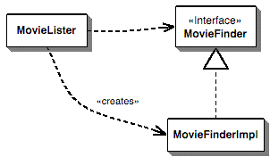

# Inversion of control

“inversion of control”即“控制反转”。IoC是一种思想（或者说 理念），IoC的实现有多种方式，很多framework中都采用了IoC的思想或受到IoC的影响。正如在tutorialsteacher [Inversion of Control](https://www.tutorialsteacher.com/ioc/inversion-of-control)中所总结的

> IoC is a principle, not a pattern. It just gives high-level design guidelines but does not give implementation details. You are free to implement the IoC principle the way you want.

关于它的第一个问题就是：what aspect of control are they inverting?这个问题需要结合具体的例子来进行回答，本章基于如下文章：

- 入门读物：martinfowler [Inversion of Control Containers and the Dependency Injection pattern](https://martinfowler.com/articles/injection.html)
- 总结：维基百科[Inversion of control](https://en.wikipedia.org/wiki/Inversion_of_control)
- 总结：stackoverflow [What is Inversion of Control?](https://stackoverflow.com/questions/3058/what-is-inversion-of-control)


inversion of control中的control是一个含义非常宽泛的词语，维基百科给出的解释是[Control flow](https://en.wikipedia.org/wiki/Control_flow)，我觉得这个解释是比较狭隘的，从广义而言，它可以指代：flow of control、dependency的注入、对object lifetime的管理，event和event handler之间的映射，显然这些都是control，如果我们从这个宽泛的角度出发来理解的话，就会发现软件工程领域的很多内容都可以归入到inversion of control中。原本这些control是由programmer来进行实现，而inversion of control则启发我们：这些control应该由framework来进行实现；此处的framework的含义也是非常宽泛的，它可以是类似于spring的container，也可以是类似于reference counting这样的逻辑，显然IOC可以简单地总结为：

非IOC:由programmer来实现control

IOC:由framework来实现control


gc是一种Ioc，有gc来管理object的lifetime

smart pointer是一种IOC：Shared_ptr由reference count来管理object的lifetime，unique_ptr则是scope

dependence injection是一种ioc，由frameworker来管理dependence关系。

reactive programming是一种ioc，由framework来管理event和event handler之间的映射关系。


inversion of control的思想内涵；

inversion of control的优势/价值；

inversion of control的实现方式；


需要对每一种都提供一个案例来进行说明。


## martinfowler [Inversion of Control Containers and the Dependency Injection pattern](https://martinfowler.com/articles/injection.html)

> NOTE: 这篇文章的英文原文是比较不好理解的，好在它提供了中文版，翻译质量还可以。中文版链接：https://insights.thoughtworks.cn/injection/

A number of frameworks have taken a stab at this problem, and several are branching out to provide a general capability to assemble components from different layers. These are often referred to as lightweight containers, examples include [PicoContainer](http://picocontainer.com/), and [Spring](http://www.springsource.org/).


Underlying these containers are a number of interesting **design principles**, things that go beyond both these specific containers and indeed the Java platform. Here I want to start exploring some of these principles. The examples I use are in Java, but like most of my writing the principles are equally applicable to other OO environments, particularly .NET.

> NOTE: 作者这段话的意思是：这些container、Java platform所采用的**design principles**，不仅仅局限于它们，它们同样适用于其他 的OO environment。

### Components and Services

I use **component** to mean a glob of software that's intended to be used, without change, by an application that is out of the control of the writers of the component. By 'without change' I mean that the using application doesn't change the source code of the components, although they may alter the component's behavior by extending it in ways allowed by the component writers.

A **service** is similar to a **component** in that it's used by foreign applications. The main difference is that I expect a component to be used **locally** (think jar file, assembly, dll, or a source import). A service will be used **remotely** through some remote interface, either synchronous or asynchronous (eg web service, messaging system, RPC, or socket.)

I mostly use **service** in this article, but much of the same logic can be applied to **local components** too. Indeed often you need some kind of **local component framework** to easily access a **remote service**. But writing "component or service" is tiring to read and write, and services are much more fashionable at the moment.

### A Naive Example

In this example I'm writing a component that provides a list of movies directed by a particular director. This stunningly useful function is implemented by a single method.


```java
class MovieLister... 
public Movie[] moviesDirectedBy(String arg) {
      List allMovies = finder.findAll();
      for (Iterator it = allMovies.iterator(); it.hasNext();) {
          Movie movie = (Movie) it.next();
          if (!movie.getDirector().equals(arg)) it.remove();
      }
      return (Movie[]) allMovies.toArray(new Movie[allMovies.size()]);
  }
```

The implementation of this function is naive in the extreme, it asks a **finder object** (which we'll get to in a moment) to return every film it knows about. Then it just hunts through this list to return those directed by a particular director. This particular piece of naivety I'm not going to fix, since it's just the scaffolding（脚手架） for the real point of this article.

The real point of this article is this **finder object**, or particularly how we connect the **lister object** with a particular **finder object**. The reason why this is interesting is that I want my wonderful `moviesDirectedBy` method to be completely independent of how all the movies are being stored. So all the method does is refer to a **finder**, and all that **finder** does is know how to respond to the `findAll` method. I can bring this out by defining an interface for the **finder**.

```java
public interface MovieFinder {
    List findAll();
}
```

Now all of this is very well decoupled, but at some point I have to come up with a concrete class to actually come up with the movies. In this case I put the code for this in the constructor of my lister class.

```java
class MovieLister...

  private MovieFinder finder;
  public MovieLister() {
    finder = new ColonDelimitedMovieFinder("movies1.txt");
  }
```

The name of the implementation class comes from the fact that I'm getting my list from a colon（冒号） delimited text file. I'll spare you the details, after all the point is just that there's some implementation.


Now if I'm using this class for just myself, this is all fine and dandy（极好的）. But what happens when my friends are overwhelmed（被打倒） by a desire for this wonderful functionality and would like a copy of my program? If they also store their movie listings in a colon delimited text file called "movies1.txt" then everything is wonderful. If they have a different name for their movies file, then it's easy to put the name of the file in a properties file. But what if they have a completely different form of storing their movie listing: a SQL database, an XML file, a web service, or just another format of text file? In this case we need a different class to grab that data. Now because I've defined a `MovieFinder` interface, this won't alter my `moviesDirectedBy` method. But I still need to have some way to get an instance of the right **finder** implementation into place.




Figure 1: The dependencies using a simple creation in the lister class

[Figure 1](https://martinfowler.com/articles/injection.html#naive.gif) shows the **dependencies** for this situation. The `MovieLister` class is dependent on both the `MovieFinder` interface and upon the implementation. We would prefer it if it were only dependent on the interface, but then how do we make an instance to work with?

#### plugin

In my book [P of EAA](https://martinfowler.com/books/eaa.html), we described this situation as a [Plugin](https://martinfowler.com/eaaCatalog/plugin.html). The implementation class for the **finder** isn't linked into the program at compile time, since I don't know what my friends are going to use. Instead we want my **lister** to work with any implementation, and for that implementation to be plugged in at some later point, out of my hands. The problem is how can I make that link so that my lister class is ignorant of the implementation class, but can still talk to an instance to do its work.

Expanding this into a real system, we might have dozens of such services and components. In each case we can abstract our use of these **components** by talking to them through an **interface** (and using an adapter if the **component** isn't designed with an interface in mind). But if we wish to deploy this system in different ways, we need to use **plugins** to handle the interaction with these services so we can use different implementations in different deployments.

So the core problem is how do we assemble these plugins into an application? This is one of the main problems that this new breed of lightweight containers face, and universally they all do it using **Inversion of Control**.

### Inversion of Control

The question is: "what aspect of control are they inverting?" When I first ran into **inversion of control**, it was in the main control of a user interface. Early user interfaces were controlled by the application program. You would have a sequence of commands like "Enter name", "enter address"; your program would drive the prompts and pick up a response to each one. With graphical (or even screen based) UIs the UI **framework** would contain this **main loop** and your program instead provided **event handlers** for the various fields on the screen. The **main control** of the program was inverted, moved away from you to the **framework**.

> NOTE: 在UI framework中，被invert的control是main control。在普通的application program中，main control是由application program控制；在UI framework中，main control由UI framework控制。

For this new breed of containers the **inversion** is about how they lookup a **plugin implementation**. In my naive example the **lister** looked up the **finder implementation** by directly instantiating it. This stops the **finder** from being a plugin. The approach that these containers use is to ensure that any user of a plugin follows some convention that allows a separate assembler module to inject the implementation into the **lister**.

As a result I think we need a more specific name for this pattern. **Inversion of Control** is too generic a term, and thus people find it confusing. As a result with a lot of discussion with various IoC advocates we settled on the name *Dependency Injection*.

> NOTE：在DI中，被invert的是how to lookup dependency。在普通的application program中，dependency是由application program控制；在DI中，dependency是有injector来进行inject。

I'm going to start by talking about the various forms of **dependency injection**, but I'll point out now that that's not the only way of removing the **dependency** from the application class to the **plugin implementation**. The other pattern you can use to do this is **Service Locator**, and I'll discuss that after I'm done with explaining **Dependency Injection**.

### Forms of Dependency Injection

The basic idea of the Dependency Injection is to have a separate object, an assembler, that populates a field in the lister class with an appropriate implementation for the finder interface, resulting in a dependency diagram along the lines of [Figure 2](https://martinfowler.com/articles/injection.html#injector.gif)


Figure 2: The dependencies for a Dependency Injector

There are three main styles of **dependency injection**. The names I'm using for them are **Constructor Injection**, **Setter Injection**, and **Interface Injection**. If you read about this stuff in the current discussions about **Inversion of Control** you'll hear these referred to as type 1 IoC (interface injection), type 2 IoC (setter injection) and type 3 IoC (constructor injection). I find numeric names rather hard to remember, which is why I've used the names I have here.

#### Constructor Injection with PicoContainer


#### Setter Injection with Spring

The [Spring framework](http://www.springsource.org/) is a wide ranging framework for enterprise Java development. It includes abstraction layers for transactions, persistence frameworks, web application development and JDBC. Like PicoContainer it supports both constructor and setter injection, but its developers tend to prefer setter injection - which makes it an appropriate choice for this example.


#### Interface Injection


